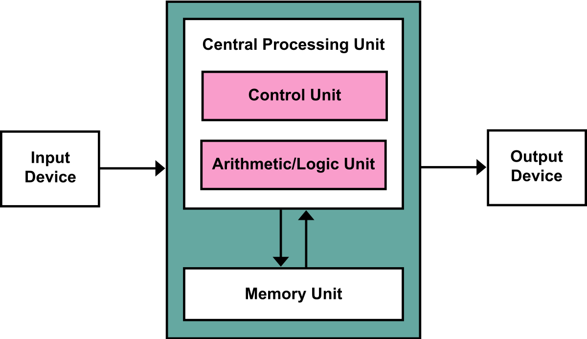
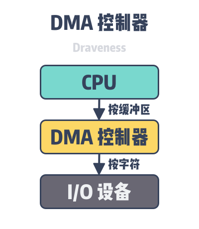
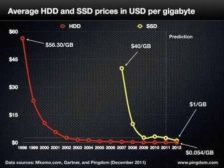

第一个令人惊叹的事实是：CPU快得离谱。在Core 2 3.0GHz上，大部分简单指令的执行只需要一个[时钟周期](https://www.zhihu.com/search?q=时钟周期&search_source=Entity&hybrid_search_source=Entity&hybrid_search_extra={"sourceType"%3A"article"%2C"sourceId"%3A98560121})，也就是**1/3纳秒**。即使是真空中传播的光，在这段时间内也只能走10厘米（约4英寸）。把上述事实记在心中是有好处的。当你要对程序做优化的时候就会想到，执行指令的开销对于当今的CPU而言是多么的微不足道。

当CPU运转起来以后，它便会通过L1 cache和L2 cache对系统中的主存进行读写访问。cache使用的是[静态存储器](https://www.zhihu.com/search?q=静态存储器&search_source=Entity&hybrid_search_source=Entity&hybrid_search_extra={"sourceType"%3A"article"%2C"sourceId"%3A98560121})(SRAM)。相对于系统主存中使用的[动态存储器](https://www.zhihu.com/search?q=动态存储器&search_source=Entity&hybrid_search_source=Entity&hybrid_search_extra={"sourceType"%3A"article"%2C"sourceId"%3A98560121})（DRAM），cache读写速度快得多、造价也高昂得多。cache一般被放置在CPU芯片的内部，加之使用昂贵高速的存储器，使其给CPU带来的延迟非常低。在[指令层次](https://www.zhihu.com/search?q=指令层次&search_source=Entity&hybrid_search_source=Entity&hybrid_search_extra={"sourceType"%3A"article"%2C"sourceId"%3A98560121})上的优化（instruction-level optimization），其效果是与优化后代码的大小息息相关。由于使用了高速缓存技术（caching），那些能够整体放入L1/L2 cache中的代码，和那些在运行时需要不断调入/调出（marshall into/out of）cache的代码，在性能上会产生非常明显的差异。

正常情况下，当CPU操作一块[内存区域](https://www.zhihu.com/search?q=内存区域&search_source=Entity&hybrid_search_source=Entity&hybrid_search_extra={"sourceType"%3A"article"%2C"sourceId"%3A98560121})时，其中的信息要么已经保存在L1/L2 cache，要么就需要将之从[系统主存](https://www.zhihu.com/search?q=系统主存&search_source=Entity&hybrid_search_source=Entity&hybrid_search_extra={"sourceType"%3A"article"%2C"sourceId"%3A98560121})中调入cache，然后再处理。如果是后一种情况，我们就碰到了第一个瓶颈，一个大约250个时钟周期的延迟。在此期间如果CPU没有其他事情要做，则往往是处在停机状态的（stall）。为了给大家一个直观的印象，我们把CPU的一个时钟周期看作一秒。那么，从L1 cache读取信息就好像是拿起桌上的一张草稿纸（3秒）；从L2 cache读取信息则是从身边的书架上取出一本书（14秒）；而从主存中读取信息则相当于走到办公楼下去买个零食（4分钟）。就算是缓慢的系统主存，和硬盘相比也可谓速度如飞了。继续拿办公室做比喻，等待硬盘寻道的时间相当于离开办公大楼并开始长达**一年零三个月**的环球旅行。

看看L1/L2 cache的性能，再对比主存，就会发现：配置更大的cache或者编写能更好的利用cache的应用程序，会使系统的性能得到多么显著的提高。

这就解释了为何电脑的大部分工作都受制于磁盘I/O，以及为何数据库的性能在[内存缓冲区](https://www.zhihu.com/search?q=内存缓冲区&search_source=Entity&hybrid_search_source=Entity&hybrid_search_extra={"sourceType"%3A"article"%2C"sourceId"%3A98560121})被耗尽后会陡然下降。同时也解释了为何充足的RAM（用于缓冲）和高速的磁盘驱动器对系统的整体性能如此重要。

------

# 为什么 CPU 访问硬盘很慢

2020-08-07 [为什么这么设计](https://draveness.me/tags/为什么这么设计) [系统设计](https://draveness.me/tags/系统设计) [CPU](https://draveness.me/tags/cpu) [I/O](https://draveness.me/tags/i/o) [硬盘](https://draveness.me/tags/硬盘)

> 为什么这么设计（Why’s THE Design）是一系列关于计算机领域中程序设计决策的文章，我们在这个系列的每一篇文章中都会提出一个具体的问题并从不同的角度讨论这种设计的优缺点、对具体实现造成的影响。如果你有想要了解的问题，可以在文章下面留言。

机械硬盘（Hard Disk Drive、HDD）和固态硬盘（Solid State Drive、SSD）是两种最常见的硬盘，作为计算机的外部存储，CPU 想要访问它们存储的数据需要很长时间，如下表所示，在 SSD 中随机访问 4KB 数据所需要的时间是访问主存的 1,500 倍，机械磁盘的寻道时间是访问主存的 100,000 倍：

| Work                               |        Latency |
| :--------------------------------- | -------------: |
| L1 cache reference                 |         0.5 ns |
| Branch mispredict                  |           5 ns |
| L2 cache reference                 |           7 ns |
| Mutex lock/unlock                  |          25 ns |
| Main memory reference              |         100 ns |
| Compress 1K bytes with Zippy       |       3,000 ns |
| Send 1K bytes over 1 Gbps network  |      10,000 ns |
| Read 4K randomly from SSD*         |     150,000 ns |
| Read 1 MB sequentially from memory |     250,000 ns |
| Round trip within same datacenter  |     500,000 ns |
| Read 1 MB sequentially from SSD*   |   1,000,000 ns |
| Disk seek                          |  10,000,000 ns |
| Read 1 MB sequentially from disk   |  20,000,000 ns |
| Send packet CA->Netherlands->CA    | 150,000,000 ns |

**表 1 - 2012 年延迟数字对比[1](https://draveness.me/whys-the-design-cpu-and-disk/#fn:1)**

虽然磁盘的寻道时间只需要 10ms，但是在 CPU 看来已经是非常长的时间了，当我们将上述的时间等比例放大后，就能直观地感受到它们的性能差异。如果 CPU 访问 L1 缓存需要 1 秒，那么访问主存需要 3 分钟、从 SSD 中随机读取数据需要 3.4 天、磁盘寻道需要 2 个月，网络传输可能需要 1 年多的时间。

在计算机体系结构中，硬盘属于一种常见的输入输出设备，操作系统在启动时不一定需要硬盘，它既可以通过硬盘启动，也可以通过网络设备或者外部设备启动，所以硬盘不是计算机运行的必要条件。

**图 1 - 输入输出设备**

作为一种外部的输入输出设备，与 CPU 缓存和内存相比，硬盘极慢的读取和写入速度就显得比较合理了，然而几千倍甚至几十万倍的速度差异也确实让人很难想象或者接受，在这篇文章中，我们会分析为什么 CPU 访问硬盘的速度非常慢：

- CPU 访问硬盘数据的过程比较复杂，它会先通过 I/O 操作将磁盘中的数据读入内存，再访问内存的数据；
- 机械硬盘在访问磁盘中的数据依赖的是机械结构，需要移动磁盘中的机械臂；

## I/O 操作

CPU 想要访问磁盘中的数据一定要先通过 I/O 操作将磁盘中的数据读入到内存中，再访问存储在内存中的数据。计算机中包含三种比较常见的 I/O 操作[2](https://draveness.me/whys-the-design-cpu-and-disk/#fn:2) — 编程 I/O（Programmed I/O）、中断驱动 I/O（Interrupt-driven I/O）和直接内存访问（Direct Memory Access)，我们接下来将依次介绍上述的这几种操作[3](https://draveness.me/whys-the-design-cpu-and-disk/#fn:3)：

**图 2 - 常见 I/O 操作**

执行 I/O 操作最简单的形式就是使用*编程 I/O*，使用编程 I/O 时，CPU 会负责全部的工作，如果我们想要在屏幕上输出 `Hello World`，CPU 每次都会向 I/O 设备中写入一个新字符，写入后会轮询设备的状态等待它完成工作后写入新的字符。这种方式虽然简单，但是它会占用全部的 CPU 资源，在某些复杂的系统中会造成计算资源的严重浪费。

*中断驱动 I/O* 是执行 I/O 操作的一种更高效方式，在编程 I/O 中，CPU 会主动获取设备的状态并等待设备闲置，但是如果使用了中断驱动 I/O，设备会在闲置时主动发起中断暂停当前进程并保存上下文，而操作系统会执行 I/O 设备的中断处理程序：

- 如果当前不包含待打印的字符，停止中断处理程序并恢复暂停的进程；
- 如果当前包含待打印的字符，将下一个字符拷贝到设备中并恢复暂停的进程；

使用中断驱动 I/O 可以在设备繁忙时，让 CPU 能够处理其它任务，尽可能地提高 CPU 的利用率，不再浪费珍贵的计算资源。与编程 I/O 相比，中断驱动 I/O 将一部分工作交给了 I/O 设备，所以能够提高资源的利用率。

*直接内存访问*会利用 DMA 控制器来执行 I/O 操作，中断驱动 I/O 需要为每个字符触发操作系统中断，这会消耗一定的 CPU 时间。当我们使用 DMA 控制器时，CPU 会一次将缓冲区中的数据全部读到 DMA 控制器中，DMA 控制器会负责将数据按字符写入 I/O 设备：

**图 3 - DMA I/O**

虽然 DMA 控制器可以解放 CPU 并减少中断次数，但是它的执行速度与 CPU 相比却很慢，如果 DMA 控制器不能快速驱动 I/O 设备，CPU 可能就会等待 DMA 控制器触发中断，在这种情况下，中断驱动 I/O 或者编程 I/O 可以提供更快的访问速度。

在默认情况下，我们都会使用 DMA 控制器来执行 I/O 任务，不过编程 I/O 和中断驱动 I/O 也不是不能接受的选项。当 CPU 经常需要等待 DMA 控制器执行 I/O 任务时，使用中断驱动 I/O 甚至轮询的编程 I/O 都可以得到更高的吞吐量，然而无论使用哪种方式，I/O 都是程序中比较耗时的复杂操作。

## 机械硬盘

机械硬盘（Hard Disk Drive、HDD）是一种基于电子的、非易失的机械数据存储设备，它使用磁性存储器存储并查找磁盘上的数据，在读取和写入数据的过程中，硬盘机械臂连接的磁头会读写磁盘表面的位[4](https://draveness.me/whys-the-design-cpu-and-disk/#fn:4)。

正是因为磁盘具有比较复杂的机械结构，所以磁盘的读取和写入都要花费很多时间，数据库的读写性能也基本都依赖于磁盘的性能，如果我们在使用机械硬盘的数据库中随机查询一条数据，这可能会触发磁盘的随机 I/O，然而将数据从磁盘读取到内存中所需要的成本是非常大的，普通磁盘（非 SSD）加载数据需要经过队列、寻道、旋转以及传输的这些过程，大概要花费 10ms 左右的时间。

**图 4 - 磁盘的随机 I/O**

我们在估算数据库的查询时可以使用 10ms 这个数量级对随机 I/O 占用的时间进行估算，这里想要说的是随机 I/O 对于数据库的查询性能影响会非常大，而顺序读取磁盘中的数据时速度可以达到 40MB/s，这两者的性能差距有几个数量级，因此我们也应该尽量减少随机 I/O 的次数，这样才能提高性能。

固态硬盘（Solid State Drive、SSD）是一种以闪存作为持久存储器的电脑存储设备[5](https://draveness.me/whys-the-design-cpu-and-disk/#fn:5)。与机械硬盘不同，固态硬盘中不包含任何的机械结构，我们使用它读取或者存储数据时不会使用到任何的机械结构，因为一切过程都是由电路完成的，所以 SSD 的读写速度比 HDD 快很多。

**图 5 - HDD 和 SSD 的价格**

机械硬盘和 SSD 从诞生后价格都在不断降低，机械硬盘是今天数据中心使用的主要外部存储，大多数通用的商用服务器都会使用机械硬盘作为主要的外部存储，但是因为 SSD 的读写速度是机械硬盘的几十倍，所以越来越多的服务器，尤其是数据库都会使用 SSD 作为外部存储。不过作为具有机械结构的外部存储设备，它虽然结构非常成熟并且具有较大的容量，但是它在受到震动时很容易受到外界的干扰。

## 总结

硬盘是计算机上的外部存储设备，它可以持久存储大量数据，然而 CPU 无法直接访问硬盘中的数据，当计算机启动时操作系统会将硬盘中的数据加载到内存中以便 CPU 访问，但是如果 CPU 要访问的数据不在内存中，那么我们需要花费几千倍甚至几十万倍的时间来读取数据，这主要是由以下两个原因造成的：

- CPU 需要通过 I/O 操作访问外部存储中的数据，编程 I/O、中断驱动 I/O 和 DMA 几种方式都会带来额外开销并占用较多的 CPU 时间；
- 机械硬盘会通过机械结构访问其中存储的数据，每一次硬盘的随机 I/O 都需要执行队列、寻道、旋转和转移数据几个过程，大约需要消耗 10ms 的时间；

正如我们在文章中提到的，硬盘不是计算机运行的必要硬件设备，计算机可以从磁盘、光盘等任意外部存储设备中将启动所需要的数据加载到内存中并正常启动，不过硬盘已经是今天最为常见的外部存储设备了。到最后，我们还是来看一些比较开放的相关问题，有兴趣的读者可以仔细思考一下下面的问题：

- 写入到硬盘上的数据一定会被持久存储，不会丢失吗？
- 内存中的数据为什么在断电重启之后就会被清空？

> 如果对文章中的内容有疑问或者想要了解更多软件工程上一些设计决策背后的原因，可以在博客下面留言，作者会及时回复本文相关的疑问并选择其中合适的主题作为后续的内容。

## 推荐阅读

- [为什么 Linux 需要虚拟内存](https://draveness.me/whys-the-design-os-virtual-memory/)
- [为什么系统调用会消耗较多资源](https://draveness.me/whys-the-design-syscall-overhead/)

------

1. Latency Numbers Every Programmer Should Know https://gist.github.com/jboner/2841832 [↩︎](https://draveness.me/whys-the-design-cpu-and-disk/#fnref:1)
2. Wikipedia: Input/output https://en.wikipedia.org/wiki/Input/output [↩︎](https://draveness.me/whys-the-design-cpu-and-disk/#fnref:2)
3. Andrew S. Tanenbaum and Herbert Bos. 2014. Modern Operating Systems (4th. ed.). Prentice Hall Press, USA. [↩︎](https://draveness.me/whys-the-design-cpu-and-disk/#fnref:3)
4. Wikipedia: Hard disk drive https://en.wikipedia.org/wiki/Hard_disk_drive [↩︎](https://draveness.me/whys-the-design-cpu-and-disk/#fnref:4)
5. Wikipedia: Solid-state drive https://en.wikipedia.org/wiki/Solid-state_drive [↩︎](https://draveness.me/whys-the-design-cpu-and-disk/#fnref:5)