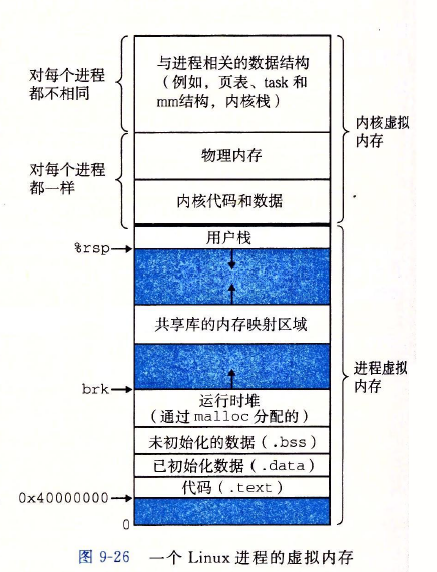

------

## 虚拟内存

虚拟内存为每个进程提供了一个大的、独立的、一致的地址空间。

- 在主存中只保存活动区域，在磁盘和主存之间通过缺页中断来回传送数据， 高效地使用了主存，等效地扩大了内存空间
- 它为每个进程提供了一致的地址空间， 从而简化了内存管理
- 它保护了每个进程的地址空间不被其他进程破坏

### 虚拟地址空间

[](https://github.com/szza/LearningNote/blob/master/1.面试总结/image/进程地址空间.jpg)


- 物理地址空间与虚拟地址空间的区别

  大小

  - 物理地址空间的大小是由地址总线决定的：比如32位系统，物理地址空间：$4G = 2^{32}$。
  - 进程的虚拟地址空间是物理地址空间大小相同。比如32位系统，他的进程虚拟空间大小就是 $4G$

  寻址方式不同

  - 物理地址空间的地址是可以直接寻址内存
  - 虚拟地址空间的地址需要经过内存管理单元`MMU（memory manger unit）` 翻译得物理地址，再去寻址内存

- 什么时候发生虚拟内存向物理内存的映射

  初始化的时候会建立一部分映射

  ```c
    #include <iostream>
  
    int main(int argc, char const *argv[])
    {
      int a =10;
      int b =1;
  
      std::cout<<(a + b)<<std::endl;
      return 0;
    }
  ```

  对于上述代码，编译会得到的信息如下：

  ```c
    $ g++ -static main.cc -o main.elf && readelf -l main.elf 
  
    Elf 文件类型为 EXEC (可执行文件)
    Entry point 0x404b00
    There are 10 program headers, starting at offset 64
  
    程序头：
      Type           Offset             VirtAddr           PhysAddr
                    FileSiz            MemSiz              Flags  Align
      LOAD          0x0000000000000000 0x0000000000400000 0x0000000000400000
                    0x00000000000005f0 0x00000000000005f0  R      0x1000
      LOAD          0x0000000000001000 0x0000000000401000 0x0000000000401000
                    0x000000000017185d 0x000000000017185d  R E    0x1000
      LOAD          0x0000000000173000 0x0000000000573000 0x0000000000573000
                    0x00000000000533f9 0x00000000000533f9  R      0x1000
      LOAD          0x00000000001c6940 0x00000000005c7940 0x00000000005c7940
                    0x000000000000bc10 0x0000000000010268  RW     0x1000
      NOTE          0x0000000000000270 0x0000000000400270 0x0000000000400270
                    0x0000000000000020 0x0000000000000020  R      0x8
      NOTE          0x0000000000000290 0x0000000000400290 0x0000000000400290
                    0x0000000000000044 0x0000000000000044  R      0x4
      TLS           0x00000000001c6940 0x00000000005c7940 0x00000000005c7940
                    0x0000000000000068 0x00000000000000b8  R      0x8
      GNU_PROPERTY  0x0000000000000270 0x0000000000400270 0x0000000000400270
                    0x0000000000000020 0x0000000000000020  R      0x8
      GNU_STACK     0x0000000000000000 0x0000000000000000 0x0000000000000000
                    0x0000000000000000 0x0000000000000000  RW     0x10
      GNU_RELRO     0x00000000001c6940 0x00000000005c7940 0x00000000005c7940
                    0x00000000000096c0 0x00000000000096c0  R      0x1
  ```

  对程序中的变量进行读写时，发生缺页中断会建立映射