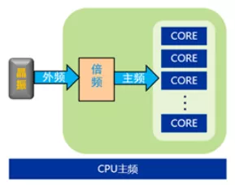
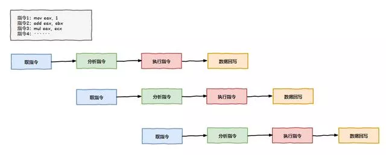
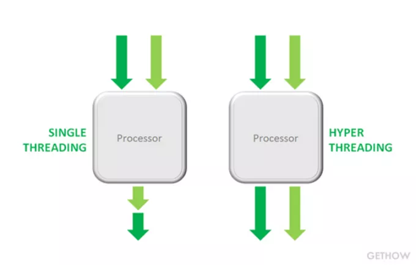
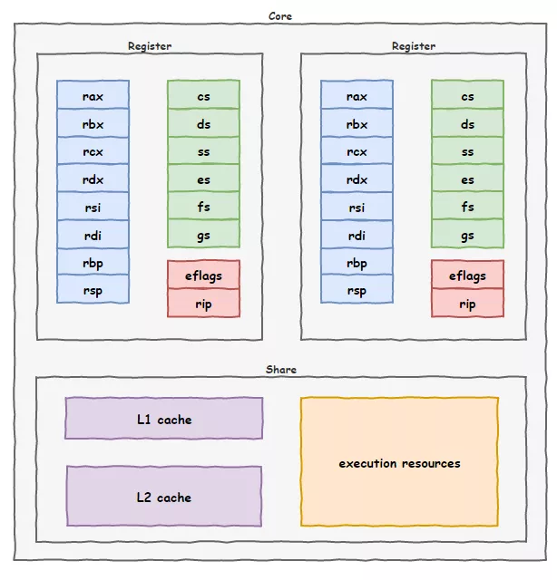
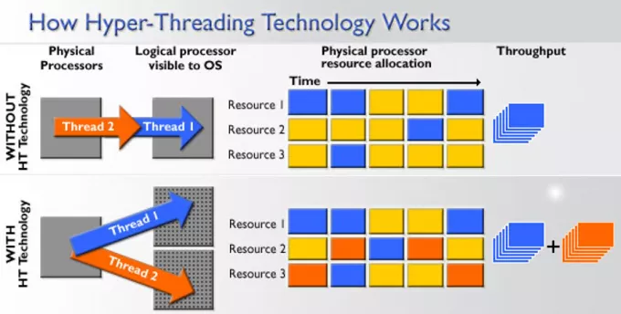
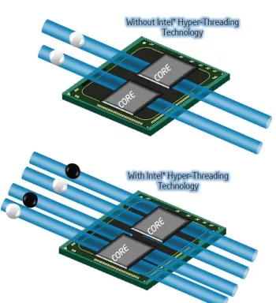
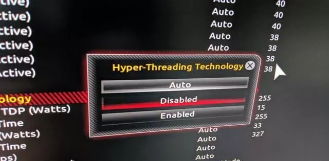

## **CPU里的时间**

Hi，好久不见，我是CPU一号车间的阿Q，不认识我的话，可以看看：[完了！CPU一味求快出事儿了！](https://mp.weixin.qq.com/s?__biz=MzIyNjMxOTY0NA==&mid=2247484072&idx=1&sn=ad1de598214dbb4eec652789d500d3a6&scene=21#wechat_redirect)

真的是好久不见了，人类有个说法叫天上一天，地上一年，而在我们的世界里，人类一天，我们不知要过多少年～～

图源网络，侵删

在我所在的CPU这座工厂里，时间的概念有些不太一样。工厂大门外的中央广场上挂着一个大大的钟表，整个计算机世界里的居民能够掐着时间过日子全都仰仗它，你们人类把它叫做**晶振**。

这个钟表每隔66000000分之一秒就会报一次时，比人类的钟表不知道快到哪里去了。

早些年还是够用的，不过随着我们CPU工厂生产效率的不断提升，我们多次向晶振提出提升报时的精度，想让他报时报的的更快一些，不过都被拒绝了。给我们的理由是内存那家伙联合主板上其他单位带头反对，说他们受条件限制，没办法像我们这么快。

图源网络，侵删

靠人不如靠己，为此，咱们工厂专门设立了一个叫`倍频器`的部门进一步把这个报时细分，达到了3600000000分之1秒，作为我们工厂内部工作作息的`时钟周期`，这数字实在是太长了，人类为了好记，取了一个叫`主频`的名字，表示1秒钟报时的次数，就是3.6GHz。

一不小心扯远了，这次想给大家说一件事儿······

## **指令依赖**

我们这座工厂的任务就是不断的执行人类编写的程序指令，咱厂里有8个车间，大家开足了马力，就能同时执行8个线程，那速度那叫一个快。

可是厂里的老板还是嫌我们不够快，那天居然告诉我们要每个车间执行两个线程，实现`八核十六线程`，是要把我们的劳动力压榨到极致！我们都满肚子怨言······

事情的起因是这样的～～

有一次，我们一号车间的四人组趁着工作的空当，又斗起了地主，突然领导过来视察。

图源网络，侵删

“你们怎么又在玩？是工作量不饱和吗？”，见我们几个闲着，领导一下就不高兴了。

我赶紧上前解释到：“不好意思领导，咱们刚刚执行了一条指令，需要内存中的一块数据，刚好又不在缓存中，所以找内存那家伙要数据去了，这不您也知道那家伙向来很慢，我们闲着也是闲着所以就稍微放松了一下······”

听了我的话领导一下皱起了眉头，“还给我狡辩，厂里现在不是用上了`乱序执行`技术吗？有这闲功夫你们可以先执行后面的指令啊”

“这我们当然知道，这不您看，我们把后面那几条指令也都处理了，现在遇到了一条没法提前执行的指令才停下来的”

领导看了一下问到：“为啥那条不能提前执行？”

“那是一个加法指令，加数依赖于现在正在处理的指令的运算结果呢，所以内存那家伙不来消息，我们只能搁置着了”，我继续解释到。

领导听完，一脸不高兴的离开了。

## **资源闲置**

过了几天，领导又来到咱们一号车间来了，也不知道怎么回事，这明明有八个车间，领导怎么老爱往我们这边跑。

不过这一次，我们没有斗地主，正在辛辛苦苦的工作着。

当时，我正在执行一个浮点数运算，领导过来一看，拍了拍我的肩膀说到：“哟，阿Q，忙着呐，这是在做什么啊？”

我笑着说到：“领导好，我刚刚用浮点数运算电路单元做了一个浮点数乘法，正在等待计算结果呢”

图源网络，侵删

领导点了点头，往周边巡视一圈，指着一堆设备问到：“这一堆是什么？”

“哦，那是整数运算电路单元，这条指令用不到它”

领导再次点了点头，若有所思的离开了。

## **超线程技术**

又过了几天，厂里召开了一次会议，八个车间都派了代表参会。

图源网络，侵删

会上，领导发话了：“前段时间我到各个车间视察，发现现在咱们厂里资源浪费的情况很严重！”

二号车间的虎子一听就坐不住了，“领导，咱们大家伙工作都挺卖力的，哪里有浪费啊？”

领导瞥了一眼，继续说到：“一方面，厂里的计算资源——电路设备得不到充分利用，另一方面，又因为内存读取缓慢、指令依赖等方面的原因，浪费大家太多时间花在等待上”

八号车间的代表向来爱拍马屁，接着领导的话问到：“领导是有什么指示？我们八号车间绝对支持！”

“我们几个管理层经过讨论，决定让你们*一个车间由现在执行一个线程，变成执行两个线程！*”

图源网络，侵删

领导这话一出，会场窃窃私语此起彼伏。虎子偏头小声对我说到：“这资本家改不了剥削的本色，这压榨的也太狠了！”

领导咳嗽了几声，会场再次安静了下来。

我起身问到：“领导，这咱们一个车间怎么能执行两个线程呢，每个车间的`寄存器`只有一套，这用起来岂不是要乱掉？”

“这个你不用担心，我们会给每个车间配两套寄存器！”

五号车间的代表一听说到：“要不再给我们添点人手吧，这样效率肯定提升快！”

领导一听笑着说到：“还添人手？要不要再给你们添点运算设备？那我不如再增加几个车间，还开这会干嘛？这次会议的主题就是如何让我们现有的资源得到最大程度的利用，减少浪费现象！”

会场一度陷入了尴尬又紧张的氛围。

还是虎子打破了安静，“领导，这两个线程的工作该怎么开展，我们心底没有数啊！”

领导满意的笑了一下：“这才是你们该问的问题嘛！每个车间回去重新分配一下工作，划分为两套班子，各自维护一套寄存器，对外宣称你们是两个不同的`物理核心`，但各车间的缓存和计算资源还是只有一套。你们内部协调好，在执行代码指令的时候，充分利用等待的时间执行另一个线程的指令，这样也不用担心指令依赖的问题。”

大家一边听一边做着笔记。

图源网络，侵删

“还有，如果遇到资源闲置的情况，也可以同时执行两个线程的指令。比如一个线程是执行整数运算指令，一个线程是执行浮点数运算指令，就可以一起来，让工厂的计算资源充分用起来，别闲置。”

看我们都认真的记着笔记，领导露出了满意的笑容，“都记好了吧，我们给这项革命性的技术取了个特别酷的名字，叫**超线程技术**！”

散会后，大家都纷纷抱怨，把大家逼得这么紧，以后上班看来是没法摸鱼了，这日子真是越来越难过了。

## **毁誉参半的超线程**

不过，抱怨归抱怨，大家还是得按照新规来执行。

很快，厂里就落地了这项技术，咱们一个车间摇身一变，变成了俩，咱们原来八核八线程的CPU一下变成了八核十六线程。操作系统那帮人都被我们给骗了，还以为咱们是十六核的CPU呢！

图源网络，侵删

不过毕竟计算资源还是只有一份，遇到两个线程都要使用同样的计算单元时，还是得要排队，还要花时间在两个线程之前的协调工作上，所以整体工作效率的根本没有2倍，绝大多数时候能提升个20%-30%就不错了。

不仅如此，车间改造后，增加了新的逻辑电路单元，咱这CPU工厂的功耗也更大了，工厂门口那座巨大的风扇也得加大马力给我们降温了。

厂子里对这项技术的反对声音开始不绝于耳。

图源网络，侵删

不过后来发生了一件事，让人们不得不关闭这项技术。听闻这个消息，我们都乐开了花，看来又可以继续摸鱼了······

## **彩蛋**

> 每当有网络数据包到来，网卡那家伙就通过中断告诉我们CPU去处理。
>
> 可咱明明有8个车间，它非得一个劲的只给我们车间发中断，搞得我们都没法好好工作。
>
> 终于，我忍不住了······
>
> *预知后事如何，请关注后续精彩······*

------

> **说明**：
>
> 超线程技术出现时间其实早于多核技术。本故事仅为叙述方便，不代表二者真实的发展顺序。