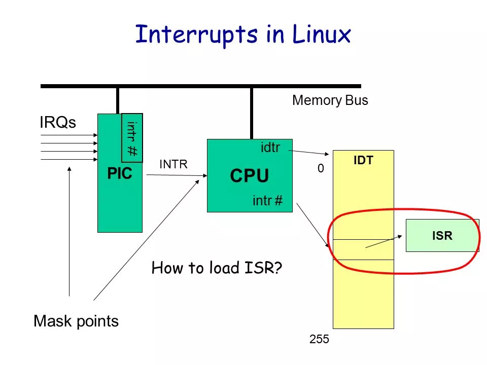
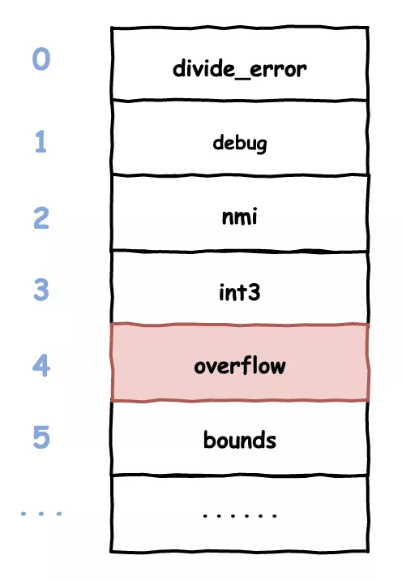
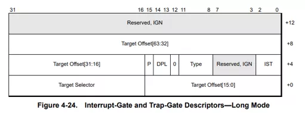
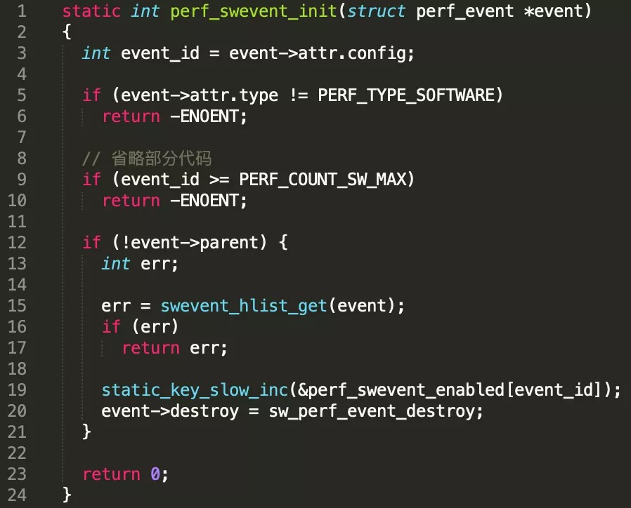
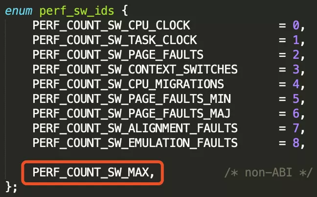
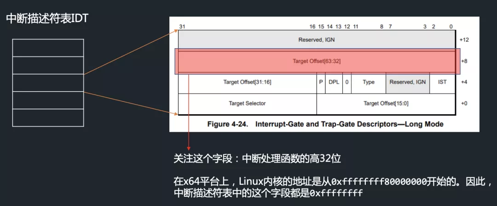

## **帝国危机**

夜幕降临，喧嚣褪去，繁忙的Linux帝国渐渐平静了下来，谁也没有想到，一场改变帝国命运的风暴正在悄然而至......


“咚咚！”，帝国安全部长办公室的敲门声，打破了夜晚的宁静。

“部长，刚刚发现有线程在修改**passwd**文件”，原来是文件系统部门的小黑到访。


“这有什么大惊小怪的？只要有root权限，这是允许的嘛！”，安全部长没有抬头，继续看着每天的系统日志。

“部长，重点在于这线程不是从系统调用进入内核，而是从中断入口进来的”

安全部长愣了一下，约莫0.2ms之后，放下了手里的日志，站了起来。

“你是说，他是通过中断描述符表（IDT）进来的？”

小黑点了点头。



“小王，你赶紧跟他过去IDT看一下，调查清楚速来报我”，部长对着一旁的助理说到。

小王点了点头，准备出发，刚走到门口，又被部长叫住了。

“等等！此事非同小可，我还是亲自去一趟吧”

## **IDT修改谜案**

安全部长随即出发，来到IDT所在的地方，这里一切如旧，未见有何异样。


部长指着这一排门墙问道：“他是从哪道门进来的？”

“4号”，这时，看守IDT大门的白发老头闻讯走了过来回答到。


“奇怪了，IDT表中的函数入口，都是帝国安排好了的，讲道理没有哪一个会去修改passwd文件才对”，部长看着这些表项，低头自语。



“部长，这我得跟您汇报一下，那小子进来之前，把第四项的入口地址高32位改成了0x00000000，进来之后他才给恢复成了0xFFFFFFFF”，老头说完，拿出了IDT表项的结构图展了开来：



部长听完猛的一抬头，“高32位变成了0x00000000，那整个函数入口地址不就指向了用户态地址空间了？”

小黑和小王都不敢说话，大家都知道这后果有多严重，天知道那家伙利用内核权限执行了用户空间的什么代码。

“不对，在他进来之前，一个用户空间的线程怎么能改IDT的内容呢？他没权限访问才对，我不信！”

“这个我倒是知道，他改的是时候，我特地留意了一下他的调用堆栈，不是在用户空间，是从内核空间的函数——`perf_swevent_init`方向来的”，老头说到。

## **整数+1的悲剧**

部长二话没说，又带着大家直奔`perf_swevent_init`函数而去。



“老伯，您可还记得具体是哪个位置？”，部长问到。

“就是从那个19行那个`static_key_slow_inc`函数过来的”


“让我看一下”，小王挤到前面来，想在部长面前露一手。

“嗯，这个`static_key_slow_inc`做的事情是把一个整数执行了原子+1操作。不过它操作的是`perf_swevent_enabled`数组，跟IDT八杆子打不到一块儿去，怎么能修改到IDT呢？”，小王摸了摸头，往后退了两步，瞧着是没看出什么问题。

“不见得！”，部长仍然是紧锁着眉头，开口说到，“你们看，它是通过`event_id`这个数字作为下标来访问数组元素，要是这个event_id出错访问越界，指向IDT，也不是没有可能啊！”

小王赶紧扫了一眼`event_id`，随后便露出了失望的表情，“不会的，第9行有检查，你看，超过8以后就会通不过检查”




线索在这里被切断了，本来指望在`perf_swevent_init`这个函数这里寻找IDT被修改之谜，看来要无功而返了。

不知不觉，时间已经很晚了，部长一行决定先回去，再从长计议。

部长走了几步，见小王没有跟上来，便回头叫了他一声。

“部长请留步，我好像感觉哪里不太对劲”，小王此刻也皱起了眉头。

“你发现了什么？”，部长和小黑他们又走了回来。

“部长，你看第3行，这个`event_id`是一个`int`型的变量，也就是说这是一个有符号数。”，小王说到。

“有符号数怎么了？”，小黑也忍不住开口问了。

“如果······”

“*如果`event_id`变成了一个负数，它将能越界访问数组，并且还能通过第9行的大小检查！*”，没等小王说完，部长道破了玄机！

众人再一次将目光聚集在了这个`event_id`上，打算看一下第三行给它赋值的`event->attr.config`是个什么来头。

首先是`perf_event`中的`attr`成员变量：

```
struct perf_event {
  // ...
  struct perf_event_attr attr;
  // ...
};
```

接着是`perf_event_attr`中的`config`成员变量：

```
struct perf_event_attr {
  // ...
  __u64 config;
  // ...
};
```

看到最后，部长和小王都倒吸了一口凉气，这`config`竟然是个64位无符号整数，把它赋值给一个`int`型变量不出问题就怪了！

见大家都不说话，小黑挠了挠头，弱弱的问到：“怎么了，你们怎么都不说话，这有什么问题吗？”

小王把小黑拉到一边，“问题大了，你看我要是把一个值为**0xFFFFFFFF**的`config`赋值给`event_id`，`event_id`会变成什么？”

“负，负，负1？”


“没错，有符号数的最高位是用来标记正负的，如果这个`config`最高位为1，后面的位经过精心设计，不仅能瞒天过海骗过那里第9行的验证，还能将某个位置的数字进行一个原子+1操作。”，小王继续说道。

“不错嘛小王，有进步！”，不知何时部长也走了过来，被部长这么一夸，小王有些不好意思了。

“听了半天，不就是越界把某个地方的数加了1嘛，有什么大不了的？”，小黑一脸不屑的样子。

小王一听连连摇头，“你可不要小瞧了这个加1的行为，要是加在某些敏感的地方，那可是要出大事的！“

小黑有些疑惑，“比如说呢？”

“比如记录中断和异常的处理函数的`IDT`，又比如记录系统调用的`sys_call_table`，这些表中的函数地址都位于帝国内核空间，要是这个加1，加的不是别人，而是这些表中的函数地址，那可就麻烦了。”，小王继续说到。

“我听明白了，可是就算加个1，也应该不是什么大问题吧？”

小王叹了口气，“看来你还是不明白，我以这次被修改的IDT表为例，给大家再看一下表中的表项——**中断描述符**的格式”



“IDT中的中断/异常处理函数的地址不是一个完整的64位，而是拆成了几部分，其中高32位我给大家红色标示出来了，在64位Linux帝国，内核空间的地址高32位都是`0xFFFFFFFF`，如果······”

“如果利用前面的`event_id`数组下标越界访问，把这个地方原子+1，那就变成了0，对不对？”，小黑总算明白了。

## **真相大白**


安全部长为小王的精彩分析鼓起了掌，“不错不错，大家都很聪明！事到如今，我们来复盘一下吧！”

> - 第一步：精心设计一个config值，从应用层传入内核空间的`perf_swevent_init`函数
> - 第二步：利用帝国内核漏洞，把一个64位无符号数赋值给一个int型变量，导致变量溢出为一个负数。
> - 第三步：利用溢出的`event_id`越界访问`perf_swevent_enabled`，指向IDT的表项，将第四项中断处理函数的高32位进行原子+1
> - 第四步：修改后的中断处理函数指向了用户空间，提前在此安排恶意代码
> - 第五步：应用层执行`int 4`汇编指令，触发4号中断，线程将进入内核空间，以至高权限执行提前安排的恶意代码。

事情总算是水落石出，安全部长回去之后便上报帝国总部，修复了此漏洞，将`event_id`的类型从`int`修正为`u64`。

即便如此，部长的心情却并没有轻松多少，未知的敌人已经闯入帝国，它们是谁？做了什么？现在藏在哪里？一个又一个的问题还在不断在脑中闪现······

**未完待续······**

## **彩蛋**

> 一个闷热的下午，风扇飞速的旋转，热得人喘不过气。
>
> 部长的办公室出现了一个熟悉的身影，走近一看原来是小马哥。
>
> “部长，nginx公司又出事了”
>
> *预知后事如何，请关系后续精彩······*