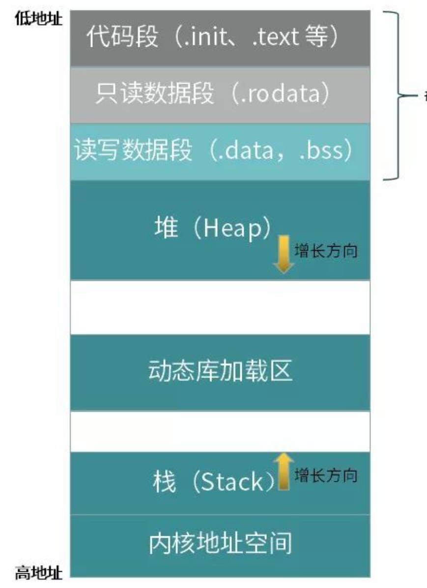
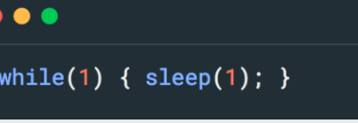
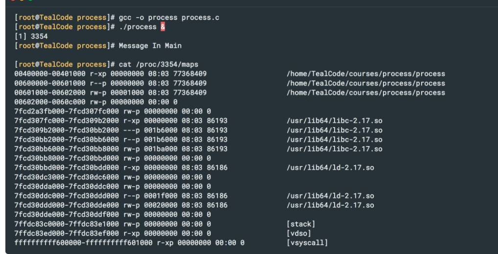
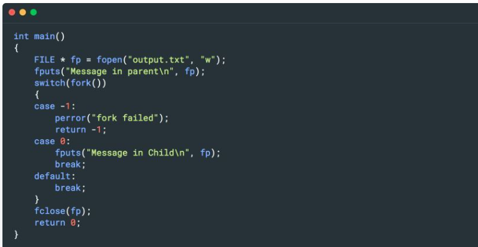
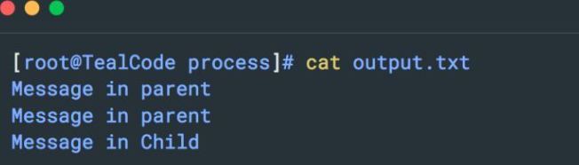
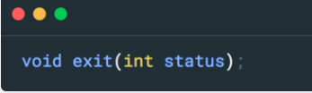
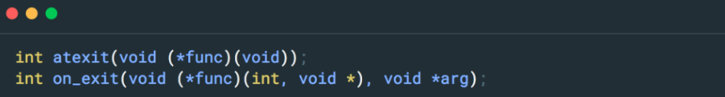

#### **虚拟空间地址排布**

在 32 位系统下，进程的虚拟地址空间有 4G，其中的 1G 分配给了内核空间，用户应用可以使用剩余的 3G。

在 64 位的 Linux 系统上，进程的虚拟地址空间可以达到 256TB，内核和应用分别占用 128TB。目前看来，这样的地址空间范围足够用了。

一个典型的内存排布结构如下图所示：



在 Linux 系统中，使用如下命令可查看一个运行中的进程的内存排布。


稍微修改上一篇中的示例代码，在 main 函数返回之前，增加一个无限循环，保持程序一直运行。



启动程序并查看该进程的内存布局，可以看到如下所示的信息：



从以上输出的内容中，可以直观看到进程的段、堆区，动态链接库加载区，栈区的逻辑地址排布，以及每块内存区分配到的权限等。

除此之外，还有两块 vdso 和 vsyscall 内存区。它们是一部分内核数据在用户空间的映射，为了提高应用的性能而创建。在《攻克 Linux 系统编程》中，我们再专门详细讨论。

### **进程的启动**

从用户角度来看，启动一个进程有许多种方式，可以配置开机自启动，可以在 Shell 中手动运行，也可以从脚本或其他进程中启动。

而从开发人员角度看，无非就是两个系统调用，即 fork() 和 execve()。下面就来探究下这两个系统调用的行为细节。

#### **2.1 fork() 系统调用**

fork() 系统调用将创建一个与父进程几乎一样的新进程，之后继续执行下面的指令。程序可以根据 fork() 的返回值，确定当前处于父进程中，还是子进程中——在父进程中，返回值为新创建子进程的进程 ID，在子进程中，返回值是 0。

一些使用多进程模型的服务器程序（比如 sshd），就是通过 fork() 系统调用来实现的，每当新用户接入时，系统就会专门创建一个新进程，来服务该用户。

fork() 系统调用所创建的新进程，与其父进程的内存布局和数据几乎一模一样。在内核中，它们的代码段所在的只读存储区会共享相同的物理内存页，可读可写的数据段、堆及栈等内存，内核会使用写时拷贝技术，为每个进程独立创建一份。

在 fork() 系统调用刚刚执行完的那一刻，子进程即可拥有一份与父进程完全一样的数据拷贝。对于已打开的文件，内核会增加每个文件描述符的引用计数，每个进程都可以用相同的文件句柄访问同一个文件。

深入理解了这些底层行为细节，就可以顺理成章地理解 fork() 的一些行为表现和正确使用规范，无需死记硬背，也可获得一些别人踩过坑后才能获得的经验。

比如，使用多进程模型的网络服务程序中，为什么要在子进程中关闭监听套接字，同时要在父进程中关闭新连接的套接字呢？

原因在于 fork() 执行之后，所有已经打开的套接字都被增加了引用计数，在其中任一个进程中都无法彻底关闭套接字，只能减少该文件的引用计数。

因此，在 fork() 之后，每个进程立即关闭不再需要的文件是个好的策略，否则很容易导致大量没有正确关闭的文件一直占用系统资源的现象。

再比如，下面这段代码是否存在问题？为什么在输出文件中会出现两行重复的文本？



输入文本：



原因是 fputs 库函数带有缓冲，fork() 创建的子进程完全拷贝父进程用户空间内存时，fputs 库函数的缓冲区也被包含进来了。

所以，fork() 执行之后，子进程同样获得了一份 fputs 缓冲区中的数据，导致“Message in parent”这条消息在子进程中又被输出了一次。要解决这个问题，只需在 fork() 之前，利用 fflush 打开文件即可，读者可自行验证 。

另外，希望读者自己思考下，利用父子进程共享相同的只读数据段的特性，是不是可以实现一套父子进程间的通信机制呢？

#### **2.2 execve() 系统调用**

execve() 系统调用的作用是运行另外一个指定的程序。它会把新程序加载到当前进程的内存空间内，当前的进程会被丢弃，它的堆、栈和所有的段数据都会被新进程相应的部分代替，然后会从新程序的初始化代码和 main 函数开始运行。同时，进程的 ID 将保持不变。

execve() 系统调用通常与 fork() 系统调用配合使用。从一个进程中启动另一个程序时，通常是先 fork() 一个子进程，然后在子进程中使用 execve() 变身为运行指定程序的进程。

例如，当用户在 Shell 下输入一条命令启动指定程序时，Shell 就是先 fork() 了自身进程，然后在子进程中使用 execve() 来运行指定的程序。

execve() 系统调用的函数原型为：


filename 用于指定要运行的程序的文件名，argv 和 envp 分别指定程序的运行参数和环境变量。除此之外，该系列函数还有很多变体，它们执行大体相同的功能，区别在于需要的参数不同，包括 execl、execlp、execle、execv、execvp、execvpe 等。它们的参数意义和使用方法请读者自行查看帮助手册。

需要注意的是，exec 系列函数的返回值只在遇到错误的时候才有意义。如果新程序成功地被执行，那么当前进程的所有数据就都被新进程替换掉了，所以永远也不会有任何返回值。

对于已打开文件的处理，在 exec() 系列函数执行之前，应该确保全部关闭。因为 exec() 调用之后，当前进程就完全变身成另外一个进程了，老进程的所有数据都不存在了。

如果 exec() 调用失败，当前打开的文件状态应该被保留下来。让应用层处理这种情况会非常棘手，而且有些文件可能是在某个库函数内部打开的，应用对此并不知情，更谈不上正确地维护它们的状态了。

所以，对于执行 exec() 函数的应用，应该总是使用内核为文件提供的执行时关闭标志（FD_CLOEXEC）。设置了该标志之后，如果 exec() 执行成功，文件就会被自动关闭；如果 exec() 执行失败，那么文件会继续保持打开状态。使用系统调用 fcntl() 可以设置该标志。

#### **2.3 fexecve() 函数**

glibc 从 2.3.2 版本开始提供 fexecv() 函数，它与 execve() 的区别在于，第一个参数使用的是打开的文件描述符，而非文件路径名。

增加这个函数是为了满足这样的应用需求：有些应用在执行某个程序文件之前，需要先打开文件验证文件内容的校验和，确保文件内容没有被恶意修改过。

在这种情景下，使用 fexecve 是更加安全的方案。组合使用 open() 和 execve() 虽然可以实现同样的功能，但是在打开文件和执行文件之间，存在被执行的程序文件被掉包的可能性。

### **03**

### **监控子进程状态**

在 Linux 应用中，父进程需要监控其创建的所有子进程的退出状态，可以通过如下几个系统调用来实现。

- **pid_t wait(int \* statua)** 一直阻塞地等待任意一个子进程退出，返回值为退出的子进程的 ID，status 中包含子进程设置的退出标志。
- **pid_t waitpid(pid_t pid, int \* status, int options)** 可以用 pid 参数指定要等待的进程或进程组的 ID，options 可以控制是否阻塞，以及是否监控因信号而停止的子进程等。
- **int waittid(idtype_t idtype, id_t id, siginfo_t \*infop, int options)** 提供比 waitpid 更加精细的控制选项来监控指定子进程的运行状态。
- **wait3() 和 wait4() 系统调用** 可以在子进程退出时，获取到子进程的资源使用数据。

更详细的信息请参考帮助手册。

**本文要重点讨论的是：**即使父进程在业务逻辑上不关心子进程的终止状态，也需要使用 wait 类系统调用的底层原因。

这其中的要点在于：在 Linux 的内核实现中，允许父进程在子进程创建之后的任意时刻用 wait() 系列系统调用来确定子进程的状态。

也就是说，如果子进程在父进程调用 wait() 之前就终止了，内核需要保留该子进程的终止状态和资源使用等数据，直到父进程执行 wait() 把这些数据取走。

在子进程终止到父进程获取退出状态之间的这段时间，这个进程会变成所谓的僵尸状态，在该状态下，任何信号都无法结束它。如果系统中存在大量此类僵尸进程，势必会占用大量内核资源，甚至会导致新进程创建失败。

如果父进程也终止，那么 init 进程会接管这些僵尸进程并自动调用 wait ，从而把它们从系统中移除。但是对于长期运行的服务器程序，这一定不是开发者希望看到的结果。所以，父进程一定要仔细维护好它创建的所有子进程的状态，防止僵尸进程的产生。

### **04** 

### **进程的终止**

正常终止一个进程可以用 _exit 系统调用来实现，原型为：


其中的 status 会返回 wait() 类的系统调用。进程退出时会清理掉该进程占用的所有系统资源，包括关闭打开的文件描述符、释放持有的文件锁和内存锁、取消内存映射等，还会给一些子进程发送信号（后面课程再详细展开）。该系统调用一定会成功，永远不会返回。

在退出之前，还希望做一些个性化的清理操作，可以使用库函数 exit() 。函数原型为：



这个库函数先调用退出处理程序，然后再利用 status 参数调用 _exit() 系统调用。这里的退出处理程序可以通过 atexit() 或 on_exit() 函数注册。

其中 atexit() 只能注册返回值和参数都为空的回调函数，而 on_exit() 可以注册带参数的回调函数。退出处理函数的执行顺序与注册顺序相反。它们的函数原型如下所示：



通常情况下，个性化的退出处理函数只会在主进程中执行一次，所以 exit() 函数一般在主进程中使用，而在子进程中只使用 _exit() 系统调用结束当前进程。

### **05** 

### **总结**

本文深入探究了 Linux 进程在用户空间的一些内部细节，包括逻辑内存排布、进程创建和变身的内部细节、进程状态监控的目的和接口，以及终止进程的正确姿势等。

对这些底层实现细节的充分理解，能帮助读者更好地理解各个系统调用的行为表现，并根据具体的应用需求选择正确、合适的实现方案。


------

# 用户空间的程序启动过程

## 简介

虽然 [linux-insides-zh](https://www.gitbook.com/book/xinqiu/linux-insides-cn/details) 大多描述的是内核相关的东西，但是我已经决定写一个大多与用户空间相关的部分。

[系统调用](https://zh.wikipedia.org/wiki/系统调用)章节的[第四部分](https://xinqiu.gitbooks.io/linux-insides-cn/content/SysCall/linux-syscall-4.html)已经描述了当我们想运行一个程序， Linux 内核的行为。这部分我想研究一下从用户空间的角度，当我们在 Linux 系统上运行一个程序，会发生什么。

我不知道你知识储备如何，但是在我的大学时期我学到，一个 `C` 程序从一个叫做 main 的函数开始执行。而且，这是部分正确的。每时每刻，当我们开始写一个新的程序时，我们从下面的实例代码开始编程：

```C
int main(int argc, char *argv[]) {
    // Entry point is here
}
```

但是你如何对于底层编程感兴趣的话，可能你已经知道 `main` 函数并不是程序的真正入口。如果你在调试器中看了下面这个简单程序，就可以很确信这一点：

```C
int main(int argc, char *argv[]) {
    return 0;
}
```

让我们来编译并且在 [gdb](https://www.gnu.org/software/gdb/) 中运行这个程序：

```
$ gcc -ggdb program.c -o program
$ gdb ./program
The target architecture is assumed to be i386:x86-64:intel
Reading symbols from ./program...done.
```

让我们在 gdb 中执行 `info files` 这个指令。这个指令会打印关于被不同段占据的内存和调试目标的信息。

```
(gdb) info files
Symbols from "/home/alex/program".
Local exec file:
    `/home/alex/program', file type elf64-x86-64.
    Entry point: 0x400430
    0x0000000000400238 - 0x0000000000400254 is .interp
    0x0000000000400254 - 0x0000000000400274 is .note.ABI-tag
    0x0000000000400274 - 0x0000000000400298 is .note.gnu.build-id
    0x0000000000400298 - 0x00000000004002b4 is .gnu.hash
    0x00000000004002b8 - 0x0000000000400318 is .dynsym
    0x0000000000400318 - 0x0000000000400357 is .dynstr
    0x0000000000400358 - 0x0000000000400360 is .gnu.version
    0x0000000000400360 - 0x0000000000400380 is .gnu.version_r
    0x0000000000400380 - 0x0000000000400398 is .rela.dyn
    0x0000000000400398 - 0x00000000004003c8 is .rela.plt
    0x00000000004003c8 - 0x00000000004003e2 is .init
    0x00000000004003f0 - 0x0000000000400420 is .plt
    0x0000000000400420 - 0x0000000000400428 is .plt.got
    0x0000000000400430 - 0x00000000004005e2 is .text
    0x00000000004005e4 - 0x00000000004005ed is .fini
    0x00000000004005f0 - 0x0000000000400610 is .rodata
    0x0000000000400610 - 0x0000000000400644 is .eh_frame_hdr
    0x0000000000400648 - 0x000000000040073c is .eh_frame
    0x0000000000600e10 - 0x0000000000600e18 is .init_array
    0x0000000000600e18 - 0x0000000000600e20 is .fini_array
    0x0000000000600e20 - 0x0000000000600e28 is .jcr
    0x0000000000600e28 - 0x0000000000600ff8 is .dynamic
    0x0000000000600ff8 - 0x0000000000601000 is .got
    0x0000000000601000 - 0x0000000000601028 is .got.plt
    0x0000000000601028 - 0x0000000000601034 is .data
    0x0000000000601034 - 0x0000000000601038 is .bss
```

注意 `Entry point: 0x400430` 这一行。现在我们知道我们程序入口点的真正地址。让我们在这个地址下一个断点，然后运行我们的程序，看看会发生什么：

```
(gdb) break *0x400430
Breakpoint 1 at 0x400430
(gdb) run
Starting program: /home/alex/program 

Breakpoint 1, 0x0000000000400430 in _start ()
```

有趣。我们并没有看见 `main` 函数的执行，但是我们看见另外一个函数被调用。这个函数是 `_start` 而且根据调试器展现给我们看的，它是我们程序的真正入口。那么，这个函数是从哪里来的，又是谁调用了这个 `main` 函数，什么时候调用的。我会在后续部分尝试回答这些问题。

## 内核如何运行新程序

首先，让我们来看一下下面这个简单的 `C` 程序：

```C
// program.c

#include <stdlib.h>
#include <stdio.h>

static int x = 1;

int y = 2;

int main(int argc, char *argv[]) {
    int z = 3;

    printf("x + y + z = %d\n", x + y + z);

    return EXIT_SUCCESS;
}
```

我们可以确定这个程序按照我们预期那样工作。让我们来编译它：

```
$ gcc -Wall program.c -o sum
```

并且执行：

```
$ ./sum
x + y + z = 6
```

好的，直到现在所有事情看起来听挺好。你可能已经知道一个特殊的[系统调用](https://zh.wikipedia.org/wiki/系统调用)家族 - [exec*](http://man7.org/linux/man-pages/man3/execl.3.html) 系统调用。正如我们从帮助手册中读到的：

> The exec() family of functions replaces the current process image with a new process image.

如果你已经阅读过[系统调用](https://zh.wikipedia.org/wiki/系统调用)章节的[第四部分](https://xinqiu.gitbooks.io/linux-insides-cn/content/SysCall/linux-syscall-4.html)，你可能就知道 execve 这个系统调用定义在 [files/exec.c](https://github.com/torvalds/linux/blob/master/fs/exec.c#L1859) 文件中，并且如下所示，

```C
SYSCALL_DEFINE3(execve,
        const char __user *, filename,
        const char __user *const __user *, argv,
        const char __user *const __user *, envp)
{
    return do_execve(getname(filename), argv, envp);
}
```

它以可执行文件的名字，命令行参数的集合以及环境变量的集合作为参数。正如你猜测的，每一件事都是 `do_execve` 函数完成的。在这里我将不描述这个函数的实现细节，因为你可以从[这里](https://xinqiu.gitbooks.io/linux-insides-cn/content/SysCall/linux-syscall-4.html)读到。但是，简而言之，`do_execve` 函数会检查诸如文件名是否有效，未超出进程数目限制等等。在这些检查之后，这个函数会解析 [ELF](https://en.wikipedia.org/wiki/Executable_and_Linkable_Format) 格式的可执行文件，为新的可执行文件创建内存描述符，并且在栈，堆等内存区域填上适当的值。当二进制镜像设置完成，`start_thread` 函数会设置一个新的进程。这个函数是框架相关的，而且对于 [x86_64](https://en.wikipedia.org/wiki/X86-64) 框架，它的定义是在 [arch/x86/kernel/process_64.c](https://github.com/torvalds/linux/blob/master/arch/x86/kernel/process_64.c#L231) 文件中。

`start_thread` 为[段寄存器](https://en.wikipedia.org/wiki/X86_memory_segmentation)设置新的值。从这一点开始，新进程已经准备就绪。一旦[进程切换](https://xinqiu.gitbooks.io/linux-insides-cn/content/Misc/(https:/en.wikipedia.org/wiki/Context_switch))完成，控制权就会返回到用户空间，并且新的可执行文件将会执行。

这就是所有内核方面的内容。Linux 内核为执行准备二进制镜像，而且它的执行从上下文切换开始，结束之后将控制权返回用户空间。但是它并不能回答像 `_start` 来自哪里这样的问题。让我们在下一段尝试回答这些问题。

## 用户空间程序如何启动

在之前的段落汇总，我们看到了内核是如何为可执行文件运行做准备工作的。让我们从用户空间来看这相同的工作。我们已经知道一个程序的入口点是 `_start` 函数。但是这个函数是从哪里来的呢？它可能来自于一个库。但是如果你记得清楚的话，我们在程序编译过程中并没有链接任何库。

```
$ gcc -Wall program.c -o sum
```

你可能会猜 `_start` 来自于[标准库](https://en.wikipedia.org/wiki/Standard_library)。是的，确实是这样。如果你尝试去重新编译我们的程序，并给 gcc 传递可以开启 `verbose mode` 的 `-v` 选项，你会看到下面的长输出。我们并不对整体输出感兴趣，让我们来看一下下面的步骤：

首先，使用 `gcc` 编译我们的程序：

```
$ gcc -v -ggdb program.c -o sum
...
...
...
/usr/libexec/gcc/x86_64-redhat-linux/6.1.1/cc1 -quiet -v program.c -quiet -dumpbase program.c -mtune=generic -march=x86-64 -auxbase test -ggdb -version -o /tmp/ccvUWZkF.s
...
...
...
```

`cc1` 编译器将编译我们的 `C` 代码并且生成 `/tmp/ccvUWZkF.s` 汇编文件。之后我们可以看见我们的汇编文件被 `GNU as` 编译器编译为目标文件：

```
$ gcc -v -ggdb program.c -o sum
...
...
...
as -v --64 -o /tmp/cc79wZSU.o /tmp/ccvUWZkF.s
...
...
...
```

最后我们的目标文件会被 `collect2` 链接到一起：

```
$ gcc -v -ggdb program.c -o sum
...
...
...
/usr/libexec/gcc/x86_64-redhat-linux/6.1.1/collect2 -plugin /usr/libexec/gcc/x86_64-redhat-linux/6.1.1/liblto_plugin.so -plugin-opt=/usr/libexec/gcc/x86_64-redhat-linux/6.1.1/lto-wrapper -plugin-opt=-fresolution=/tmp/ccLEGYra.res -plugin-opt=-pass-through=-lgcc -plugin-opt=-pass-through=-lgcc_s -plugin-opt=-pass-through=-lc -plugin-opt=-pass-through=-lgcc -plugin-opt=-pass-through=-lgcc_s --build-id --no-add-needed --eh-frame-hdr --hash-style=gnu -m elf_x86_64 -dynamic-linker /lib64/ld-linux-x86-64.so.2 -o test /usr/lib/gcc/x86_64-redhat-linux/6.1.1/../../../../lib64/crt1.o /usr/lib/gcc/x86_64-redhat-linux/6.1.1/../../../../lib64/crti.o /usr/lib/gcc/x86_64-redhat-linux/6.1.1/crtbegin.o -L/usr/lib/gcc/x86_64-redhat-linux/6.1.1 -L/usr/lib/gcc/x86_64-redhat-linux/6.1.1/../../../../lib64 -L/lib/../lib64 -L/usr/lib/../lib64 -L. -L/usr/lib/gcc/x86_64-redhat-linux/6.1.1/../../.. /tmp/cc79wZSU.o -lgcc --as-needed -lgcc_s --no-as-needed -lc -lgcc --as-needed -lgcc_s --no-as-needed /usr/lib/gcc/x86_64-redhat-linux/6.1.1/crtend.o /usr/lib/gcc/x86_64-redhat-linux/6.1.1/../../../../lib64/crtn.o
...
...
...
```

是的，我们可以看见一个很长的命令行选项列表被传递给链接器。让我们从另一条路行进。我们知道我们的程序都依赖标准库。

```
$ ldd program
    linux-vdso.so.1 (0x00007ffc9afd2000)
    libc.so.6 => /lib64/libc.so.6 (0x00007f56b389b000)
    /lib64/ld-linux-x86-64.so.2 (0x0000556198231000)
```

从那里我们会用一些库函数，像 `printf` 。但是不止如此。这就是为什么当我们给编译器传递 `-nostdlib` 参数，我们会收到错误报告：

```
$ gcc -nostdlib program.c -o program
/usr/bin/ld: warning: cannot find entry symbol _start; defaulting to 000000000040017c
/tmp/cc02msGW.o: In function `main':
/home/alex/program.c:11: undefined reference to `printf'
collect2: error: ld returned 1 exit status
```

除了这些错误，我们还看见 `_start` 符号未定义。所以现在我们可以确定 `_start` 函数来自于标准库。但是即使我们链接标准库，它也无法成功编译：

```
$ gcc -nostdlib -lc -ggdb program.c -o program
/usr/bin/ld: warning: cannot find entry symbol _start; defaulting to 0000000000400350
```

好的，当我们使用 `/usr/lib64/libc.so.6` 链接我们的程序，编译器并不报告标准库函数的未定义引用，但是 `_start` 符号仍然未被解析。让我们重新回到 `gcc` 的冗长输出，看看 `collect2` 的参数。我们现在最重要的问题是我们的程序不仅链接了标准库，还有一些目标文件。第一个目标文件是 `/lib64/crt1.o` 。而且，如果我们使用 `objdump` 工具去看这个目标文件的内部，我们将看见 `_start` 符号：

```
$ objdump -d /lib64/crt1.o 

/lib64/crt1.o:     file format elf64-x86-64


Disassembly of section .text:

0000000000000000 <_start>:
   0:    31 ed                    xor    %ebp,%ebp
   2:    49 89 d1                 mov    %rdx,%r9
   5:    5e                       pop    %rsi
   6:    48 89 e2                 mov    %rsp,%rdx
   9:    48 83 e4 f0              and    $0xfffffffffffffff0,%rsp
   d:    50                       push   %rax
   e:    54                       push   %rsp
   f:    49 c7 c0 00 00 00 00     mov    $0x0,%r8
  16:    48 c7 c1 00 00 00 00     mov    $0x0,%rcx
  1d:    48 c7 c7 00 00 00 00     mov    $0x0,%rdi
  24:    e8 00 00 00 00           callq  29 <_start+0x29>
  29:    f4                       hlt
```

因为 `crt1.o` 是一个共享目标文件，所以我们只看到桩而不是真正的函数调用。让我们来看一下 `_start` 函数的源码。因为这个函数是框架相关的，所以 `_start` 的实现是在 [sysdeps/x86_64/start.S](https://sourceware.org/git/?p=glibc.git;a=blob;f=sysdeps/x86_64/start.S;h=f1b961f5ba2d6a1ebffee0005f43123c4352fbf4;hb=HEAD) 这个汇编文件中。

`_start` 始于对 `ebp` 寄存器的清零，正如 [ABI](https://xinqiu.gitbooks.io/linux-insides-cn/content/Misc/(https:/software.intel.com/sites/default/files/article/402129/mpx-linux64-abi.pdf)) 所建议的。

```assembly
xorl %ebp, %ebp
```

之后，将终止函数的地址放到 `r9` 寄存器中：

```assembly
mov %RDX_LP, %R9_LP
```

正如 [ELF](http://flint.cs.yale.edu/cs422/doc/ELF_Format.pdf) 标准所述，

> After the dynamic linker has built the process image and performed the relocations, each shared object gets the opportunity to execute some initialization code. ... Similarly, shared objects may have termination functions, which are executed with the atexit (BA_OS) mechanism after the base process begins its termination sequence.

所以我们需要把终止函数的地址放到 `r9` 寄存器，因为将来它会被当作第六个参数传递给 `__libc_start_main` 。注意，终止函数的地址初始是存储在 `rdx` 寄存器。除了 `%rdx` 和 `%rsp` 之外的其他寄存器保存未确定的值。`_start` 函数中真正的重点是调用 `__libc_start_main`。所以下一步就是为调用这个函数做准备。

`__libc_start_main` 的实现是在 [csu/libc-start.c](https://sourceware.org/git/?p=glibc.git;a=blob;f=csu/libc-start.c;h=0fb98f1606bab475ab5ba2d0fe08c64f83cce9df;hb=HEAD) 文件中。让我们来看一下这个函数：

```C
STATIC int LIBC_START_MAIN (int (*main) (int, char **, char **),
                             int argc,
                            char **argv,
                             __typeof (main) init,
                            void (*fini) (void),
                            void (*rtld_fini) (void),
                            void *stack_end)
```

It takes address of the `main` function of a program, `argc` and `argv`. `init` and `fini` functions are constructor and destructor of the program. The `rtld_fini` is termination function which will be called after the program will be exited to terminate and free dynamic section. The last parameter of the `__libc_start_main` is the pointer to the stack of the program. Before we can call the `__libc_start_main` function, all of these parameters must be prepared and passed to it. Let's return to the [sysdeps/x86_64/start.S](https://sourceware.org/git/?p=glibc.git;a=blob;f=sysdeps/x86_64/start.S;h=f1b961f5ba2d6a1ebffee0005f43123c4352fbf4;hb=HEAD) assembly file and continue to see what happens before the `__libc_start_main` function will be called from there.

该函数以程序 `main` 函数的地址，`argc` 和 `argv` 作为输入。`init` 和 `fini` 函数分别是程序的构造函数和析构函数。`rtld_fini` 是当程序退出时调用的终止函数，用来终止以及释放动态段。`__libc_start_main` 函数的最后一个参数是一个指向程序栈的指针。在我们调用 `__libc_start_main` 函数之前，所有的参数都要被准备好，并且传递给它。让我们返回 [sysdeps/x86_64/start.S](https://sourceware.org/git/?p=glibc.git;a=blob;f=sysdeps/x86_64/start.S;h=f1b961f5ba2d6a1ebffee0005f43123c4352fbf4;hb=HEAD) 这个文件，继续看在 `__libc_start_main` 被调用之前发生了什么。

我们可以从栈上获取我们所需的 `__libc_start_main` 的所有参数。当 `_start` 被调用的时候，我们的栈如下所示：

```
+-----------------+
|       NULL      |
+-----------------+ 
|       envp      |
+-----------------+ 
|       NULL      |
+------------------
|       argv      | <- rsp
+------------------
|       argc      |
+-----------------+
```

当我们清零了 `ebp` 寄存器，并且将终止函数的地址保存到 `r9` 寄存器中之后，我们取出栈顶元素，放到 `rsi` 寄存器中。最终 `rsp` 指向 `argv` 数组，`rsi` 保存传递给程序的命令行参数的数目：

```
+-----------------+
|       NULL      |
+-----------------+ 
|       envp      |
+-----------------+ 
|       NULL      |
+------------------
|       argv      | <- rsp
+-----------------+
```

这之后，我们将 `argv` 数组的地址赋值给 `rdx` 寄存器中。

```assembly
popq %rsi
mov %RSP_LP, %RDX_LP
```

从这一时刻开始，我们已经有了 `argc` 和 `argv`。我们仍要将构造函数和析构函数的指针放到合适的寄存器，以及传递指向栈的指针。下面汇编代码的前三行按照 [ABI](https://software.intel.com/sites/default/files/article/402129/mpx-linux64-abi.pdf) 中的建议设置栈为 `16` 字节对齐，并将 `rax` 压栈：

```assembly
and  $~15, %RSP_LP
pushq %rax

pushq %rsp
mov $__libc_csu_fini, %R8_LP
mov $__libc_csu_init, %RCX_LP
mov $main, %RDI_LP
```

栈对齐之后，我们压栈栈的地址，并且将构造函数和析构函数的地址放到 `r8` 和 `rcx` 寄存器中，同时将 `main` 函数的地址放到 `rdi` 寄存器中。从这个时刻开始，我们可以调用 [csu/libc-start.c](https://sourceware.org/git/?p=glibc.git;a=blob;f=csu/libc-start.c;h=0fb98f1606bab475ab5ba2d0fe08c64f83cce9df;hb=HEAD) 中的 `__libc_start_main` 函数。

在我们查看 `__libc_start_main` 函数之前，让我们添加 `/lib64/crt1.o` 文件并且再次尝试编译我们的程序：

```
$ gcc -nostdlib /lib64/crt1.o -lc -ggdb program.c -o program
/lib64/crt1.o: In function `_start':
(.text+0x12): undefined reference to `__libc_csu_fini'
/lib64/crt1.o: In function `_start':
(.text+0x19): undefined reference to `__libc_csu_init'
collect2: error: ld returned 1 exit status
```

现在我们看见了另外一个错误 - 未找到 `__libc_csu_fini` 和 `__libc_csu_init` 。我们知道这两个函数的地址被传递给 `__libc_start_main` 作为参数，同时这两个函数还是我们程序的构造函数和析构函数。但是在 `C` 程序中，构造函数和析构函数意味着什么呢？我们已经在 [ELF](http://flint.cs.yale.edu/cs422/doc/ELF_Format.pdf) 标准中看到：

> After the dynamic linker has built the process image and performed the relocations, each shared object gets the opportunity to execute some initialization code. ... Similarly, shared objects may have termination functions, which are executed with the atexit (BA_OS) mechanism after the base process begins its termination sequence.

所以链接器除了一般的段，如 `.text`, `.data` 之外创建了两个特殊的段：

- `.init`
- `.fini`

We can find it with `readelf` util:

我们可以通过 `readelf` 工具找到它们：

```
$ readelf -e test | grep init
  [11] .init             PROGBITS         00000000004003c8  000003c8

$ readelf -e test | grep fini
  [15] .fini             PROGBITS         0000000000400504  00000504
```

这两个将被替换为二进制镜像的开始和结尾，包含分别被称为构造函数和析构函数的例程。这些例程的要点是在程序的真正代码执行之前，做一些初始化/终结，像全局变量如 [errno](http://man7.org/linux/man-pages/man3/errno.3.html) ，为系统例程分配和释放内存等等。

你可能可以从这些函数的名字推测，这两个会在 `main` 函数之前和之后被调用。`.init` 和 `.fini` 段的定义在 `/lib64/crti.o` 中。如果我们添加这个目标文件：

```
$ gcc -nostdlib /lib64/crt1.o /lib64/crti.o  -lc -ggdb program.c -o program
```

我们不会收到任何错误报告。但是让我们尝试去运行我们的程序，看看发生什么：

```
$ ./program
Segmentation fault (core dumped)
```

是的，我们收到 `segmentation fault` 。让我们通过 `objdump` 看看 `lib64/crti.o` 的内容：

```
$ objdump -D /lib64/crti.o

/lib64/crti.o:     file format elf64-x86-64


Disassembly of section .init:

0000000000000000 <_init>:
   0:    48 83 ec 08              sub    $0x8,%rsp
   4:    48 8b 05 00 00 00 00     mov    0x0(%rip),%rax        # b <_init+0xb>
   b:    48 85 c0                 test   %rax,%rax
   e:    74 05                    je     15 <_init+0x15>
  10:    e8 00 00 00 00           callq  15 <_init+0x15>

Disassembly of section .fini:

0000000000000000 <_fini>:
   0:    48 83 ec 08              sub    $0x8,%rsp
```

正如上面所写的， `/lib64/crti.o` 目标文件包含 `.init` 和 `.fini` 段的定义，但是我们可以看见这个函数的桩。让我们看一下 [sysdeps/x86_64/crti.S](https://sourceware.org/git/?p=glibc.git;a=blob;f=sysdeps/x86_64/crti.S;h=e9d86ed08ab134a540e3dae5f97a9afb82cdb993;hb=HEAD) 文件中的源码：

```assembly
    .section .init,"ax",@progbits
    .p2align 2
    .globl _init
    .type _init, @function
_init:
    subq $8, %rsp
    movq PREINIT_FUNCTION@GOTPCREL(%rip), %rax
    testq %rax, %rax
    je .Lno_weak_fn
    call *%rax
.Lno_weak_fn:
    call PREINIT_FUNCTION
```

它包含 `.init` 段的定义，而且汇编代码设置 16 字节的对齐。之后，如果它不是零，我们调用 `PREINIT_FUNCTION`；否则不调用：

```
00000000004003c8 <_init>:
  4003c8:       48 83 ec 08             sub    $0x8,%rsp
  4003cc:       48 8b 05 25 0c 20 00    mov    0x200c25(%rip),%rax        # 600ff8 <_DYNAMIC+0x1d0>
  4003d3:       48 85 c0                test   %rax,%rax
  4003d6:       74 05                   je     4003dd <_init+0x15>
  4003d8:       e8 43 00 00 00          callq  400420 <__libc_start_main@plt+0x10>
  4003dd:       48 83 c4 08             add    $0x8,%rsp
  4003e1:       c3                      retq
```

where the `PREINIT_FUNCTION` is the `__gmon_start__` which does setup for profiling. You may note that we have no return instruction in the [sysdeps/x86_64/crti.S](https://sourceware.org/git/?p=glibc.git;a=blob;f=sysdeps/x86_64/crti.S;h=e9d86ed08ab134a540e3dae5f97a9afb82cdb993;hb=HEAD). Actually that's why we got segmentation fault. Prolog of `_init` and `_fini` is placed in the [sysdeps/x86_64/crtn.S](https://sourceware.org/git/?p=glibc.git;a=blob;f=sysdeps/x86_64/crtn.S;h=e9d86ed08ab134a540e3dae5f97a9afb82cdb993;hb=HEAD) assembly file:

其中，`PREINIT_FUNCTION` 是设置简况的 `__gmon_start__`。你可能发现，在 [sysdeps/x86_64/crti.S](https://sourceware.org/git/?p=glibc.git;a=blob;f=sysdeps/x86_64/crti.S;h=e9d86ed08ab134a540e3dae5f97a9afb82cdb993;hb=HEAD)中，我们没有 `return` 指令。事实上，这就是我们获得 `segmentation fault` 的原因。`_init` 和 `_fini` 的序言被放在 [sysdeps/x86_64/crtn.S](https://sourceware.org/git/?p=glibc.git;a=blob;f=sysdeps/x86_64/crtn.S;h=e9d86ed08ab134a540e3dae5f97a9afb82cdb993;hb=HEAD) 汇编文件中：

```assembly
.section .init,"ax",@progbits
addq $8, %rsp
ret

.section .fini,"ax",@progbits
addq $8, %rsp
ret
```

如果我们把它加到编译过程中，我们的程序会被成功编译和运行。

```
$ gcc -nostdlib /lib64/crt1.o /lib64/crti.o /lib64/crtn.o  -lc -ggdb program.c -o program

$ ./program
x + y + z = 6
```

## 结论

现在让我们回到 `_start` 函数，以及尝试去浏览 `main` 函数被调用之前的完整调用链。

`_start` 总是被默认的 `ld` 脚本链接到程序 `.text` 段的起始位置：

```
$ ld --verbose | grep ENTRY
ENTRY(_start)
```

`_start` 函数定义在 [sysdeps/x86_64/start.S](https://sourceware.org/git/?p=glibc.git;a=blob;f=sysdeps/x86_64/start.S;h=f1b961f5ba2d6a1ebffee0005f43123c4352fbf4;hb=HEAD) 汇编文件中，并且在 `__libc_start_main` 被调用之前做一些准备工作，像从栈上获取 `argc/argv`，栈准备等。来自于 [csu/libc-start.c](https://sourceware.org/git/?p=glibc.git;a=blob;f=csu/libc-start.c;h=0fb98f1606bab475ab5ba2d0fe08c64f83cce9df;hb=HEAD) 文件中的 `__libc_start_main` 函数注册构造函数和析构函数，开启线程，做一些安全相关的操作，比如在有需要的情况下设置 `stack canary`，调用初始化，最后调用程序的 `main` 函数以及返回结果退出。而构造函数和析构函数分别是 `main` 之前和之后被调用。

```C
result = main (argc, argv, __environ MAIN_AUXVEC_PARAM);
exit (result);
```

结束

## 链接

- [system call](https://en.wikipedia.org/wiki/System_call)
- [gdb](https://www.gnu.org/software/gdb/)
- [execve](http://linux.die.net/man/2/execve)
- [ELF](https://en.wikipedia.org/wiki/Executable_and_Linkable_Format)
- [x86_64](https://en.wikipedia.org/wiki/X86-64)
- [segment registers](https://en.wikipedia.org/wiki/X86_memory_segmentation)
- [context switch](https://en.wikipedia.org/wiki/Context_switch)
- [System V ABI](https://software.intel.com/sites/default/files/article/402129/mpx-linux64-abi.pdf)