#### 调度时机

在进程的生命周期中，当进程从一个运行状态到另外一状态变化的时候，其实会触发一次调度。

比如，以下状态的变化都会触发操作系统的调度：

- *从就绪态 -> 运行态*：当进程被创建时，会进入到就绪队列，操作系统会从就绪队列选择一个进程运行；
- *从运行态 -> 阻塞态*：当进程发生 I/O 事件而阻塞时，操作系统必须另外一个进程运行；
- *从运行态 -> 结束态*：当进程退出结束后，操作系统得从就绪队列选择另外一个进程运行；

- **非抢占式调度算法**挑选一个进程，然后让该进程运行直到被阻塞，或者直到该进程退出，才会调用另外一个进程，也就是说不会理时钟中断这个事情。
- **抢占式调度算法**挑选一个进程，然后让该进程只运行某段时间，如果在该时段结束时，该进程仍然在运行时，则会把它挂起，接着调度程序从就绪队列挑选另外一个进程。这种抢占式调度处理，需要在时间间隔的末端发生**时钟中断**，以便把 CPU 控制返回给调度程序进行调度，也就是常说的**时间片机制**。

#### 调度原则

*原则一*：如果运行的程序，发生了 I/O 事件的请求，那 CPU 使用率必然会很低，因为此时进程在阻塞等待硬盘的数据返回。这样的过程，势必会造成 CPU 突然的空闲。所以，**为了提高 CPU 利用率，在这种发送 I/O 事件致使 CPU 空闲的情况下，调度程序需要从就绪队列中选择一个进程来运行。**

*原则二*：有的程序执行某个任务花费的时间会比较长，如果这个程序一直占用着 CPU，会造成系统吞吐量（CPU 在单位时间内完成的进程数量）的降低。所以，**要提高系统的吞吐率，调度程序要权衡长任务和短任务进程的运行完成数量。**

*原则三*：从进程开始到结束的过程中，实际上是包含两个时间，分别是进程运行时间和进程等待时间，这两个时间总和就称为周转时间。进程的周转时间越小越好，**如果进程的等待时间很长而运行时间很短，那周转时间就很长，这不是我们所期望的，调度程序应该避免这种情况发生。**

*原则四*：处于就绪队列的进程，也不能等太久，当然希望这个等待的时间越短越好，这样可以使得进程更快的在 CPU 中执行。所以，**就绪队列中进程的等待时间也是调度程序所需要考虑的原则。**

*原则五*：对于鼠标、键盘这种交互式比较强的应用，我们当然希望它的响应时间越快越好，否则就会影响用户体验了。所以，**对于交互式比较强的应用，响应时间也是调度程序需要考虑的原则。**

- **CPU 利用率**：调度程序应确保 CPU 是始终匆忙的状态，这可提高 CPU 的利用率；
- **系统吞吐量**：吞吐量表示的是单位时间内 CPU 完成进程的数量，长作业的进程会占用较长的 CPU 资源，因此会降低吞吐量，相反，短作业的进程会提升系统吞吐量；
- **周转时间**：周转时间是进程运行和阻塞时间总和，一个进程的周转时间越小越好；
- **等待时间**：这个等待时间不是阻塞状态的时间，而是进程处于就绪队列的时间，等待的时间越长，用户越不满意；
- **响应时间**：用户提交请求到系统第一次产生响应所花费的时间，在交互式系统中，响应时间是衡量调度算法好坏的主要标准。

#### 调度算法

不同的调度算法适用的场景也是不同的。

接下来，说说在**单核 CPU 系统**中常见的调度算法。

> 01 先来先服务调度算法

最简单的一个调度算法，就是非抢占式的**先来先服务（\*First Come First Severd, FCFS\*）算法**了。

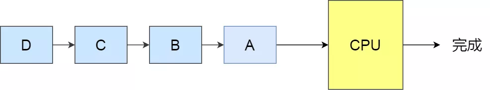FCFS 调度算法

顾名思义，先来后到，**每次从就绪队列选择最先进入队列的进程，然后一直运行，直到进程退出或被阻塞，才会继续从队列中选择第一个进程接着运行。**

这似乎很公平，但是当一个长作业先运行了，那么后面的短作业等待的时间就会很长，不利于短作业。

FCFS 对长作业有利，适用于 CPU 繁忙型作业的系统，而不适用于 I/O 繁忙型作业的系统。

> 02 最短作业优先调度算法

**最短作业优先（\*Shortest Job First, SJF\*）调度算法**同样也是顾名思义，它会**优先选择运行时间最短的进程来运行**，这有助于提高系统的吞吐量。

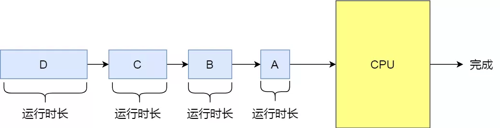SJF 调度算法

这显然对长作业不利，很容易造成一种极端现象。

比如，一个长作业在就绪队列等待运行，而这个就绪队列有非常多的短作业，那么就会使得长作业不断的往后推，周转时间变长，致使长作业长期不会被运行。

> 03 高响应比优先调度算法

前面的「先来先服务调度算法」和「最短作业优先调度算法」都没有很好的权衡短作业和长作业。

那么，**高响应比优先 （\*Highest Response Ratio Next, HRRN\*）调度算法**主要是权衡了短作业和长作业。

**每次进行进程调度时，先计算「响应比优先级」，然后把「响应比优先级」最高的进程投入运行**，「响应比优先级」的计算公式：

从上面的公式，可以发现：

- 如果两个进程的「等待时间」相同时，「要求的服务时间」越短，「响应比」就越高，这样短作业的进程容易被选中运行；
- 如果两个进程「要求的服务时间」相同时，「等待时间」越长，「响应比」就越高，这就兼顾到了长作业进程，因为进程的响应比可以随时间等待的增加而提高，当其等待时间足够长时，其响应比便可以升到很高，从而获得运行的机会；

> 04 时间片轮转调度算法

最古老、最简单、最公平且使用最广的算法就是**时间片轮转（\*Round Robin, RR\*）调度算法**。
。

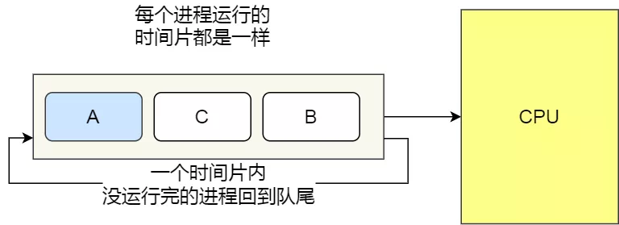RR 调度算法

**每个进程被分配一个时间段，称为时间片（\*Quantum\*），即允许该进程在该时间段中运行。**

- 如果时间片用完，进程还在运行，那么将会把此进程从 CPU 释放出来，并把 CPU 分配另外一个进程；
- 如果该进程在时间片结束前阻塞或结束，则 CPU 立即进行切换；

另外，时间片的长度就是一个很关键的点：

- 如果时间片设得太短会导致过多的进程上下文切换，降低了 CPU 效率；
- 如果设得太长又可能引起对短作业进程的响应时间变长。将

通常时间片设为 `20ms~50ms` 通常是一个比较合理的折中值。

> 05 最高优先级调度算法

前面的「时间片轮转算法」做了个假设，即让所有的进程同等重要，也不偏袒谁，大家的运行时间都一样。

但是，对于多用户计算机系统就有不同的看法了，它们希望调度是有优先级的，即希望调度程序能**从就绪队列中选择最高优先级的进程进行运行，这称为最高优先级（\*Highest Priority First，HPF\*）调度算法**。

进程的优先级可以分为，静态优先级或动态优先级：

- 静态优先级：创建进程时候，就已经确定了优先级了，然后整个运行时间优先级都不会变化；
- 动态优先级：根据进程的动态变化调整优先级，比如如果进程运行时间增加，则降低其优先级，如果进程等待时间（就绪队列的等待时间）增加，则升高其优先级，也就是**随着时间的推移增加等待进程的优先级**。

该算法也有两种处理优先级高的方法，非抢占式和抢占式：

- 非抢占式：当就绪队列中出现优先级高的进程，运行完当前进程，再选择优先级高的进程。
- 抢占式：当就绪队列中出现优先级高的进程，当前进程挂起，调度优先级高的进程运行。

但是依然有缺点，可能会导致低优先级的进程永远不会运行。

> 06 多级反馈队列调度算法

**多级反馈队列（\*Multilevel Feedback Queue\*）调度算法**是「时间片轮转算法」和「最高优先级算法」的综合和发展。

顾名思义：

- 「多级」表示有多个队列，每个队列优先级从高到低，同时优先级越高时间片越短。
- 「反馈」表示如果有新的进程加入优先级高的队列时，立刻停止当前正在运行的进程，转而去运行优先级高的队列；

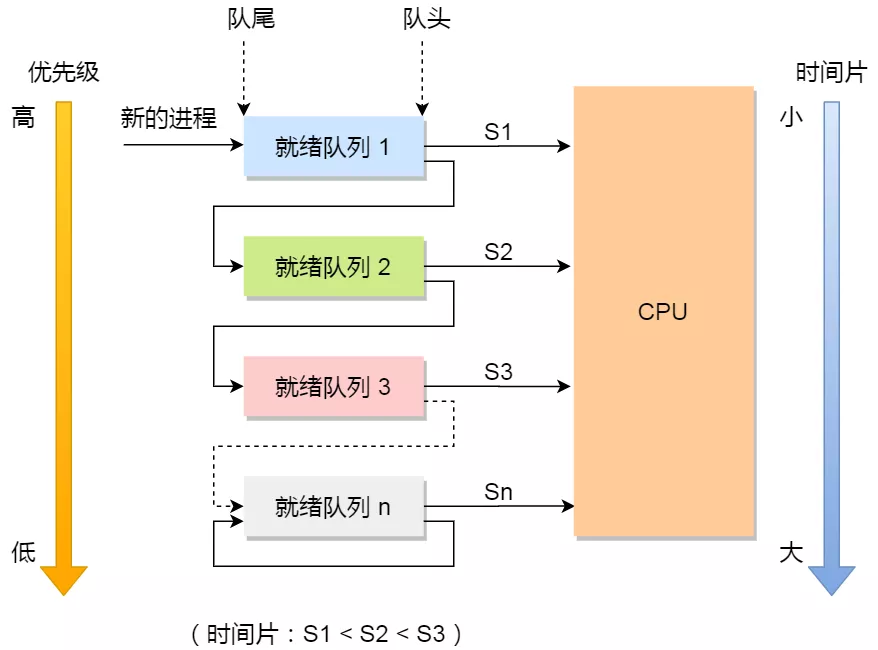多级反馈队列

来看看，它是如何工作的：

- 设置了多个队列，赋予每个队列不同的优先级，每个**队列优先级从高到低**，同时**优先级越高时间片越短**；
- 新的进程会被放入到第一级队列的末尾，按先来先服务的原则排队等待被调度，如果在第一级队列规定的时间片没运行完成，则将其转入到第二级队列的末尾，以此类推，直至完成；
- 当较高优先级的队列为空，才调度较低优先级的队列中的进程运行。如果进程运行时，有新进程进入较高优先级的队列，则停止当前运行的进程并将其移入到原队列末尾，接着让较高优先级的进程运行；

可以发现，对于短作业可能可以在第一级队列很快被处理完。对于长作业，如果在第一级队列处理不完，可以移入下次队列等待被执行，虽然等待的时间变长了，但是运行时间也会更长了，所以该算法很好的**兼顾了长短作业，同时有较好的响应时间。**

> 看的迷迷糊糊？那我拿去银行办业务的例子，把上面的调度算法串起来，你还不懂，你锤我！

**办理业务的客户相当于进程，银行窗口工作人员相当于 CPU。**

现在，假设这个银行只有一个窗口（单核 CPU ），那么工作人员一次只能处理一个业务。

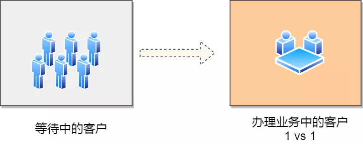银行办业务

那么最简单的处理方式，就是先来的先处理，后面来的就乖乖排队，这就是**先来先服务（\*FCFS\*）调度算法**。但是万一先来的这位老哥是来贷款的，这一谈就好几个小时，一直占用着窗口，这样后面的人只能干等，或许后面的人只是想简单的取个钱，几分钟就能搞定，却因为前面老哥办长业务而要等几个小时，你说气不气人？

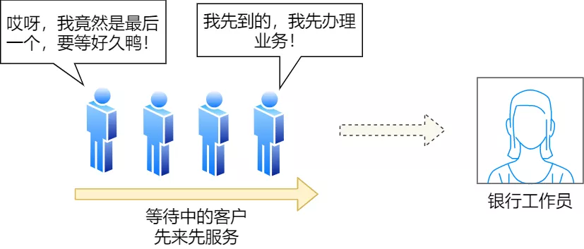先来先服务

有客户抱怨了，那我们就要改进，我们干脆优先给那些几分钟就能搞定的人办理业务，这就是**短作业优先（\*SJF\*）调度算法**。听起来不错，但是依然还是有个极端情况，万一办理短业务的人非常的多，这会导致长业务的人一直得不到服务，万一这个长业务是个大客户，那不就捡了芝麻丢了西瓜

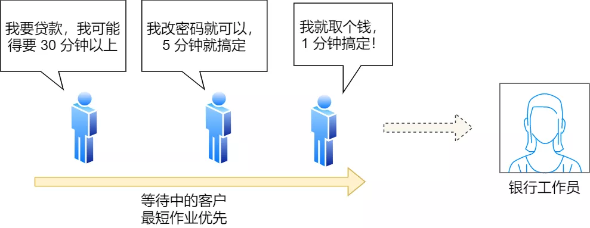最短作业优先

那就公平起见，现在窗口工作人员规定，每个人我只处理 10 分钟。如果 10 分钟之内处理完，就马上换下一个人。如果没处理完，依然换下一个人，但是客户自己得记住办理到哪个步骤了。这个也就是**时间片轮转（\*RR\*）调度算法**。但是如果时间片设置过短，那么就会造成大量的上下文切换，增大了系统开销。如果时间片过长，相当于退化成退化成 FCFS 算法了。

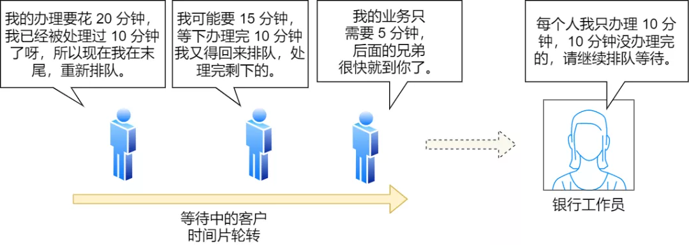时间片轮转

既然公平也可能存在问题，那银行就对客户分等级，分为普通客户、VIP 客户、SVIP 客户。只要高优先级的客户一来，就第一时间处理这个客户，这就是**最高优先级（\*HPF\*）调度算法**。但依然也会有极端的问题，万一当天来的全是高级客户，那普通客户不是没有被服务的机会，不把普通客户当人是吗？那我们把优先级改成动态的，如果客户办理业务时间增加，则降低其优先级，如果客户等待时间增加，则升高其优先级。

最高优先级（静态）

那有没有兼顾到公平和效率的方式呢？这里介绍一种算法，考虑的还算充分的，**多级反馈队列（\*MFQ\*）调度算法**，它是时间片轮转算法和优先级算法的综合和发展。它的工作方式：

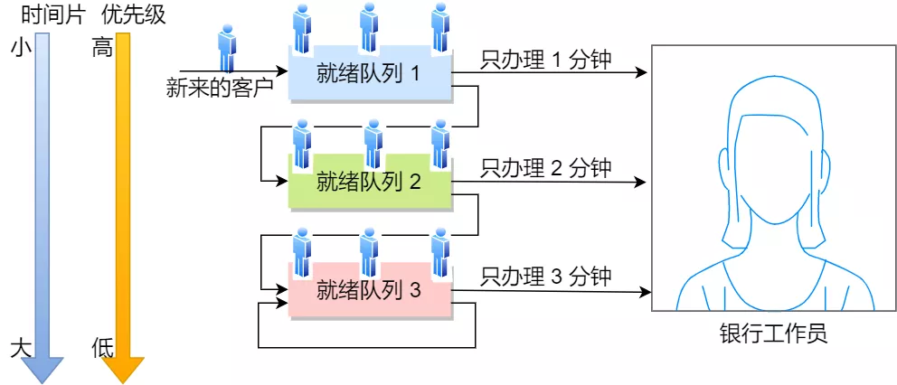多级反馈队列

- 银行设置了多个排队（就绪）队列，每个队列都有不同的优先级，**各个队列优先级从高到低**，同时每个队列执行时间片的长度也不同，**优先级越高的时间片越短**。
- 新客户（进程）来了，先进入第一级队列的末尾，按先来先服务原则排队等待被叫号（运行）。如果时间片用完客户的业务还没办理完成，则让客户进入到下一级队列的末尾，以此类推，直至客户业务办理完成。
- 当第一级队列没人排队时，就会叫号二级队列的客户。如果客户办理业务过程中，有新的客户加入到较高优先级的队列，那么此时办理中的客户需要停止办理，回到原队列的末尾等待再次叫号，因为要把窗口让给刚进入较高优先级队列的客户。

可以发现，对于要办理短业务的客户来说，可以很快的轮到并解决。对于要办理长业务的客户，一下子解决不了，就可以放到下一个队列，虽然等待的时间稍微变长了，但是轮到自己的办理时间也变长了，也可以接受，不会造成极端的现象，可以说是综合上面几种算法的优点。

------

对于[分时操作系统](https://www.zhihu.com/search?q=分时操作系统&search_source=Entity&hybrid_search_source=Entity&hybrid_search_extra={"sourceType"%3A"article"%2C"sourceId"%3A72754729})来说，表面上看起来同时多个进程在运行，其实系统内部同一时间只有一个进程在运行，但进程是以比较快的速度在切换。这样就引入了[进程切换](https://www.zhihu.com/search?q=进程切换&search_source=Entity&hybrid_search_source=Entity&hybrid_search_extra={"sourceType"%3A"article"%2C"sourceId"%3A72754729})和进程调度的概念了。进程调度应该是操作系统的核心功能了，它非常的复杂。

尽管刚出Linux开发为的是桌面操作系统，但现在服务器，嵌入式设备，个人pc都会使用它，不同领域对进程调度的差异非常大，所以要考虑整体的平衡性。Linux进程在调度器中被分为三种：

1. **[交互式进程](https://www.zhihu.com/search?q=交互式进程&search_source=Entity&hybrid_search_source=Entity&hybrid_search_extra={"sourceType"%3A"article"%2C"sourceId"%3A72754729})**：大量的人机交互，所以会有大量的睡眠状态，等待用户操作。例如：编辑器，这类进程需要比较高的[响应速度](https://www.zhihu.com/search?q=响应速度&search_source=Entity&hybrid_search_source=Entity&hybrid_search_extra={"sourceType"%3A"article"%2C"sourceId"%3A72754729})。
2. **批处理进程**：这类进程需要大量的CPU资源，但是响应延迟可以忍受，比如：视频编码，算法；
3. **实时进程**：对调度延迟要求最高。比如：视频播放

**在Linux中，线程和进程一视同仁，所以讲到进程调度，也包含了线程调度。**

## **Linux调度器的简史**

Linux进程调度，有一段非常有趣的历史。在2.5版本之前，Linux采用传统的UNIX调度算法。由于没有考虑到SMP，所以SMP不支持。性能表现就非常不好。

所以在后来的2.5版本中，进行了大改。采用了O（1）的算法，之所以O(1)，因为它的运行时间是常量，与系统的任务数量是无关的。该调度器增加了对SMP的支持。但是在许多的桌面交互进程的响应时间却表现不是很好。

在之后的2.6版本中，调度器再一次的大的改动。2.6.23的版本中，**完全公平调度器（CFS）**最终成为Linux[调度算法](https://www.zhihu.com/search?q=调度算法&search_source=Entity&hybrid_search_source=Entity&hybrid_search_extra={"sourceType"%3A"article"%2C"sourceId"%3A72754729})。

Linux的进程调度基于调度类。每个调度类都有一个特定优先级。每一个不同的调度类，都有不同的调度算法，就是为了满足不同的需要。也许手机中的Linux和服务器的Linux调度器准则也是不一样。

Linux内核有两个调度类：**CFS和实时调度类。**

## CFS

CFS [调度程序](https://www.zhihu.com/search?q=调度程序&search_source=Entity&hybrid_search_source=Entity&hybrid_search_extra={"sourceType"%3A"article"%2C"sourceId"%3A72754729})并不采用严格规则来为一个优先级分配某个长度的时间片，而是为每个任务分配一定比例的 CPU 处理时间。每个任务分配的具体比例是根据nice值来计算的。nice值的范围从 -20 到 +19，数值较低的nice值表示较高的相对优先级。具有较低nice值的任务，与具有较高nice值的任务相比，会得到更高比例的处理器处理时间。默认nice值为 0。

**为什么叫nice？当一个任务增加了它的nice，说明它的优先级降低了，进而对其他任务变得nice**

CFS 调度程序没有直接分配优先级。相反，它通过每个任务的变量 vruntime 以便维护虚拟运行时间，进而记录每个任务运行多久。虚拟运行时间与基于任务优先级的[衰减因子](https://www.zhihu.com/search?q=衰减因子&search_source=Entity&hybrid_search_source=Entity&hybrid_search_extra={"sourceType"%3A"article"%2C"sourceId"%3A72754729})有关，更低优先级的任务比更高优先级的任务具有更高[衰减速率](https://www.zhihu.com/search?q=衰减速率&search_source=Entity&hybrid_search_source=Entity&hybrid_search_extra={"sourceType"%3A"article"%2C"sourceId"%3A72754729})。对于正常优先级的任务（nice值为 0），虚拟运行时间与实际物理运行时间是相同的。下面分析一下 CFS 调度程序是如何工作的。

假设有两个任务，它们具有相同的nice值。一个任务是 I/O [密集型](https://www.zhihu.com/search?q=密集型&search_source=Entity&hybrid_search_source=Entity&hybrid_search_extra={"sourceType"%3A"article"%2C"sourceId"%3A72754729})而另一个为 CPU 密集型。通常，I/O 密集型任务在运行很短时间后就会阻塞以便等待更多的 I/O；而 CPU 密集型任务只要有在处理器上运行的机会，就会用完它的时间片。

因此，I/O 密集型任务的虚拟运行时间最终将会小于 CPU 密集型任务的，从而使得 I/O 密集型任务具有更高的优先级。这时，如果 CPU 密集型任务在运行，而 I/O 密集型任务变得有资格可以运行（如该任务所等待的 I/O 已成为可用)，那么 I/O 密集型任务就会抢占 CPU 密集型任务。

## 实时调度

采用 SCHED_FIFO 或 SCHED_RR 实时策略来调度的任何任务，与普通（非实时的）任务相比，具有更高的优先级。

Linux 采用两个单独的[优先级](https://www.zhihu.com/search?q=优先级&search_source=Entity&hybrid_search_source=Entity&hybrid_search_extra={"sourceType"%3A"article"%2C"sourceId"%3A72754729})范围，一个用于实时任务，另一个用于正常任务。实时任务分配的[静态优先级](https://www.zhihu.com/search?q=静态优先级&search_source=Entity&hybrid_search_source=Entity&hybrid_search_extra={"sourceType"%3A"article"%2C"sourceId"%3A72754729})为 0〜99，而正常任务分配的优先级为 100〜139。

这两个[值域](https://www.zhihu.com/search?q=值域&search_source=Entity&hybrid_search_source=Entity&hybrid_search_extra={"sourceType"%3A"article"%2C"sourceId"%3A72754729})合并成为一个全局的优先级方案，其中较低数值表明较高的优先级。正常任务，根据它们的nice值，分配一个优先级；这里 -20 的nice值映射到优先级 100，而 +19 的nice值映射到 139。下图显示了这个方案。

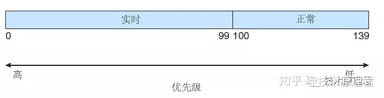

## CFS 性能

Linux CFS 调度程序釆用高效算法，以便选择运行下个任务。每个可运行的任务放置在红黑树上（这是一种平衡的、二分搜索树，它的键是基于虚拟运行时间的）。这种树如下图所示：

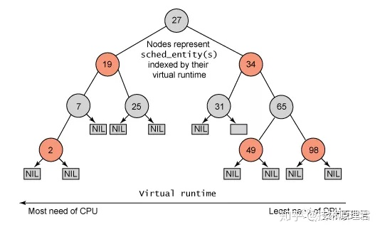

当一个任务变成可运行时，它被添加到树上。当一个任务变成不可运行时（例如，当阻塞等待 I/O 时），它从树上被删除。一般来说，得到较少处理时间的任务（虚拟运行时间较小）会偏向树的左侧；得到较多处理时间的任务会偏向树的右侧。

根据二分搜索树的性质，最左侧的结点有最小的键值；从 CFS 调度程序角度而言，这也是具有最高优先级的任务。由于红黑树是平衡的，找到最左侧结点会需要 `O(lgN)` 操作（这里 N 为树内结点总数）。不过，为高效起见，Linux 调度程序将这个值缓存在变量 [rb_leftmost](https://www.zhihu.com/search?q=rb_leftmost&search_source=Entity&hybrid_search_source=Entity&hybrid_search_extra={"sourceType"%3A"article"%2C"sourceId"%3A72754729}) 中，从而确定哪个任务运行只需检索缓存的值。

## 总结

本文没有特别复杂的一些细节，只是把原理告诉大家。没有告诉[进程权重](https://www.zhihu.com/search?q=进程权重&search_source=Entity&hybrid_search_source=Entity&hybrid_search_extra={"sourceType"%3A"article"%2C"sourceId"%3A72754729})的概念，觉得大部分不是做内核开发，没有必要掌握的太细。只需要把原理弄懂即可，也足够。