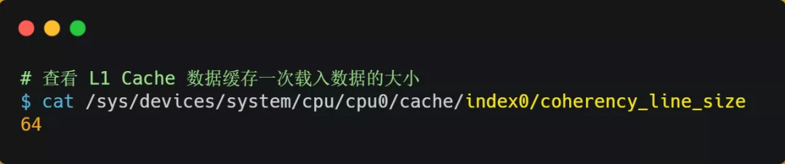

## 前言

你清楚下面这几个问题吗？

- 有了内存，为什么还需要 CPU Cache？
- CPU 是怎么读写数据的？
- 如何让 CPU 能读取数据更快一些？
- CPU 伪共享是如何发生的？又该如何避免？
- CPU 是如何调度任务的？如果你的任务对响应要求很高，你希望它总是能被先调度，这该怎么办？
- …

这篇，我们就来回答这些问题。

------

## 正文

### CPU 如何读写数据的？

先来认识 CPU 的架构，只有理解了 CPU 的 架构，才能更好地理解 CPU 是如何读写数据的，对于现代 CPU 的架构图如下：

可以看到，一个 CPU 里通常会有多个 CPU 核心，比如上图中的 1 号和 2 号 CPU 核心，并且每个 CPU 核心都有自己的 L1 Cache 和 L2 Cache，而 L1 Cache 通常分为 dCache（数据缓存） 和 iCache（指令缓存），L3 Cache 则是多个核心共享的，这就是 CPU 典型的缓存层次。

上面提到的都是 CPU 内部的 Cache，放眼外部的话，还会有内存和硬盘，这些存储设备共同构成了金字塔存储层次。如下图所示：

从上图也可以看到，从上往下，存储设备的容量会越大，而访问速度会越慢。至于每个存储设备的访问延时，你可以看下图的表格：

你可以看到， CPU 访问 L1 Cache 速度比访问内存快 100 倍，这就是为什么 CPU 里会有 L1~L3 Cache 的原因，目的就是把 Cache 作为 CPU 与内存之间的缓存层，以减少对内存的访问频率。

CPU 从内存中读取数据到 Cache 的时候，并不是一个字节一个字节读取，而是一块一块的方式来读取数据的，这一块一块的数据被称为 CPU Line（缓存行），所以 **CPU Line 是 CPU 从内存读取数据到 Cache 的单位**。

至于 CPU Line 大小，在 Linux 系统可以用下面的方式查看到，你可以看我服务器的 L1 Cache Line 大小是 64 字节，也就意味着 **L1 Cache 一次载入数据的大小是 64 字节**。

那么对数组的加载， CPU 就会加载数组里面连续的多个数据到 Cache 里，因此我们应该按照物理内存地址分布的顺序去访问元素，这样访问数组元素的时候，Cache 命中率就会很高，于是就能减少从内存读取数据的频率， 从而可提高程序的性能。

但是，在我们不使用数组，而是使用单独的变量的时候，则会有 Cache 伪共享的问题，Cache 伪共享问题上是一个性能杀手，我们应该要规避它。

接下来，就来看看 Cache 伪共享是什么？又如何避免这个问题？

现在假设有一个双核心的 CPU，这两个 CPU 核心并行运行着两个不同的线程，它们同时从内存中读取两个不同的数据，分别是类型为 `long` 的变量 A 和 B，这个两个数据的地址在物理内存上是**连续**的，如果 Cahce Line 的大小是 64 字节，并且变量 A 在 Cahce Line 的开头位置，那么这两个数据是位于**同一个 Cache Line 中**，又因为 CPU Line 是 CPU 从内存读取数据到 Cache 的单位，所以这两个数据会被同时读入到了两个 CPU 核心中各自 Cache 中。

我们来思考一个问题，如果这两个不同核心的线程分别修改不同的数据，比如 1 号 CPU 核心的线程只修改了 变量 A，或 2 号 CPU 核心的线程的线程只修改了变量 B，会发生什么呢？

#### 分析伪共享的问题

现在我们结合保证多核缓存一致的 MESI 协议，来说明这一整个的过程，如果你还不知道 MESI 协议，你可以看我这篇文章「[10 张图打开 CPU 缓存一致性的大门](https://mp.weixin.qq.com/s?__biz=MzUxODAzNDg4NQ==&mid=2247486479&idx=1&sn=433a551c37a445d068ffbf8ac85f0346&scene=21#wechat_redirect)」。

①. 最开始变量 A 和 B 都还不在 Cache 里面，假设 1 号核心绑定了线程 A，2 号核心绑定了线程 B，线程 A 只会读写变量 A，线程 B 只会读写变量 B。

②. 1 号核心读取变量 A，由于 CPU 从内存读取数据到 Cache 的单位是 Cache Line，也正好变量 A 和 变量 B 的数据归属于同一个 Cache Line，所以 A 和 B 的数据都会被加载到 Cache，并将此 Cache Line 标记为「独占」状态。

③.  接着，2 号核心开始从内存里读取变量 B，同样的也是读取 Cache Line 大小的数据到 Cache 中，此 Cache Line 中的数据也包含了变量 A 和 变量 B，此时 1 号和 2 号核心的 Cache Line 状态变为「共享」状态。

④. 1 号核心需要修改变量 A，发现此 Cache Line 的状态是「共享」状态，所以先需要通过总线发送消息给 2 号核心，通知 2 号核心把 Cache 中对应的 Cache Line 标记为「已失效」状态，然后 1 号核心对应的 Cache Line 状态变成「已修改」状态，并且修改变量 A。

⑤. 之后，2 号核心需要修改变量 B，此时 2 号核心的 Cache 中对应的 Cache Line 是已失效状态，另外由于 1 号核心的 Cache 也有此相同的数据，且状态为「已修改」状态，所以要先把 1 号核心的 Cache 对应的 Cache Line 写回到内存，然后 2 号核心再从内存读取 Cache Line 大小的数据到 Cache 中，最后把变量 B 修改到 2 号核心的 Cache 中，并将状态标记为「已修改」状态。

所以，可以发现如果 1 号和 2 号 CPU 核心这样持续交替的分别修改变量 A 和 B，就会重复 ④ 和 ⑤ 这两个步骤，Cache 并没有起到缓存的效果，虽然变量 A 和 B 之间其实并没有任何的关系，但是因为同时归属于一个 Cache Line ，这个 Cache Line 中的任意数据被修改后，都会相互影响，从而出现 ④ 和 ⑤ 这两个步骤。

因此，这种因为多个线程同时读写同一个 Cache Line 的不同变量时，而导致 CPU Cache 失效的现象称为**伪共享（\*False Sharing\*）**。

#### 避免伪共享的方法

因此，对于多个线程共享的热点数据，即经常会修改的数据，应该避免这些数据刚好在同一个 Cache Line 中，否则就会出现为伪共享的问题。

接下来，看看在实际项目中是用什么方式来避免伪共享的问题的。

在 Linux 内核中存在 `__cacheline_aligned_in_smp` 宏定义，是用于解决伪共享的问题。

从上面的宏定义，我们可以看到：

- 如果在多核（MP）系统里，该宏定义是 `__cacheline_aligned`，也就是 Cache Line 的大小；
- 而如果在单核系统里，该宏定义是空的；

因此，针对在同一个 Cache Line 中的共享的数据，如果在多核之间竞争比较严重，为了防止伪共享现象的发生，可以采用上面的宏定义使得变量在 Cache Line 里是对齐的。

举个例子，有下面这个结构体：

结构体里的两个成员变量 a 和 b 在物理内存地址上是连续的，于是它们可能会位于同一个 Cache Line 中，如下图：

所以，为了防止前面提到的 Cache 伪共享问题，我们可以使用上面介绍的宏定义，将 b 的地址设置为 Cache Line 对齐地址，如下：

这样 a 和 b 变量就不会在同一个 Cache Line 中了，如下图：

所以，避免  Cache 伪共享实际上是用空间换时间的思想，浪费一部分 Cache 空间，从而换来性能的提升。

我们再来看一个应用层面的规避方案，有一个 Java 并发框架 Disruptor 使用「字节填充 + 继承」的方式，来避免伪共享的问题。

Disruptor 中有一个 RingBuffer 类会经常被多个线程使用，代码如下：

你可能会觉得 RingBufferPad 类里 7 个 long 类型的名字很奇怪，但事实上，它们虽然看起来毫无作用，但却对性能的提升起到了至关重要的作用。

我们都知道，CPU Cache 从内存读取数据的单位是 CPU Line，一般 64 位 CPU 的 CPU Line 的大小是 64 个字节，一个 long 类型的数据是 8 个字节，所以 CPU 一下会加载 8 个 long 类型的数据。

根据 JVM 对象继承关系中父类成员和子类成员，内存地址是连续排列布局的，因此 RingBufferPad 中的 7 个 long 类型数据作为 Cache Line **前置填充**，而 RingBuffer 中的 7 个 long 类型数据则作为 Cache Line **后置填充**，这 14 个 long 变量没有任何实际用途，更不会对它们进行读写操作。

另外，RingBufferFelds 里面定义的这些变量都是 `final` 修饰的，意味着第一次加载之后不会再修改， 又**由于「前后」各填充了 7 个不会被读写的 long 类型变量，所以无论怎么加载 Cache Line，这整个 Cache Line 里都没有会发生更新操作的数据，于是只要数据被频繁地读取访问，就自然没有数据被换出 Cache 的可能，也因此不会产生伪共享的问题**。

------

### CPU 如何选择线程的？

了解完 CPU 读取数据的过程后，我们再来看看 CPU 是根据什么来选择当前要执行的线程。

在 Linux 内核中，进程和线程都是用 `tark_struct` 结构体表示的，区别在于线程的 tark_struct 结构体里部分资源是共享了进程已创建的资源，比如内存地址空间、代码段、文件描述符等，所以 Linux 中的线程也被称为轻量级进程，因为线程的 tark_struct 相比进程的 tark_struct 承载的 资源比较少，因此以「轻」得名。

一般来说，没有创建线程的进程，是只有单个执行流，它被称为是主线程。如果想让进程处理更多的事情，可以创建多个线程分别去处理，但不管怎么样，它们对应到内核里都是 `tark_struct`。

所以，Linux 内核里的调度器，调度的对象就是 `tark_struct`，接下来我们就把这个数据结构统称为**任务**。

在 Linux 系统中，根据任务的优先级以及响应要求，主要分为两种，其中优先级的数值越小，优先级越高：

- 实时任务，对系统的响应时间要求很高，也就是要尽可能快的执行实时任务，优先级在 `0~99` 范围内的就算实时任务；
- 普通任务，响应时间没有很高的要求，优先级在 `100~139` 范围内都是普通任务级别；

#### 调度类

由于任务有优先级之分，Linux 系统为了保障高优先级的任务能够尽可能早的被执行，于是分为了这几种调度类，如下图：

Deadline 和 Realtime 这两个调度类，都是应用于实时任务的，这两个调度类的调度策略合起来共有这三种，它们的作用如下：

- *SCHED_DEADLINE*：是按照 deadline 进行调度的，距离当前时间点最近的 deadline 的任务会被优先调度；
- *SCHED_FIFO*：对于相同优先级的任务，按先来先服务的原则，但是优先级更高的任务，可以抢占低优先级的任务，也就是优先级高的可以「插队」；
- *SCHED_RR*：对于相同优先级的任务，轮流着运行，每个任务都有一定的时间片，当用完时间片的任务会被放到队列尾部，以保证相同优先级任务的公平性，但是高优先级的任务依然可以抢占低优先级的任务；

而 Fair 调度类是应用于普通任务，都是由 CFS 调度器管理的，分为两种调度策略：

- *SCHED_NORMAL*：普通任务使用的调度策略；
- *SCHED_BATCH*：后台任务的调度策略，不和终端进行交互，因此在不影响其他需要交互的任务，可以适当降低它的优先级。

#### 完全公平调度

我们平日里遇到的基本都是普通任务，对于普通任务来说，公平性最重要，在 Linux 里面，实现了一个基于 CFS 的调度算法，也就是**完全公平调度（\*Completely Fair Scheduling\*）**。

这个算法的理念是想让分配给每个任务的 CPU 时间是一样，于是它为每个任务安排一个虚拟运行时间 vruntime，如果一个任务在运行，其运行的越久，该任务的 vruntime 自然就会越大，而没有被运行的任务，vruntime 是不会变化的。

那么，**在 CFS 算法调度的时候，会优先选择 vruntime 少的任务**，以保证每个任务的公平性。

这就好比，让你把一桶的奶茶平均分到 10 杯奶茶杯里，你看着哪杯奶茶少，就多倒一些；哪个多了，就先不倒，这样经过多轮操作，虽然不能保证每杯奶茶完全一样多，但至少是公平的。

当然，上面提到的例子没有考虑到优先级的问题，虽然是普通任务，但是普通任务之间还是有优先级区分的，所以在计算虚拟运行时间 vruntime 还要考虑普通任务的**权重值**，注意权重值并不是优先级的值，内核中会有一个 nice 级别与权重值的转换表，nice 级别越低的权重值就越大，至于 nice 值是什么，我们后面会提到。
于是就有了以下这个公式：

你可以不用管 NICE_0_LOAD 是什么，你就认为它是一个常量，那么在「同样的实际运行时间」里，高权重任务的 vruntime 比低权重任务的 vruntime **少**，你可能会奇怪为什么是少的？你还记得 CFS 调度吗，它是会优先选择 vruntime 少的任务进行调度，所以高权重的任务就会被优先调度了，于是高权重的获得的实际运行时间自然就多了。

#### CPU 运行队列

一个系统通常都会运行着很多任务，多任务的数量基本都是远超 CPU 核心数量，因此这时候就需要**排队**。

事实上，每个 CPU 都有自己的**运行队列（\*Run Queue, rq\*）**，用于描述在此 CPU 上所运行的所有进程，其队列包含三个运行队列，Deadline 运行队列 dl_rq、实时任务运行队列 rt_rq 和 CFS 运行队列 csf_rq，其中 csf_rq 是用红黑树来描述的，按 vruntime 大小来排序的，最左侧的叶子节点，就是下次会被调度的任务。

这几种调度类是有优先级的，优先级如下：Deadline > Realtime > Fair，这意味着 Linux 选择下一个任务执行的时候，会按照此优先级顺序进行选择，也就是说先从 `dl_rq` 里选择任务，然后从 `rt_rq` 里选择任务，最后从 `csf_rq` 里选择任务。因此，**实时任务总是会比普通任务优先被执行**。

#### 调整优先级

如果我们启动任务的时候，没有特意去指定优先级的话，默认情况下都是普通任务，普通任务的调度类是 Fail，由 CFS 调度器来进行管理。CFS 调度器的目的是实现任务运行的公平性，也就是保障每个任务的运行的时间是差不多的。

如果你想让某个普通任务有更多的执行时间，可以调整任务的 `nice` 值，从而让优先级高一些的任务执行更多时间。nice 的值能设置的范围是 `-20～19`， 值越低，表明优先级越高，因此 -20 是最高优先级，19 则是最低优先级，默认优先级是 0。

是不是觉得 nice 值的范围很诡异？事实上，nice 值并不是表示优先级，而是表示优先级的修正数值，它与优先级（priority）的关系是这样的：priority(new) = priority(old) + nice。内核中，priority 的范围是 0~139，值越低，优先级越高，其中前面的 0~99 范围是提供给实时任务使用的，而 nice 值是映射到 100~139，这个范围是提供给普通任务用的，因此 nice 值调整的是普通任务的优先级。

在前面我们提到了，权重值与 nice 值的关系的，nice 值越低，权重值就越大，计算出来的 vruntime 就会越少，由于 CFS 算法调度的时候，就会优先选择 vruntime 少的任务进行执行，所以 nice 值越低，任务的优先级就越高。

我们可以在启动任务的时候，可以指定 nice 的值，比如将 mysqld 以 -3 优先级：

如果想修改已经运行中的任务的优先级，则可以使用 `renice` 来调整 nice 值：

nice 调整的是普通任务的优先级，所以不管怎么缩小 nice 值，任务永远都是普通任务，如果某些任务要求实时性比较高，那么你可以考虑改变任务的优先级以及调度策略，使得它变成实时任务，比如：

------

### 总结

理解 CPU 是如何读写数据的前提，是要理解 CPU 的架构，CPU 内部的多个 Cache + 外部的内存和磁盘都就构成了金字塔的存储器结构，在这个金字塔中，越往下，存储器的容量就越大，但访问速度就会小。

CPU 读写数据的时候，并不是按一个一个字节为单位来进行读写，而是以 CPU Line 大小为单位，CPU Line 大小一般是 64 个字节，也就意味着 CPU 读写数据的时候，每一次都是以 64 字节大小为一块进行操作。

因此，如果我们操作的数据是数组，那么访问数组元素的时候，按内存分布的地址顺序进行访问，这样能充分利用到 Cache，程序的性能得到提升。但如果操作的数据不是数组，而是普通的变量，并在多核 CPU 的情况下，我们还需要避免 Cache Line 伪共享的问题。

所谓的 Cache Line 伪共享问题就是，多个线程同时读写同一个 Cache Line 的不同变量时，而导致 CPU Cache 失效的现象。那么对于多个线程共享的热点数据，即经常会修改的数据，应该避免这些数据刚好在同一个 Cache Line 中，避免的方式一般有 Cache Line 大小字节对齐，以及字节填充等方法。

系统中需要运行的多线程数一般都会大于 CPU 核心，这样就会导致线程排队等待 CPU，这可能会产生一定的延时，如果我们的任务对延时容忍度很低，则可以通过一些人为手段干预 Linux 的默认调度策略和优先级。

------

#### 调度时机

在进程的生命周期中，当进程从一个运行状态到另外一状态变化的时候，其实会触发一次调度。

比如，以下状态的变化都会触发操作系统的调度：

- *从就绪态 -> 运行态*：当进程被创建时，会进入到就绪队列，操作系统会从就绪队列选择一个进程运行；
- *从运行态 -> 阻塞态*：当进程发生 I/O 事件而阻塞时，操作系统必须另外一个进程运行；
- *从运行态 -> 结束态*：当进程退出结束后，操作系统得从就绪队列选择另外一个进程运行；

- **非抢占式调度算法**挑选一个进程，然后让该进程运行直到被阻塞，或者直到该进程退出，才会调用另外一个进程，也就是说不会理时钟中断这个事情。
- **抢占式调度算法**挑选一个进程，然后让该进程只运行某段时间，如果在该时段结束时，该进程仍然在运行时，则会把它挂起，接着调度程序从就绪队列挑选另外一个进程。这种抢占式调度处理，需要在时间间隔的末端发生**时钟中断**，以便把 CPU 控制返回给调度程序进行调度，也就是常说的**时间片机制**。

#### 调度原则

*原则一*：如果运行的程序，发生了 I/O 事件的请求，那 CPU 使用率必然会很低，因为此时进程在阻塞等待硬盘的数据返回。这样的过程，势必会造成 CPU 突然的空闲。所以，**为了提高 CPU 利用率，在这种发送 I/O 事件致使 CPU 空闲的情况下，调度程序需要从就绪队列中选择一个进程来运行。**

*原则二*：有的程序执行某个任务花费的时间会比较长，如果这个程序一直占用着 CPU，会造成系统吞吐量（CPU 在单位时间内完成的进程数量）的降低。所以，**要提高系统的吞吐率，调度程序要权衡长任务和短任务进程的运行完成数量。**

*原则三*：从进程开始到结束的过程中，实际上是包含两个时间，分别是进程运行时间和进程等待时间，这两个时间总和就称为周转时间。进程的周转时间越小越好，**如果进程的等待时间很长而运行时间很短，那周转时间就很长，这不是我们所期望的，调度程序应该避免这种情况发生。**

*原则四*：处于就绪队列的进程，也不能等太久，当然希望这个等待的时间越短越好，这样可以使得进程更快的在 CPU 中执行。所以，**就绪队列中进程的等待时间也是调度程序所需要考虑的原则。**

*原则五*：对于鼠标、键盘这种交互式比较强的应用，我们当然希望它的响应时间越快越好，否则就会影响用户体验了。所以，**对于交互式比较强的应用，响应时间也是调度程序需要考虑的原则。**

- **CPU 利用率**：调度程序应确保 CPU 是始终匆忙的状态，这可提高 CPU 的利用率；
- **系统吞吐量**：吞吐量表示的是单位时间内 CPU 完成进程的数量，长作业的进程会占用较长的 CPU 资源，因此会降低吞吐量，相反，短作业的进程会提升系统吞吐量；
- **周转时间**：周转时间是进程运行和阻塞时间总和，一个进程的周转时间越小越好；
- **等待时间**：这个等待时间不是阻塞状态的时间，而是进程处于就绪队列的时间，等待的时间越长，用户越不满意；
- **响应时间**：用户提交请求到系统第一次产生响应所花费的时间，在交互式系统中，响应时间是衡量调度算法好坏的主要标准。

#### 调度算法

不同的调度算法适用的场景也是不同的。

接下来，说说在**单核 CPU 系统**中常见的调度算法。

> 01 先来先服务调度算法

最简单的一个调度算法，就是非抢占式的**先来先服务（\*First Come First Severd, FCFS\*）算法**了。

FCFS 调度算法

顾名思义，先来后到，**每次从就绪队列选择最先进入队列的进程，然后一直运行，直到进程退出或被阻塞，才会继续从队列中选择第一个进程接着运行。**

这似乎很公平，但是当一个长作业先运行了，那么后面的短作业等待的时间就会很长，不利于短作业。

FCFS 对长作业有利，适用于 CPU 繁忙型作业的系统，而不适用于 I/O 繁忙型作业的系统。

> 02 最短作业优先调度算法

**最短作业优先（\*Shortest Job First, SJF\*）调度算法**同样也是顾名思义，它会**优先选择运行时间最短的进程来运行**，这有助于提高系统的吞吐量。

SJF 调度算法

这显然对长作业不利，很容易造成一种极端现象。

比如，一个长作业在就绪队列等待运行，而这个就绪队列有非常多的短作业，那么就会使得长作业不断的往后推，周转时间变长，致使长作业长期不会被运行。

> 03 高响应比优先调度算法

前面的「先来先服务调度算法」和「最短作业优先调度算法」都没有很好的权衡短作业和长作业。

那么，**高响应比优先 （\*Highest Response Ratio Next, HRRN\*）调度算法**主要是权衡了短作业和长作业。

**每次进行进程调度时，先计算「响应比优先级」，然后把「响应比优先级」最高的进程投入运行**，「响应比优先级」的计算公式：

从上面的公式，可以发现：

- 如果两个进程的「等待时间」相同时，「要求的服务时间」越短，「响应比」就越高，这样短作业的进程容易被选中运行；
- 如果两个进程「要求的服务时间」相同时，「等待时间」越长，「响应比」就越高，这就兼顾到了长作业进程，因为进程的响应比可以随时间等待的增加而提高，当其等待时间足够长时，其响应比便可以升到很高，从而获得运行的机会；

> 04 时间片轮转调度算法

最古老、最简单、最公平且使用最广的算法就是**时间片轮转（\*Round Robin, RR\*）调度算法**。
。

RR 调度算法

**每个进程被分配一个时间段，称为时间片（\*Quantum\*），即允许该进程在该时间段中运行。**

- 如果时间片用完，进程还在运行，那么将会把此进程从 CPU 释放出来，并把 CPU 分配另外一个进程；
- 如果该进程在时间片结束前阻塞或结束，则 CPU 立即进行切换；

另外，时间片的长度就是一个很关键的点：

- 如果时间片设得太短会导致过多的进程上下文切换，降低了 CPU 效率；
- 如果设得太长又可能引起对短作业进程的响应时间变长。将

通常时间片设为 `20ms~50ms` 通常是一个比较合理的折中值。

> 05 最高优先级调度算法

前面的「时间片轮转算法」做了个假设，即让所有的进程同等重要，也不偏袒谁，大家的运行时间都一样。

但是，对于多用户计算机系统就有不同的看法了，它们希望调度是有优先级的，即希望调度程序能**从就绪队列中选择最高优先级的进程进行运行，这称为最高优先级（\*Highest Priority First，HPF\*）调度算法**。

进程的优先级可以分为，静态优先级或动态优先级：

- 静态优先级：创建进程时候，就已经确定了优先级了，然后整个运行时间优先级都不会变化；
- 动态优先级：根据进程的动态变化调整优先级，比如如果进程运行时间增加，则降低其优先级，如果进程等待时间（就绪队列的等待时间）增加，则升高其优先级，也就是**随着时间的推移增加等待进程的优先级**。

该算法也有两种处理优先级高的方法，非抢占式和抢占式：

- 非抢占式：当就绪队列中出现优先级高的进程，运行完当前进程，再选择优先级高的进程。
- 抢占式：当就绪队列中出现优先级高的进程，当前进程挂起，调度优先级高的进程运行。

但是依然有缺点，可能会导致低优先级的进程永远不会运行。

> 06 多级反馈队列调度算法

**多级反馈队列（\*Multilevel Feedback Queue\*）调度算法**是「时间片轮转算法」和「最高优先级算法」的综合和发展。

顾名思义：

- 「多级」表示有多个队列，每个队列优先级从高到低，同时优先级越高时间片越短。
- 「反馈」表示如果有新的进程加入优先级高的队列时，立刻停止当前正在运行的进程，转而去运行优先级高的队列；

多级反馈队列

来看看，它是如何工作的：

- 设置了多个队列，赋予每个队列不同的优先级，每个**队列优先级从高到低**，同时**优先级越高时间片越短**；
- 新的进程会被放入到第一级队列的末尾，按先来先服务的原则排队等待被调度，如果在第一级队列规定的时间片没运行完成，则将其转入到第二级队列的末尾，以此类推，直至完成；
- 当较高优先级的队列为空，才调度较低优先级的队列中的进程运行。如果进程运行时，有新进程进入较高优先级的队列，则停止当前运行的进程并将其移入到原队列末尾，接着让较高优先级的进程运行；

可以发现，对于短作业可能可以在第一级队列很快被处理完。对于长作业，如果在第一级队列处理不完，可以移入下次队列等待被执行，虽然等待的时间变长了，但是运行时间也会更长了，所以该算法很好的**兼顾了长短作业，同时有较好的响应时间。**

> 看的迷迷糊糊？那我拿去银行办业务的例子，把上面的调度算法串起来，你还不懂，你锤我！

**办理业务的客户相当于进程，银行窗口工作人员相当于 CPU。**

现在，假设这个银行只有一个窗口（单核 CPU ），那么工作人员一次只能处理一个业务。

银行办业务

那么最简单的处理方式，就是先来的先处理，后面来的就乖乖排队，这就是**先来先服务（\*FCFS\*）调度算法**。但是万一先来的这位老哥是来贷款的，这一谈就好几个小时，一直占用着窗口，这样后面的人只能干等，或许后面的人只是想简单的取个钱，几分钟就能搞定，却因为前面老哥办长业务而要等几个小时，你说气不气人？

先来先服务

有客户抱怨了，那我们就要改进，我们干脆优先给那些几分钟就能搞定的人办理业务，这就是**短作业优先（\*SJF\*）调度算法**。听起来不错，但是依然还是有个极端情况，万一办理短业务的人非常的多，这会导致长业务的人一直得不到服务，万一这个长业务是个大客户，那不就捡了芝麻丢了西瓜

最短作业优先

那就公平起见，现在窗口工作人员规定，每个人我只处理 10 分钟。如果 10 分钟之内处理完，就马上换下一个人。如果没处理完，依然换下一个人，但是客户自己得记住办理到哪个步骤了。这个也就是**时间片轮转（\*RR\*）调度算法**。但是如果时间片设置过短，那么就会造成大量的上下文切换，增大了系统开销。如果时间片过长，相当于退化成退化成 FCFS 算法了。

时间片轮转

既然公平也可能存在问题，那银行就对客户分等级，分为普通客户、VIP 客户、SVIP 客户。只要高优先级的客户一来，就第一时间处理这个客户，这就是**最高优先级（\*HPF\*）调度算法**。但依然也会有极端的问题，万一当天来的全是高级客户，那普通客户不是没有被服务的机会，不把普通客户当人是吗？那我们把优先级改成动态的，如果客户办理业务时间增加，则降低其优先级，如果客户等待时间增加，则升高其优先级。

最高优先级（静态）

那有没有兼顾到公平和效率的方式呢？这里介绍一种算法，考虑的还算充分的，**多级反馈队列（\*MFQ\*）调度算法**，它是时间片轮转算法和优先级算法的综合和发展。它的工作方式：

多级反馈队列

- 银行设置了多个排队（就绪）队列，每个队列都有不同的优先级，**各个队列优先级从高到低**，同时每个队列执行时间片的长度也不同，**优先级越高的时间片越短**。
- 新客户（进程）来了，先进入第一级队列的末尾，按先来先服务原则排队等待被叫号（运行）。如果时间片用完客户的业务还没办理完成，则让客户进入到下一级队列的末尾，以此类推，直至客户业务办理完成。
- 当第一级队列没人排队时，就会叫号二级队列的客户。如果客户办理业务过程中，有新的客户加入到较高优先级的队列，那么此时办理中的客户需要停止办理，回到原队列的末尾等待再次叫号，因为要把窗口让给刚进入较高优先级队列的客户。

可以发现，对于要办理短业务的客户来说，可以很快的轮到并解决。对于要办理长业务的客户，一下子解决不了，就可以放到下一个队列，虽然等待的时间稍微变长了，但是轮到自己的办理时间也变长了，也可以接受，不会造成极端的现象，可以说是综合上面几种算法的优点。

------

对于[分时操作系统](https://www.zhihu.com/search?q=分时操作系统&search_source=Entity&hybrid_search_source=Entity&hybrid_search_extra={"sourceType"%3A"article"%2C"sourceId"%3A72754729})来说，表面上看起来同时多个进程在运行，其实系统内部同一时间只有一个进程在运行，但进程是以比较快的速度在切换。这样就引入了[进程切换](https://www.zhihu.com/search?q=进程切换&search_source=Entity&hybrid_search_source=Entity&hybrid_search_extra={"sourceType"%3A"article"%2C"sourceId"%3A72754729})和进程调度的概念了。进程调度应该是操作系统的核心功能了，它非常的复杂。

尽管刚出Linux开发为的是桌面操作系统，但现在服务器，嵌入式设备，个人pc都会使用它，不同领域对进程调度的差异非常大，所以要考虑整体的平衡性。Linux进程在调度器中被分为三种：

1. **[交互式进程](https://www.zhihu.com/search?q=交互式进程&search_source=Entity&hybrid_search_source=Entity&hybrid_search_extra={"sourceType"%3A"article"%2C"sourceId"%3A72754729})**：大量的人机交互，所以会有大量的睡眠状态，等待用户操作。例如：编辑器，这类进程需要比较高的[响应速度](https://www.zhihu.com/search?q=响应速度&search_source=Entity&hybrid_search_source=Entity&hybrid_search_extra={"sourceType"%3A"article"%2C"sourceId"%3A72754729})。
2. **批处理进程**：这类进程需要大量的CPU资源，但是响应延迟可以忍受，比如：视频编码，算法；
3. **实时进程**：对调度延迟要求最高。比如：视频播放

**在Linux中，线程和进程一视同仁，所以讲到进程调度，也包含了线程调度。**

## **Linux调度器的简史**

Linux进程调度，有一段非常有趣的历史。在2.5版本之前，Linux采用传统的UNIX调度算法。由于没有考虑到SMP，所以SMP不支持。性能表现就非常不好。

所以在后来的2.5版本中，进行了大改。采用了O（1）的算法，之所以O(1)，因为它的运行时间是常量，与系统的任务数量是无关的。该调度器增加了对SMP的支持。但是在许多的桌面交互进程的响应时间却表现不是很好。

在之后的2.6版本中，调度器再一次的大的改动。2.6.23的版本中，**完全公平调度器（CFS）**最终成为Linux[调度算法](https://www.zhihu.com/search?q=调度算法&search_source=Entity&hybrid_search_source=Entity&hybrid_search_extra={"sourceType"%3A"article"%2C"sourceId"%3A72754729})。

Linux的进程调度基于调度类。每个调度类都有一个特定优先级。每一个不同的调度类，都有不同的调度算法，就是为了满足不同的需要。也许手机中的Linux和服务器的Linux调度器准则也是不一样。

Linux内核有两个调度类：**CFS和实时调度类。**

## CFS

CFS [调度程序](https://www.zhihu.com/search?q=调度程序&search_source=Entity&hybrid_search_source=Entity&hybrid_search_extra={"sourceType"%3A"article"%2C"sourceId"%3A72754729})并不采用严格规则来为一个优先级分配某个长度的时间片，而是为每个任务分配一定比例的 CPU 处理时间。每个任务分配的具体比例是根据nice值来计算的。nice值的范围从 -20 到 +19，数值较低的nice值表示较高的相对优先级。具有较低nice值的任务，与具有较高nice值的任务相比，会得到更高比例的处理器处理时间。默认nice值为 0。

**为什么叫nice？当一个任务增加了它的nice，说明它的优先级降低了，进而对其他任务变得nice**

CFS 调度程序没有直接分配优先级。相反，它通过每个任务的变量 vruntime 以便维护虚拟运行时间，进而记录每个任务运行多久。虚拟运行时间与基于任务优先级的[衰减因子](https://www.zhihu.com/search?q=衰减因子&search_source=Entity&hybrid_search_source=Entity&hybrid_search_extra={"sourceType"%3A"article"%2C"sourceId"%3A72754729})有关，更低优先级的任务比更高优先级的任务具有更高[衰减速率](https://www.zhihu.com/search?q=衰减速率&search_source=Entity&hybrid_search_source=Entity&hybrid_search_extra={"sourceType"%3A"article"%2C"sourceId"%3A72754729})。对于正常优先级的任务（nice值为 0），虚拟运行时间与实际物理运行时间是相同的。下面分析一下 CFS 调度程序是如何工作的。

假设有两个任务，它们具有相同的nice值。一个任务是 I/O [密集型](https://www.zhihu.com/search?q=密集型&search_source=Entity&hybrid_search_source=Entity&hybrid_search_extra={"sourceType"%3A"article"%2C"sourceId"%3A72754729})而另一个为 CPU 密集型。通常，I/O 密集型任务在运行很短时间后就会阻塞以便等待更多的 I/O；而 CPU 密集型任务只要有在处理器上运行的机会，就会用完它的时间片。

因此，I/O 密集型任务的虚拟运行时间最终将会小于 CPU 密集型任务的，从而使得 I/O 密集型任务具有更高的优先级。这时，如果 CPU 密集型任务在运行，而 I/O 密集型任务变得有资格可以运行（如该任务所等待的 I/O 已成为可用)，那么 I/O 密集型任务就会抢占 CPU 密集型任务。

## 实时调度

采用 SCHED_FIFO 或 SCHED_RR 实时策略来调度的任何任务，与普通（非实时的）任务相比，具有更高的优先级。

Linux 采用两个单独的[优先级](https://www.zhihu.com/search?q=优先级&search_source=Entity&hybrid_search_source=Entity&hybrid_search_extra={"sourceType"%3A"article"%2C"sourceId"%3A72754729})范围，一个用于实时任务，另一个用于正常任务。实时任务分配的[静态优先级](https://www.zhihu.com/search?q=静态优先级&search_source=Entity&hybrid_search_source=Entity&hybrid_search_extra={"sourceType"%3A"article"%2C"sourceId"%3A72754729})为 0〜99，而正常任务分配的优先级为 100〜139。

这两个[值域](https://www.zhihu.com/search?q=值域&search_source=Entity&hybrid_search_source=Entity&hybrid_search_extra={"sourceType"%3A"article"%2C"sourceId"%3A72754729})合并成为一个全局的优先级方案，其中较低数值表明较高的优先级。正常任务，根据它们的nice值，分配一个优先级；这里 -20 的nice值映射到优先级 100，而 +19 的nice值映射到 139。下图显示了这个方案。

## CFS 性能

Linux CFS 调度程序釆用高效算法，以便选择运行下个任务。每个可运行的任务放置在红黑树上（这是一种平衡的、二分搜索树，它的键是基于虚拟运行时间的）。这种树如下图所示：

当一个任务变成可运行时，它被添加到树上。当一个任务变成不可运行时（例如，当阻塞等待 I/O 时），它从树上被删除。一般来说，得到较少处理时间的任务（虚拟运行时间较小）会偏向树的左侧；得到较多处理时间的任务会偏向树的右侧。

根据二分搜索树的性质，最左侧的结点有最小的键值；从 CFS 调度程序角度而言，这也是具有最高优先级的任务。由于红黑树是平衡的，找到最左侧结点会需要 `O(lgN)` 操作（这里 N 为树内结点总数）。不过，为高效起见，Linux 调度程序将这个值缓存在变量 [rb_leftmost](https://www.zhihu.com/search?q=rb_leftmost&search_source=Entity&hybrid_search_source=Entity&hybrid_search_extra={"sourceType"%3A"article"%2C"sourceId"%3A72754729}) 中，从而确定哪个任务运行只需检索缓存的值。

## 总结

本文没有特别复杂的一些细节，只是把原理告诉大家。没有告诉[进程权重](https://www.zhihu.com/search?q=进程权重&search_source=Entity&hybrid_search_source=Entity&hybrid_search_extra={"sourceType"%3A"article"%2C"sourceId"%3A72754729})的概念，觉得大部分不是做内核开发，没有必要掌握的太细。只需要把原理弄懂即可，也足够。