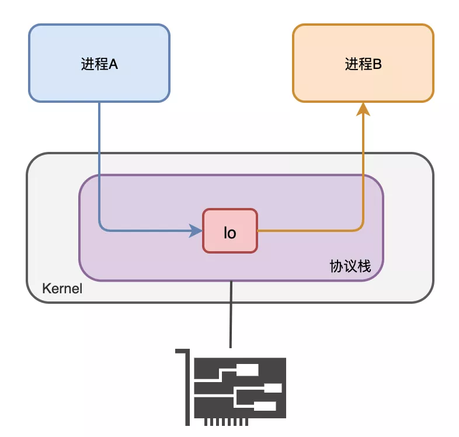
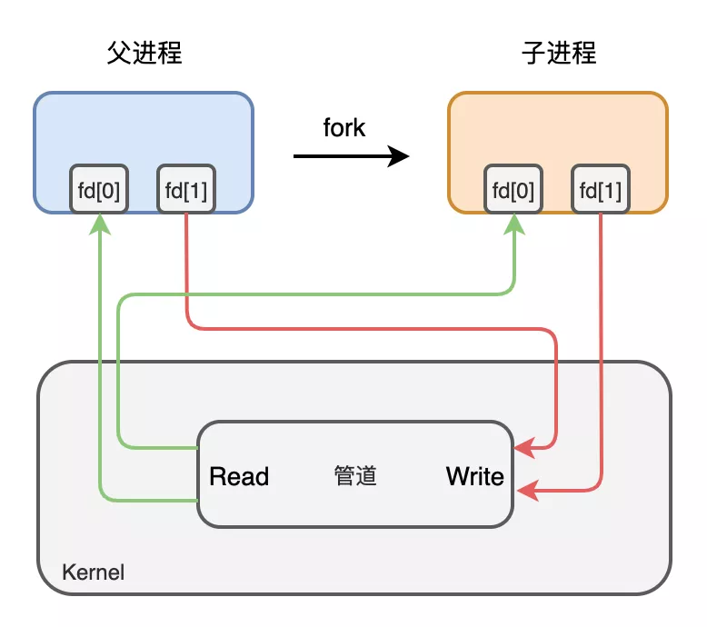
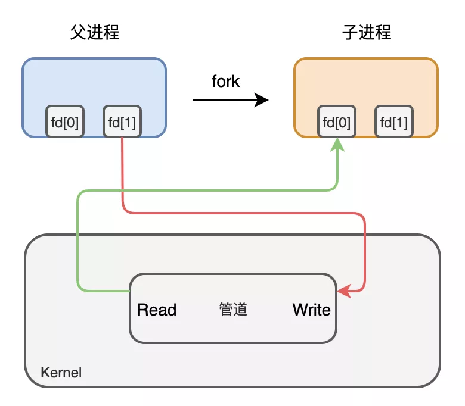
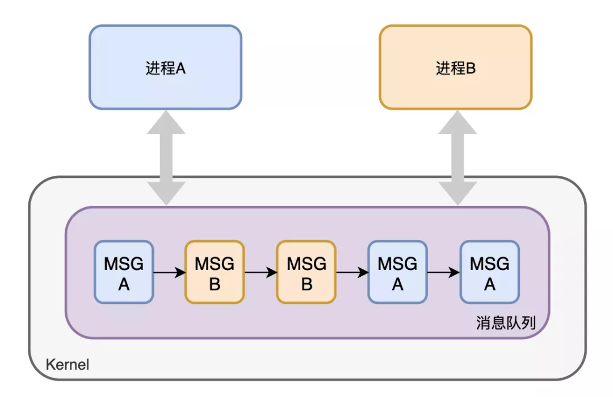
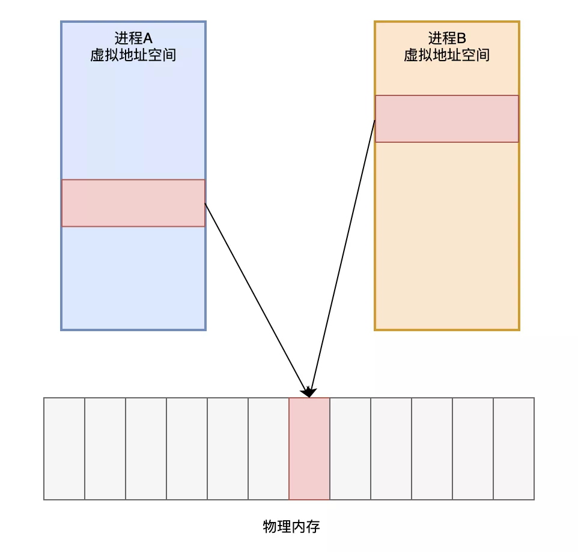

有一次面试的时候，被问到进程之间有哪些通信方式，不过由于之前没深入思考且整理过，说的并不好。想必大家也都知道进程有哪些通信方式，可是我猜很多人都是靠着”背“来记忆的。

所以今天的这篇文章，讲给大家详细着讲解他们是如何通信的，让大家尽量能够理解他们之间的区别、优缺点等，这样的话，以后面试官让你举例子，你也能够顺手拈来。

### 1、管道

我们来看一条 Linux 的语句

```
netstat -tulnp | grep 8080
```

学过 Linux 命名的估计都懂这条语句的含义，其中”|“是**管道**的意思，它的作用就是把前一条命令的输出作为后一条命令的输入。在这里就是把 netstat -tulnp 的输出结果作为 grep 8080 这条命令的输入。如果两个进程要进行通信的话，就可以用这种**管道**来进行通信了，并且我们可以知道这条**竖线**是没有名字的，所以我们把这种通信方式称之为**匿名管道**。

并且这种通信方式是**单向**的，只能把第一个命令的输出作为第二个命令的输入，如果进程之间想要互相通信的话，那么需要创建两个管道。

居然有匿名管道，那也意味着有**命名**管道，下面我们来创建一个命名管道。

```
mkfifo  test
```

这条命令创建了一个名字为 test 的命名管道。

接下来我们用一个进程向这个管道里面写数据，然后有另外一个进程把里面的数据读出来。

```
echo "this is a pipe" > test   // 写数据
```

这个时候管道的内容没有被读出的话，那么这个命令就会一直停在这里，只有当另外一个进程把 test 里面的内容读出来的时候这条命令才会结束。接下来我们用另外一个进程来读取

```
cat < test  // 读数据
```

我们可以看到，test 里面的数据被读取出来了。上一条命令也执行结束了。

从上面的例子可以看出，管道的通知机制类似于**缓存**，就像一个进程把数据放在某个缓存区域，然后等着另外一个进程去拿，并且是管道是**单向传输的。**

这种通信方式有什么缺点呢？显然，这种通信方式**效率低下**，你看，a 进程给 b 进程传输数据，只能等待 b 进程取了数据之后 a 进程才能返回。

所以管道不适合频繁通信的进程。当然，他也有它的优点，例如比较简单，能够保证我们的数据已经真的被其他进程拿走了。我们平时用 Linux 的时候，也算是经常用。

### 2、消息队列

那我们能不能把进程的数据放在某个内存之后就马上让进程返回呢？无需等待其他进程来取就返回呢？

答是可以的，我们可以用**消息队列**的通信模式来解决这个问题，例如 a 进程要给 b 进程发送消息，只需要把消息放在对应的消息队列里就行了，b 进程需要的时候再去对应的
消息队列里取出来。同理，b 进程要个 a 进程发送消息也是一样。这种通信方式也类似于**缓存**吧。

这种通信方式有缺点吗？答是有的，如果 a 进程发送的数据占的内存比较大，并且两个进程之间的通信特别频繁的话，消息队列模型就不大适合了。因为 a 发送的数据很大的话，意味**发送消息（拷贝）**这个过程需要花很多时间来读内存。

哪有没有什么解决方案呢？答是有的，请继续往下看。

## 3、共享内存

**共享内存**这个通信方式就可以很好着解决**拷贝**所消耗的时间了。

这个可能有人会问了，每个进程不是有自己的独立内存吗？两个进程怎么就可以共享一块内存了？

我们都知道，系统加载一个进程的时候，分配给进程的内存并不是**实际物理内存**，而是**虚拟内存空间**。那么我们可以让两个进程各自拿出一块虚拟地址空间来，然后映射到相同的物理内存中，这样，两个进程虽然有着独立的虚拟内存空间，但有一部分却是映射到相同的物理内存，这就完成了**内存共享**机制了。

### 4、信号量

共享内存最大的问题是什么？没错，就是多进程竞争内存的问题，就像类似于我们平时说的**线程安全**问题。如何解决这个问题？这个时候我们的**信号量**就上场了。

信号量的本质就是一个计数器，用来实现进程之间的互斥与同步。例如信号量的初始值是 1，然后 a 进程来访问**内存1**的时候，我们就把信号量的值设为 0，然后进程b 也要来访问**内存1**的时候，看到信号量的值为 0 就知道已经有进程在访问**内存1**了，这个时候进程 b 就会访问不了**内存1**。所以说，信号量也是进程之间的一种通信方式。

### 5、Socket

上面我们说的共享内存、管道、信号量、消息队列，他们都是多个进程在一台主机之间的通信，那两个相隔几千里的进程能够进行通信吗？

答是必须的，这个时候 Socket 这家伙就派上用场了，例如我们平时通过浏览器发起一个 http 请求，然后服务器给你返回对应的数据，这种就是采用 Socket 的通信方式了。

### 总结

所以，进程之间的通信方式有：

1、管道

2、消息队列

3、共享内存

4、信号量

5、Socket

讲到这里也就完结了，之前我看进程之间的通信方式的时候，也算是死记硬背，并没有去理解他们之间的关系，优缺点，为什么会有这种通信方式。所以最近花点时间去研究了一下，
整理了这篇文章，相信看完这篇文章，你就可以更好着理解各种通信方式的由来的。

------

### 总结

由于每个进程的用户空间都是独立的，不能相互访问，这时就需要借助内核空间来实现进程间通信，原因很简单，每个进程都是共享一个内核空间。

Linux 内核提供了不少进程间通信的方式，其中最简单的方式就是管道，管道分为「匿名管道」和「命名管道」。

**匿名管道**顾名思义，它没有名字标识，匿名管道是特殊文件只存在于内存，没有存在于文件系统中，shell 命令中的「`|`」竖线就是匿名管道，通信的数据是**无格式的流并且大小受限**，通信的方式是**单向**的，数据只能在一个方向上流动，如果要双向通信，需要创建两个管道，再来**匿名管道是只能用于存在父子关系的进程间通信**，匿名管道的生命周期随着进程创建而建立，随着进程终止而消失。

**命名管道**突破了匿名管道只能在亲缘关系进程间的通信限制，因为使用命名管道的前提，需要在文件系统创建一个类型为 p 的设备文件，那么毫无关系的进程就可以通过这个设备文件进行通信。另外，不管是匿名管道还是命名管道，进程写入的数据都是**缓存在内核**中，另一个进程读取数据时候自然也是从内核中获取，同时通信数据都遵循**先进先出**原则，不支持 lseek 之类的文件定位操作。

**消息队列**克服了管道通信的数据是无格式的字节流的问题，消息队列实际上是保存在内核的「消息链表」，消息队列的消息体是可以用户自定义的数据类型，发送数据时，会被分成一个一个独立的消息体，当然接收数据时，也要与发送方发送的消息体的数据类型保持一致，这样才能保证读取的数据是正确的。消息队列通信的速度不是最及时的，毕竟**每次数据的写入和读取都需要经过用户态与内核态之间的拷贝过程。**

**共享内存**可以解决消息队列通信中用户态与内核态之间数据拷贝过程带来的开销，**它直接分配一个共享空间，每个进程都可以直接访问**，就像访问进程自己的空间一样快捷方便，不需要陷入内核态或者系统调用，大大提高了通信的速度，享有**最快**的进程间通信方式之名。但是便捷高效的共享内存通信，**带来新的问题，多进程竞争同个共享资源会造成数据的错乱。**

那么，就需要**信号量**来保护共享资源，以确保任何时刻只能有一个进程访问共享资源，这种方式就是互斥访问。**信号量不仅可以实现访问的互斥性，还可以实现进程间的同步**，信号量其实是一个计数器，表示的是资源个数，其值可以通过两个原子操作来控制，分别是 **P 操作和 V 操作**。

与信号量名字很相似的叫**信号**，它俩名字虽然相似，但功能一点儿都不一样。信号是进程间通信机制中**唯一的异步通信机制**，信号可以在应用进程和内核之间直接交互，内核也可以利用信号来通知用户空间的进程发生了哪些系统事件，信号事件的来源主要有硬件来源（如键盘 Cltr+C ）和软件来源（如 kill 命令），一旦有信号发生，**进程有三种方式响应信号 1. 执行默认操作、2. 捕捉信号、3. 忽略信号**。有两个信号是应用进程无法捕捉和忽略的，即 `SIGKILL` 和 `SEGSTOP`，这是为了方便我们能在任何时候结束或停止某个进程。

前面说到的通信机制，都是工作于同一台主机，如果**要与不同主机的进程间通信，那么就需要 Socket 通信了**。Socket 实际上不仅用于不同的主机进程间通信，还可以用于本地主机进程间通信，可根据创建 Socket 的类型不同，分为三种常见的通信方式，一个是基于 TCP 协议的通信方式，一个是基于 UDP 协议的通信方式，一个是本地进程间通信方式。

以上，就是进程间通信的主要机制了。你可能会问了，那线程通信间的方式呢？

同个进程下的线程之间都是共享进程的资源，只要是共享变量都可以做到线程间通信，比如全局变量，所以对于线程间关注的不是通信方式，而是关注多线程竞争共享资源的问题，信号量也同样可以在线程间实现互斥与同步：

- 互斥的方式，可保证任意时刻只有一个线程访问共享资源；
- 同步的方式，可保证线程 A 应在线程 B 之前执行；

------

月黑风高夜，突然听得咣当一声，Web服务器的目录下冒出了两个文件，弄出了不小的声响。这两个家伙一胖一瘦，鬼鬼祟祟，潜入这台计算机，不知要搞什么名堂。

“二弟，一会儿咱们按照计划好的运行起来，分头行事，你等我信号，拿到数据后赶紧撤”，胖子对瘦子说到。

“老大，这地方我不熟悉，我怎么等你信号？咱们得想个联系方式，一会儿通信使用”，瘦子说到。

“这个不用担心，主人都交代好了”，胖子一边说，一边从背后拿出一本 **《Linux进程间通信手册》** 翻了起来。

## **信号**

翻开手册的第一页，上面写着：**信号——Signal**，两个家伙开始认真研究起来。

片刻之后，胖子程序说道：“唉，这个不行，往后翻吧！”

瘦子程序不解，问道：“咋就不行啦？”

“你看这里，手册上说了，信号是Linux上的一种**软中断**通信机制，可以向指定进程发送通知，总共有64种信号，不过这个信号只能作为通知使用，没办法传输数据”


“没法传输数据？那这玩意有什么用？”

“还是有用啊，可以通知某个进程发生了什么事件，比如kill命令就是利用这个信号来告知进程退出从而实现杀进程的效果的”

“原来如此”，瘦子程序若有所思的点了点头，此时胖子已经翻到了手册的第二页。

## **socket**

“你看，手册上写了，可以用**socket**”，胖子说到。

“socket？那不是网络通信使用的吗？”，瘦子有些疑惑。

“是啊，不过咱们一样可以用来在本地计算机通信，把连接的IP地址换成127.0.0.1就行了”

“感觉有点太招摇了，咱们计算机内部进程通信，数据还要经过网卡，很容易被发现的！”

“不会不会，手册上说了，127.0.0.1是本地回环地址，数据在协议栈就进行转发了，根本不会到达网卡”



“那抓包能抓到咱们通信吗？”

“嗯，让我看看···手册上说，可以在虚拟的回环网卡**lo**上抓到数据”

“还是算了吧，咱干这事得悄悄进行，不能留下痕迹，你再看看还有没有别的招”

听瘦子这么一说，胖子倒也觉得有理，便在手册上继续翻了起来。

## **匿名管道**

“哎，有了有了，这个叫**匿名管道**的，听起来就比较隐秘，应该不会被发现。”

瘦子接过手册，看了起来。

这俩盯着手册上的两个图研究了半天，总算弄明白了，所谓匿名管道不过是内核中的一段缓冲区，提供了读写两个口子，通过fork创建子进程后，子进程继承了父进程的管道信息，两边只要约定好，一个读，一个写，就能实现通信了。





“老大，这匿名管道是单向的，咱们要通信，得整两根管道才行，一个你写我读，一个我写你读”

“看起来挺靠谱，就这么干！”，二人达成了一致。

胖子程序率先运行起来，随后创建了两个管道，一个用来发送消息，一个用来接收消息。接着执行fork，将瘦子程序也运行了起来。


时间过的很快，转眼已是深夜，随着计算机被关掉，两个家伙的进程也都退出了。

半夜无人之际，硬盘中这两个家伙开始吵起来了。

“你是怎么回事？我给你发消息怎么也不回，害得我一连发了一堆消息，最后把管道塞满了，我都阻塞了！”，胖子程序气愤地说道。

“嗨！别提了，主人给我写的程序有bug，今天运行的时候不小心崩溃了，等我再次起来时，发现管道不见了，什么情况啊？”，瘦子程序说完叹了一口气。

“那肯定不行，这匿名管道需要有亲缘关系的进程继承后才能通信，你用别的方式运行起来，肯定看不到我创建的管道啊！”

“这匿名管道用起来太麻烦了，看看还有没有别的通信方式？”

胖子程序又掏出了手册，翻了起来。

## **消息队列**

“有了有了，这里还写了两种方式：命名管道、消息队列”，胖子程序说到。

“命名管道？跟匿名管道有什么区别吗？”

“命名管道有名字，有了名字就不限有亲缘关系的进程才能通信了，只要使用这个名字，都能打开管道通信，这下你就算挂了重启也能跟我联系上了”

“那消息队列又是什么东西？”

“额，让我看一下”

“给我也看看”，瘦子程序凑了上去，一起看了起来。



过了一会儿，瘦子程序说道：“我看明白了，这消息队列是内核中的一个消息链表，按照消息块组织，比那管道全是二进制数据流堆积在一起好用多了”

“有道理，而且这消息还可以指定类型，这样咱们俩就不用弄两个管道，一个消息队列就行了，咱们俩使用不同的消息类型，可省了不少事儿啊！”

“那咱们就用消息队列吧，别用那什么管道了”

“好，就这么干！”

两个家伙一拍即合，准备第二天再大干一场。

第二天，计算机启动后，它们又偷偷的运行了起来。

这一次用上了消息队列，联络起来方便了不少。

## **共享内存**

不知过了多久，那瘦子进程总算来信儿了，胖子从消息队列中取出一看，只见上面写着：

> “老大，我拿到了数据了，需要你来处理一下，不过这数据体量有点大，用管道和消息队列传输效率都太低了，有无办法快速把数据传送给你，盼速回。”

胖子进程心里一阵欢喜，数据拿到了，总算可以回去交差了。不过怎么样快速把数据传送过来呢，心里又犯起了嘀咕。

此时，胖子进程又一次拿出手册，翻到了最后一页，发现了一个叫“**共享内存**”的东西，仿佛像抓住了救命稻草一般，仔细研究了起来。

片刻之后，胖子的脸上露出了笑容，随后写下了一条消息给瘦子进程发送了过去。

却说这瘦子进程正在焦急等待消息中，收到老大的回信后，赶紧取出来看：

> 二弟，主人的手册中提到，可以使用共享内存进行进程间通信。
>
> 我准备了几个内存页面，你将它们映射到你的进程地址空间中，咱们就能共享这一片内存，你写的数据我能立即看到，我写的你也能立即看到，虽然咱们各自读写的地址不同，但实际上是访问的同一片物理内存页面，比管道和消息队列效率高多了！
>
> 
>
> 不过为了防止咱们一起读写发生冲突，需要配合**信号量**一起使用，用它来实现进程间同步。
>
> 具体的使用方法如下：
>
> ······
>
> ······
>
> 盼速回！

瘦子进程看完，心中大喜！赶紧通过消息队列发了一封回信。

随后，通过老大交代的方法开始操作起来，打开共享、映射挂载一气呵成。再接着，将数据一股脑儿写到了共享的内存页面中。

大功告成之后，便退出了进程，按照计划准备撤退，却不见了胖子的踪迹，既无进程也无文件。

“这家伙难道抛下我一个人跑了？”

正想着，突然“嗡”的一声，瘦子的程序文件也没了。

却看那文件目录之下，只留了一卷《Linux进程间通信手册》···