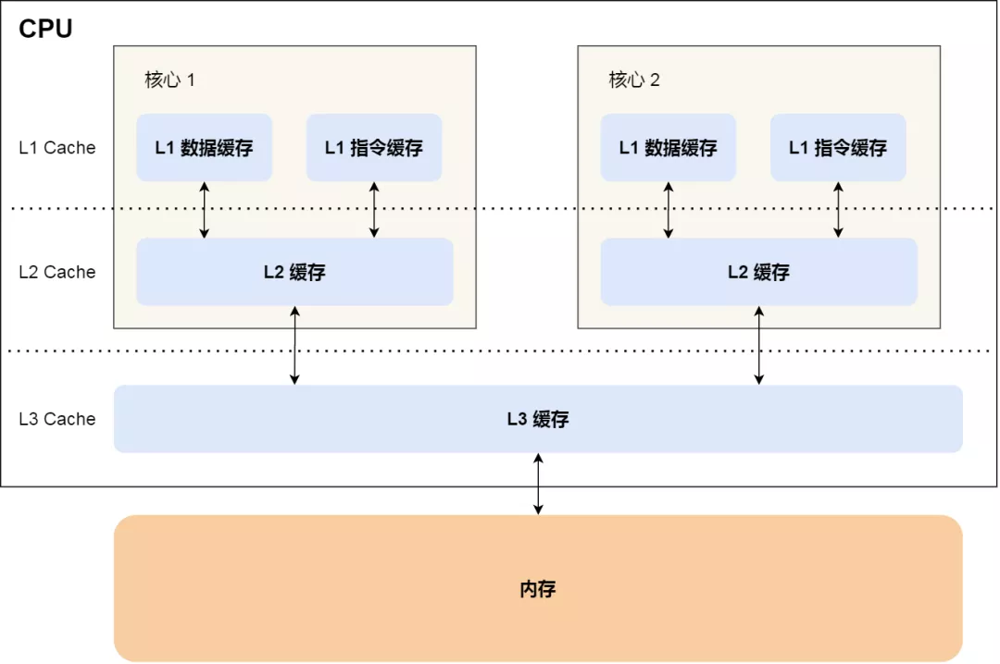
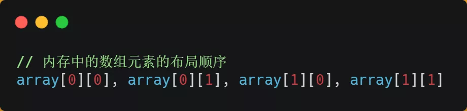
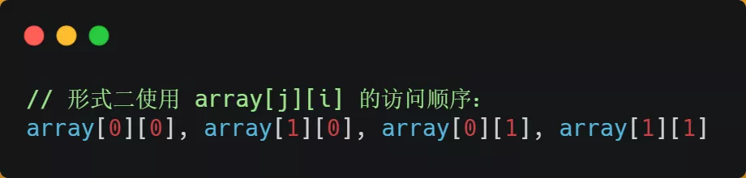

我这里举个简单例子，你觉得下面这两个 `for` 循环哪个效率会更高呢？为什么会更高呢？

这个问题的关键在于，大家知不知道 CPU Cache 这个东西。

我自己曾经在还没有学计组的时候，只觉得存储设备就是我们常见的内存和硬盘，**学了后我才发现还有 CPU Cache 这个东西，而能不能充分利用到这个东西，就决定你程序的性能。**

CPU Cache 是 CPU 内部的一个缓存，它的读写速度远高于内存，所以它充当内存的缓存角色，当 CPU 要访问的数据命中了 CPU Cache，就不用去从内存上找数据，就像 MySQL 和 Redis 之间的关系。

CPU Cache 一般会分为三层，分别是 L1 Cache、L2 Cache、L3 Cache ，其中 L1 Cache 是各个 CPU 核心独立的，剩下的 L2 Cache、L3 Cache 是各个核心共享的。

CPU Cache 的数据是从内存中读取过来的，它是以一小块一小块读取数据的，而不是按照单个数组元素来读取数据的，在 CPU Cache 中的，这样一小块一小块的数据，称为 Cache Line(缓存块)。 

如果 L1 Cache Line 大小是 64 字节，**也就意味着 L1 Cache 一次载入数据的大小是 64 字节。**

比如，有一个 int array[100] 的数组，当载入 array[0] 时，由于这个数组元素的大小在内存只占 4 字节，不足 64 字节，CPU 就会顺序加载数组元素到 array[15] ，意味着 array[0]~array[15] 数组元素都会 被缓存在 CPU Cache 中了，因此当下次访问这些数组元素时，会直接从 CPU Cache 读取，而不用再从内 存中读取，大大提高了 CPU 读取数据的性能。

CPU Cache 的概念简单介绍完了，再来说说刚才的 for 循环问题。

我直接说答案：形式一 `array[i][j]` 执行时间比形式二 `array[j][i]` 快好几倍。

之所以有这么大的差距，是因为二维数组 `array` 所占用的内存是连续的，比如长度 `N` 的指是 `2` 的话，那么内存中的数组元素的布局顺序是这样的：

形式一用 `array[i][j]` 访问数组元素的顺序，正是和内存中数组元素存放的顺序一致。当 CPU 访问 `array[0][0]` 时，由于该数据不在 Cache 中，于是会「顺序」把跟随其后的 3 个元素从内存中加载到 CPU Cache，这样当 CPU 访问后面的 3 个数组元素时，就能在 CPU Cache 中成功地找到数据，这意味着缓存命中率很高，缓存命中的数据不需要访问内存，这便大大提高了代码的性能。

而如果用形式二的 `array[j][i]` 来访问，则访问的顺序就是：

你可以看到，访问的方式跳跃式的，而不是顺序的，那么如果 N 的数值很大，那么操作 `array[j][i]` 时，是没办法把 `array[j+1][i]` 也读入到 CPU Cache 中的，既然 `array[j+1][i]`没有读取到 CPU Cache，那么就需要从内存读取该数据元素了。很明显，这种不连续性、跳跃式访问数据元素的方式，可能不能充分利用到了 CPU Cache 的特性，从而代码的性能不高。

那访问 `array[0][0]` 元素时，CPU 具体会一次从内存中加载多少元素到 CPU Cache 呢？这个问题，在前面我们也提到过，这跟 CPU Cache Line 有关，它表示 **CPU Cache 一次性能加载数据的大小**，可以在 Linux 里通过 `coherency_line_size` 配置查看 它的大小，通常是 64 个字节。

也就是说，当 CPU 访问内存数据时，如果数据不在 CPU Cache 中，则会一次性会连续加载 64 字节大小的数据到 CPU Cache，那么当访问 `array[0][0]` 时，由于该元素不足 64 字节，于是就会往后**顺序**读取 `array[0][0]~array[0][15]` 到 CPU Cache 中。顺序访问的 `array[i][j]` 因为利用了这一特点，所以就会比跳跃式访问的 `array[j][i]` 要快。

**因此，遇到这种遍历数组的情况时，按照内存布局顺序访问，将可以有效的利用 CPU Cache 带来的好处，这样我们代码的性能就会得到很大的提升，**

CPU Cache 的内容远不止于我说的这些，还有**缓存一致性协议、伪共享、write through 和 write back 的方式**等，这些都是非常重要的知识。