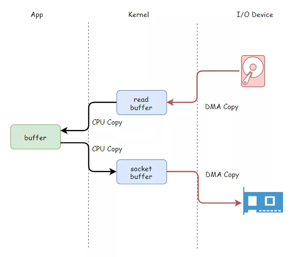
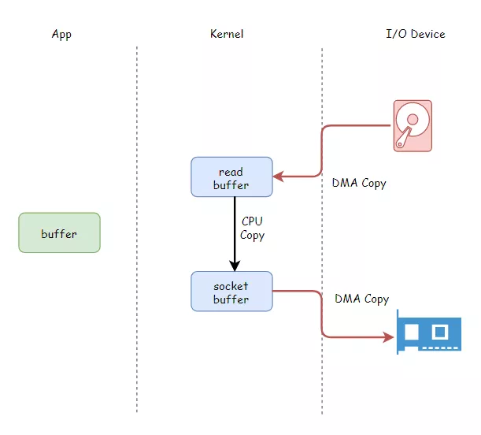
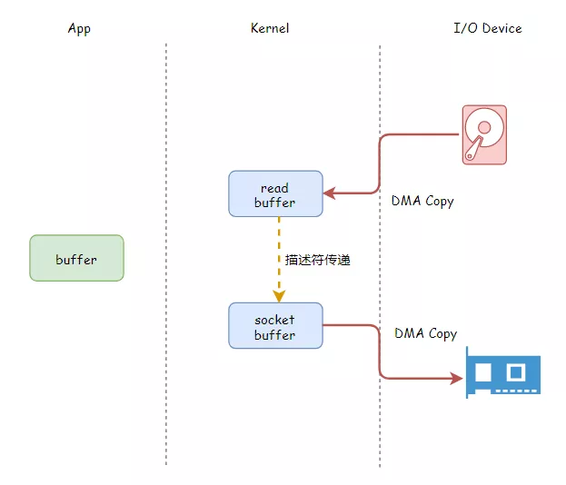

## **数据搬运工**

Hi，我是CPU一号车间的阿Q，有段日子没见面了。

还记得上回说到咱们厂里用上了DMA技术（[太慢不能忍！CPU又拿硬盘和网卡开刀了！](https://mp.weixin.qq.com/s?__biz=MzIyNjMxOTY0NA==&mid=2247485292&idx=1&sn=528260520a264ce655f9eede03738976&scene=21#wechat_redirect)）之后，我们总算解放了，再也不用奔波于网卡、硬盘与内存之间搬运数据了。


前段时间，我到二号车间虎子那里去串门，发现他正忙的满头大汗。

“老哥，你这是接到什么任务了？看把你给你忙的”

虎子一看我过来，擦了擦头上的汗说到：“我这是在搬运数据啊，刚刚搬完一批，累死我了”

我有些疑惑：“咱们现在不是有DMA技术了吗，找外包DMA控制器搬运啊，你干嘛还亲自上阵？”

“DMA是用于I/O外部设备与内存之间搬运数据，我现在的任务是内存之间的复制拷贝工作，这DMAC也帮不上什么忙啊，还不得我亲自动手复制。”


我瘪了瘪嘴，“也是，但愿我不要接到这种任务”

“先不跟你聊了，又有活要干了”，虎子屁股还没坐热，又起身去忙了，我也起身准备回去。

“我靠！怎么又要拷贝这批数据！”，我刚走两步，就听到虎子的吐槽。

我回过头去问到：“咋了这是？”

“我刚才才把这份数据从内核地址空间往用户态地址空间拷贝了一次，这还没喘口气，又让我再搬一次从用户态再搬回内核地址空间，太折腾我了吧！”

我拍了拍他的肩膀说到：“嗨，这没办法，咱们就是打工的，哪轮得到咱们挑挑拣拣啊，加油吧！”

我一边给他打气，一边暗自祈祷别给我安排这种活，又累有没有技术含量。

天有不测风云，回到一号车间没多久，我也摊上这种事了。老话说得好，真是怕什么来什么。

一开始我还能忍着，时间一久我就抑制不住心里的不满了，还真是落在自己身上才知道痛。

## **数据的四次拷贝**

第二天，我约上虎子去找操作系统内存管理部门反应这事。

内存管理部门居然踢皮球，说这事不归他们管，让我们找I/O部门，没办法，我们又来到I/O部门反应这事。


I/O部门的人听完我们的抱怨，也很无奈：“两位，实在不是我们故意戏耍你们。之前让你们两次搬运数据实在没有办法，这是上边的应用程序要这样写的。他们要把硬盘上的文件读取出来，然后再通过网卡发送出去。这一读一写的不就要搬两次吗？”

```
File.read(file, buf, len);
Socket.send(socket, buf, len);
```

“硬盘？网卡？这，这，这我们不是有了DMA技术了吗，正好解决了和他们的数据传输，干嘛还另外让我们再在内存之间复制来复制去呢？”，我问到。

对方看出了我们的疑惑，在旁边的白板上画了一张图：



“你们看，数据从硬盘最终到网卡，因为有应用程序的参与，他们需要先读到他们在用户空间的缓存区，再发送出去，这样就总共有四次数据的传输。其中从硬盘到内核空间和从内核空间到网卡这两个环节，DMAC可以帮你们搬运。不过剩下两次的用户空间和内核空间的来回拷贝，这还得靠你们来搬运下啊”

“原来是这样，唉，看来是没办法避免了，咱先回去吧”，虎子看完图垂头丧气的说到。

我却不愿放弃，想在这图中找出可以优化改进的地方。


“能不能让数据不要去应用程序那里，直接在内核空间复制一次就好，我们就可以少搬运一次了？”，我抛出了一个问题。

“那怎么可能呢，他不读上去，后面怎么发出去呢？不行不行”，I/O部门的人连连摇头。

“还是可以发啊，你看像这样···反正最后也是把数据从内核空间交给网卡发，只是免去了数据去用户空间白晃一圈的浪费”，我把他画的图改了一下，不肯放弃解释到。



对方被我的话点醒了一般，眼珠左右转动，反复思考。

片刻之后，回到：“还是不行，万一人家要对读取的文件数据进行修改，或者解密，那还是得读到他的用户空间缓存区才行”

我想了一下，这似乎没办法避免，说到：“那这种情况咱们就认了，反正以我的经验来看，你说的这种情况不多。大部分情况下都是数据原封不动的从内核到用户空间，又从用户空间回到内核。”

I/O部门的人再也没有什么说辞，点了点头答应了下来，说把我们的意见汇报到Linux帝国高层讨论后才能做决定。我们就先回去等消息了。

## **零拷贝技术**

不过后来工作太忙，迟迟没有操作系统那边的消息，慢慢的我们就把这事给淡忘了，直到前几天······

“阿Q，听说了吗，最近Linux帝国新成立了一个公司，居然绕过我们CPU就能把数据从网卡写入硬盘中”，虎子火急火燎的来找我。

“不可能啊，按照我们之前的方案，怎么说也得至少经过我们拷贝一次吧”

“根本不用，他们号称是**零拷贝技术**”

我们赶紧放下手里的工作，去打听下究竟怎么回事。

原来，Linux帝国最近新推出了一个API，叫**sendfile**

```
ssize_t sendfile(
  int out_fd, 
  int in_fd, 
  off_t *offset, 
  size_t count
  );
```

只需要指定打开文件的描述符和要发送的网络接口描述符，就直接实现了把文件通过网络发出去。

我们再次来到了操作系统I/O部门，对方一看是我们，热情的接待了我们。

“你们来的正好，我还没来得及告诉你们呢。上次你们提的思路非常好，帝国高层非常重视，我一反应上去，当即就采纳了你们的意见。这不你们估计也知道了，推出了新的API给应用程序们使用，省去了数据白白去用户空间转一圈的开销。一推出就大受欢迎，说起来还得感谢你们呢”

“原来是这样，我说最近怎么搬运数据的工作少了不少。不过你们是怎么做到**零拷贝**的？”



I/O部门的人瞅了我们几眼，得意的一笑，“帝国高层在讨论你们的方案时，觉得还可以再进一步优化，直接把从硬盘读取到的数据缓冲区地址和长度给到网络socket描述符，就不用你们再搬运一次数据，彻底解放你们，所以叫零拷贝啦！”

我俩连连点头称赞。

“还没完呢！咱Linux帝国还把这一技术推广到了文件数据复制上，增加了另一个API:**splice**，以后文件拷贝也可以减轻你们的负担了”

```
ssize_t splice(
  int fd_in, 
  loff_t *off_in, 
  int fd_out,
  loff_t *off_out, 
  size_t len, 
  unsigned int flags
  );
```

我俩回去之后，把这一消息告知了全厂，大家都高兴坏了，原来各个车间都受苦久矣。

## **彩蛋1**

> 在遥远的Windows帝国上。
>
> “部长，听说Linux帝国推出了一个sendfile，号称零拷贝”
>
> “有这回事？咱们不能落后，赶紧去研究一下”

## **彩蛋2**

> Linux帝国新来了一家公司，专注网络数据包分析业务。
>
> “老大，数据包每次都要经过Linux帝国协议栈部门处理一遍才能拿到，这太慢了”
>
> “能不能绕开协议栈，直接抓包？”
>
> *预知后事如何，请关注后续精彩······*