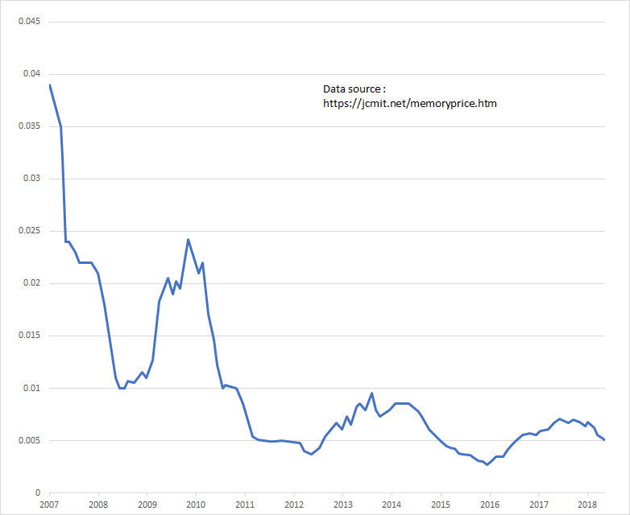

# 为什么 Linux 默认页大小是 4KB

2020-05-27 [为什么这么设计](https://draveness.me/tags/为什么这么设计) [系统设计](https://draveness.me/tags/系统设计) [Linux](https://draveness.me/tags/linux) [虚拟内存](https://draveness.me/tags/虚拟内存)

> 为什么这么设计（Why’s THE Design）是一系列关于计算机领域中程序设计决策的文章，我们在这个系列的每一篇文章中都会提出一个具体的问题并从不同的角度讨论这种设计的优缺点、对具体实现造成的影响。如果你有想要了解的问题，可以在文章下面留言。

我们都知道 Linux 会以页为单位管理内存，无论是将磁盘中的数据加载到内存中，还是将内存中的数据写回磁盘，操作系统都会以页面为单位进行操作，哪怕我们只向磁盘中写入一个字节的数据，我们也需要将整个页面中的全部数据刷入磁盘中。

Linux 同时支持正常大小的内存页和大内存页（Huge Page）[1](https://draveness.me/whys-the-design-linux-default-page/#fn:1)，绝大多数处理器上的内存页的默认大小都是 4KB，虽然部分处理器会使用 8KB、16KB 或者 64KB 作为默认的页面大小，但是 4KB 的页面仍然是操作系统默认内存页配置的主流；除了正常的内存页大小之外，不同的处理器上也包含不同大小的大页面，我们在 x86 处理器上就可以使用 2MB 的内存页。

4KB 的内存页其实是一个历史遗留问题，在上个世纪 80 年代确定的 4KB 一直保留到了今天。虽然今天的硬件比过去丰富了很多，但是我们仍然沿用了过去主流的内存页大小。如下图所示，装过机的人应该对这里的内存条非常熟悉：

**图 1 - 随机存取内存**

在今天，4KB 的内存页大小可能不是最佳的选择，8KB 或者 16KB 说不定是更好的选择，但是这是过去在特定场景下做出的权衡。我们在这篇文章中不要过于纠结于 4KB 这个数字，应该更重视决定这个结果的几个因素，这样当我们在遇到类似场景时才可以从这些方面考虑当下最佳的选择，我们在这篇文章中会介绍以下两个影响内存页大小的因素，它们分别是：

- 过小的页面大小会带来较大的页表项增加寻址时 TLB（Translation lookaside buffer）的查找时间和额外开销；
- 过大的页面大小会浪费内存空间，造成内存碎片，降低内存的利用率；

上个世纪在设计内存页大小时充分考虑了上述的两个因素，最终选择了 4KB 的内存页作为操作系统最常见的页大小，我们接下来将详细介绍以上它们对操作系统性能的影响。

## 页表项

我们在 [为什么 Linux 需要虚拟内存](https://draveness.me/whys-the-design-os-virtual-memory/) 一文中曾经介绍过 Linux 中的虚拟内存，每个进程能够看到的都是独立的虚拟内存空间，虚拟内存空间只是逻辑上的概念，进程仍然需要访问虚拟内存对应的物理内存，从虚拟内存到物理内存的转换就需要使用每个进程持有页表。

为了存储 64 位操作系统中 128 TiB 虚拟内存的映射数据，Linux 在 2.6.10 中引入了四层的页表辅助虚拟地址的转换[2](https://draveness.me/whys-the-design-linux-default-page/#fn:2)，在 4.11 中引入了五层的页表结构[3](https://draveness.me/whys-the-design-linux-default-page/#fn:3)，在未来还可能会引入更多层的页表结构以支持 64 位的虚拟地址。

**图 2 - 四层页表结构**

在如上图所示的四层页表结构中，操作系统会使用最低的 12 位作为页面的偏移量，剩下的 36 位会分四组分别表示当前层级在上一层中的索引，所有的虚拟地址都可以用上述的多层页表查找到对应的物理地址[4](https://draveness.me/whys-the-design-linux-default-page/#fn:4)。

因为操作系统的虚拟地址空间大小都是一定的，整片虚拟地址空间被均匀分成了 N 个大小相同的内存页，所以内存页的大小最终会决定每个进程中页表项的层级结构和具体数量，虚拟页的大小越小，单个进程中的页表项和虚拟页也就越多。

PagesCount=VirtualMemoryPageSizePagesCount=VirtualMemoryPageSize

因为目前的虚拟页大小为 4096 字节，所以虚拟地址末尾的 12 位可以表示虚拟页中的地址，如果虚拟页的大小降到了 512 字节，那么原本的四层页表结构或者五层页表结构会变成五层或者六层，这不仅会增加内存访问的额外开销，还会增加每个进程中页表项占用的内存大小。

## 碎片化

因为内存映射设备会在内存页的层面工作，所以操作系统认为内存分配的最小单元就是虚拟页。哪怕用户程序只是申请了 1 字节的内存，操作系统也会为它申请一个虚拟页，如下图所示，如果内存页的大小为 24KB，那么申请 1 字节的内存会浪费 ~99.9939% 的空间。

**图 3 - 大内存的碎片化**

随着内存页大小的增加，内存的碎片化严情况会越来越严重，小的内存页会减少内存空间中的内存碎片，提高内存的利用率。上个世纪的内存资源还没有像今天这么丰富，在大多数情况下，内存都不是限制程序运行的资源，多数的在线服务都需要更多的CPU，而不是更多的内存。不过在上个世纪内存其实也是稀缺资源，所以提高稀缺资源的利用率是我们不得不考虑的事情：

**图 4 - 内存的价格**

上个世纪八九十年代的内存条只有 512KB 或者 2MB，价格也贵得离谱，但是几 GB 的内存在今天却非常常见[5](https://draveness.me/whys-the-design-linux-default-page/#fn:5)，所以虽然内存的利用率仍然十分重要，但是在内存的价格大幅降低的今天，碎片化的内存不再是需要解决的关键问题了。

除了内存的利用率之外，较大的内存页也会增加内存拷贝时的额外开销，因为 Linux 上的写时拷贝机制，在多个进程共享同一块内存时，当其中的一个进程修改了共享的虚拟内存会触发内存页的拷贝，这时操作系统的内存页越小，写时拷贝带来的额外开销也就越小。

## 总结

就像我们在上面提到的，4KB 的内存页是上个世纪决定的默认设置，从今天的角度来看，这很可能已经是错误的选择了，arm64、ia64 等架构已经可以支持 8KB、16KB 等大小的内存页，随着内存的价格变得越来越低、系统的内存变得越来越大，更大的内存可能是操作系统更好的选择，我们重新回顾一下两个决定内存页大小的要素：

- 过小的页面大小会带来较大的页表项增加寻址时 TLB（Translation lookaside buffer）的查找时间和额外开销，但是也会减少程序中的内存碎片，提高内存的利用率；
- 过大的页面大小会浪费内存空间，造成内存碎片，降低内存的利用率，但是可以减少进程中的页表项以及 TLB 的寻址时间；

这种类似的场景在我们做系统设计时也比较常见，举一个不是特别恰当的例子，当我们想要在集群上部署服务时，每个节点上的资源是有限的，单个服务占用的资源可能会影响集群的资源利用率或者系统的额外开销。如果我们在集群中部署 32 个占用 1 CPU 的服务，那么可以充分利用集群中的资源，但是如此多的实例数会带来较大的额外开销；如果我们在集群中部署 4 个占用 8 CPU 的服务，那么这些服务的额外开销虽然很小，但是可能会在节点中留下很多空隙。到最后，我们还是来看一些比较开放的相关问题，有兴趣的读者可以仔细思考一下下面的问题：

- Linux 中的扇区、块和页都有什么区别和联系？
- Linux 中的块大小是如何决定的？常见的大小有哪些？

> 如果对文章中的内容有疑问或者想要了解更多软件工程上一些设计决策背后的原因，可以在博客下面留言，作者会及时回复本文相关的疑问并选择其中合适的主题作为后续的内容。

## 推荐阅读

- [为什么 Linux 需要虚拟内存](https://draveness.me/whys-the-design-os-virtual-memory/)
- [为什么系统调用会消耗较多资源](https://draveness.me/whys-the-design-syscall-overhead/)

------

1. Huge TLB Pages https://www.kernel.org/doc/Documentation/vm/hugetlbpage.txt [↩︎](https://draveness.me/whys-the-design-linux-default-page/#fnref:1)
2. Four-level page tables merged https://lwn.net/Articles/117749/ [↩︎](https://draveness.me/whys-the-design-linux-default-page/#fnref:2)
3. Five-level page tables https://lwn.net/Articles/717293/ [↩︎](https://draveness.me/whys-the-design-linux-default-page/#fnref:3)
4. 为什么 Linux 需要虚拟内存 https://draveness.me/whys-the-design-os-virtual-memory/ [↩︎](https://draveness.me/whys-the-design-linux-default-page/#fnref:4)
5. Memory Prices 1957+ https://jcmit.net/memoryprice.htm [↩︎](https://draveness.me/whys-the-design-linux-default-page/#fnref:5)