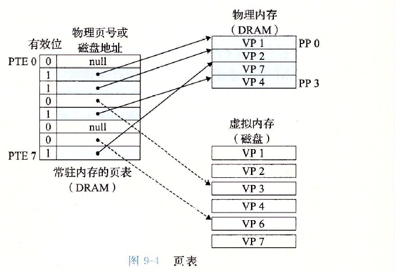
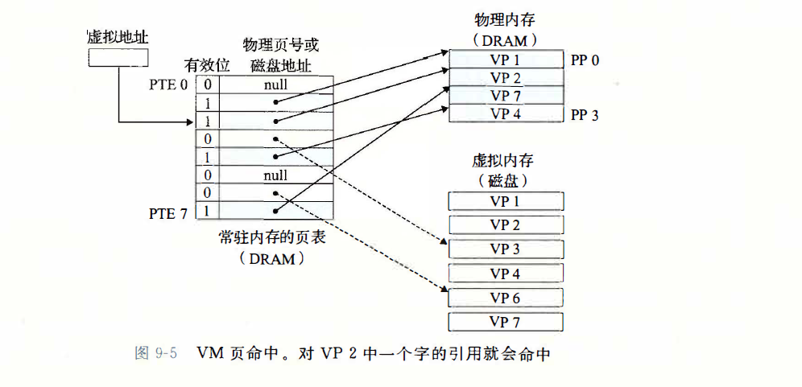
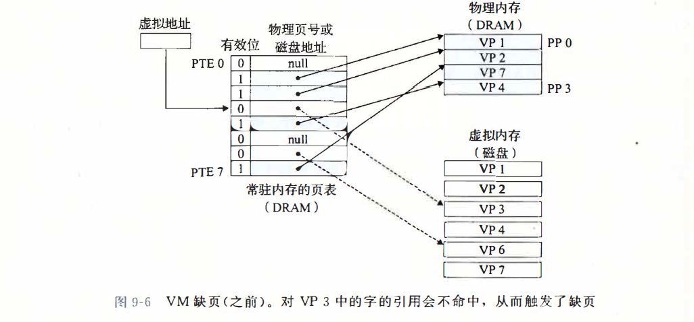
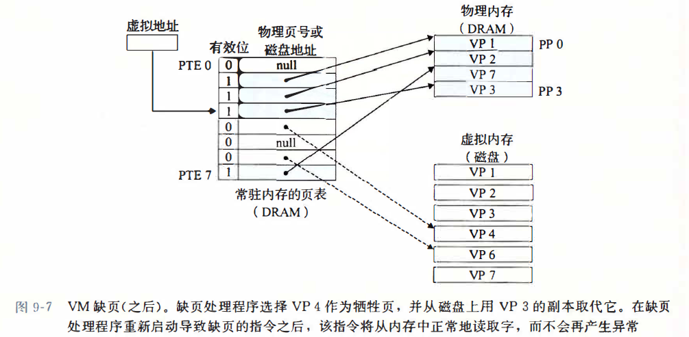
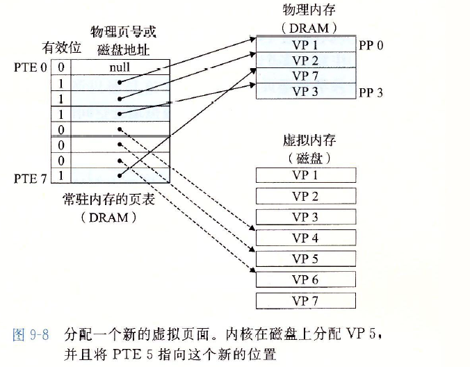

## 内存映射

### 页表

物理内存即 **DRAM**

### 页

在任意时刻，虚拟页面的集合都分为三个不相交的子集：

- 未分配的：虚拟系统还未分配（或者创建）的页。 未分配的块没有任何数据和它们相关联，因此也就不占用任何磁盘空间。
- 缓存的 ： 当前已缓存在物理内存中的已分配页。
- 未缓存的：未缓存在物理内存中的已分配页

### 页表

页表是存储在物理内存中，功能是将虚拟页映射到物理页。每次地址翻译硬件将一个虚拟地址转换为物理地址时，都会读取页表。操作系统会维护页表的页表的内容，以及在磁盘和DRAM之间来回传送页。

页表是常驻在物理内存中，页表本质上可以当作数组来看待，每个元素（即，页表条目）是由“有效位+地址”组成。有效位指示该虚拟页是否被缓存在DRAM中：如果设置了有效位，那么地址字段就表示 `DRAM` 中相应的物理页的起始地址。如果没有设置有效位，而地址段是一个空的地址，表示这个虚拟页还未被分配；如果不是空的地址，那么表示的这个虚拟页在磁盘中的起始位置，后面发生缺页中断时，进行页面置换算法将这个虚拟页从磁盘调入进内存中。

如下图显示：

### 页命中与缺页中断

当CPU**访问**包含在VP2中的虚拟内存的一个变量时，vp2将会被缓存在DRAM中。通过某个机制找到该变量的虚拟地址，地址翻译硬件将虚拟地址作为一个索引来定位PTE2，并从虚拟内存中读取他。因为设置了PTE2的有效位，那么地址翻译单元就知道VP2是已经缓冲在内存中，就是可以使用PTE2中的物理内存地址，构造出这个变量的物理地址。

如果我门要访问的变量在vp3中，但是vp3没有被缓存在 `DRAM` 中，虚拟内存中将DRAM缓存不命中称为缺页。

地址翻译单元从内存中读取PTE3，从有效位推断出VP 3未被缓存，并且触发一个缺页异常。 缺页异常调用内核中的缺页异常处理程序，该程序会选择一个牺牲页， 在此例中就是存放在pp3处的VP4。 如果VP4 已经被修改了， 那么内核就会将它复制回磁盘。 无论哪种情况，内核都会修改VP4的页表条目，反映出VP4不再缓存在主存中这一事实。

接下来， 内核从**磁盘**复制VP3到内存中的pp3, 更新PTE3, 随后返回。 当异常处理程序返回时， **它会重新启动导致缺页的指令**，该指令会把导致缺页的虚拟地址重发送到地址翻译硬件。 现在VP3已经缓存在主存中了， 那么页命中也能由地址翻译硬件正常处理了。 图9-7展示了在缺页之后我们的示例页表的状态。

### 分配页

下图展示了当操作系统分配一个新的虚拟页时对我们上述示例页表的影响。比如，调用 `malloc` 的结果，在这个示例中，`vp5`的分配过程是在磁盘上创建空间，并更新PTE5，使她指向磁盘上这个新创建的页面。

### 多级页表

之所以需要存在多级页面。根据局部性原理可知，进程在一段时间内，只需要访问某几个页面就能正常运行。因此没有必要将整个物理内存的页表都加载进来，实现方式就是缺页中断实现数据交换。