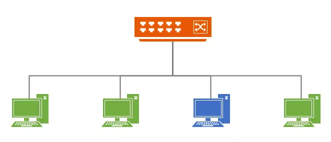
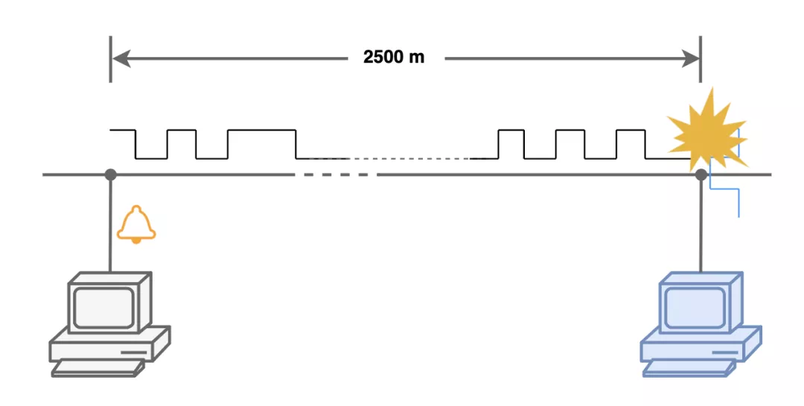
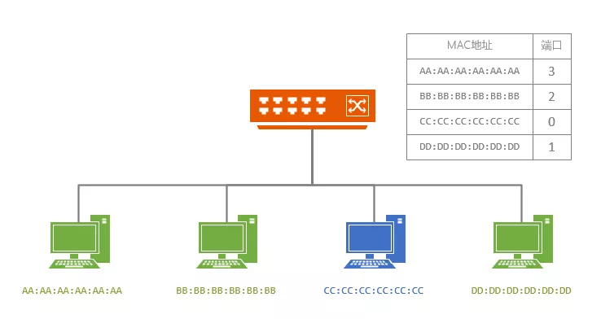
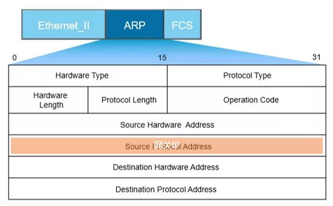

#### ARP

在传输一个 IP 数据报的时候，确定了源 IP 地址和目标 IP 地址后，就会通过主机「路由表」确定 IP 数据包下一跳。然而，网络层的下一层是数据链路层，所以我们还要知道「下一跳」的 MAC 地址。

由于主机的路由表中可以找到下一条的 IP 地址，所以可以通过 **ARP 协议**，求得下一跳的 MAC 地址。

> 那么 ARP 又是如何知道对方 MAC 地址的呢？

简单地说，ARP 是借助 **ARP 请求与 ARP 响应**两种类型的包确定 MAC 地址的。

ARP 广播

- 主机会通过**广播发送 ARP 请求**，这个包中包含了想要知道的 MAC 地址的主机 IP 地址。
- 当同个链路中的所有设备收到 ARP 请求时，会去拆开 ARP 请求包里的内容，如果 ARP 请求包中的目标 IP 地址与自己的 IP 地址一致，那么这个设备就将自己的 MAC 地址塞入 **ARP 响应包**返回给主机。

操作系统通常会把第一次通过 ARP 获取的 MAC 地址缓存起来，以便下次直接从缓存中找到对应 IP 地址的 MAC 地址。

不过，MAC 地址的缓存是有一定期限的，超过这个期限，缓存的内容将被清除。

------

我是一个监听软件，主人花了好几个晚上才把我开发出来，我的使命是监听网络中的所有流量然后报告给他。

那天，主人给要被监听的电脑小白发了一封电子邮件，邮件中有一个链接，小白一点链接，我就偷偷的被下载到了这台电脑上，开始在背后默默的运行。

太好了，这台电脑上居然没有安全软件，我可以为所欲为了！

我加载了一个驱动程序，开始在内核中劫持网络数据包的接收流程，这下，这台电脑的网络通信，我都能捕获到了！

过了一段时间，我发现这个小白的电脑没有什么有价值的信息，除了打游戏就是看视频。

## **混杂模式**

那天主人在云端给我下达了一个指令：**打开网卡混杂模式，监控局域网内所有流量！**

我有点不太懂，去请教网卡：“老哥，什么是混杂模式？”

网卡告诉我：“我跟你讲哦，正常情况下，收到数据包后如果发现收件人唔系我，我就丢掉咗。开启混杂模式后，只要收到数据包，唔理收件人系唔系我，我都给你提交上来”

好家伙，这网卡还抄着一口广东腔，难道是华强北产的？

“为什么会收到收件人不是你的数据包呢？”，我有点好奇。

“这你就不知道了吧，咱们这个网络中，所有电脑都连在一个**集线器**上面，这个家伙可笨了，不管谁给谁发的消息，他都广播出去，所以所有人的通信其实我都能看到，只需要你打开混杂模式就好了”

“那别愣着了，赶紧打开吧”

我激动的让网卡打开了混杂模式，期待监听到别人的通信。

果不其然，一下子就涌来了大量的数据包，搞得我措手不及。

我开始认真工作起来，解析所有的网络通信，把感兴趣的提取下来，汇报给我的主人，主人对我的工作非常满意。

## **交换机**

就这样过了好长一段日子，突然有一天，我发现网络通信中没有了别人的通信，只有小白这台电脑的流量了，我又找上了网卡。

“老哥，谁把你的混杂模式给关了吗？”

“没有啊，你看，这不开着了呢嘛！”

“这就奇怪了，为什么看不到别人通信的流量了？”

“我也母鸡啊，以前经常发生通信冲突，最近这段日子突然也没有了”，网卡说到。

“通信冲突？什么意思？”，我问到。

“集线器不是会广播所有通信嘛，我们所有人都相当于共用了一个线路，别人传输数据的时候就得等着，有时候发到半路上才发现跟别人传输的数据冲突了，就得等会儿重发，我们把这叫CSMA/CD，载波侦听多路访问冲突检测，怪拗口的名字”

原来是这样，但如今这一切都消失了，我感觉事情有些不正常，赶紧把这个消息汇报给了主人，主人得知以后对我做了升级，让我潜入这个家伙那里看看到底发生了什么。

在一个夜深人静的夜晚，顺着网卡老哥连接的那根网线，我偷偷潜入到了网线的那一头，发现了一个黑乎乎的大块头。

好家伙，这个大块头背后有好多网口，连接了好多网线啊，每一个都通向了一台电脑，在背板的铭片上，我还看到这个大块头的名字：**交换机**。

我决定躲在一旁，偷偷观察它是怎么工作的。

只见这个叫交换机的家伙，拿着一张表格，里面填写了每一个网卡的MAC地址和对应连接的网口，收到数据包后，取出数据包中的目的MAC地址，再找到对应连接的端口，只给这一个端口转发过去，根本没有广播！

这下我总算明白，为什么就算开启混杂模式，也看不到别人的通信了，都怪这个叫交换机的家伙，太可恶了！

不过我有点奇怪，他这个表格是哪里来的，怎么知道哪个网卡对应哪个端口呢，难不成要人工配置，可要是拔了网线换个口插，那不就出错了吗，我百思不得其解，决定再观察观察。

这大晚上的上网的人少，网络流量也少，这一等竟然就是天亮。

第二天，来了一个新的数据包，大块头在它的那张表里面没有找到收件地址，这下有好戏了，看你怎么办。

没想到，这家伙竟然学起了集线器，把这个新的数据包给所有端口都下发下去了，随后发现只有一个端口有响应包过来，然后就把这个端口和这个收件人地址添加到了表格中！好家伙，还挺聪明，会自己学习总结映射关系。

因为担心白天被发现，我不敢久留，撤了回去，随后，我把看到的这些都上报给了主人，没多久，主人再一次对我进行了升级。

## **ARP欺骗**

这一次，我挨个给局域网中的其他电脑发送ARP报文，并在报文中的源IP地址的位置填上了网关（也就是大块头交换机）的IP地址，大伙收到我的报文后，纷纷把网关的MAC地址改成了我所在这台电脑的网卡地址。

好一招偷天换日，所有人都被我蒙在鼓里，他们原来访问互联网要发给网关的数据包，现在都一股脑儿发到了我这边来了，我再转发给真正的网关，我又一次可以监听所有人的网络通信啦！

幸福的日子总是过得很快，没过多久，我发现流量又变少了，不知道谁走漏了风声，它们不再把数据包发到我这里来，而是发给了真正的网关。而且，不管我怎么发送ARP报文欺骗，它们也不再信任我了。

终于有一天，这个电脑小白不知道下载了什么，捆绑安装了一个361杀毒软件，我感觉我的日子快到头了。

我赶紧联系主人，报告我艰难的处境，却发现怎么也连不上了···难道主人也被端了？