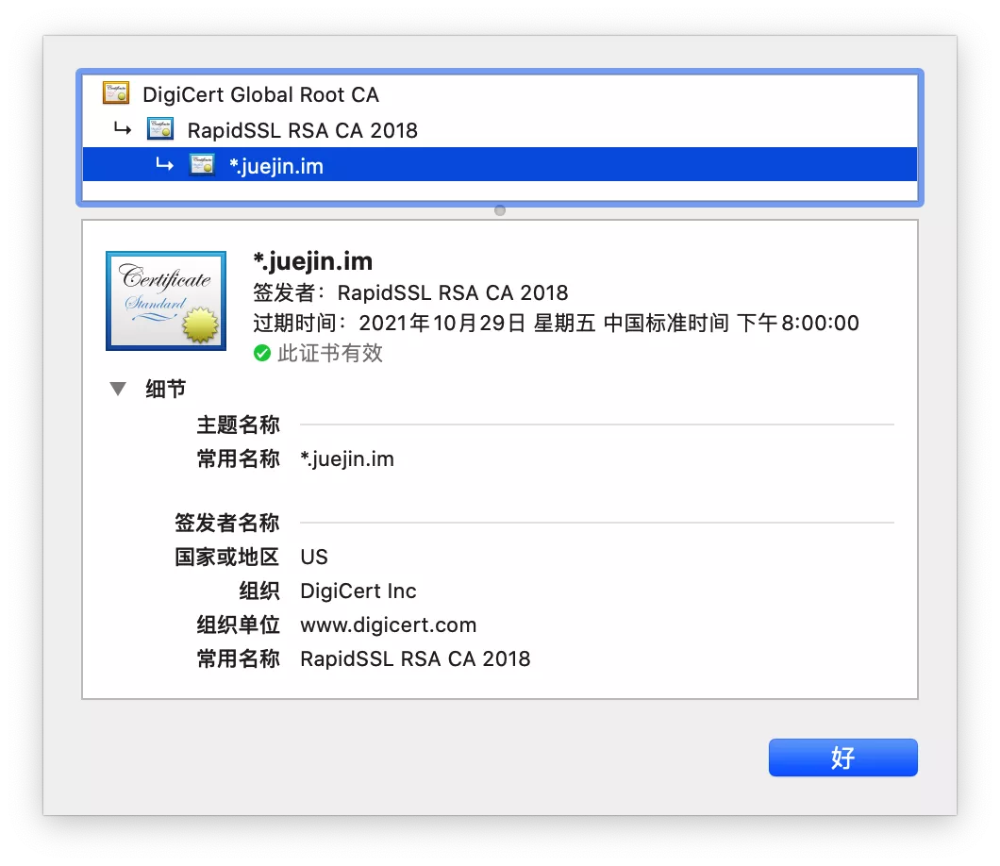

#### CA颁发机构

依然考虑**中间人攻击**的情况，非对称加密的算法都是**公开**的，所有人都可以自己生成一对公钥私钥。

当服务端向客户端返回公钥A1的时候，中间人将其**替换**成自己的公钥B1传送给浏览器。

而浏览器此时一无所知，傻乎乎地使用公钥B1加密了密钥K发送出去，又被**中间人截获**，中间人利用自己的私钥B2解密，得到密钥K，再使用服务端的公钥A1加密传送给服务端，完成了通信链路，而服务端和客户端毫无感知。

HTTPS中间人

出现这一问题的核心原因是**客户端无法确认收到的公钥是不是真的是服务端发来的**。为了解决这个问题，互联网引入了一个公信机构，这就是CA。

服务端在使用HTTPS前，去经过认证的CA机构申请颁发一份**数字证书**，数字证书里包含有证书持有者、证书有效期、公钥等信息，服务端将证书发送给客户端，客户端校验证书身份和要访问的网站身份确实一致后再进行后续的加密操作。

但是，如果中间人也聪明一点，**只改动了证书中的公钥部分**，客户端依然不能确认证书**是否被篡改**，这时我们就需要一些防伪技术了。

前面说过，非对称加密中一般公钥用来加密，私钥用来解密，虽然私钥加密理论上可行，但由于数学上的设计这么做并不适合，那么私钥就只有解密这个功能了么？

私钥除了解密外的真正用途其实还有一个，就是**数字签名**，其实就是一种防伪技术，只要有人篡改了证书，那么数字签名必然校验失败。具体过程如下

1. CA机构拥有自己的一对公钥和私钥
2. CA机构在颁发证书时对证书明文信息进行哈希
3. 将哈希值用私钥进行**加签**，得到数字签名

##### 明文数据和数字签名组成证书，传递给客户端。

1. 客户端得到证书，分解成明文部分Text和数字签名Sig1
2. 用CA机构的公钥进行**解签**，得到Sig2（由于CA机构是一种公信身份，因此在系统或浏览器中会内置CA机构的证书和公钥信息）
3. 用证书里声明的哈希算法对明文Text部分进行哈希得到H
4. 当自己计算得到的哈希值T与**解签**后的Sig2**相等**，表示证书可信，**没有被篡改**

这时，签名是由CA机构的私钥生成的，中间人篡改信息后无法拿到CA机构的私钥，保证了证书可信。

> 注意，这里有一个比较**难以理解**的地方，非对称加密的签名过程是，私钥将一段消息进行加签，然后将签名部分和消息本身一起发送给对方，收到消息后对签名部分利用公钥验签，如果验签出来的内容和消息本身一致，表明消息没有被篡改。

在这个过程中，系统或浏览器中内置的CA机构的证书和公钥成为了至关重要的环节，这也是CA机构公信身份的证明，如果系统或浏览器中没有这个CA机构，那么客户端可以不接受服务端传回的证书，显示HTTPS警告。

实际上CA机构的证书是一条信任链，A信任B，B信任C，以**掘金的证书**为例，掘金向RapidSSL申请一张证书，而RapidSSL的CA身份是由DigiCert Global根CA认证的，构成了一条信任链。

各级CA机构的私钥是绝对的私密信息，一旦CA机构的私钥泄露，其公信力就会一败涂地。之前就有过几次**CA机构私钥泄露**，引发信任危机，各大系统和浏览器只能纷纷吊销内置的对应CA的根证书。

有些老旧的网站会要求使用前下载安装他自己的根证书，这就是这个网站使用的证书并不能在系统内置的CA机构和根证书之间形成一条信任链，需要自己安装根证书来构成信任链，这里的风险就要**使用者自己承担**了。

证书明细

