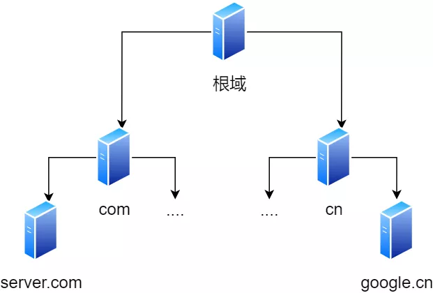
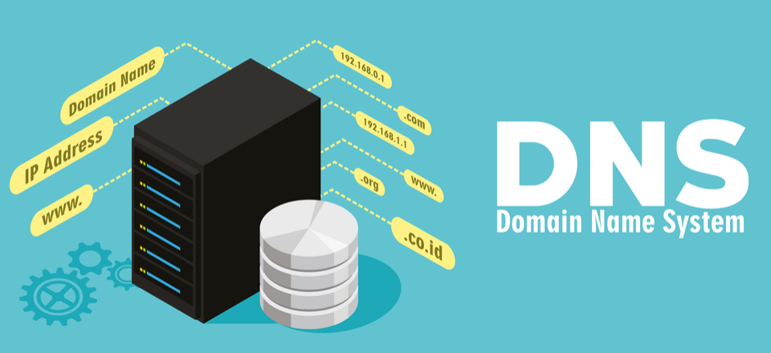
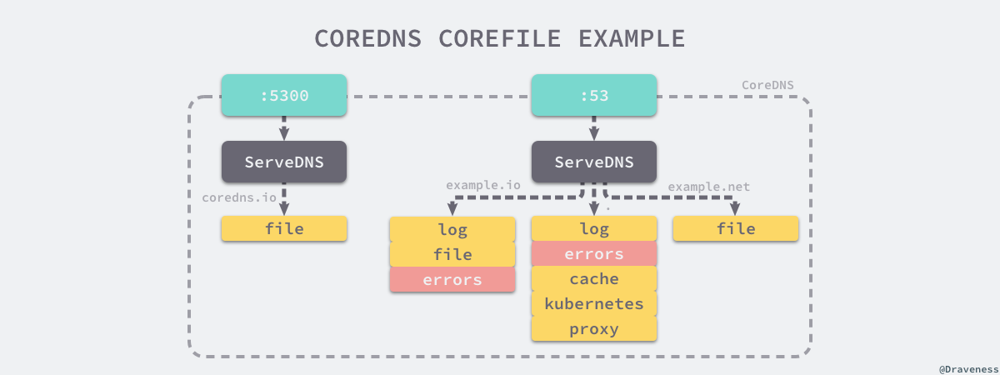

#### DNS

我们在上网的时候，通常使用的方式域名，而不是 IP 地址，因为域名方便人类记忆。

那么实现这一技术的就是 **DNS 域名解析**，DNS 可以将域名网址自动转换为具体的 IP 地址。

> 域名的层级关系

DNS 中的域名都是用**句点**来分隔的，比如 `www.server.com`，这里的句点代表了不同层次之间的**界限**。

在域名中，**越靠右**的位置表示其层级**越高**。

毕竟域名是外国人发明，所以思维和中国人相反，比如说一个城市地点的时候，外国喜欢从小到大的方式顺序说起（如 XX 街道 XX 区 XX 市 XX 省），而中国则喜欢从大到小的顺序（如 XX 省 XX 市 XX 区 XX 街道）。

根域是在最顶层，它的下一层就是 com 顶级域，再下面是 server.com。

所以域名的层级关系类似一个树状结构：

- 根 DNS 服务器
- 顶级域 DNS 服务器（com）
- 权威 DNS 服务器（server.com）

DNS 树状结构

根域的 DNS 服务器信息保存在互联网中所有的 DNS 服务器中。这样一来，任何 DNS 服务器就都可以找到并访问根域 DNS 服务器了。

因此，客户端只要能够找到任意一台 DNS 服务器，就可以通过它找到根域 DNS 服务器，然后再一路顺藤摸瓜找到位于下层的某台目标 DNS 服务器。

> 域名解析的工作流程

浏览器首先看一下自己的缓存里有没有，如果没有就向操作系统的缓存要，还没有就检查本机域名解析文件 `hosts`，如果还是没有，就会 DNS 服务器进行查询，查询的过程如下：

1. 客户端首先会发出一个 DNS 请求，问 www.server.com 的 IP 是啥，并发给本地 DNS 服务器（也就是客户端的 TCP/IP 设置中填写的 DNS 服务器地址）。
2. 本地域名服务器收到客户端的请求后，如果缓存里的表格能找到 www.server.com，则它直接返回 IP 地址。如果没有，本地 DNS 会去问它的根域名服务器：“老大， 能告诉我 www.server.com 的 IP 地址吗？” 根域名服务器是最高层次的，它不直接用于域名解析，但能指明一条道路。
3. 根 DNS 收到来自本地 DNS 的请求后，发现后置是 .com，说：“www.server.com 这个域名归 .com 区域管理”，我给你 .com 顶级域名服务器地址给你，你去问问它吧。”
4. 本地 DNS 收到顶级域名服务器的地址后，发起请求问“老二， 你能告诉我 www.server.com  的 IP 地址吗？”
5. 顶级域名服务器说：“我给你负责 www.server.com 区域的权威 DNS 服务器的地址，你去问它应该能问到”。
6. 本地 DNS 于是转向问权威 DNS 服务器：“老三，www.server.com对应的IP是啥呀？” server.com 的权威 DNS 服务器，它是域名解析结果的原出处。为啥叫权威呢？就是我的域名我做主。
7. 权威 DNS 服务器查询后将对应的 IP 地址 X.X.X.X 告诉本地 DNS。
8. 本地 DNS 再将 IP 地址返回客户端，客户端和目标建立连接。

至此，我们完成了 DNS 的解析过程。现在总结一下，整个过程我画成了一个图。

域名解析的工作流程

DNS 域名解析的过程蛮有意思的，整个过程就和我们日常生活中找人问路的过程类似，**只指路不带路**。

------

# 详解 DNS 与 CoreDNS 的实现原理

2018-11-07 [DNS](https://draveness.me/tags/dns) [CoreDNS](https://draveness.me/tags/coredns) [服务发现](https://draveness.me/tags/服务发现)

域名系统（Domain Name System）是整个互联网的电话簿，它能够将可被人理解的域名翻译成可被机器理解 IP 地址，使得互联网的使用者不再需要直接接触很难阅读和理解的 IP 地址。


我们在这篇文章中的第一部分会介绍 DNS 的工作原理以及一些常见的 DNS 问题，而第二部分会介绍 DNS 服务 [CoreDNS](https://github.com/coredns/coredns) 的架构和实现原理。

## DNS

域名系统在现在的互联网中非常重要，因为服务器的 IP 地址可能会经常变动，如果没有了 DNS，那么可能 IP 地址一旦发生了更改，当前服务器的客户端就没有办法连接到目标的服务器了，如果我们为 IP 地址提供一个『别名』并在其发生变动时修改别名和 IP 地址的关系，那么我们就可以保证集群对外提供的服务能够相对稳定地被其他客户端访问。



DNS 其实就是一个分布式的树状命名系统，它就像一个去中心化的分布式数据库，存储着从域名到 IP 地址的映射。

### 工作原理

在我们对 DNS 有了简单的了解之后，接下来我们就可以进入 DNS 工作原理的部分了，作为用户访问互联网的第一站，当一台主机想要通过域名访问某个服务的内容时，需要先通过当前域名获取对应的 IP 地址。这时就需要通过一个 DNS 解析器负责域名的解析，下面的图片展示了 DNS 查询的执行过程：


1. 本地的 DNS 客户端向 DNS 解析器发出解析 draveness.me 域名的请求；
2. DNS 解析器首先会向就近的根 DNS 服务器 `.` 请求顶级域名 DNS 服务的地址；
3. 拿到顶级域名 DNS 服务 `me.` 的地址之后会向顶级域名服务请求负责 `dravenss.me.` 域名解析的命名服务；
4. 得到授权的 DNS 命名服务时，就可以根据请求的具体的主机记录直接向该服务请求域名对应的 IP 地址；

DNS 客户端接受到 IP 地址之后，整个 DNS 解析的过程就结束了，客户端接下来就会通过当前的 IP 地址直接向服务器发送请求。

对于 DNS 解析器，这里使用的 DNS 查询方式是*迭代查询*，每个 DNS 服务并不会直接返回 DNS 信息，而是会返回另一台 DNS 服务器的位置，由客户端依次询问不同级别的 DNS 服务直到查询得到了预期的结果；另一种查询方式叫做*递归查询*，也就是 DNS 服务器收到客户端的请求之后会直接返回准确的结果，如果当前服务器没有存储 DNS 信息，就会访问其他的服务器并将结果返回给客户端。

### 域名层级

域名层级是一个层级的树形结构，树的最顶层是根域名，一般使用 `.` 来表示，这篇文章所在的域名一般写作 `draveness.me`，但是这里的写法其实省略了最后的 `.`，也就是全称域名（FQDN）`dravenss.me.`。


根域名下面的就是 `com`、`net` 和 `me` 等顶级域名以及次级域名 `draveness.me`，我们一般在各个域名网站中购买和使用的都是次级域名、子域名和主机名了。

### 域名服务器

既然域名的命名空间是树形的，那么用于处理域名解析的 DNS 服务器也是树形的，只是在树的组织和每一层的职责上有一些不同。DNS 解析器从根域名服务器查找到顶级域名服务器的 IP 地址，又从顶级域名服务器查找到权威域名服务器的 IP 地址，最终从权威域名服务器查出了对应服务的 IP 地址。

```bash
$ dig -t A draveness.me +trace
```

Bash

我们可以使用 dig 命令追踪 `draveness.me` 域名对应 IP 地址是如何被解析出来的，首先会向预置的 13 组根域名服务器发出请求获取顶级域名的地址：

```text
.			56335	IN	NS	m.root-servers.net.
.			56335	IN	NS	b.root-servers.net.
.			56335	IN	NS	c.root-servers.net.
.			56335	IN	NS	d.root-servers.net.
.			56335	IN	NS	e.root-servers.net.
.			56335	IN	NS	f.root-servers.net.
.			56335	IN	NS	g.root-servers.net.
.			56335	IN	NS	h.root-servers.net.
.			56335	IN	NS	i.root-servers.net.
.			56335	IN	NS	a.root-servers.net.
.			56335	IN	NS	j.root-servers.net.
.			56335	IN	NS	k.root-servers.net.
.			56335	IN	NS	l.root-servers.net.
.			56335	IN	RRSIG	NS 8 0 518400 20181111050000 20181029040000 2134 . G4NbgLqsAyin2zZFetV6YhBVVI29Xi3kwikHSSmrgkX+lq3sRgp3UuQ3 JQxpJ+bZY7mwzo3NxZWy4pqdJDJ55s92l+SKRt/ruBv2BCnk9CcnIzK+ OuGheC9/Coz/r/33rpV63CzssMTIAAMQBGHUyFvRSkiKJWFVOps7u3TM jcQR0Xp+rJSPxA7f4+tDPYohruYm0nVXGdWhO1CSadXPvmWs1xeeIKvb 9sXJ5hReLw6Vs6ZVomq4tbPrN1zycAbZ2tn/RxGSCHMNIeIROQ99kO5N QL9XgjIJGmNVDDYi4OF1+ki48UyYkFocEZnaUAor0pD3Dtpis37MASBQ fr6zqQ==
;; Received 525 bytes from 8.8.8.8#53(8.8.8.8) in 247 ms
```

Text

> 根域名服务器是 DNS 中最高级别的域名服务器，这些服务器负责返回顶级域的权威域名服务器地址，这些域名服务器的数量总共有 13 组，域名的格式从上面返回的结果可以看到是 `.root-servers.net`，每个根域名服务器中只存储了顶级域服务器的 IP 地址，大小其实也只有 2MB 左右，虽然域名服务器总共只有 13 组，但是每一组服务器都通过提供了镜像服务，全球大概也有几百台的根域名服务器在运行。

在这里，我们获取到了以下的 5 条 NS 记录，也就是 5 台 `me.` 定义域名 DNS 服务器：

```text
me.			172800	IN	NS	b0.nic.me.
me.			172800	IN	NS	a2.nic.me.
me.			172800	IN	NS	b2.nic.me.
me.			172800	IN	NS	a0.nic.me.
me.			172800	IN	NS	c0.nic.me.
me.			86400	IN	DS	2569 7 1 09BA1EB4D20402620881FD9848994417800DB26A
me.			86400	IN	DS	2569 7 2 94E798106F033500E67567B197AE9132C0E916764DC743C55A9ECA3C 7BF559E2
me.			86400	IN	RRSIG	DS 8 1 86400 20181113050000 20181031040000 2134 . O81bud61Qh+kJJ26XHzUOtKWRPN0GHoVDacDZ+pIvvD6ef0+HQpyT5nV rhEZXaFwf0YFo08PUzX8g5Pad8bpFj0O//Q5H2awGbjeoJnlMqbwp6Kl 7O9zzp1YCKmB+ARQgEb7koSCogC9pU7E8Kw/o0NnTKzVFmLq0LLQJGGE Y43ay3Ew6hzpG69lP8dmBHot3TbF8oFrlUzrm5nojE8W5QVTk1QQfrZM 90WBjfe5nm9b4BHLT48unpK3BaqUFPjqYQV19C3xJ32at4OwUyxZuQsa GWl0w9R5TiCTS5Ieupu+Q9fLZbW5ZMEgVSt8tNKtjYafBKsFox3cSJRn irGOmg==
;; Received 721 bytes from 192.36.148.17#53(i.root-servers.net) in 59 ms
```

Text

当 DNS 解析器从根域名服务器中查询到了顶级域名 `.me` 服务器的地址之后，就可以访问这些顶级域名服务器其中的一台 `b2.nic.me` 获取权威 DNS 的服务器的地址了：

```text
draveness.me.		86400	IN	NS	f1g1ns1.dnspod.net.
draveness.me.		86400	IN	NS	f1g1ns2.dnspod.net.
fsip6fkr2u8cf2kkg7scot4glihao6s1.me. 8400 IN NSEC3 1 1 1 D399EAAB FSJJ1I3A2LHPTHN80MA6Q7J64B15AO5K  NS SOA RRSIG DNSKEY NSEC3PARAM
fsip6fkr2u8cf2kkg7scot4glihao6s1.me. 8400 IN RRSIG NSEC3 7 2 8400 20181121151954 20181031141954 2208 me. eac6+fEuQ6gK70KExV0EdUKnWeqPrzjqGiplqMDPNRpIRD1vkpX7Zd6C oN+c8b2yLoI3s3oLEoUd0bUi3dhyCrxF5n6Ap+sKtEv4zZ7o7CEz5Fw+ fpXHj7VeL+pI8KffXcgtYQGlPlCM/ylGUGYOcExrB/qPQ6f/62xrPWjb +r4=
qcolpi5mj0866sefv2jgp4jnbtfrehej.me. 8400 IN NSEC3 1 1 1 D399EAAB QD4QM6388QN4UMH78D429R72J1NR0U07  NS DS RRSIG
qcolpi5mj0866sefv2jgp4jnbtfrehej.me. 8400 IN RRSIG NSEC3 7 2 8400 20181115151844 20181025141844 2208 me. rPGaTz/LyNRVN3LQL3LO1udby0vy/MhuIvSjNfrNnLaKARsbQwpq2pA9 +jyt4ah8fvxRkGg9aciG1XSt/EVIgdLSKXqE82hB49ZgYDACX6onscgz naQGaCAbUTSGG385MuyxCGvqJdE9kEZBbCG8iZhcxSuvBksG4msWuo3k dTg=
;; Received 586 bytes from 199.249.127.1#53(b2.nic.me) in 267 ms
```

Text

这里的权威 DNS 服务是作者在域名提供商进行配置的，当有客户端请求 `draveness.me` 域名对应的 IP 地址时，其实会从作者使用的 DNS 服务商 DNSPod 处请求服务的 IP 地址：

```text
draveness.me.		600	IN	A	123.56.94.228
draveness.me.		86400	IN	NS	f1g1ns2.dnspod.net.
draveness.me.		86400	IN	NS	f1g1ns1.dnspod.net.
;; Received 123 bytes from 58.247.212.36#53(f1g1ns1.dnspod.net) in 28 ms
```

Text

最终，DNS 解析器从 `f1g1ns1.dnspod.net` 服务中获取了当前博客的 IP 地址 `123.56.94.228`，浏览器或者其他设备就能够通过 IP 向服务器获取请求的内容了。

从整个解析过程，我们可以看出 DNS 域名服务器大体分成三类，根域名服务、顶级域名服务以及权威域名服务三种，获取域名对应的 IP 地址时，也会像遍历一棵树一样按照从顶层到底层的顺序依次请求不同的服务器。

### 胶水记录

在通过服务器解析域名的过程中，我们看到当请求 `me.` 顶级域名服务器的时候，其实返回了 `b0.nic.me` 等域名：

```text
me.			172800	IN	NS	b0.nic.me.
me.			172800	IN	NS	a2.nic.me.
me.			172800	IN	NS	b2.nic.me.
me.			172800	IN	NS	a0.nic.me.
me.			172800	IN	NS	c0.nic.me.
...
```

Text

就像我们最开始说的，在互联网中想要请求服务，最终一定需要获取 IP 提供服务的服务器的 IP 地址；同理，作为 `b0.nic.me` 作为一个 DNS 服务器，我也必须获取它的 IP 地址才能获得次级域名的 DNS 信息，但是这里就陷入了一种循环：

1. 如果想要获取 `dravenss.me` 的 IP 地址，就需要访问 `me` 顶级域名服务器 `b0.nic.me`
2. 如果想要获取 `b0.nic.me` 的 IP 地址，就需要访问 `me` 顶级域名服务器 `b0.nic.me`
3. 如果想要获取 `b0.nic.me` 的 IP 地址，就需要访问 `me` 顶级域名服务器 `b0.nic.me`
4. …

为了解决这一个问题，我们引入了胶水记录（Glue Record）这一概念，也就是在出现循环依赖时，直接在上一级作用域返回 DNS 服务器的 IP 地址：

```text
$ dig +trace +additional draveness.me

...

me.			172800	IN	NS	a2.nic.me.
me.			172800	IN	NS	b2.nic.me.
me.			172800	IN	NS	b0.nic.me.
me.			172800	IN	NS	a0.nic.me.
me.			172800	IN	NS	c0.nic.me.
me.			86400	IN	DS	2569 7 1 09BA1EB4D20402620881FD9848994417800DB26A
me.			86400	IN	DS	2569 7 2 94E798106F033500E67567B197AE9132C0E916764DC743C55A9ECA3C 7BF559E2
me.			86400	IN	RRSIG	DS 8 1 86400 20181116050000 20181103040000 2134 . cT+rcDNiYD9X02M/NoSBombU2ZqW/7WnEi+b/TOPcO7cDbjb923LltFb ugMIaoU0Yj6k0Ydg++DrQOy6E5eeshughcH/6rYEbVlFcsIkCdbd9gOk QkOMH+luvDjCRdZ4L3MrdXZe5PJ5Y45C54V/0XUEdfVKel+NnAdJ1gLE F+aW8LKnVZpEN/Zu88alOBt9+FPAFfCRV9uQ7UmGwGEMU/WXITheRi5L h8VtV9w82E6Jh9DenhVFe2g82BYu9MvEbLZr3MKII9pxgyUE3pt50wGY Mhs40REB0v4pMsEU/KHePsgAfeS/mFSXkiPYPqz2fgke6OHFuwq7MgJk l7RruQ==
a0.nic.me.		172800	IN	A	199.253.59.1
a2.nic.me.		172800	IN	A	199.249.119.1
b0.nic.me.		172800	IN	A	199.253.60.1
b2.nic.me.		172800	IN	A	199.249.127.1
c0.nic.me.		172800	IN	A	199.253.61.1
a0.nic.me.		172800	IN	AAAA	2001:500:53::1
a2.nic.me.		172800	IN	AAAA	2001:500:47::1
b0.nic.me.		172800	IN	AAAA	2001:500:54::1
b2.nic.me.		172800	IN	AAAA	2001:500:4f::1
c0.nic.me.		172800	IN	AAAA	2001:500:55::1
;; Received 721 bytes from 192.112.36.4#53(g.root-servers.net) in 110 ms

...
```

Text

也就是同时返回 NS 记录和 A（或 AAAA） 记录，这样就能够解决域名解析出现的循环依赖问题。

### 服务发现

讲到现在，我们其实能够发现 DNS 就是一种最早的服务发现的手段，通过虽然服务器的 IP 地址可能会经常变动，但是通过相对不会变动的域名，我们总是可以找到提供对应服务的服务器。

在微服务架构中，服务注册的方式其实大体上也只有两种，一种是使用 Zookeeper 和 etcd 等配置管理中心，另一种是使用 DNS 服务，比如说 Kubernetes 中的 CoreDNS 服务。

使用 DNS 在集群中做服务发现其实是一件比较容易的事情，这主要是因为绝大多数的计算机上都会安装 DNS 服务，所以这其实就是一种内置的、默认的服务发现方式，不过使用 DNS 做服务发现也会有一些问题，因为在默认情况下 DNS 记录的失效时间是 600s，这对于集群来讲其实并不是一个可以接受的时间，在实践中我们往往会启动单独的 DNS 服务满足服务发现的需求。

## CoreDNS

CoreDNS 其实就是一个 DNS 服务，而 DNS 作为一种常见的服务发现手段，所以很多开源项目以及工程师都会使用 CoreDNS 为集群提供服务发现的功能，Kubernetes 就在集群中使用 CoreDNS 解决服务发现的问题。


作为一个加入 CNCF(Cloud Native Computing Foundation) 的服务 CoreDNS 的实现可以说的非常的简单。

### 架构

整个 CoreDNS 服务都建立在一个使用 Go 编写的 HTTP/2 Web 服务器 [Caddy · GitHub](https://github.com/mholt/caddy) 上，CoreDNS 整个项目可以作为一个 Caddy 的教科书用法。


CoreDNS 的大多数功能都是由插件来实现的，插件和服务本身都使用了 Caddy 提供的一些功能，所以项目本身也不是特别的复杂。

#### 插件

作为基于 Caddy 的 Web 服务器，CoreDNS 实现了一个插件链的架构，将很多 DNS 相关的逻辑都抽象成了一层一层的插件，包括 Kubernetes 等功能，每一个插件都是一个遵循如下协议的结构体：

```go
type (
	Plugin func(Handler) Handler

	Handler interface {
		ServeDNS(context.Context, dns.ResponseWriter, *dns.Msg) (int, error)
		Name() string
	}
)
```

Go

所以只需要为插件实现 `ServeDNS` 以及 `Name` 这两个接口并且写一些用于配置的代码就可以将插件集成到 CoreDNS 中。

#### Corefile

另一个 CoreDNS 的特点就是它能够通过简单易懂的 DSL 定义 DNS 服务，在 Corefile 中就可以组合多个插件对外提供服务：

```go
coredns.io:5300 {
    file db.coredns.io
}

example.io:53 {
    log
    errors
    file db.example.io
}

example.net:53 {
    file db.example.net
}

.:53 {
    kubernetes
    proxy . 8.8.8.8
    log
    errors
    cache
}
```

Go

对于以上的配置文件，CoreDNS 会根据每一个代码块前面的区和端点对外暴露两个端点提供服务：



该配置文件对外暴露了两个 DNS 服务，其中一个监听在 5300 端口，另一个在 53 端口，请求这两个服务时会根据不同的域名选择不同区中的插件进行处理。

### 原理

CoreDNS 可以通过四种方式对外直接提供 DNS 服务，分别是 UDP、gRPC、HTTPS 和 TLS：


但是无论哪种类型的 DNS 服务，最终都会调用以下的 `ServeDNS` 方法，为服务的调用者提供 DNS 服务：

```go
func (s *Server) ServeDNS(ctx context.Context, w dns.ResponseWriter, r *dns.Msg) {
	m, _ := edns.Version(r)

	ctx, _ := incrementDepthAndCheck(ctx)

	b := r.Question[0].Name
	var off int
	var end bool

	var dshandler *Config

	w = request.NewScrubWriter(r, w)

	for {
		if h, ok := s.zones[string(b[:l])]; ok {
			ctx = context.WithValue(ctx, plugin.ServerCtx{}, s.Addr)
			if r.Question[0].Qtype != dns.TypeDS {
				rcode, _ := h.pluginChain.ServeDNS(ctx, w, r)
 			dshandler = h
		}
		off, end = dns.NextLabel(q, off)
		if end {
			break
		}
	}

	if r.Question[0].Qtype == dns.TypeDS && dshandler != nil && dshandler.pluginChain != nil {
		rcode, _ := dshandler.pluginChain.ServeDNS(ctx, w, r)
		plugin.ClientWrite(rcode)
		return
	}

	if h, ok := s.zones["."]; ok && h.pluginChain != nil {
		ctx = context.WithValue(ctx, plugin.ServerCtx{}, s.Addr)

		rcode, _ := h.pluginChain.ServeDNS(ctx, w, r)
		plugin.ClientWrite(rcode)
		return
	}
}
```

Go

在上述这个已经被简化的复杂函数中，最重要的就是调用了『插件链』的 `ServeDNS` 方法，将来源的请求交给一系列插件进行处理，如果我们使用以下的文件作为 Corefile：

```text
example.org {
    file /usr/local/etc/coredns/example.org
    prometheus     # enable metrics
    errors         # show errors
    log            # enable query logs
}
```

Text

那么在 CoreDNS 服务启动时，对于当前的 `example.org` 这个组，它会依次加载 `file`、`log`、`errors` 和 `prometheus` 几个插件，这里的顺序是由 zdirectives.go 文件定义的，启动的顺序是从下到上：

```go
var Directives = []string{
  // ...
	"prometheus",
	"errors",
	"log",
  // ...
	"file",
  // ...
	"whoami",
	"on",
}
```

Go

因为启动的时候会按照从下到上的顺序依次『包装』每一个插件，所以在真正调用时就是从上到下执行的，这就是因为 `NewServer` 方法中对插件进行了组合：

```go
func NewServer(addr string, group []*Config) (*Server, error) {
	s := &Server{
		Addr:        addr,
		zones:       make(map[string]*Config),
		connTimeout: 5 * time.Second,
	}

	for _, site := range group {
		s.zones[site.Zone] = site
		if site.registry != nil {
			for name := range enableChaos {
				if _, ok := site.registry[name]; ok {
					s.classChaos = true
					break
				}
			}
		}
		var stack plugin.Handler
		for i := len(site.Plugin) - 1; i >= 0; i-- {
			stack = site.Plugin[i](stack)
			site.registerHandler(stack)
		}
		site.pluginChain = stack
	}

	return s, nil
}
```

Go

对于 Corefile 里面的每一个配置组，`NewServer` 都会讲配置组中提及的插件按照一定的顺序组合起来，原理跟 Rack Middleware 的机制非常相似，插件 `Plugin` 其实就是一个出入参数都是 `Handler` 的函数：

```go
type (
	Plugin func(Handler) Handler

	Handler interface {
		ServeDNS(context.Context, dns.ResponseWriter, *dns.Msg) (int, error)
		Name() string
	}
)
```

Go

所以我们可以将它们叠成堆栈的方式对它们进行操作，这样在最后就会形成一个插件的调用链，在每个插件执行方法时都可以通过 `NextOrFailure` 函数调用下一个插件的 `ServerDNS` 方法：

```go
func NextOrFailure(name string, next Handler, ctx context.Context, w dns.ResponseWriter, r *dns.Msg) (int, error) {
	if next != nil {
		if span := ot.SpanFromContext(ctx); span != nil {
			child := span.Tracer().StartSpan(next.Name(), ot.ChildOf(span.Context()))
			defer child.Finish()
			ctx = ot.ContextWithSpan(ctx, child)
		}
		return next.ServeDNS(ctx, w, r)
	}

	return dns.RcodeServerFailure, Error(name, errors.New("no next plugin found"))
}
```

Go

除了通过 `ServeDNS` 调用下一个插件之外，我们也可以调用 `WriteMsg` 方法并结束整个调用链。


从插件的堆叠到顺序调用以及错误处理，我们对 CoreDNS 的工作原理已经非常清楚了，接下来我们可以简单介绍几个插件的作用。

#### loadbalance

loadbalance 这个插件的名字就告诉我们，使用这个插件能够提供基于 DNS 的负载均衡功能，在 `setup` 中初始化时传入了 `RoundRobin` 结构体：

```go
func setup(c *caddy.Controller) error {
	err := parse(c)
	if err != nil {
		return plugin.Error("loadbalance", err)
	}

	dnsserver.GetConfig(c).AddPlugin(func(next plugin.Handler) plugin.Handler {
		return RoundRobin{Next: next}
	})

	return nil
}
```

Go

当用户请求 CoreDNS 服务时，我们会根据插件链调用 loadbalance 这个包中的 `ServeDNS` 方法，在方法中会改变用于返回响应的 `Writer`：

```go
func (rr RoundRobin) ServeDNS(ctx context.Context, w dns.ResponseWriter, r *dns.Msg) (int, error) {
	wrr := &RoundRobinResponseWriter{w}
	return plugin.NextOrFailure(rr.Name(), rr.Next, ctx, wrr, r)
}
```

Go

所以在最终服务返回响应时，会通过 `RoundRobinResponseWriter` 的 `WriteMsg` 方法写入 DNS 消息：

```go
func (r *RoundRobinResponseWriter) WriteMsg(res *dns.Msg) error {
	if res.Rcode != dns.RcodeSuccess {
		return r.ResponseWriter.WriteMsg(res)
	}

	res.Answer = roundRobin(res.Answer)
	res.Ns = roundRobin(res.Ns)
	res.Extra = roundRobin(res.Extra)

	return r.ResponseWriter.WriteMsg(res)
}
```

Go

上述方法会将响应中的 `Answer`、`Ns` 以及 `Extra` 几个字段中数组的顺序打乱：

```go
func roundRobin(in []dns.RR) []dns.RR {
	cname := []dns.RR{}
	address := []dns.RR{}
	mx := []dns.RR{}
	rest := []dns.RR{}
	for _, r := range in {
		switch r.Header().Rrtype {
		case dns.TypeCNAME:
			cname = append(cname, r)
		case dns.TypeA, dns.TypeAAAA:
			address = append(address, r)
		case dns.TypeMX:
			mx = append(mx, r)
		default:
			rest = append(rest, r)
		}
	}

	roundRobinShuffle(address)
	roundRobinShuffle(mx)

	out := append(cname, rest...)
	out = append(out, address...)
	out = append(out, mx...)
	return out
}
```

Go

打乱后的 DNS 记录会被原始的 `ResponseWriter` 结构写回到 DNS 响应中。

#### loop

loop 插件会检测 DNS 解析过程中出现的简单循环依赖，如果我们在 Corefile 中添加如下的内容并启动 CoreDNS 服务，CoreDNS 会向自己发送一个 DNS 查询，看最终是否会陷入循环：

```text
. {
    loop
    forward . 127.0.0.1
}
```

Text

在 CoreDNS 启动时，它会在 `setup` 方法中调用 `Loop.exchange` 方法向自己查询一个随机域名的 DNS 记录：

```go
func (l *Loop) exchange(addr string) (*dns.Msg, error) {
	m := new(dns.Msg)
	m.SetQuestion(l.qname, dns.TypeHINFO)
	return dns.Exchange(m, addr)
}
```

Go

如果这个随机域名在 `ServeDNS` 方法中被查询了两次，那么就说明当前的 DNS 请求陷入了循环需要终止：

```go
func (l *Loop) ServeDNS(ctx context.Context, w dns.ResponseWriter, r *dns.Msg) (int, error) {
	if r.Question[0].Qtype != dns.TypeHINFO {
		return plugin.NextOrFailure(l.Name(), l.Next, ctx, w, r)
	}

	// ...

	if state.Name() == l.qname {
		l.inc()
	}

	if l.seen() > 2 {
		log.Fatalf("Forwarding loop detected in \"%s\" zone. Exiting. See https://coredns.io/plugins/loop#troubleshooting. Probe query: \"HINFO %s\".", l.zone, l.qname)
	}

	return plugin.NextOrFailure(l.Name(), l.Next, ctx, w, r)
}
```

Go

就像 loop 插件的 README 中写的，这个插件只能够检测一些简单的由于配置造成的循环问题，复杂的循环问题并不能通过当前的插件解决。

### 总结

如果想要在分布式系统实现服务发现的功能，DNS 以及 CoreDNS 其实是一个非常好的选择，CoreDNS 作为一个已经进入 CNCF 并且在 Kubernetes 中作为 DNS 服务使用的应用，其本身的稳定性和可用性已经得到了证明，同时它基于插件实现的方式非常轻量并且易于使用，插件链的使用也使得第三方插件的定义变得非常的方便。

## 相关文章



## References

- [What is DNS? How DNS works](https://www.cloudflare.com/learning/dns/what-is-dns/)
- [移动互联网时代，如何优化你的网络 —— 域名解析篇](https://yq.aliyun.com/articles/58967)
- [How Queries Are Processed in CoreDNS](https://coredns.io/2017/06/08/how-queries-are-processed-in-coredns/)
- [Domain Name System](https://en.wikipedia.org/wiki/Domain_Name_System)
- [DOMAIN NAMES - IMPLEMENTATION AND SPECIFICATION · RFC1035](https://www.ietf.org/rfc/rfc1035.txt)
- [A fun and colorful explanation of how DNS works.](https://howdns.works/)
- [Root Servers](https://www.iana.org/domains/root/servers)
- [What is the DNS Protocol?](https://ns1.com/resources/dns-protocol)
- [Root name server · Wikipedia](https://en.wikipedia.org/wiki/Root_name_server)
- [CoreDNS for Kubernetes Service Discovery, Take 2](https://coredns.io/2017/03/01/coredns-for-kubernetes-service-discovery-take-2/)
- [Kubernetes DNS-Based Service Discovery](https://github.com/kubernetes/dns/blob/master/docs/specification.md)
- [CoreDNS Manual](https://coredns.io/manual/toc/#plugins)