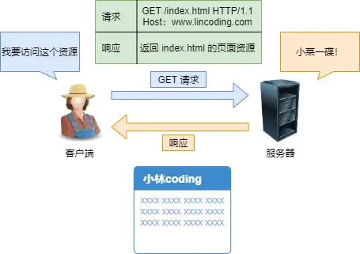
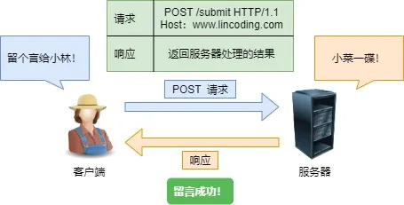

### GET 与 POST

> 说一下 GET 和 POST 的区别？

`Get` 方法的含义是请求**从服务器获取资源**，这个资源可以是静态的文本、页面、图片视频等。

比如，你打开我的文章，浏览器就会发送 GET 请求给服务器，服务器就会返回文章的所有文字及资源。

而`POST` 方法则是相反操作，它向 `URI` 指定的资源提交数据，数据就放在报文的 body 里。

比如，你在我文章底部，敲入了留言后点击「提交」（**暗示你们留言**），浏览器就会执行一次 POST 请求，把你的留言文字放进了报文 body 里，然后拼接好 POST 请求头，通过 TCP 协议发送给服务器。

POST 请求

> GET 和 POST 方法都是安全和幂等的吗？

先说明下安全和幂等的概念：

- 在 HTTP 协议里，所谓的「安全」是指请求方法不会「破坏」服务器上的资源。
- 所谓的「幂等」，意思是多次执行相同的操作，结果都是「相同」的。

那么很明显 **GET 方法就是安全且幂等的**，因为它是「只读」操作，无论操作多少次，服务器上的数据都是安全的，且每次的结果都是相同的。

**POST** 因为是「新增或提交数据」的操作，会修改服务器上的资源，所以是**不安全**的，且多次提交数据就会创建多个资源，所以**不是幂等**的。

------

> 14、Get与POST的区别

（1）GET 一般用来从服务器上获取资源，POST 一般用来创建资源；

（2）GET 是幂等的，即读取同一个资源，总是得到相同的数据，而 POST 不是幂等的。GET 不会改变服务器上的资源，而 POST 会对服务器资源进行改变；

（3）从请求参数形式上看，GET 请求的数据会附在`URL之后`；而 POST 请求会把提交的数据则放置在是HTTP请求报文的`请求体`中。

（4）POST 的安全性要比 GET 的安全性高，因为 GET 请求提交的数据将明文出现在 URL 上，而 POST 请求参数则被包装到请求体中，相对更安全。

（5）GET 请求的长度受限于浏览器或服务器对URL长度的限制，允许发送的数据量比较小，而POST请求则是没有大小限制的。

------

GET和POST是HTTP请求的两种基本方法，要说他们的区别，接触过WEB开发的人都能说出一二。

最直观的区别就是GET把参数包含在URL中，POST通过request body传递参数。

你可能自己写过无数个GET和POST请求，或者已经看过很多权威网站总结出的他们的区别，你非常清楚的知道什么时候该用什么。

当你在面试中遇到这个问题时，你的内心充满了喜悦。

你轻轻松松的给出了一个“标准答案”：
1、GET在浏览器回退时是无害的，而POST会再次提交请求。
2、GET产生的URL地址可以被Bookmark，而POST不可以。
3、GET请求会被浏览器主动cache，而POST不会，除非手动设置。
4、GET请求的参数会完整的被保存在历史记录里，POST不会。
5、GET请求参数放在URL中，POST放在request body中。
6、GET请求只能进行url编码，POST请求支持多种编码方式。
7、对于参数类型，GET只接受ASCII字符，而POST没有限制。
8、GET请求在URL中传递的参数是有长度限制的，而POST没有。
9、GET比POST更不安全，因为参数直接暴露在URL中，所以不能传递敏感信息。

but，这不是我们想要的回答！！！！

请告诉我真想….
如果我告诉你GET和POST本质上没有区别，你信吗？

GET和POST是什么？
HTTP中两种发送请求的方法。

HTTP是什么？
HTTP是基于TCP/IP的关于数据如何在万维网中传递的通信协议。

HTTP的底层是TCP/IP，所以GET和POST底层也是TCP/IP，也就是说GET和POST都是TCP链接。GET和POST能做的事情是一样的。你要给GET加上request body或者给POST带上url参数技术上是完全行的通的。

在我大万维网世界中，TCP就像汽车，我们用TCP来运输数据，它很可靠，从来不会发生丢件少件的现象。但是如果路上跑的全是看起来一模一样的汽车，那这个世界看起来是一团混乱，送急件的汽车可能被前面满载货物的汽车拦堵在路上，整个交通系统一定会瘫痪。为了避免这种情况发生，交通规则HTTP诞生了。HTTP给汽车运输设定了好几个服务类别，有GET, POST, PUT, DELETE等等，HTTP规定，当执行GET请求的时候，要给汽车贴上GET的标签（设置method为GET），而且要求把传送的数据放在车顶上（url中）以方便记录。如果是POST请求，就要在车上贴上POST的标签，并把货物放在车厢里。当然，你也可以在GET的时候往车厢内偷偷藏点货物，但是这是很不光彩；也可以在POST的时候在车顶上也放一些数据，让人觉得傻乎乎的。HTTP只是个行为准则，而TCP才是GET和POST怎么实现的基本。

但是，我们只看到HTTP对GET和POST参数的传送渠道（url还是requrest body）提出了要求。“标准答案”里关于参数大小的限制又是从哪来的呢？

在我大万维网世界中，还有另一个重要的角色：运输公司。不同的浏览器（发起http请求）和服务器（接受http请求）就是不同的运输公司。 虽然理论上，你可以在车顶上无限的堆货物（url中无限加参数）。但是运输公司可不傻，装货和卸货也是有很大成本的，他们会限制单次运输量来控制风险，数据量太大对浏览器和服务器都是很大负担。业界不成文的规定是，（大多数）浏览器通常都会限制url长度在2K个字节，而（大多数）服务器最多处理64K大小的url。超过的部分，恕不处理。如果你用GET服务，在request body偷偷藏了数据，不同服务器的处理方式也是不同的，有些服务器会帮你卸货，读出数据，有些服务器直接忽略，所以，虽然GET可以带request body，也不能保证一定能被接收到哦。

好了，现在你知道，GET和POST本质上就是TCP链接，并无差别。但是由于HTTP的规定和浏览器/服务器的限制，导致他们在应用过程中体现出一些不同。

GET和POST还有一个重大区别，简单的说：
GET产生一个TCP数据包；POST产生两个TCP数据包。

长的说：
对于GET方式的请求，浏览器会把http header和data一并发送出去，服务器响应200（返回数据）；
而对于POST，浏览器先发送header，服务器响应100 continue，浏览器再发送data，服务器响应200 ok（返回数据）。

也就是说，GET只需要汽车跑一趟就把货送到了，而POST得跑两趟，第一趟，先去和服务器打个招呼“嗨，我等下要送一批货来，你们打开门迎接我”，然后再回头把货送过去。

因为POST需要两步，时间上消耗的要多一点，看起来GET比POST更有效。因此Yahoo团队有推荐用GET替换POST来优化网站性能。但这是一个坑！跳入需谨慎。为什么？

GET与POST都有自己的语义，不能随便混用。
据研究，在网络环境好的情况下，发一次包的时间和发两次包的时间差别基本可以无视。而在网络环境差的情况下，两次包的TCP在验证数据包完整性上，有非常大的优点。
并不是所有浏览器都会在POST中发送两次包，Firefox就只发送一次。