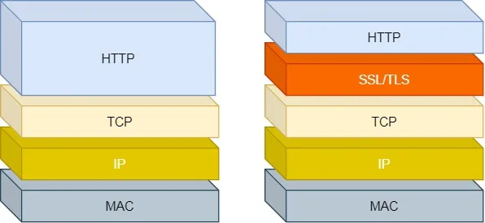
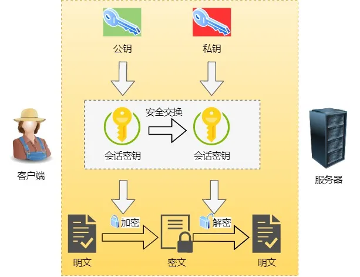
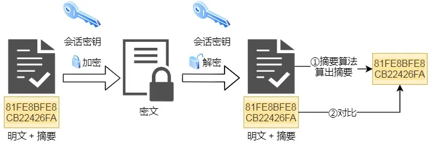
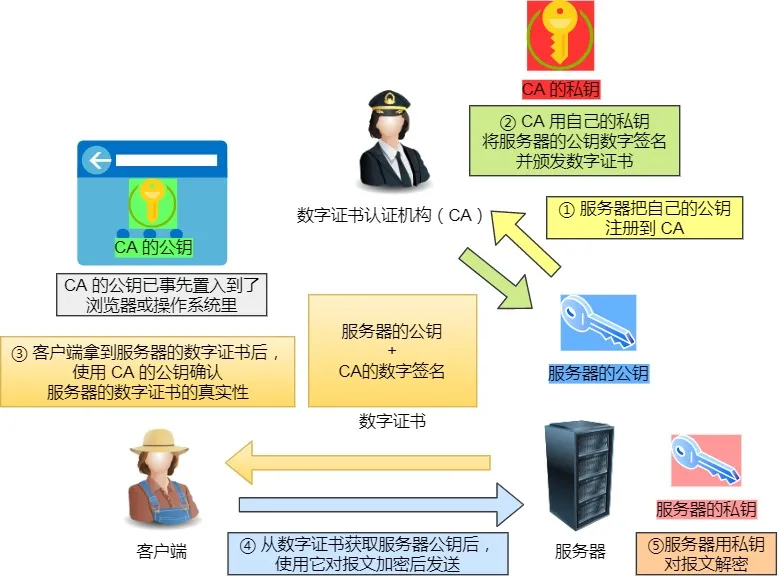
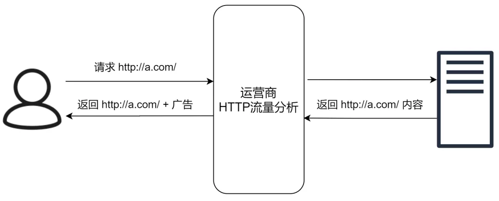

### 04 HTTP 与 HTTPS

> HTTP 与 HTTPS 有哪些区别？

1. HTTP 是超文本传输协议，信息是明文传输，存在安全风险的问题。HTTPS 则解决 HTTP 不安全的缺陷，在 TCP 和 HTTP 网络层之间加入了 SSL/TLS 安全协议，使得报文能够加密传输。
2. HTTP 连接建立相对简单， TCP 三次握手之后便可进行 HTTP 的报文传输。而 HTTPS 在 TCP 三次握手之后，还需进行 SSL/TLS 的握手过程，才可进入加密报文传输。
3. HTTP 的端口号是 80，HTTPS 的端口号是 443。
4. HTTPS 协议需要向 CA（证书权威机构）申请数字证书，来保证服务器的身份是可信的。

> HTTPS 解决了 HTTP 的哪些问题？

HTTP 由于是明文传输，所以安全上存在以下三个风险：

- **窃听风险**，比如通信链路上可以获取通信内容，用户号容易没。
- **篡改风险**，比如强制入垃圾广告，视觉污染，用户眼容易瞎。
- **冒充风险**，比如冒充淘宝网站，用户钱容易没。

HTTP**S** 在 HTTP 与 TCP 层之间加入了 `SSL/TLS` 协议。

HTTP 与 HTTPS

可以很好的解决了上述的风险：

- **信息加密**：交互信息无法被窃取，但你的号会因为「自身忘记」账号而没。
- **校验机制**：无法篡改通信内容，篡改了就不能正常显示，但百度「竞价排名」依然可以搜索垃圾广告。
- **身份证书**：证明淘宝是真的淘宝网，但你的钱还是会因为「剁手」而没。

可见，只要自身不做「恶」，SSL/TLS 协议是能保证通信是安全的。

> HTTPS 是如何解决上面的三个风险的？

- **混合加密**的方式实现信息的**机密性**，解决了窃听的风险。
- **摘要算法**的方式来实现**完整性**，它能够为数据生成独一无二的「指纹」，指纹用于校验数据的完整性，解决了篡改的风险。
- 将服务器公钥放入到**数字证书**中，解决了冒充的风险。

*1. 混合加密*

通过**混合加密**的方式可以保证信息的**机密性**，解决了窃听的风险。

混合加密

HTTPS 采用的是**对称加密**和**非对称加密**结合的「混合加密」方式：

- 在通信建立前采用**非对称加密**的方式交换「会话秘钥」，后续就不再使用非对称加密。
- 在通信过程中全部使用**对称加密**的「会话秘钥」的方式加密明文数据。

采用「混合加密」的方式的原因：

- **对称加密**只使用一个密钥，运算速度快，密钥必须保密，无法做到安全的密钥交换。
- **非对称加密**使用两个密钥：公钥和私钥，公钥可以任意分发而私钥保密，解决了密钥交换问题但速度慢。

*2. 摘要算法*

**摘要算法**用来实现**完整性**，能够为数据生成独一无二的「指纹」，用于校验数据的完整性，解决了篡改的风险。

校验完整性

客户端在发送明文之前会通过摘要算法算出明文的「指纹」，发送的时候把「指纹 + 明文」一同
加密成密文后，发送给服务器，服务器解密后，用相同的摘要算法算出发送过来的明文，通过比较客户端携带的「指纹」和当前算出的「指纹」做比较，若「指纹」相同，说明数据是完整的。

*3. 数字证书*

客户端先向服务器端索要公钥，然后用公钥加密信息，服务器收到密文后，用自己的私钥解密。

这就存在些问题，如何保证公钥不被篡改和信任度？

所以这里就需要借助第三方权威机构 `CA` （数字证书认证机构），将**服务器公钥放在数字证书**（由数字证书认证机构颁发）中，只要证书是可信的，公钥就是可信的。

数字证书工作流程

通过数字证书的方式保证服务器公钥的身份，解决冒充的风险。

------

### Why HTTPS

> 近几年来，各大公司都在大力推进 HTTPS 的建设。Google Chrome将非 HTTPS 的网站标注为「不安全」，苹果要求 APP 中需要使用HTTPS进行通信，微信小程序也要求使用HTTPS协议。那么，我们为什么非要做这么一件事呢？

我们先来看看HTTP。HTTP（Hypertext Transfer Protocol）超文本传输协议，是一种用于分布式、协作式和超媒体信息系统的应用层协议，可以说 HTTP 是当代互联网通信的基础。

但是，HTTP 有着一个致命的缺陷，那就是内容是**明文传输**的，没有经过任何加密，而这些明文数据会经过**WiFi、路由器、运营商、机房**等多个物理设备节点，如果在这中间任意一个节点被监听，传输的内容就会完全暴露，，这一攻击手法叫做MITM（Man In The Middle）**中间人**攻击。

##### 举个例子，稍微有点长，但这个例子透露出了怪怪我对安全如此痴迷的原因😝~~

------

可以拿小时候上课传纸条来类比，你坐在教室靠墙的一边，想要传一句**「晚上放学操场我等你」**给坐在窗边的小红，中间要经过六七个人的传递。虽然你把纸条对折了一下，但是防君子不防小人，中间的所有人都可以很轻易地打开纸条看到你想要说什么。

只是看还好，如果有小刚也喜欢小红，看到你俩马上就要甜甜蜜蜜地回家了，心有不甘，换了一张纸条，改成了**「晚上放学你自己回家吧，我要去网吧玩游戏」**。

小红看到你要抛弃她自己去玩游戏，非常伤心，开始在纸条上质问**「说好的一起回家呢，为什么要去打游戏，哼」**。

在小红的纸条传回来的路上，小刚又改了纸条**「你玩你的游戏去吧，我要和小刚回家」**。

于是，你和小红都倍感伤心，小刚横刀夺爱，而你一头雾水。

------

回忆一下几年前遍地都是的**运营商劫持**，当你访问一个本来很正常的网页，但页面上却莫名其妙出现了一些广告标签、跳转脚本、欺骗性的红包按钮，甚至有时候本来要下载一个文件，最后下下来却变成了另外一个完全不同的东西，这些都是被运营商劫持了HTTP明文数据的现象。

运营商劫持

还有各大公司的员工**安全培训**里都有一条「不要连陌生的WiFi」，也是类似的原因，恶意WiFi的控制者可以看到和篡改HTTP明文传输的信息。

为了解决HTTP明文传输数据可能导致的安全问题，1994年网景公司提出了HTTPS（HyperText Transfer Protocol Secure）超文本传输安全协议，数据通信仍然是HTTP，但利用**SSL/TLS加密数据包**。