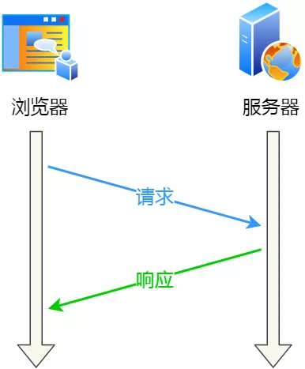
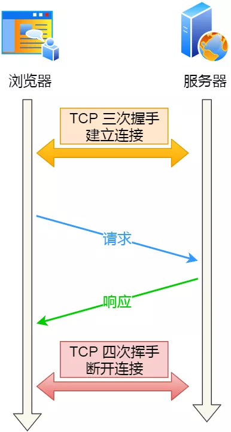
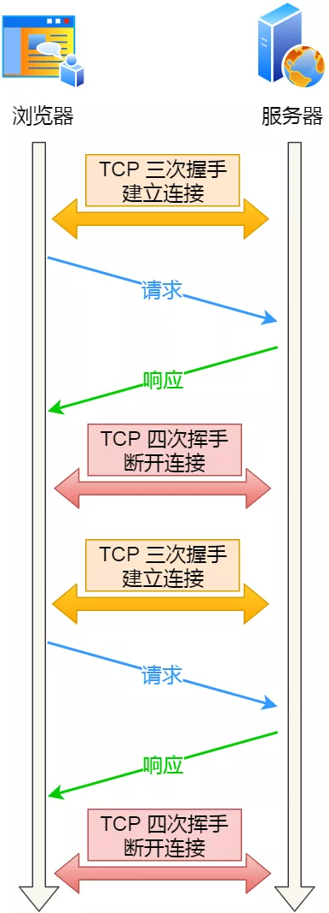
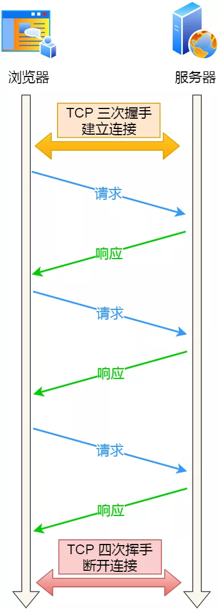
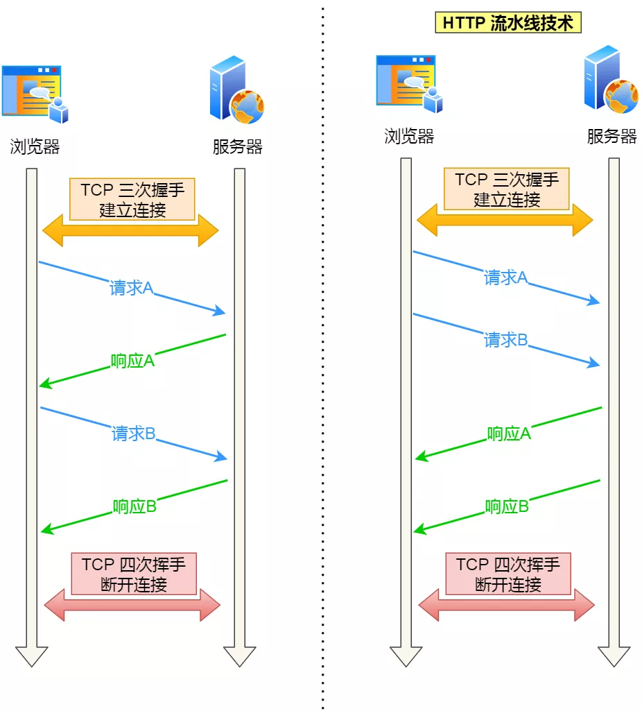
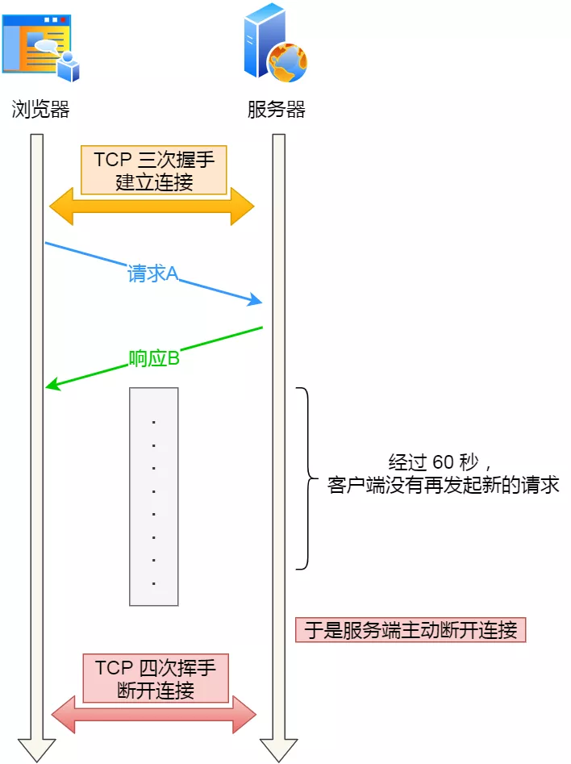

### HTTP 的 Keep-Alive

HTTP 协议采用的是「请求-应答」的模式，也就是客户端发起了请求，服务端才会返回响应，一来一回这样子。

请求-应答

由于 HTTP 是基于 TCP 传输协议实现的，客户端与服务端要进行 HTTP 通信前，需要先建立 TCP 连接，然后客户端发送 HTTP  请求，服务端收到后就返回响应，至此「请求-应答」的模式就完成了，随后就会释放 TCP 连接。

一个 HTTP 请求

如果每次请求都要经历这样的过程：建立 TCP -> 请求资源 -> 响应资源 -> 释放连接，那么此方式就是 **HTTP 短连接**，如下图：

HTTP 短连接

这样实在太累人了，一次连接只能请求一次资源。

能不能在第一个 HTTP 请求完后，先不断开 TCP 连接，让后续的 HTTP 请求继续使用此连接？

当然可以，HTTP 的 Keep-Alive 就是实现了这个功能，可以使用同一个 TCP 连接来发送和接收多个 HTTP 请求/应答，避免了连接建立和释放的开销，这个方法称为 **HTTP 长连接**。

HTTP 长连接

HTTP 长连接的特点是，只要任意一端没有明确提出断开连接，则保持 TCP 连接状态。

怎么才能使用 HTTP 的 Keep-Alive 功能？

在 HTTP 1.0 中默认是关闭的，如果浏览器要开启 Keep-Alive，它必须在请求的包头中添加：

```
Connection: Keep-Alive
```

然后当服务器收到请求，作出回应的时候，它也添加一个头在响应中：

```
Connection: Keep-Alive
```

这样做，连接就不会中断，而是保持连接。当客户端发送另一个请求时，它会使用同一个连接。这一直继续到客户端或服务器端提出断开连接。

**从 HTTP 1.1 开始， 就默认是开启了 Keep-Alive**，如果要关闭 Keep-Alive，需要在 HTTP 请求的包头里添加：

```
Connection:close
```

现在大多数浏览器都默认是使用 HTTP/1.1，所以 Keep-Alive 都是默认打开的。一旦客户端和服务端达成协议，那么长连接就建立好了。

HTTP 长连接不仅仅减少了 TCP 连接资源的开销，而且这给 **HTTP 流水线**技术提供了可实现的基础。

所谓的 HTTP 流水线，是**客户端可以先一次性发送多个请求，而在发送过程中不需先等待服务器的回应**，可以减少整体的响应时间。

举例来说，客户端需要请求两个资源。以前的做法是，在同一个 TCP 连接里面，先发送 A 请求，然后等待服务器做出回应，收到后再发出 B 请求。HTTP 流水线机制则允许客户端同时发出 A 请求和 B 请求。



右边为 HTTP 流水线机制

但是**服务器还是按照顺序响应**，先回应 A 请求，完成后再回应 B 请求。

而且要等服务器响应完客户端第一批发送的请求后，客户端才能发出下一批的请求，也就说如果服务器响应的过程发生了阻塞，那么客户端就无法发出下一批的请求，此时就造成了「队头阻塞」的问题。

可能有的同学会问，如果使用了 HTTP 长连接，如果客户端完成一个 HTTP 请求后，就不再发起新的请求，此时这个 TCP 连接一直占用着不是挺浪费资源的吗？

对没错，所以为了避免资源浪费的情况，web 服务软件一般都会提供 `keepalive_timeout` 参数，用来指定 HTTP 长连接的超时时间。

比如设置了 HTTP 长连接的超时时间是 60 秒，web 服务软件就会**启动一个定时器**，如果客户端在完后一个 HTTP 请求后，在 60 秒内都没有再发起新的请求，**定时器的时间一到，就会触发回调函数来释放该连接。**

HTTP 长连接超时