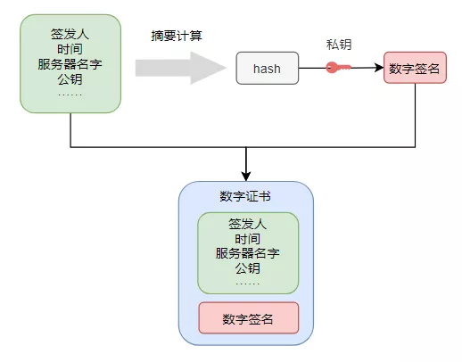

我是一个浏览器，每到夜深人静的时候，主人就打开我开始学习。

为了不让别人看到浏览记录，主人选择了“无痕模式”。

但网络中总是有很多坏人，他们通过抓包截获我和服务器的通信，主人干了什么，请求了什么数据全被他们知道了！

光窃听也就罢了，他们还经常篡改内容，在网页里面插入诱人的小广告，真是太坏了！

为了保护主人的隐私还他一个干净的上网环境，我决定对通信加密！

## **第一版：直接简单加密**

加密嘛，很简单，把原来要发送的数据加密处理后再发给服务器就行了。

为了安全，密钥当然不能固定，每一次通信都要随机生成。

不过接下来我犯难了，我该怎么把这个秘钥告诉服务器呢，服务器没有秘钥就解不了密，也就不知道我在请求什么资源了。

也不能直接弄个字段告诉服务器密钥，那样别人也能拿到，就跟没加密一样了。

我左思右想，灵机一动，决定把密钥放在数据的开头几个字节藏起来，只要私下跟服务器约定好，他用这前几个字节作为密钥解密，就能解开我发送的数据了。

你还别说，这办法还真好使，我跟服务器开始秘密通信起来。

后来，找我使用这种办法通信的服务器变得越来越多。

再后来这事就在圈子里传开了，大家都知道数据的前几个字节是密钥了，谁都能解密了。

看来这个办法不行，我得重新思考加密方法了。

## **第二版：非对称加密**

服务器告诉我，我们之前用的那种加密算法叫**对称加密算法**，也就是加密和解密使用的同一个秘钥。

还有一种叫**非对称加密算法**，这种算法有两个秘钥，一个公开的叫公钥，一个私藏的叫私钥。

最关键的是，公钥加密后只能用私钥解开，反过来也一样。

只要在正式的数据传输前，服务器把他的公钥告诉我，我后面用它加密数据就行了，就算被别人抓包，他也解不开，因为只有拥有私钥的服务器才能解开。

不得不说，这非对称加密真是个好东西啊！

不过这样一来只能单程加密，服务器能解密我发的，但他发给我的，我却解不了，也不能让他用私钥加密，我用公钥解密，因为公钥是公开的，谁收到都能解，不安全。

没办法，我也弄了一对儿秘钥，通信之前我们双方都交换一下彼此的公钥，这样就可以双向加解密了！

虽然是有点麻烦，但为了数据安全，忍了吧！

## **第三版：非对称与对称加密结合**

但我忍了没几天就忍不住了。

这个非对称加密算法好是好，就是加解密太费时间了，导致我渲染一个网页要花很久时间，卡的不行。

我打算去跟服务器商量一下办法，没想到服务器比我更头疼，他要服务很多浏览器，每一个都这么加解密，把他累的够呛。

于是我们决定，还是用原来的对称加密算法，这样快得多。但是一开始的时候可以用非对称加密算法来传输后面要用的秘钥，把两种算法的优势结合起来。

这一来，我只需要把后面要用到的秘钥，通过服务器公钥加密后发给他就行了，我省去了不少事儿。

## **第四版：秘钥计算**

有一天，服务器告诉我，我们现在的秘钥就是一个随机数，而随机数并不是真正随机的，可能被预测出来，所以我们得提升这个秘钥的安全性。

一个随机数不够，那就多弄几个！

一端容易被猜出来，那就两端一起生成！

我们决定各自生成一个随机数发给对方，我再额外加密传输一个随机数给服务器，这一来，咱们双方都有3个随机数了，然后双方都用这三个随机数计算出真正的秘钥，这可比一个单纯的随机数要安全得多了。

不过为了验证双方计算出来的秘钥是一样的，我们在正式数据传输前，需要先来测试一下，现在的流程变成了这个样子：

我们的这一方案很快得到了大家的认可，圈子里的浏览器和服务器们纷纷用上了这套方案。

## **第五版：数字证书**

原以为这个方案已经万无一失了，没想到我和服务器的通信还是泄露了···

原来有个家伙冒充服务器跟我通信，然后又冒充我跟服务器通信，把我的请求进行了转发，我们俩都被蒙在鼓里，这就是**中间人攻击**。

看来还缺乏一个**认证机制**！我得知道和我通信的是不是真的服务器。

经过大家的商量，圈子里的服务器们推选了一个德高望重的前辈做公证人，让这公证人准备一对非对称加密的密钥，并在圈子里公开了公钥，所有人都得把他的公钥记下来。

服务器得去公证人这里先登记，把自己的公钥、名字等等信息报上去，公证人拿到这些信息后，计算一个Hash值，然后再用公证人的**私钥**把Hash值进行加密，加密后的结果就是**数字签名**。

证书的签发

最后，公证人把登记的信息和这个数字签名合在一起，封装了一个新的文件发给服务器，登记就完成了，而这个新的文件就是**数字证书**。

服务器拿到证书后，可要好生保管，因为通信的时候，服务器须要将他们的证书发给我们浏览器验证。

证书的验证

我们浏览器拿到证书后，把证书里面的信息也计算一遍Hash，再用提前记录好的公证人的公钥把证书里的数字签名进行解密，得到公证人计算的Hash，两个一对比，就知道这证书是不是公证人签发的，以及有没有被篡改过了！

只有验证成功才能继续后面的流程，要不然就是冒充的！

这一下总算解决了中间人冒充的问题，除非中间人偷到了公证人的私钥，否则他是没办法伪造出一个证书来的。

**非对称加密除了加密数据，还能用来验证身份，真是YYDS！**

## **第六版：信任链**

我们这加密方案一传十，十传百，很快就传遍了整个互联网，想要使用这套方案的服务器越来越多，毕竟，谁都不希望自己的网站被人插入小广告。

可原来的那个公证人有些忙不过来了，于是，大家开始推选更多的公证人，公证人开始多了起来，不仅多了起来，而且还形成了产业链。

原来的公证人变成了一代目，一代目可以给新的公证人签发证书，新的公证人就变成了二代目，还有三代目，搞得跟传销似的。

原来只有一个公证人的时候，大家直接保存他的公钥就行了。现在公证人越来越多，我们没办法保存所有的公证人的公钥了，就算能保存得下，但有新的公证人出现的时候我们也做不到实时更新。

于是，大家约定，让所有的一代目公证人自己给自己签发一个证书，叫做**根证书**，并安装在我们的操作系统中。

以后在验证网站服务器的证书时，就得先去验证证书的签发者，然后再继续验证上一级签发者，直到验证最终的签发者是不是在根证书列表中。

只要最终的签发者在系统的根证书列表中，那这条链上签署的证书就都是受信任的，否则我们就会弹窗提醒用户：

如今，这套方案已经推广到了全世界，现在遇到使用这套方案的网站服务器时，我们浏览器就会在地址栏加上一把小锁，表示网站很安全，还把URL地址，从HTTP，改成了**HTTPS**···

> PS：本文用故事形式讲述了HTTPS是如何工作的，只是起一个引领入门的作用，略去了很多细节，实际情况远比这复杂，比如对称加密秘钥的计算方式、秘钥的交换算法（RSA、DH、ECDH还有区别），双方测试秘钥正确性的方式都没有体现出来，有机会再写一篇正经的技术文来详细抓包剖析HTTPS详细流程。
>
> 希望本文对大家理解HTTPS机制有一些帮助，再看其他专业介绍时不再吃力。