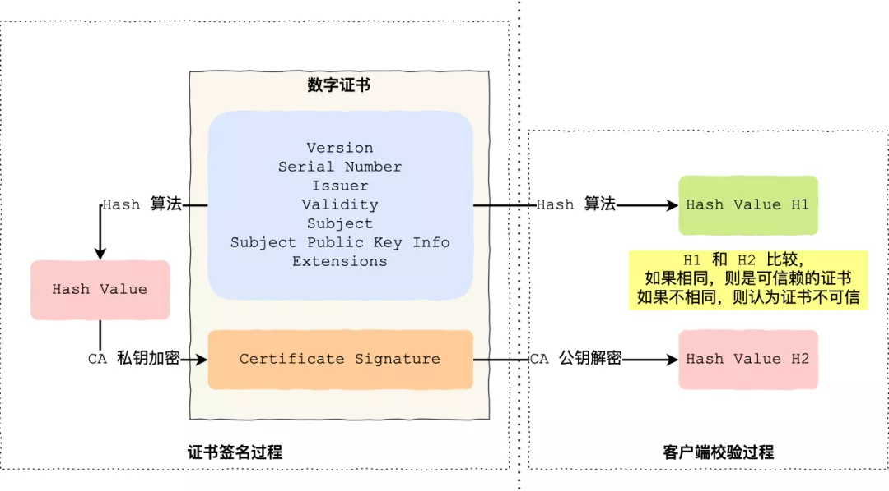

上周吴某凢和都某竹的瓜大家都吃了吧，结果前几天北京朝阳警方通报了这是一个金钱诈骗案。

我读了那份通报，我直接炸开了，没想到这次的瓜里，还有第三个人，它就是中间人刘某，具体怎么诈骗的呢？

整个诈骗过程可以概括成如下图，下图中的 ID_A 表示都某竹的银行卡，ID_E 表示中间人刘某的银行卡。

这个诈骗案牛逼在于，**中间人刘某有双重身份.**

不仅冒充都某竹的身份来向吴某凢索取赔偿，而且又冒充吴某凢的身份骗都某竹把退款的钱转到中间人刘某的银行卡，从而获取利益。

这波操作说实话比电影还精彩，刘某把中间人的角色演技到了极致，它做到了三件事情：

- **冒充身份**，不仅冒充了都某竹的身份，而且冒充了吴某凢的身份；
- **篡改信息**，骗都某竹把退款的钱，退到中间人刘某的银行卡；
- **窃听信息**，因为冒充了身份，所以都某竹和吴某凢双方的信息，刘某都牢牢的掌握在手中。

不知道大家有没有察觉中间人刘某做的这三件事情，正是 HTTP 协议的安全风险？

HTTP 协议不仅传输的信息是明文，而且没有身份认证，所以存在窃听风险、篡改风险、冒充风险。

为了解决 HTTP 协议的安全性，后面就出现了 HTTPS 协议，在 HTTP 层与 TCP 层之间加入了 TLS 协议，来保证安全可靠的信息传输。

具体怎么做到安全可靠的信息传输，这就涉及到了**数字签名和数字证书**。

没想到吧，画风突转的很快吧。

没错，今天这不是吃瓜文，而是技术文，让大家在吃瓜中学习，小林真是煞费苦心。

------

### 如何保证消息不被篡改？

为了保证传输的内容不被篡改，我们需要对内容计算出一个「指纹」，然后同内容一起传输给对方。

对方收到后，先是对内容也计算出一个「指纹」，然后跟发送方发送的「指纹」做一个比较，如果「指纹」相同，说明内容没有被篡改，否则就可以判断出内容被篡改了。

那么，在计算机里会**用哈希函数来计算出内容的哈希值**，也就是内容的「指纹」，这个**哈希值是唯一的，且无法通过哈希值推导出内容**。

### 如何保证消息的来源可靠？

通过哈希算法可以确保内容不会被篡改，**但是并不能保证「内容 + 哈希值」不会被中间人替换，因为这里缺少对客户端收到的消息是否来源于服务端的证明**。

举个例子，你想向老师请假，一般来说是要求由家长写一份请假理由并签名，老师才能允许你请假。

但是你有模仿你爸爸字迹的能力，你用你爸爸的字迹写了一份请假理由然后签上你爸爸的名字，老师一看到这个请假条，查看字迹和签名，就误以为是你爸爸写的，就会允许你请假。

那作为老师，要如何避免这种情况发生呢？现实生活中的，可以通过电话或视频来确认是否是由父母发出的请假，但是计算机里可没有这种操作。

那为了避免这种情况，计算机里会用**非对称加密算法**来解决，共有两个密钥：

- 一个是公钥，这个是可以公开给所有人的；
- 一个是私钥，这个必须由本人管理，不可泄露。

这两个密钥可以**双向加解密**的，比如可以用公钥加密内容，然后用私钥解密，也可以用私钥加密内容，公钥解密内容。

流程的不同，意味着目的也不相同：

- **公钥加密，私钥解密**。这个目的是为了**保证内容传输的安全**，因为被公钥加密的内容，其他人是无法解密的，只有持有私钥的人，才能解密出实际的内容；
- **私钥加密，公钥解密**。这个目的是为了**保证消息不会被冒充**，因为私钥是不可泄露的，如果公钥能正常解密出私钥加密的内容，就能证明这个消息是来源于持有私钥身份的人发送的。

一般我们不会用非对称加密来加密实际的传输内容，因为非对称加密的计算比较耗费性能的。

所以非对称加密的用途主要在于**通过「私钥加密，公钥解密」的方式，来确认消息的身份**，我们常说的**数字签名算法**，就是用的是这种方式，不过私钥加密内容不是内容本身，而是**对内容的哈希值加密**。

私钥是由服务端保管，然后服务端会向客户端颁发对应的公钥。如果客户端收到的信息，能被公钥解密，就说明该消息是由服务器发送的。

引入了数字签名算法后，你就无法模仿你爸爸的字迹来请假了，你爸爸手上持有着私钥，你老师持有着公钥。

这样只有用你爸爸手上的私钥才对请假条进行「签名」，老师通过公钥看能不能解出这个「签名」，如果能解出并且确认内容的完整性，就能证明是由你爸爸发起的请假条，这样老师才允许你请假，否则老师就不认。

### 如果保证对方的身份？

前面我们知道：

- 可以通过哈希算法来保证消息的完整性；
- 可以通过数字签名来保证消息的来源可靠性（能确认消息是由持有私钥的一方发送的）；

但是这还远远不够，**还缺少身份验证的环节**，万一公钥是被伪造的呢？

还是拿请假的例子，虽然你爸爸持有私钥，老师通过是否能用公钥解密来确认这个请假条是不是来源你父亲的。

但是我们还可以自己伪造出一对公私钥啊！

你找了个夜晚，偷偷把老师桌面上和你爸爸配对的公钥，换成了你的公钥，那么下次你在请假的时候，你继续模仿你爸爸的字迹写了个请假条，然后用你的私钥做个了「数字签名」。

但是老师并不知道自己的公钥被你替换过了，所以他还是按照往常一样用公钥解密，由于这个公钥和你的私钥是配对的，老师当然能用这个被替换的公钥解密出来，并且确认了内容的完整性，于是老师就会以为是你父亲写的请假条，又允许你请假了。

好家伙，为了一个请假，真的是斗智斗勇。

后面你的老师和父亲发现了你伪造公私钥的事情后，决定重新商量一个对策来应对你这个臭家伙。

正所谓魔高一丈，道高一尺。

既然伪造公私钥那么随意，所以你爸把他的公钥注册到**警察局**，警察局用他们自己的私钥对你父亲的公钥做了个数字签名，然后把你爸爸的「个人信息 + 公钥 + 数字签名」打包成一个**数字证书，也就是说这个数字证书包含你爸爸的公钥。**

这样，你爸爸如果因为家里确实有事要向老师帮你请假的时候，不仅会用自己的私钥对内容进行签名，还会把数字证书给到老师。

老师拿到了数字证书后，**首先会去警察局验证这个数字证书是否合法**，因为数字证书里有警察局的数字签名，警察局要验证证书合法性的时候，用自己的公钥解密，如果能解密成功，就说明这个数字证书是在警察局注册过的，就认为该数字证书是合法的，然后就会把数字证书里头的公钥（你爸爸的）给到老师。

**由于通过警察局验证了数字证书是合法的，那么就能证明这个公钥就是你父亲的**，于是老师就可以安心的用这个公钥解密出清教条，如果能解密出，就证明是你爸爸写的请假条。

正是通过了一个权威的机构来证明你爸爸的身份，所以你的伪造公私钥这个小伎俩就没用了。

在计算机里，这个权威的机构就是 CA （数字证书认证机构），将服务器公钥放在数字证书（由数字证书认证机构颁发）中，只要证书是可信的，公钥就是可信的。

数字证书的工作流程，我也画了一张图，方便大家理解：

数子证书工作流程

#### 数字证书签发和验证流程

接下来，详细说一下实际中数字证书签发和验证流程。

如下图图所示，为数字证书签发和验证流程：

CA 签发证书的过程，如上图左边部分：

- 首先 CA 会把持有者的公钥、用途、颁发者、有效时间等信息打成一个包，然后对这些信息进行 Hash 计算，得到一个 Hash 值；
- 然后 CA 会使用自己的私钥将该 Hash 值加密，生成 Certificate Signature，也就是 CA 对证书做了签名；
- 最后将 Certificate Signature 添加在文件证书上，形成数字证书；

客户端校验服务端的数字证书的过程，如上图右边部分：

- 首先客户端会使用同样的 Hash 算法获取该证书的 Hash 值 H1；
- 通常浏览器和操作系统中集成了 CA 的公钥信息，浏览器收到证书后可以使用 CA 的公钥解密 Certificate Signature 内容，得到一个 Hash 值 H2 ；
- 最后比较 H1 和 H2，如果值相同，则为可信赖的证书，否则则认为证书不可信。

#### 证书链

但事实上，证书的验证过程中**还存在一个证书信任链的问题**，因为我们向 CA 申请的证书一般不是根证书签发的，而是由中间证书签发的，比如百度的证书，从下图你可以看到，证书的层级有三级：

对于这种三级层级关系的证书的验证过程如下：

- 客户端收到 baidu.com 的证书后，发现这个证书的签发者不是根证书，就无法根据本地已有的根证书中的公钥去验证 baidu.com 证书是否可信。于是，客户端根据 baidu.com 证书中的签发者，找到该证书的颁发机构是 “GlobalSign Organization Validation CA - SHA256 - G2”，然后向 CA 请求该中间证书。
- 请求到证书后发现 “GlobalSign Organization Validation CA - SHA256 - G2” 证书是由 “GlobalSign Root CA” 签发的，由于 “GlobalSign Root CA” 没有再上级签发机构，说明它是根证书，也就是自签证书。应用软件会检查此证书有否已预载于根证书清单上，如果有，则可以利用根证书中的公钥去验证 “GlobalSign Organization Validation CA - SHA256 - G2” 证书，如果发现验证通过，就认为该中间证书是可信的。
- “GlobalSign Organization Validation CA - SHA256 - G2” 证书被信任后，可以使用 “GlobalSign Organization Validation CA - SHA256 - G2” 证书中的公钥去验证 baidu.com 证书的可信性，如果验证通过，就可以信任 baidu.com 证书。

在这四个步骤中，最开始客户端只信任根证书 GlobalSign Root CA 证书的，然后 “GlobalSign Root CA” 证书信任 “GlobalSign Organization Validation CA - SHA256 - G2” 证书，而 “GlobalSign Organization Validation CA - SHA256 - G2” 证书又信任 baidu.com 证书，于是客户端也信任 baidu.com 证书。

总括来说，由于用户信任 GlobalSign，所以由 GlobalSign 所担保的 baidu.com 可以被信任，另外由于用户信任操作系统或浏览器的软件商，所以由软件商预载了根证书的 GlobalSign 都可被信任。

操作系统里一般都会内置一些根证书，比如我的 MAC 电脑里内置的根证书有这么多：

这样的一层层地验证就构成了一条信任链路，整个证书信任链验证流程如下图所示：

最后一个问题，为什么需要证书链这么麻烦的流程？Root CA 为什么不直接颁发证书，而是要搞那么多中间层级呢？

**这是为了确保根证书的绝对安全性，将根证书隔离地越严格越好，不然根证书如果失守了，那么整个信任链都会有问题。**

------

HTTPS（SSL/TLS）的[加密机制](https://www.zhihu.com/search?q=加密机制&search_source=Entity&hybrid_search_source=Entity&hybrid_search_extra={"sourceType"%3A"article"%2C"sourceId"%3A43789231})虽然是大家都应了解的基本知识，但网上很多相关文章总会忽略一些内容，没有阐明完整的逻辑脉络，我当年学习它的时候也废了挺大功夫。

对称与非对称加密、数字签名、[数字证书](https://www.zhihu.com/search?q=数字证书&search_source=Entity&hybrid_search_source=Entity&hybrid_search_extra={"sourceType"%3A"article"%2C"sourceId"%3A43789231})等，在学习过程中，除了了解“它是什么”，你是否有想过“为什么是它”？我认为理解了后者才真正理解了HTTPS的加密机制。

本文以问题的形式逐步展开，一步步解开HTTPS的面纱，希望能帮助你彻底搞懂HTTPS。

## **为什么需要加密？**

因为http的内容是明文传输的，明文数据会经过中间代理服务器、[路由器](https://www.zhihu.com/search?q=路由器&search_source=Entity&hybrid_search_source=Entity&hybrid_search_extra={"sourceType"%3A"article"%2C"sourceId"%3A43789231})、wifi热点、通信服务运营商等多个物理节点，如果信息在传输过程中被劫持，传输的内容就完全暴露了。劫持者还可以篡改传输的信息且不被双方察觉，这就是`中间人攻击`。所以我们才需要对信息进行加密。最容易理解的就是`对称加密` 。

## **什么是对称加密？**

简单说就是有一个密钥，它可以加密一段信息，也可以对加密后的信息进行解密，和我们日常生活中用的钥匙作用差不多。

对称加密（https://sectigostore.com/blog/types-of-encryption-what-to-know-about-symmetric-vs-asymmetric-encryption/）

## **用对称加密可行吗？**

**如果通信双方都各自持有同一个密钥，且没有别人知道，这两方的通信安全当然是可以被保证的（除非密钥被破解）。**

然而最大的问题就是**这个密钥怎么让传输的双方知晓，同时不被别人知道**。如果由服务器生成一个密钥并传输给浏览器，那在这个传输过程中密钥被别人劫持到手了怎么办？之后他就能用密钥解开双方传输的任何内容了，所以这么做当然不行。

换种思路？试想一下，如果浏览器内部就预存了网站A的密钥，且可以确保除了浏览器和网站A，不会有任何外人知道该密钥，那理论上用对称加密是可以的，这样浏览器只要预存好世界上所有HTTPS网站的密钥就行了！这么做显然不现实。
怎么办？所以我们就需要`非对称加密` 。

## **什么是非对称加密？**

简单说就是有两把密钥，通常一把叫做[公钥](https://www.zhihu.com/search?q=公钥&search_source=Entity&hybrid_search_source=Entity&hybrid_search_extra={"sourceType"%3A"article"%2C"sourceId"%3A43789231})、一把叫私钥，用公钥加密的内容必须用私钥才能解开，同样，私钥加密的内容只有公钥能解开。

非对称加密（https://sectigostore.com/blog/types-of-encryption-what-to-know-about-symmetric-vs-asymmetric-encryption/）

##  用非对称加密可行吗？

鉴于非对称加密的机制，我们可能会有这种思路：服务器先把公钥以明文方式传输给浏览器，之后浏览器向服务器传数据前都先用这个公钥加密好再传，这条数据的安全似乎可以保障了！**因为只有服务器有相应的私钥能解开公钥加密的数据**。

然而反过来**由服务器到浏览器的这条路怎么保障安全？**如果服务器用它的私钥加密数据传给浏览器，那么浏览器用公钥可以解密它，而这个公钥是一开始通过明文传输给浏览器的，若这个公钥被中间人劫持到了，那他也能用该公钥解密服务器传来的信息了。所以**目前似乎只能保证由浏览器向服务器传输数据的[安全性](https://www.zhihu.com/search?q=安全性&search_source=Entity&hybrid_search_source=Entity&hybrid_search_extra={"sourceType"%3A"article"%2C"sourceId"%3A43789231})**（其实仍有漏洞，下文会说），那利用这点你能想到什么解决方案吗？

## **改良的非对称加密方案，似乎可以？**

我们已经理解通过一组公钥私钥，可以保证单个方向传输的安全性，那用两组公钥私钥，是否就能保证双向传输都安全了？请看下面的过程：

1. 某网站服务器拥有公钥A与对应的私钥A’；浏览器拥有公钥B与对应的私钥B’。
2. 浏览器把公钥B明文传输给服务器。
3. 服务器把公钥A明文给传输浏览器。
4. 之后浏览器向服务器传输的内容都用公钥A加密，服务器收到后用私钥A’解密。由于只有服务器拥有私钥A’，所以能保证这条数据的安全。
5. 同理，服务器向浏览器传输的内容都用公钥B加密，浏览器收到后用私钥B’解密。同上也可以保证这条数据的安全。

的确可以！抛开这里面仍有的漏洞不谈（下文会讲），HTTPS的加密却没使用这种方案，为什么？很重要的原因是非对称加密算法非常耗时，而对称加密快很多。那我们能不能运用非对称加密的特性解决前面提到的对称加密的漏洞？

## **非对称加密+对称加密？**

既然非对称加密耗时，那非对称加密+对称加密结合可以吗？而且得尽量减少非对称加密的次数。当然是可以的，且非对称加密、解密各只需用一次即可。
请看一下这个过程：

1. 某网站拥有用于非对称加密的公钥A、私钥A’。
2. 浏览器向网站服务器请求，服务器把公钥A明文给传输浏览器。
3. 浏览器随机生成一个用于对称加密的密钥X，用公钥A加密后传给服务器。
4. 服务器拿到后用私钥A’解密得到密钥X。
5. 这样双方就都拥有密钥X了，且别人无法知道它。之后双方所有数据都通过密钥X加密解密即可。

完美！HTTPS基本就是采用了这种方案。完美？还是有漏洞的。

## **中间人攻击**

中间人攻击（https://blog.pradeo.com/man-in-the-middle-attack）

如果在数据传输过程中，中间人劫持到了数据，此时他的确无法得到浏览器生成的密钥X，这个密钥本身被公钥A加密了，只有服务器才有私钥A’解开它，然而中间人却完全不需要拿到私钥A’就能干坏事了。请看：

1. 某网站有用于非对称加密的公钥A、私钥A’。
2. 浏览器向网站服务器请求，服务器把公钥A明文给传输浏览器。
3. **中间人劫持到公钥A，保存下来，把数据包中的公钥A替换成自己伪造的公钥B（它当然也拥有公钥B对应的私钥B’）**。
4. 浏览器生成一个用于对称加密的密钥X，用**公钥B**（浏览器无法得知公钥被替换了）加密后传给服务器。
5. **中间人劫持后用私钥B’解密得到密钥X，再用公钥A加密后传给服务器**。
6. 服务器拿到后用私钥A’解密得到密钥X。

这样在双方都不会发现异常的情况下，中间人通过一套“狸猫换太子”的操作，掉包了服务器传来的公钥，进而得到了密钥X。**根本原因是浏览器无法确认收到的公钥是不是网站自己的，**因为公钥本身是明文传输的，难道还得对公钥的传输进行加密？这似乎变成鸡生蛋、蛋生鸡的问题了。解法是什么？

## **如何证明浏览器收到的公钥一定是该网站的公钥？**

其实所有证明的源头都是一条或多条不证自明的“公理”（可以回想一下数学上公理），由它推导出一切。比如现实生活中，若想证明某身份证号一定是小明的，可以看他身份证，而身份证是由政府作证的，这里的“公理”就是“政府机构可信”，这也是社会正常运作的前提。

那能不能类似地有个机构充当互联网世界的“公理”呢？让它作为一切证明的源头，给网站颁发一个“身份证”？

它就是**CA机构**，它是如今互联网世界正常运作的前提，而CA机构颁发的“身份证”就是**数字证书**。

## **数字证书**

网站在使用HTTPS前，需要向**CA机构**申领一份**数字证书**，数字证书里含有证书持有者信息、公钥信息等。服务器把证书传输给浏览器，浏览器从证书里获取公钥就行了，证书就如身份证，证明“该公钥对应该网站”。而这里又有一个显而易见的问题，“**证书本身的传输过程中，如何防止被篡改”**？即如何证明证书本身的真实性？身份证运用了一些[防伪技术](https://www.zhihu.com/search?q=防伪技术&search_source=Entity&hybrid_search_source=Entity&hybrid_search_extra={"sourceType"%3A"article"%2C"sourceId"%3A43789231})，而数字证书怎么防伪呢？解决这个问题我们就接近胜利了！

## **如何放防止数字证书被篡改？**

我们把证书原本的内容生成一份“签名”，比对证书内容和签名是否一致就能判别是否被篡改。这就是数字证书的“防伪技术”，这里的“签名”就叫`数字签名`：

## **数字签名**

这部分内容建议看下图并结合后面的文字理解，图中左侧是数字签名的制作过程，右侧是验证过程：

数字签名的生成与验证（https://cheapsslsecurity.com/blog/digital-signature-vs-digital-certificate-the-difference-explained/）

数字签名的制作过程：

1. CA机构拥有非对称加密的私钥和公钥。
2. CA机构对证书明文数据T进行hash。
3. 对hash后的值用私钥加密，得到数字签名S。

明文和数字签名共同组成了数字证书，这样一份数字证书就可以颁发给网站了。
那浏览器拿到服务器传来的数字证书后，如何验证它是不是真的？（有没有被篡改、掉包）

浏览器验证过程：

1. 拿到证书，得到明文T，签名S。
2. 用CA机构的公钥对S解密（由于是浏览器信任的机构，所以浏览器保有它的公钥。详情见下文），得到S’。
3. 用证书里指明的[hash算法](https://www.zhihu.com/search?q=hash算法&search_source=Entity&hybrid_search_source=Entity&hybrid_search_extra={"sourceType"%3A"article"%2C"sourceId"%3A43789231})对明文T进行hash得到T’。
4. 显然通过以上步骤，T’应当等于S‘，除非明文或签名被篡改。所以此时比较S’是否等于T’，等于则表明证书可信。

为何么这样可以保证证书可信呢？我们来仔细想一下。

## **中间人有可能篡改该证书吗？**

假设中间人篡改了证书的原文，由于他没有CA机构的私钥，所以无法得到此时加密后签名，无法相应地篡改签名。浏览器收到该证书后会发现原文和签名解密后的值不一致，则说明证书已被篡改，证书不可信，从而终止向服务器传输信息，防止信息泄露给中间人。

既然不可能篡改，那整个证书被掉包呢？

## **中间人有可能把证书掉包吗？**

假设有另一个网站B也拿到了CA机构认证的证书，它想劫持网站A的信息。于是它成为中间人拦截到了A传给浏览器的证书，然后替换成自己的证书，传给浏览器，之后浏览器就会错误地拿到B的证书里的公钥了，这确实会导致上文“中间人攻击”那里提到的漏洞？

其实这并不会发生，因为证书里包含了网站A的信息，包括域名，浏览器把证书里的域名与自己请求的域名比对一下就知道有没有被掉包了。

## **为什么制作数字签名时需要hash一次？**

我初识HTTPS的时候就有这个疑问，因为似乎那里的hash有点多余，把hash过程去掉也能保证证书没有被篡改。

最显然的是性能问题，前面我们已经说了非对称加密效率较差，证书信息一般较长，比较耗时。而hash后得到的是固定长度的信息（比如用md5算法hash后可以得到固定的128位的值），这样加解密就快很多。

当然也有安全上的原因，这部分内容相对深一些，感兴趣的可以看这篇解答：[crypto.stackexchange.com/a/12780](https://link.zhihu.com/?target=https%3A//link.juejin.im/%3Ftarget%3Dhttps%3A%2F%2Fcrypto.stackexchange.com%2Fa%2F12780)

## **怎么证明CA机构的公钥是可信的？**

你们可能会发现上文中说到CA机构的公钥，我几乎一笔带过，“浏览器保有它的公钥”，这是个什么保有法？怎么证明这个公钥是否可信？

让我们回想一下数字证书到底是干啥的？没错，为了证明某公钥是可信的，即“该公钥是否对应该网站”，那CA机构的公钥是否也可以用数字证书来证明？没错，操作系统、浏览器本身会预装一些它们信任的根证书，如果其中会有CA机构的根证书，这样就可以拿到它对应的可信公钥了。

实际上证书之间的认证也可以不止一层，可以A信任B，B信任C，以此类推，我们把它叫做`信任链`或`数字证书链`。也就是一连串的数字证书，由根证书为起点，透过层层信任，使终端实体证书的持有者可以获得转授的信任，以证明身份。

另外，不知你们是否遇到过网站访问不了、提示需安装证书的情况？这里安装的就是根证书。说明浏览器不认给这个网站颁发证书的机构，那么你就得手动下载安装该机构的根证书（风险自己承担XD）。安装后，你就有了它的公钥，就可以用它验证服务器发来的证书是否可信了。

信任链（https://publib.boulder.ibm.com/tividd/td/TRM/GC32-1323-00/en_US/HTML/admin230.htm）

## **每次进行HTTPS请求时都**必须**在SSL/TLS层进行握手传输密钥吗？**

这也是我当时的困惑之一，显然每次请求都经历一次密钥传输过程非常耗时，那怎么达到只传输一次呢？

服务器会为每个浏览器（或客户端软件）维护一个session ID，在TLS握手阶段传给浏览器，浏览器生成好密钥传给服务器后，服务器会把该密钥存到相应的session ID下，之后浏览器每次请求都会携带session ID，服务器会根据session ID找到相应的密钥并进行解密加密操作，这样就不必要每次重新制作、传输密钥了！

## **总结**

可以看下这张图，梳理一下整个流程（SSL、TLS握手有一些区别，不同版本间也有区别，不过大致过程就是这样）：

（www.extremetech.com）

至此，我们已自上而下地打通了[HTTPS加密](https://www.zhihu.com/search?q=HTTPS加密&search_source=Entity&hybrid_search_source=Entity&hybrid_search_extra={"sourceType"%3A"article"%2C"sourceId"%3A43789231})的整体脉络以及核心知识点，不知你是否真正搞懂了HTTPS呢？
找几个时间，多看、多想、多理解几次就会越来越清晰的！
那么，下面的问题你是否已经可以解答了呢？

1. 为什么要用对称加密+非对称加密？
2. 为什么不能只用非对称加密？
3. 为什么需要数字证书？
4. 为什么需要数字签名？
   …

当然，由于篇幅和能力所限，一些更深入的内容没有覆盖到。但我认为一般对于前后端开发人员来说，了解到这步就够了，有兴趣的可以再深入研究~如有疏漏之处，欢迎指出。

如果你觉得这篇文章对搞懂https有帮助，欢迎点赞和分享~感谢！

（希望大家收藏的同时也点个赞或加个关注哈~目前3000多个收藏，1000多个赞。。。）

为什么制作数字签名时需要hash一次？补充一点，非对称加密可以加密的消息体长度有上限（public key length in bits / 8 - 11），否则会报错，所以必须先hash保证定长结果。