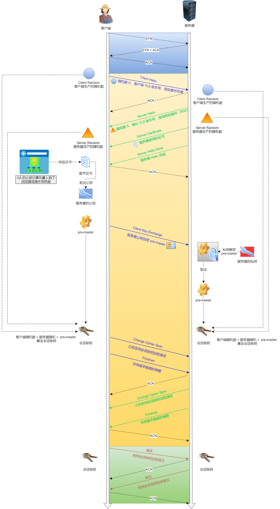

> HTTPS 是如何建立连接的？其间交互了什么？

SSL/TLS 协议基本流程：

- 客户端向服务器索要并验证服务器的公钥。
- 双方协商生产「会话秘钥」。
- 双方采用「会话秘钥」进行加密通信。

前两步也就是 SSL/TLS 的建立过程，也就是握手阶段。

SSL/TLS 的「握手阶段」涉及**四次**通信，可见下图：

SSL/TLS 协议建立的详细流程：

*1. ClientHello*

首先，由客户端向服务器发起加密通信请求，也就是 `ClientHello` 请求。

在这一步，客户端主要向服务器发送以下信息：

（1）客户端支持的 SSL/TLS 协议版本，如 TLS 1.2 版本。

（2）客户端生产的随机数（`Client Random`），后面用于生产「会话秘钥」。

（3）客户端支持的密码套件列表，如 RSA 加密算法。

*2. SeverHello*

服务器收到客户端请求后，向客户端发出响应，也就是 `SeverHello`。服务器回应的内容有如下内容：

（1）确认 SSL/ TLS 协议版本，如果浏览器不支持，则关闭加密通信。

（2）服务器生产的随机数（`Server Random`），后面用于生产「会话秘钥」。

（3）确认的密码套件列表，如 RSA 加密算法。

（4）服务器的数字证书。

*3.客户端回应*

客户端收到服务器的回应之后，首先通过浏览器或者操作系统中的 CA 公钥，确认服务器的数字证书的真实性。

如果证书没有问题，客户端会从数字证书中取出服务器的公钥，然后使用它加密报文，向服务器发送如下信息：

（1）一个随机数（`pre-master key`）。该随机数会被服务器公钥加密。

（2）加密通信算法改变通知，表示随后的信息都将用「会话秘钥」加密通信。

（3）客户端握手结束通知，表示客户端的握手阶段已经结束。这一项同时把之前所有内容的发生的数据做个摘要，用来供服务端校验。

上面第一项的随机数是整个握手阶段的第三个随机数，这样服务器和客户端就同时有三个随机数，接着就用双方协商的加密算法，**各自生成**本次通信的「会话秘钥」。

*4. 服务器的最后回应*

服务器收到客户端的第三个随机数（`pre-master key`）之后，通过协商的加密算法，计算出本次通信的「会话秘钥」。然后，向客户端发生最后的信息：

（1）加密通信算法改变通知，表示随后的信息都将用「会话秘钥」加密通信。

（2）服务器握手结束通知，表示服务器的握手阶段已经结束。这一项同时把之前所有内容的发生的数据做个摘要，用来供客户端校验。

至此，整个 SSL/TLS 的握手阶段全部结束。接下来，客户端与服务器进入加密通信，就完全是使用普通的 HTTP 协议，只不过用「会话秘钥」加密内容。

------

我们先来看看 HTTPS 的加解密流程，如下图：

HTTPS 加解密流程如下：

- 用户在浏览器发起 HTTPS 请求（如 https://www.mogu.com/），默认使用服务端的 443 端口进行连接。
- HTTPS 需要使用一套 CA 数字证书，证书内会附带一个公钥 Pub，而与之对应的私钥 Private 保留在服务端不公开。
- 服务端收到请求，返回配置好的包含公钥 Pub 的证书给客户端。
- 客户端收到证书，校验合法性，主要包括是否在有效期内、证书的域名与请求的域名是否匹配，上一级证书是否有效（递归判断，直到判断到系统内置或浏览器配置好的根证书），如果不通过，则显示 HTTPS 警告信息，如果通过则继续。
- 客户端生成一个用于对称加密的随机 Key，并用证书内的公钥 Pub 进行加密，发送给服务端。
- 服务端收到随机 Key 的密文，使用与公钥 Pub 配对的私钥 Private 进行解密，得到客户端真正想发送的随机 Key。
- 服务端使用客户端发送过来的随机 Key 对要传输的 HTTP 数据进行对称加密，将密文返回客户端。
- 客户端使用随机 Key 对称解密密文，得到 HTTP 数据明文。
- 后续 HTTPS 请求使用之前交换好的随机 Key 进行对称加解密。
