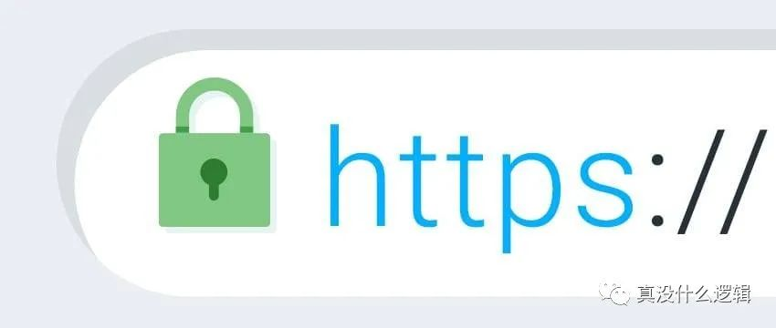
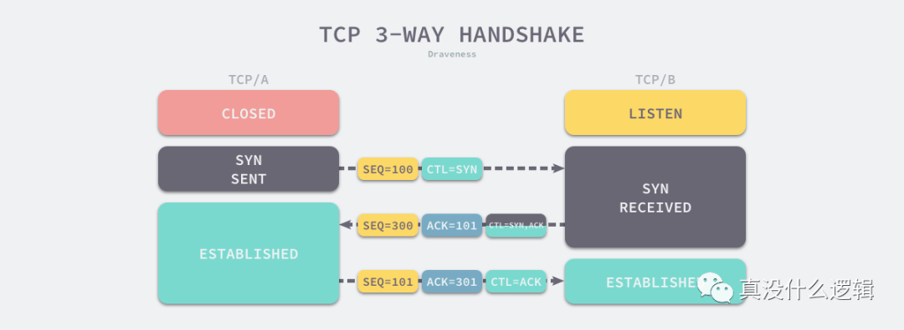
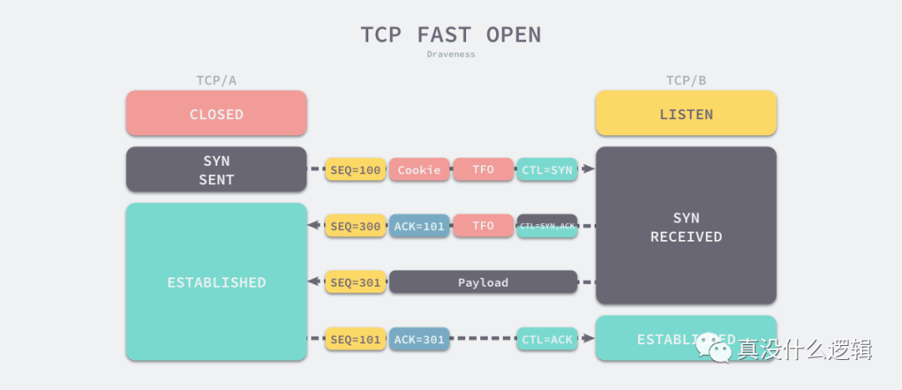
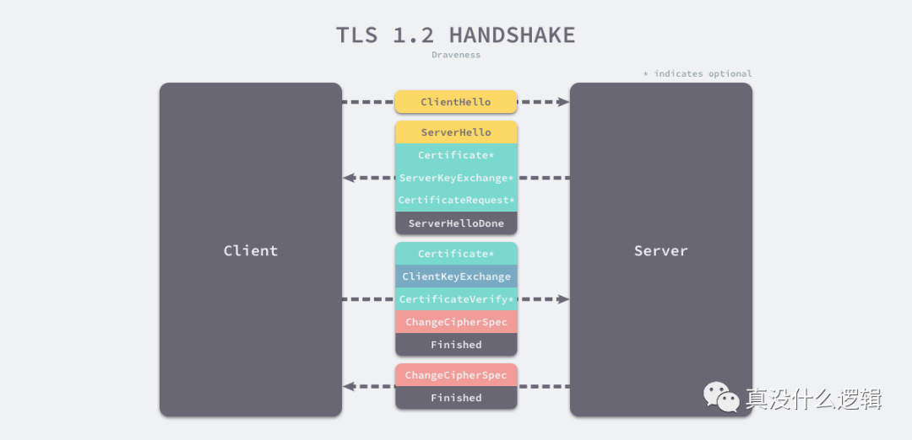

> HTTPS 是如何建立连接的？其间交互了什么？

SSL/TLS 协议基本流程：

- 客户端向服务器索要并验证服务器的公钥。
- 双方协商生产「会话秘钥」。
- 双方采用「会话秘钥」进行加密通信。

前两步也就是 SSL/TLS 的建立过程，也就是握手阶段。

SSL/TLS 的「握手阶段」涉及**四次**通信，可见下图：

SSL/TLS 协议建立的详细流程：

*1. ClientHello*

首先，由客户端向服务器发起加密通信请求，也就是 `ClientHello` 请求。

在这一步，客户端主要向服务器发送以下信息：

（1）客户端支持的 SSL/TLS 协议版本，如 TLS 1.2 版本。

（2）客户端生产的随机数（`Client Random`），后面用于生产「会话秘钥」。

（3）客户端支持的密码套件列表，如 RSA 加密算法。

*2. SeverHello*

服务器收到客户端请求后，向客户端发出响应，也就是 `SeverHello`。服务器回应的内容有如下内容：

（1）确认 SSL/ TLS 协议版本，如果浏览器不支持，则关闭加密通信。

（2）服务器生产的随机数（`Server Random`），后面用于生产「会话秘钥」。

（3）确认的密码套件列表，如 RSA 加密算法。

（4）服务器的数字证书。

*3.客户端回应*

客户端收到服务器的回应之后，首先通过浏览器或者操作系统中的 CA 公钥，确认服务器的数字证书的真实性。

如果证书没有问题，客户端会从数字证书中取出服务器的公钥，然后使用它加密报文，向服务器发送如下信息：

（1）一个随机数（`pre-master key`）。该随机数会被服务器公钥加密。

（2）加密通信算法改变通知，表示随后的信息都将用「会话秘钥」加密通信。

（3）客户端握手结束通知，表示客户端的握手阶段已经结束。这一项同时把之前所有内容的发生的数据做个摘要，用来供服务端校验。

上面第一项的随机数是整个握手阶段的第三个随机数，这样服务器和客户端就同时有三个随机数，接着就用双方协商的加密算法，**各自生成**本次通信的「会话秘钥」。

*4. 服务器的最后回应*

服务器收到客户端的第三个随机数（`pre-master key`）之后，通过协商的加密算法，计算出本次通信的「会话秘钥」。然后，向客户端发生最后的信息：

（1）加密通信算法改变通知，表示随后的信息都将用「会话秘钥」加密通信。

（2）服务器握手结束通知，表示服务器的握手阶段已经结束。这一项同时把之前所有内容的发生的数据做个摘要，用来供客户端校验。

至此，整个 SSL/TLS 的握手阶段全部结束。接下来，客户端与服务器进入加密通信，就完全是使用普通的 HTTP 协议，只不过用「会话秘钥」加密内容。

------

我们先来看看 HTTPS 的加解密流程，如下图：

HTTPS 加解密流程如下：

- 用户在浏览器发起 HTTPS 请求（如 https://www.mogu.com/），默认使用服务端的 443 端口进行连接。
- HTTPS 需要使用一套 CA 数字证书，证书内会附带一个公钥 Pub，而与之对应的私钥 Private 保留在服务端不公开。
- 服务端收到请求，返回配置好的包含公钥 Pub 的证书给客户端。
- 客户端收到证书，校验合法性，主要包括是否在有效期内、证书的域名与请求的域名是否匹配，上一级证书是否有效（递归判断，直到判断到系统内置或浏览器配置好的根证书），如果不通过，则显示 HTTPS 警告信息，如果通过则继续。
- 客户端生成一个用于对称加密的随机 Key，并用证书内的公钥 Pub 进行加密，发送给服务端。
- 服务端收到随机 Key 的密文，使用与公钥 Pub 配对的私钥 Private 进行解密，得到客户端真正想发送的随机 Key。
- 服务端使用客户端发送过来的随机 Key 对要传输的 HTTP 数据进行对称加密，将密文返回客户端。
- 客户端使用随机 Key 对称解密密文，得到 HTTP 数据明文。
- 后续 HTTPS 请求使用之前交换好的随机 Key 进行对称加解密。

------

# HTTPS 的 7 次握手以及 9 倍时延

 2020-05-25 
[http](https://www.codenong.com/tag/http/)[https](https://www.codenong.com/tag/https/)

HTTP 协议（Hypertext Transfer Protocol）已经成为互联网上最常用的应用层协议，然而其本身只是用于传输超文本的网络协议，不会提供任何安全上的保证，使用明文在互联网上传输数据包使得窃听和中间人攻击成为可能，通过 HTTP 传输密码其实与在互联网上裸奔也差不多。

https-banner

**图 1 - HTTPS 协议**

网景（Netscape）在 1994 年设计了 HTTPS 协议，使用安全套接字层（Secure Sockets Layer，SSL）保证数据传输的安全[^1]，随着传输层安全协议（Transport Layer Security，TLS）的发展，目前我们已经使用 TLS 取代了废弃的 SSL 协议，不过仍然使用 SSL 证书一词[^2]。

HTTPS 是对 HTTP 协议的扩展，我们可以使用它在互联网上安全地传输数据[^3]，然而 HTTPS 请求的发起方第一次从接收方获取响应需要经过 4.5 倍的往返延迟（Round-Trip Time，RTT）。本文将详细介绍请求发起和响应的过程，分析为什么 HTTPS 协议需要通过 4.5-RTT 的时间获得服务提供方的响应：

- TCP 协议 — 通信双方通过三次握手建立 TCP 连接[^4]；
- TLS 协议 — 通信双方通过四次握手建立 TLS 连接[^5]；
- HTTP 协议 — 客户端向服务端发送请求，服务端发回响应；

这里的分析建立在特定版本的协议实现以及常见场景上，随着网络技术的发展，我们能够减少需要的网络通信次数，本文会在对应章节中提到一些常见的优化方案。

### TCP

HTTP 协议作为应用层协议，它需要底层的传输层协议为其提供基本的数据传输功能，HTTP 协议一般都会使用 TCP 协议作为底层协议。为了阻止错误的建立历史连接，TCP 协议通信的双方会通过三次握手建立 TCP 连接[^6]，我们在这里简单回顾一下 TCP 连接建立的整个过程。

tcp-3-way-handshake

**图 2 - TCP 三次握手**

1. 客户端向服务端发送带有 SYN 的数据段以及客户端开始发送数据段（Segment）的初始序列号 SEQ = 100；

2. 服务端收到数据段时，向客户端发送带有 SYN 和 ACK 的数据段；

3. 

   

   

   通过返回 ACK = 101 确认客户端数据段的初始序列号；

4. 通过发送 SEQ = 300 通知客户端，服务端开始发送数据段的初始序列号；

5. 客户端向服务端发送带有 ACK 的数据段，确认服务端的初始序列号，其中包含 ACK = 301；

TCP 连接的双方会通过三次握手确定 TCP 连接的初始序列号、窗口大小以及最大数据段，这样通信双方就能利用连接中的初始序列号保证双方数据段的不重不漏、通过窗口大小控制流量并使用最大数据段避免 IP 协议对数据包的分片[^7]。

最初版本的 TCP 协议确实会通过三次通信建立 TCP 连接，在目前的大多数场景下，三次握手也是无法避免的，不过在 2014 年提出的 TCP 快启（TCP Fast Open，TFO）却可以在某些场景下通过一次通信建立 TCP 连接[^8]。

tcp-fast-open

**图 3 - TCP 快启**

TCP 快启策略使用存储在客户端的 TFO Cookie 与服务端快速建立连接。TCP 连接的客户端向服务端发送 SYN 消息时会携带快启选项，服务端会生成一个 Cookie 并将其发送至客户端，客户端会缓存该 Cookie，当其与服务端重新建立连接时，它会使用存储的 Cookie 直接建立 TCP 连接，服务端验证 Cookie 后会向客户端发送 SYN 和 ACK 并开始传输数据，这也就能减少通信的次数。

### TLS

TLS 的作用是在可靠的 TCP 协议上构建安全的传输通道，其本身是不提供可靠性保障的，我们还是需要下层可靠的传输层协议。在通信双方建立可靠的 TCP 连接之后，我们就需要通过 TLS 握手交换双方的密钥了，在这里我们将介绍 TLS 1.2 的连接建立过程[^9]：

tls-1-2-handshake

**图 4 - TLS 1.2 建立连接**

1. 客户端向服务端发送 Client Hello 消息，其中携带客户端支持的协议版本、加密算法、压缩算法以及**客户端生成的随机数**；
2. 服务端收到客户端支持的协议版本、加密算法等信息后；
3. 向客户端发送 Server Hello 消息，并携带选择特定的协议版本、加密方法、会话 ID 以及**服务端生成的随机数**；
4. 向客户端发送 Certificate 消息，即服务端的证书链，其中包含证书支持的域名、发行方和有效期等信息；
5. 向客户端发送 Server Key Exchange 消息，传递**公钥**以及签名等信息；
6. 向客户端发送可选的消息 CertificateRequest，验证客户端的证书；
7. 向客户端发送 Server Hello Done 消息，通知服务端已经发送了全部的相关信息；
8. 客户端收到服务端的协议版本、加密方法、会话 ID 以及证书等信息后，验证服务端的证书；
9. 向服务端发送 Client Key Exchange 消息，包含**使用服务端公钥加密后的随机字符串**，即预主密钥（Pre Master Secret）；
10. 向服务端发送 Change Cipher Spec 消息，通知服务端后面的数据段会加密传输；
11. 向服务端发送 Finished 消息，其中包含加密后的握手信息；
12. 服务端收到 Change Cipher Spec 和 Finished 消息后；
13. 向客户端发送 Change Cipher Spec 消息，通知客户端后面的数据段会加密传输；
14. 向客户端发送 Finished 消息，验证客户端的 Finished 消息并完成 TLS 握手；

TLS 握手的关键在于利用通信双方生成的随机字符串和服务端的公钥生成一个双方经过协商后的密钥，通信的双方可以使用这个对称的密钥加密消息防止中间人的监听和攻击，保证通信的安全。

在 TLS 1.2 中，我们需要 2-RTT 才能建立 TLS 连接[^10]，但是 TLS 1.3 通过优化协议，将两次往返延迟降低至一次，大幅度减少建立 TLS 连接所需要的时间，让客户端可以在 1-RTT 之后就能向服务端传输应用层数据。

这里就不展开介绍 TLS 1.3 建立连接的过程了，除了减少常规握手下的网络开销，TLS 1.3 还引入了 0-RTT 的连接建立过程；60% 的网络连接都是用户在第一次访问网站或者间隔一段时间后访问时建立的，剩下的 40% 可以通过 TLS 1.3 的 0-RTT 策略解决[^11]，然而该策略与 TFO 的实现原理比较相似，都是通过重用会话和缓存来实现的，所以存在一定的安全风险，使用时也应该结合业务的具体场景。

### HTTP

在已经建立好 TCP 和 TLS 通道上传输数据是比较简单的事情，HTTP 协议可以直接利用下层建立的可靠的、安全的通道传输数据。客户端通过 TCP 的套接字接口向服务端写入数据，服务端在接收到数据、进行处理后通过相同的途径返回。因为整个过程需要客户端发送请求以及服务端返回响应，所以耗时是 1-RTT。

http-request-and-response

**图 5 - HTTP 请求和响应**

HTTP 协议的数据交换只会消耗 1-RTT，当客户端和服务端仅处理一次 HTTP 请求时，从 HTTP 协议本身我们已经无法进行优化。不过随着请求的数量逐渐增加，HTTP/2 就可以复用已经建立的 TCP 连接减少 TCP 和 TLS 握手带来的额外开销。

## 总结

当客户端想要通过 HTTPS 请求访问服务端时，整个过程需要经过 7 次握手并消耗 9 倍的延迟。如果客户端和服务端因为物理距离上的限制，RTT 约为 40ms 时，第一次请求需要 ~180ms；不过如果我们想要访问美国的服务器，RTT 约为 200ms 时，这时 HTTPS 请求的耗时为 ~900ms，这就是一个比较高的耗时了。我们来总结一下 HTTPS 协议需要 9 倍时延才能完成通信的原因：

1. TCP 协议需要通过三次握手建立 TCP 连接保证通信的可靠性（1.5-RTT）；
2. TLS 协议会在 TCP 协议之上通过四次握手建立 TLS 连接保证通信的安全性（2-RTT）；
3. HTTP 协议会在 TCP 和 TLS 上通过一次往返发送请求并接收响应（1-RTT）；

需要注意的是，本文对往返延时的计算都基于特定的场景以及特定的协议版本，网络协议的版本在不断更新和演进，过去忽略的问题最开始都会通过补丁的方式更新，但是最后仍然会需要从底层完成重写。

HTTP/3 就是一个这样的例子，它会使用基于 UDP 的 QUIC 协议进行握手，将 TCP 和 TLS 的握手过程结合起来，把 7 次握手减少到了 3 次握手，直接建立了可靠并且安全的传输通道，将原本 ~900ms 的耗时降低至 ~500ms，我们会在后面的文章介绍 HTTP/3 协议相关的内容。到最后，我们还是来看一些比较开放的相关问题，有兴趣的读者可以仔细思考一下下面的问题：

- 作为传输层协议，QUIC 协议和 TCP 协议之间有什么异同？
- 为什么可以通过 0-RTT 建立客户端和服务端的连接？
