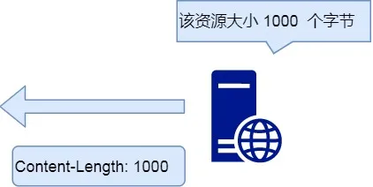
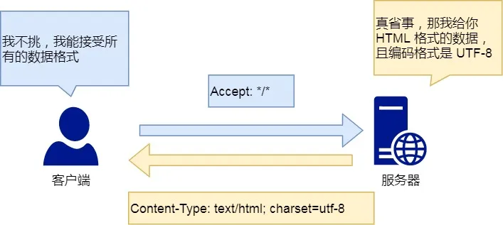
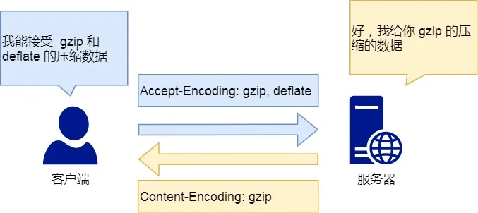

> http 常见字段有哪些？

*Host*

客户端发送请求时，用来指定服务器的域名。


```
Host: www.A.com
```

有了 `Host` 字段，就可以将请求发往「同一台」服务器上的不同网站。

*Content-Length 字段*

服务器在返回数据时，会有 `Content-Length` 字段，表明本次回应的数据长度。




```
Content-Length: 1000
```

如上面则是告诉浏览器，本次服务器回应的数据长度是 1000 个字节，后面的字节就属于下一个回应了。

*Connection 字段*

`Connection` 字段最常用于客户端要求服务器使用 TCP 持久连接，以便其他请求复用。


HTTP/1.1 版本的默认连接都是持久连接，但为了兼容老版本的 HTTP，需要指定 `Connection` 首部字段的值为 `Keep-Alive`。

```
Connection: keep-alive
```

一个可以复用的 TCP 连接就建立了，直到客户端或服务器主动关闭连接。但是，这不是标准字段。

*Content-Type 字段*

`Content-Type` 字段用于服务器回应时，告诉客户端，本次数据是什么格式。




```
Content-Type: text/html; charset=utf-8
```

上面的类型表明，发送的是网页，而且编码是UTF-8。

客户端请求的时候，可以使用 `Accept` 字段声明自己可以接受哪些数据格式。

```
Accept: */*
```

上面代码中，客户端声明自己可以接受任何格式的数据。

*Content-Encoding 字段*

`Content-Encoding` 字段说明数据的压缩方法。表示服务器返回的数据使用了什么压缩格式




```
Content-Encoding: gzip
```

上面表示服务器返回的数据采用了 gzip 方式压缩，告知客户端需要用此方式解压。

客户端在请求时，用 `Accept-Encoding` 字段说明自己可以接受哪些压缩方法。

```
Accept-Encoding: gzip, deflate
```