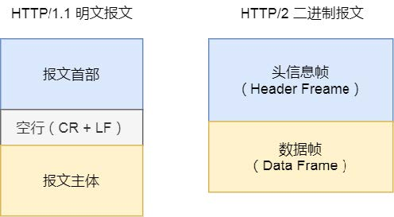

# HTTP版本

#### HTTP1.0 到 HTTP 1.1

- 长连接：

  早期 HTTP/1.0 性能上的一个很大的问题，那就是每发起一个请求，都要新建一次 TCP 连接（三次握手），而且是串行请求，做了无谓的 TCP 连接建立和断开，增加了通信开销。为了解决上述 TCP 连接问题，HTTP/1.1 提出了长连接的通信方式，也叫持久连接。这种方式的好处在于减少了 TCP 连接的重复建立和断开所造成的额外开销，减轻了服务器端的负载。

- 管道网络传输

  这个类似于TCP的窗口，后一个请求不需要等待前一个请求回来才能发送出去，而是可以一起发送出去。

  > 但是响应顺序还是先来先服务，如果前面的请求阻塞了，那么还是会使得后面的请求得不到处理，这叫“队头阻塞”

#### HTTP1.1 到 HTTP2.0

**HTTP/2 协议是基于 HTTPS 的**，所以 HTTP/2 的安全性也是有保障的。那 HTTP/2 相比 HTTP/1.1 性能上的改进：

- 头部压缩
  HTTP/2 会压缩请求头（*Header*）。如果你同时发出多个请求，他们的请求头是一样的或是相似的，那么，协议会帮你消除重复的部分。

  这就是所谓的 **HPACK** 算法：在客户端和服务器同时维护一张头信息表，所有字段都会存入这个表，生成一个索引号，以后就不发送同样字段了，只发送索引号，这样就**提高速度**了。

- 二进制格式
  HTTP/2 不再像 HTTP/1.1 里的纯文本形式的报文，而是全面采用了二进制格式，头信息和数据体都是二进制，并且统称为帧（frame）：头信息帧和数据帧。

  

  对于计算机而言，无需再将明文的报文转成二进制，而是直接解析二进制报文，这**增加了数据传输的效率**。

- 数据流
  HTTP/2 的数据包不是按顺序发送的，同一个连接里面连续的数据包，可能属于不同的回应。因此，必须要对数据包做标记，指出它属于哪个回应。

  每个请求或回应的所有数据包，称为一个数据流（`Stream`）。每个数据流都标记着一个独一无二的编号，其中规定客户端发出的数据流编号为奇数， 服务器发出的数据流编号为偶数、客户端还可以指定数据流的优先级。优先级高的请求，服务器就先响应该请求

- **多路复用**
  HTTP/2 是可以在一个连接中并发多个请求或回应，而**不用按照顺序一一对应**。移除了 HTTP/1.1 中的串行请求，不需要排队等待，也就不会再出现「队头阻塞」问题，降低了延迟，大幅度**提高了连接的利用率**。

- **服务器推送**
  HTTP/2 还在一定程度上改善了传统的「请求 - 应答」工作模式，服务不再是被动地响应，也可以主动向客户端发送消息。