> 那你说下 HTTP/1.1 的性能如何？

HTTP 协议是基于 **TCP/IP**，并且使用了「**请求 - 应答**」的通信模式，所以性能的关键就在这**两点**里。

*1. 长连接*

早期 HTTP/1.0 性能上的一个很大的问题，那就是每发起一个请求，都要新建一次 TCP 连接（三次握手），而且是串行请求，做了无畏的 TCP 连接建立和断开，增加了通信开销。

为了解决上述 TCP 连接问题，HTTP/1.1 提出了**长连接**的通信方式，也叫持久连接。这种方式的好处在于减少了 TCP 连接的重复建立和断开所造成的额外开销，减轻了服务器端的负载。

持	的特点是，只要任意一端没有明确提出断开连接，则保持 TCP 连接状态。

短连接与长连接

*2. 管道网络传输*

HTTP/1.1 采用了长连接的方式，这使得管道（pipeline）网络传输成为了可能。

即可在同一个 TCP 连接里面，客户端可以发起多个请求，只要第一个请求发出去了，不必等其回来，就可以发第二个请求出去，可以**减少整体的响应时间。**

举例来说，客户端需要请求两个资源。以前的做法是，在同一个TCP连接里面，先发送 A 请求，然后等待服务器做出回应，收到后再发出 B 请求。管道机制则是允许浏览器同时发出 A 请求和 B 请求。

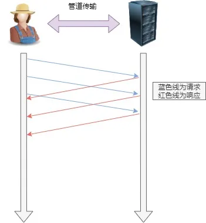管道网络传输

但是服务器还是按照**顺序**，先回应 A 请求，完成后再回应 B 请求。要是 前面的回应特别慢，后面就会有许多请求排队等着。这称为「队头堵塞」。

*3. 队头阻塞*

「请求 - 应答」的模式加剧了 HTTP 的性能问题。

因为当顺序发送的请求序列中的一个请求因为某种原因被阻塞时，在后面排队的所有请求也一同被阻塞了，会招致客户端一直请求不到数据，这也就是「**队头阻塞**」。**好比上班的路上塞车**。

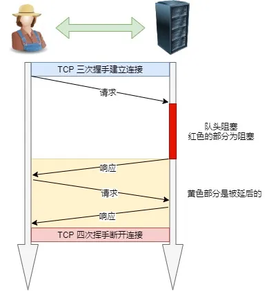队头阻塞

总之 HTTP/1.1 的性能一般般，后续的 HTTP/2 和 HTTP/3 就是在优化 HTTP 的性能。

------

> 说说 HTTP/1.1 相比 HTTP/1.0 提高了什么性能？

HTTP/1.1 相比 HTTP/1.0 性能上的改进：

- 使用 TCP 长连接的方式改善了 HTTP/1.0 短连接造成的性能开销。
- 支持 管道（pipeline）网络传输，只要第一个请求发出去了，不必等其回来，就可以发第二个请求出去，可以减少整体的响应时间。

但 HTTP/1.1 还是有性能瓶颈：

- 请求 / 响应头部（Header）未经压缩就发送，首部信息越多延迟越大。只能压缩 `Body` 的部分；
- 发送冗长的首部。每次互相发送相同的首部造成的浪费较多；
- 服务器是按请求的顺序响应的，如果服务器响应慢，会招致客户端一直请求不到数据，也就是队头阻塞；
- 没有请求优先级控制；
- 请求只能从客户端开始，服务器只能被动响应。

> 那上面的 HTTP/1.1 的性能瓶颈，HTTP/2 做了什么优化？

HTTP/2 协议是基于 HTTPS 的，所以 HTTP/2 的安全性也是有保障的。

那 HTTP/2 相比 HTTP/1.1 性能上的改进：

*1. 头部压缩*

HTTP/2 会**压缩头**（Header）如果你同时发出多个请求，他们的头是一样的或是相似的，那么，协议会帮你**消除重复的分**。

这就是所谓的 `HPACK` 算法：在客户端和服务器同时维护一张头信息表，所有字段都会存入这个表，生成一个索引号，以后就不发送同样字段了，只发送索引号，这样就**提高速度**了。

*2. 二进制格式*

HTTP/2 不再像 HTTP/1.1 里的纯文本形式的报文，而是全面采用了**二进制格式。**

头信息和数据体都是二进制，并且统称为帧（frame）：**头信息帧和数据帧**。

报文区别

这样虽然对人不友好，但是对计算机非常友好，因为计算机只懂二进制，那么收到报文后，无需再将明文的报文转成二进制，而是直接解析二进制报文，这**增加了数据传输的效率**。

*3. 数据流*

HTTP/2 的数据包不是按顺序发送的，同一个连接里面连续的数据包，可能属于不同的回应。因此，必须要对数据包做标记，指出它属于哪个回应。

每个请求或回应的所有数据包，称为一个数据流（`Stream`）。

每个数据流都标记着一个独一无二的编号，其中规定客户端发出的数据流编号为奇数， 服务器发出的数据流编号为偶数

客户端还可以**指定数据流的优先级**。优先级高的请求，服务器就先响应该请求。

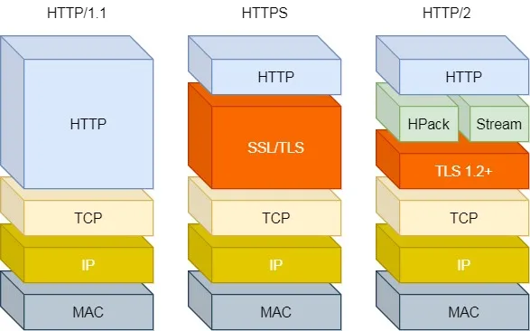HTT/1 ~ HTTP/2

*4. 多路复用*

HTTP/2 是可以在**一个连接中并发多个请求或回应，而不用按照顺序一一对应**。

移除了 HTTP/1.1 中的串行请求，不需要排队等待，也就不会再出现「队头阻塞」问题，**降低了延迟，大幅度提高了连接的利用率**。

举例来说，在一个 TCP 连接里，服务器收到了客户端 A 和 B 的两个请求，如果发现 A 处理过程非常耗时，于是就回应 A 请求已经处理好的部分，接着回应 B 请求，完成后，再回应 A 请求剩下的部分。

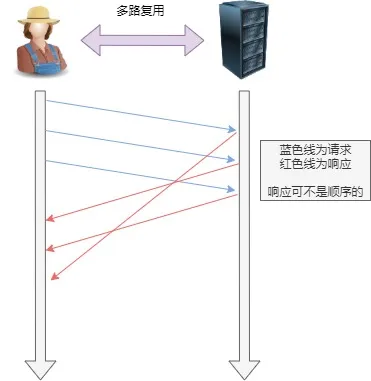多路复用

*5. 服务器推送*

HTTP/2 还在一定程度上改善了传统的「请求 - 应答」工作模式，服务不再是被动地响应，也可以**主动**向客户端发送消息。

举例来说，在浏览器刚请求 HTML 的时候，就提前把可能会用到的 JS、CSS 文件等静态资源主动发给客户端，**减少延时的等待**，也就是服务器推送（Server Push，也叫 Cache Push）。

> HTTP/2 有哪些缺陷？HTTP/3 做了哪些优化？

HTTP/2 主要的问题在于：多个 HTTP 请求在复用一个 TCP 连接，下层的 TCP 协议是不知道有多少个 HTTP 请求的。

所以一旦发生了丢包现象，就会触发 TCP 的重传机制，这样在一个 TCP 连接中的**所有的 HTTP 请求都必须等待这个丢了的包被重传回来**。

- HTTP/1.1 中的管道（ pipeline）传输中如果有一个请求阻塞了，那么队列后请求也统统被阻塞住了
- HTTP/2 多请求复用一个TCP连接，一旦发生丢包，就会阻塞住所有的 HTTP 请求。

这都是基于 TCP 传输层的问题，所以 **HTTP/3 把 HTTP 下层的 TCP 协议改成了 UDP！**

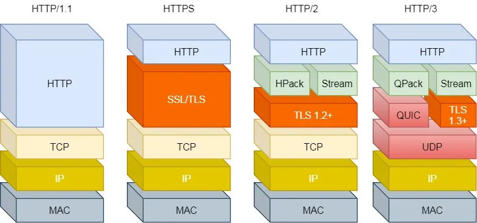HTTP/1 ~ HTTP/3

UDP 发生是不管顺序，也不管丢包的，所以不会出现 HTTP/1.1 的队头阻塞 和 HTTP/2 的一个丢包全部等待重传问题。

大家都知道 UDP 是不可靠传输的，但基于 UDP 的 **QUIC 协议** 可以实现类似 TCP 的可靠性传输。

- QUIC 有自己的一套机制可以保证传输的可靠性的。当某个流发生丢包时，只会阻塞这个流，**其他流不会受到影响**。
- TL3 升级成了最新的 `1.3` 版本，头部压缩算法也升级成了 `QPack`。
- HTTPS 要建立一个连接，要花费 6 次交互，先是建立三次握手，然后是 `TLS/1.3` 的三次握手。QUIC 直接把以往的 TCP 和 `TLS/1.3` 的 6 次交互**合并成了 3 次，减少了交互次数**。

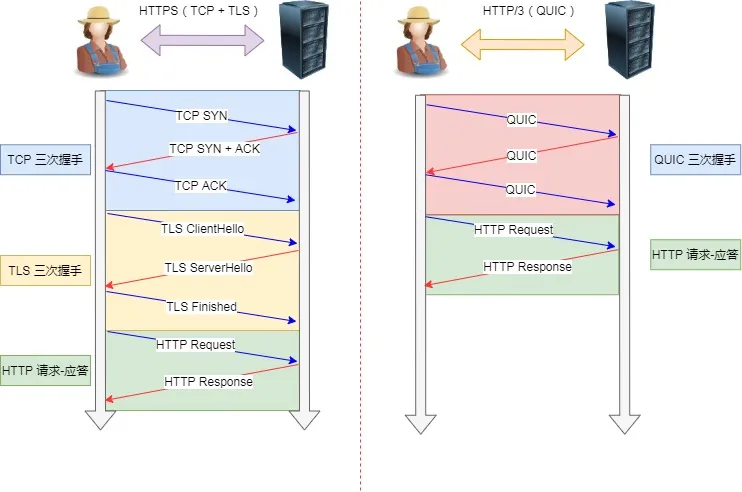TCP HTTPS（TLS/1.3） 和 QUIC HTTPS

所以， QUIC 是一个在 UDP 之上的**伪** TCP + TLS + HTTP/2 的多路复用的协议。

QUIC 是新协议，对于很多网络设备，根本不知道什么是 QUIC，只会当做 UDP，这样会出现新的问题。所以 HTTP/3 现在普及的进度非常的缓慢，不知道未来 UDP 是否能够逆袭 TCP。

------

## HTTP / 0.9 时代

在 1989 年，李老发表了一篇论文，文中提出了三项现在看来很平常的三个概念。

- URI，统一资源标识符，作为互联网上的唯一标识。
- HTML，超文本标记语言，描述超文本。
- HTTP ，超文本传输协议，传输超文本。

随后李老就付之于行动，把这些都搞出来了，称之为万维网（World Wide Web）。

那时候是互联网初期，计算机的处理能力包括网速等等都很弱，所以 HTTP 也逃脱不了那个时代的约束，因此设计的非常简单，而且也是纯文本格式。

李老当时的想法是文档存在服务器里面，我们只需要从服务器获取文档，因此只有 “GET”，也不需要啥请求头，并且拿完了就结束了，因此请求响应之后连接就断了。

这就是为什么 HTTP 设计为文本协议，并且一开始只有“GET”、响应之后连接就断了的原因了。

在我们现在看来这协议太简陋了，但是在当时这是互联网发展的一大步！一个东西从无到有是最困难的。

## HTTP 1.0 时代

人们的需求是无止尽的，随着图像和音频的发展，浏览器也在不断的进步予以支持。

所以在 HTTP/1.0 版本主要增加以下几点：

- 增加了 HEAD、POST 等新方法。
- 增加了响应状态码。
- 引入了头部，即请求头和响应头。
- 在请求中加入了 HTTP 版本号。
- 引入了 Content-Type ，使得传输的数据不再限于文本。

可以看到引入了新的方法，填充了操作的语义，像  HEAD 还可以只拿元信息不必传输全部内容，提高某些场景下的效率。

引入的响应状态码让请求方可以得知服务端的情况，可以区分请求出错的原因，不会一头雾水。

引入了头部，使得请求和响应更加的灵活，把控制数据和业务实体进行了拆分，也是一种解耦。

新增了版本号表明这是一种工程化的象征，说明走上了正途，毕竟没版本号无法管理。

引入了 Content-Type，支持传输不同类型的数据，丰富了协议的载体，充实了用户的眼球。

但是那时候 HTTP/1.0 还不是标准，没有实际的约束力，各方势力不吃这一套，大白话就是你算老几。

## HTTP 1.1 时代

HTTP/1.1 版本在 1997 的 RFC 2068 中首次被记录，从 1995 年至 1999 年间的第一次浏览器大战，极大的推动了 Web 的发展。

随着发展 HTTP/1.0 演进成了 HTTP/1.1，并且在 1999 年废弃了之前的 RFC 2068，发布了 RFC 2616。

从版本号可以得知这是一个小版本的更新，更新主要是因为 HTTP/1.0 很大的性能问题，就是每请求一个资源都得新建一个 TCP 连接，而且只能串行请求。

所以在 HTTP/1.1 版本主要增加以下几点：

- 新增了连接管理即 keepalive ，允许持久连接。
- 支持 pipeline，无需等待前面的请求响应，即可发送第二次请求。
- 允许响应数据分块（chunked），即响应的时候不标明Content-Length，客户端就无法断开连接，直到收到服务端的 EOF ，利于传输大文件。
- 新增缓存的控制和管理。
- 加入了 Host 头，用在你一台机子部署了多个主机，然后多个域名解析又是同一个 IP，此时加入了 Host 头就可以判断你到底是要访问哪个主机。

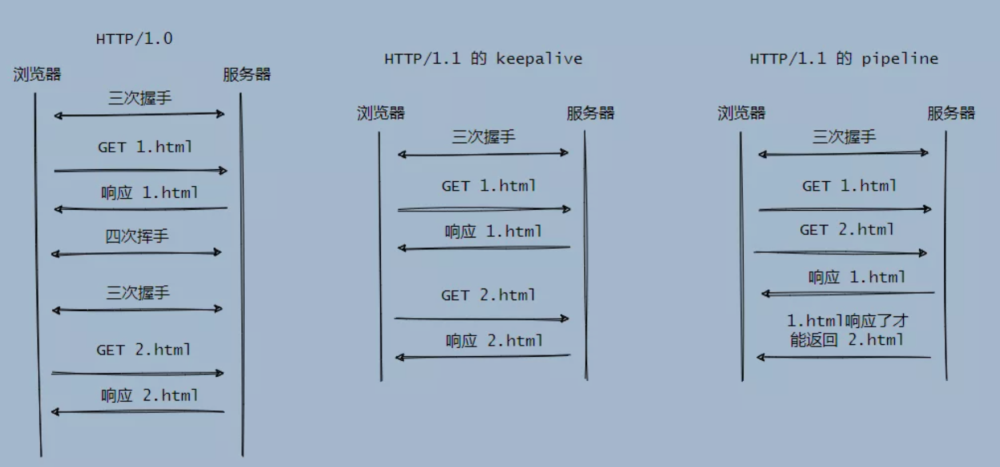

可以看到浏览器大战推进了 Web 的发展，也暴露出 HTTP/1.0 的不足之处，毕竟网络带宽等等都在进步，总不能让协议限制了硬件的发展。

因此提出了 HTTP/1.1 ，主要是为了解决性能的问题，包括支持持久连接、pipeline、缓存管理等等，也添加了一些特性。

再后来到 2014 年对 HTTP/1.1 又做了一次修订，因为其太过庞大和复杂，因此进行了拆分，弄成了六份小文档 RFC7230 - RFC7235

这时候 HTTP/1.1 已经成了标准，其实标准往往是在各大强力竞争对手相对稳定之后建立的，因为标准意味着统一，统一就不用费劲心思去兼容各种玩意。

只有强大的势力才能定标准，当你足够强大的时候你也可以定标准，去挑战老标准。

## HTTP 2 时代

随着 HTTP/1.1 的发布，互联网也开始了爆发式的增长，这种增长暴露出 HTTP 的不足，主要还是性能问题，而 HTTP/1.1 无动于衷。

这就是人的惰性，也符合平日里我们对产品的演进，当你足够强大又安逸的时候，任何的改动你是不想理会的。

别用咯。

这时候 Google 看不下去了，你不搞是吧？我自己搞我的，我自己和我自己玩，我用户群体大，我有 Chrome，我服务多了去了。

Google 推出了 SPDY 协议，凭借着它全球的占有率超过了 60% 的底气，2012年7月，开发 SPDY 的小组公开表示，它正在努力实现标准化。

HTTP 坐不住了，之后互联网标准化组织以 SPDY 为基础开始制定新版本的 HTTP 协议，最终在 2015 年发布了 HTTP/2。

HTTP/2 版本主要增加以下几点：

- 是二进制协议，不再是纯文本。
- 支持一个 TCP 连接发起多请求，移除了 pipeline。
- 利用 HPACK 压缩头部，减少数据传输量。
- 允许服务端主动推送数据。

从文本到二进制其实简化了整齐的复杂性，解析数据的开销更小，数据更加紧凑，减少了网络的延迟，提升了整体的吞吐量。

支持一个 TCP 连接发起多请求，即支持多路复用，像 HTTP/1.1 pipeline 还是有阻塞的情况，需要等前面的一个响应返回了后面的才能返回。

而多路复用就是完全异步化，这减少了整体的往返时间（RTT），解决了 HTTP 队头阻塞问题，也规避了 TCP 慢启动带来的影响。

HPACK 压缩头部，采用了静态表、动态表和哈夫曼编码，在客户端和服务器都维护请求头的列表，所以只需要增量和压缩过的头部信息，服务端拿到之后组装一下就能得到完整的头部信息。

形象一点就是如下图所示：

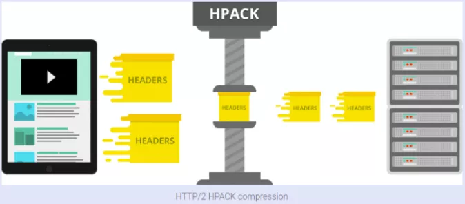

再具体一点就是下图这样：

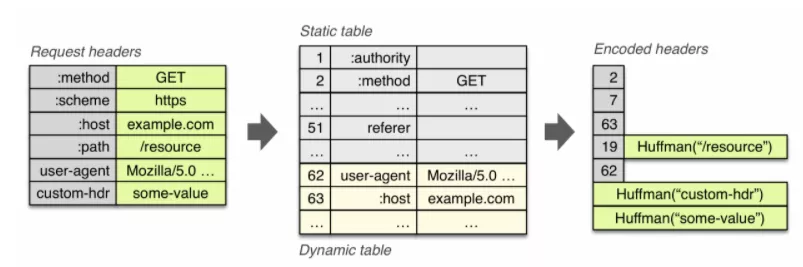

服务端主动推送数据，这个其实就是减少了请求的次数，比如客户端请求 1.html，我把 1.html 需要的 js 和 css 也一块送过去，省的之后客户端再请求我要 js ，我要这个 css。

可以看到 HTTP/2 的整体演进都是往性能优化的角度发展，因为此时的性能就是痛点，任何东西的演进都是哪里痛医哪里。

当然有一些例外，比如一些意外，或者就是“闲的蛋疼”的那种捯饬。

这次推进属于用户揭竿而起为之，你再不给我升级我自己搞了，我有着资本，你自己掂量。

最终结果是好的，Google 后来放弃了 SPDY ，拥抱标准，而 HTTP/1.1 这个历史包袱太重了，所以 HTTP/2 到现在也只有大致一半的网站使用它。

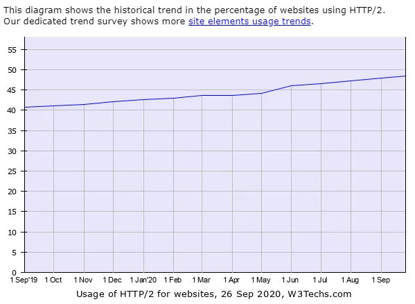

## HTTP 3 时代

这 HTTP/2 还没捂热， HTTP/3 怎么就来了？

这次又是 Google，它自己突破自己，主要也是源自于痛点，这次的痛点来自于 HTTP 依赖的 TCP。

TCP 是面向可靠的、有序的传输协议，因此会有失败重传和按序机制，而 HTTP/2 是所有流共享一个 TCP 连接，所以会有 TCP 层面的队头阻塞，当发生重传时会影响多个请求响应。

并且 TCP 是基于四元组（源IP，源端口，目标IP，目标端口）来确定连接的，而在移动网络的情况下 IP 地址会频繁的换，这会导致反复的建连。

还有 TCP 与 TLS 的叠加握手，增加了延时。

问题就出在 TCP 身上，所以 Google 就把目光瞄向了 UDP。

UDP 我们知道是无连接的，不管什么顺序，也不管你什么丢包，而 TCP 我在之前的文章说的很清楚了[TCP疑难杂症解析](https://mp.weixin.qq.com/s?__biz=Mzg2MjEyNTk1Ng==&mid=2247485428&idx=1&sn=162d5b7b5746af08fafaf7cd28aa0970&scene=21#wechat_redirect)不了解的同学可以去看看。

简单的说就是 TCP 太无私了，或者说太保守了，现在需要一种更激进的做法。

那怎么搞? TCP 改不动我就换！然后把 TCP 可靠、有序的功能提到应用层来实现，因此 Google 就研究出了 QUIC 协议。

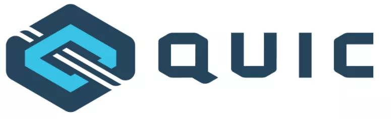

QUIC 层来实现自己的丢包重传和拥塞控制，还有出于安全的考虑我们都会用 HTTPS ，所以需要多次握手。

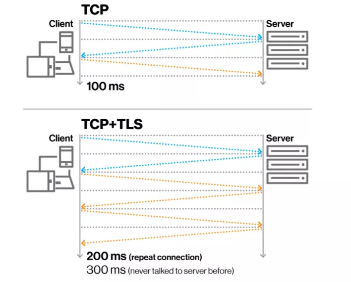

上面我也已经提到了关于四元组的情况，所以在移动互联网时代这握手的消耗就更加放大了，于是 QUIC 引入了个叫 Connection ID 来标识一个链接，所以切换网络之后可以复用这个连接，达到 0 RTT 就能开始传输。

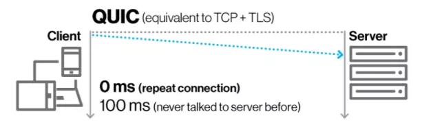

注意上图是在已经和服务端握过手之后的，由于网络切换等原因才有 0 RTT ，也就是 Connection ID 在之前生成过了。

如果是第一次建连还是需要多次握手的，我们来看一下简化的握手对比图。

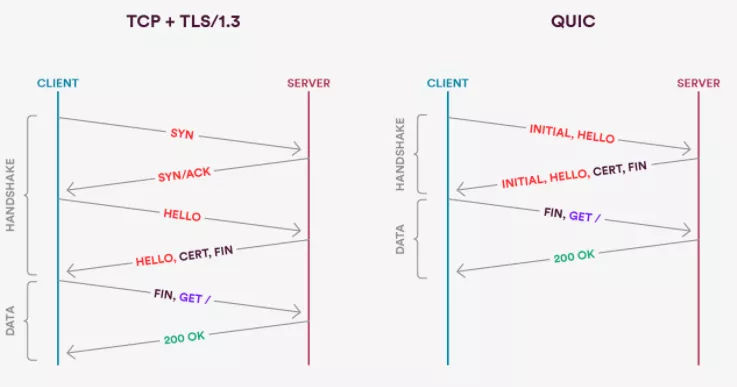

所以所谓的 0RTT 是在之前已经建连的情况下。

当然还有 HTTP/2 提到的 HPACK，这个是依赖 TCP 的可靠、有序传输的，于是 QUIC 得搞了个 QPACK，也采用了静态表、动态表和哈夫曼编码。

它丰富了 HTTP/2 的静态表，从 61 项加到了 98 项。

上面提到的动态表，是用来存储未包含在静态表中的头部项，假设动态表还未收到，后面来解头部的时候肯定要被阻塞的。

所以 QPACK 就另开一条路，在单向的 Stream 里传输动态表的编解码，单向传输好了，接受端到才能开始解码，也就是说还没好你就先别管，防止做一半卡住了。

那还有前面提到的 TCP 队头阻塞， QUIC 是怎么解决的呢？毕竟它也要保证有序和可靠啊。

因为 TCP 不认识每个流分别是哪个请求的，所以它只能全部阻塞住，而 QUIC 知道，因此比如请求 A 丢包了，我就把 A 卡住了就行，请求 B 完全可以全部放行，丝毫不受影响。

可以看到基于 UDP 的 QUIC 还是很强大的，而且人家用户多，在 2018 年，互联网标准化组织 IETF 提议将 HTTP over QUIC 更名为 HTTP/3 并获得批准。

可以看到需求又推动技术的进步，由于 TCP 自身机制的限制，我们的目光已经往 UDP 上靠了，那 TCP 会不会成为历史呢？

我们拭目以待。

## 最后

今天我们大致过了一遍 HTTP 发展的历史和它的演进之路，可以看到技术是源于需求，需求推动着技术的发展。

本质上就是人的惰性，只有痛了才会成长。

而且标准其实也是巨头们为了他们的利益推动的，不过标准确实能减轻对接的开销，统一而方便。

当然就 HTTP 来说还是有很多内容的，有很多细节，很多算法，比如拿 Connection ID 来说，不同的四元组你如何保证请求一定会转发到之前的服务器上？

所以今天我只是浅显的谈了谈大致的演进，具体的实现还是得靠各位自己摸索，或者之后有机会我再写一些。

不过相对于这些实现细节我更感兴趣的是历史的演进，这能让我从时代背景等一些约束来得知，为什么这东西一开始是这么设计的，从而更深刻的理解这玩意。

而且历史还是很有趣的，不是么？