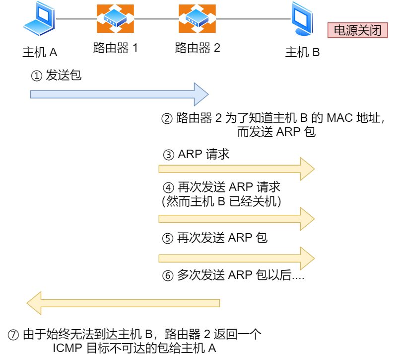
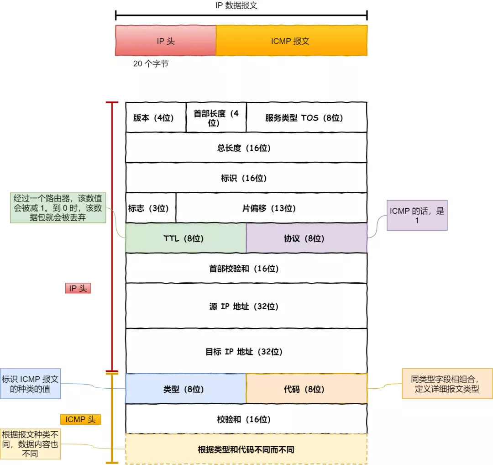
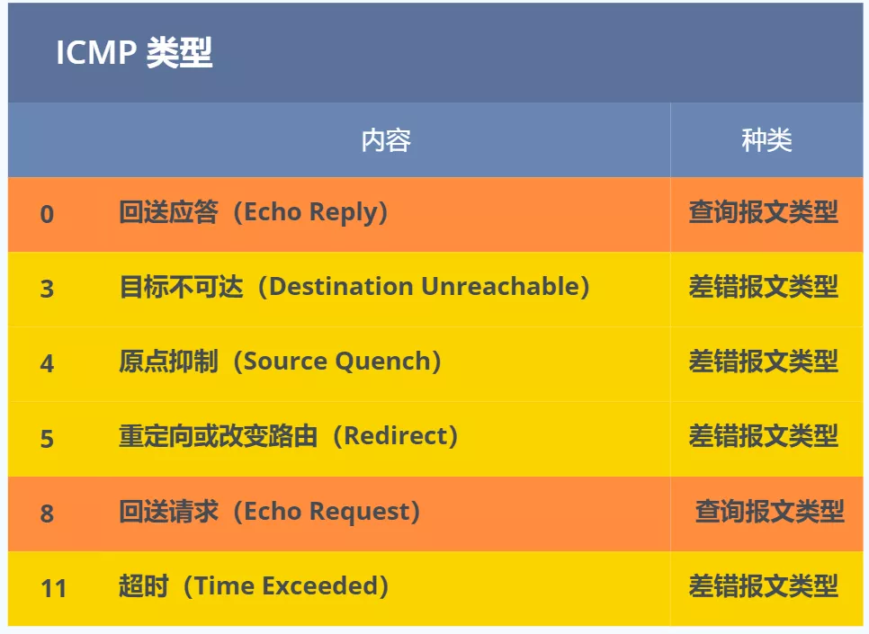
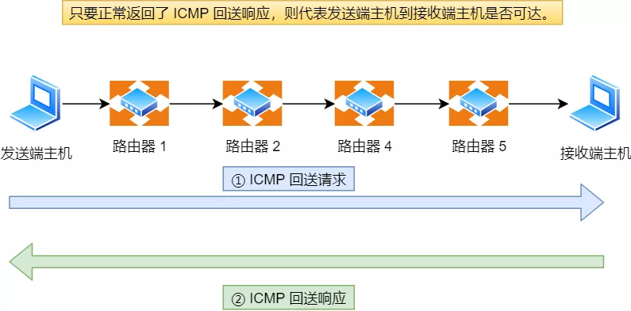
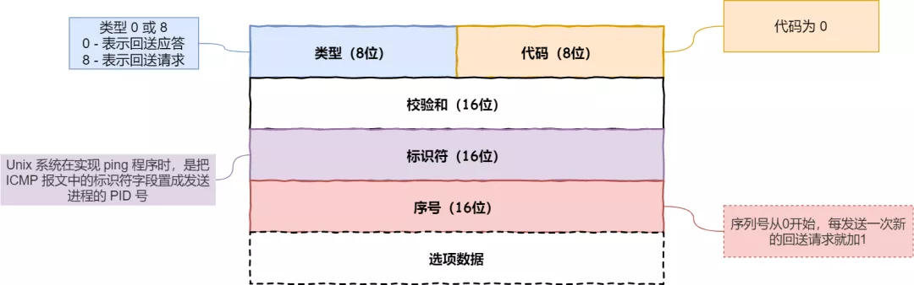
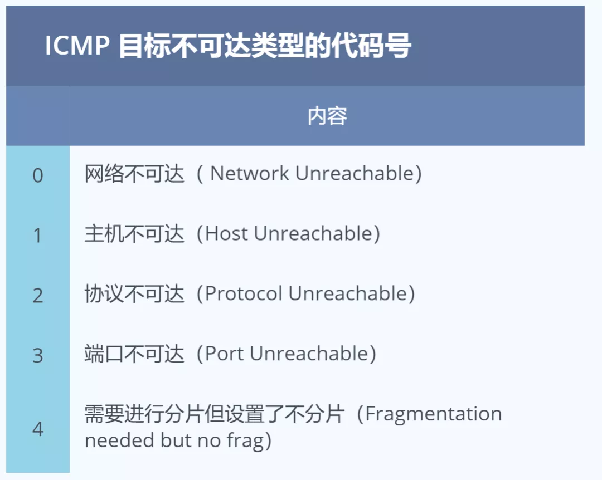
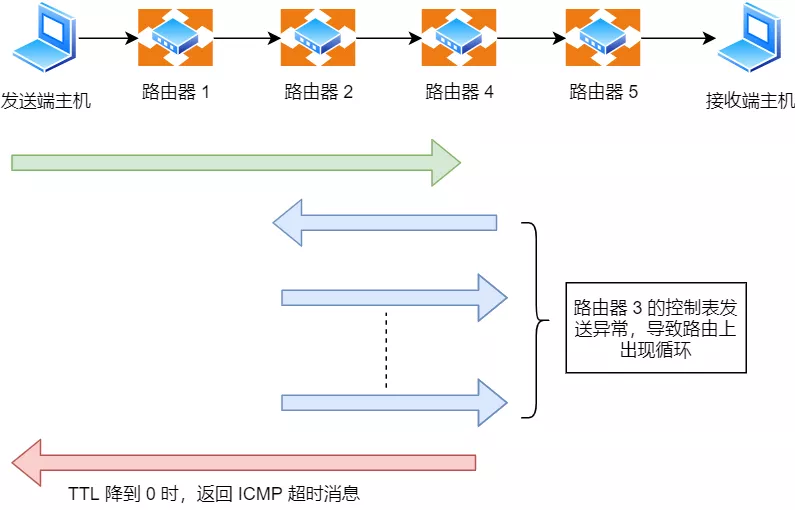

### IP协议的助手 —— ICMP 协议

ping 是基于 `ICMP` 协议工作的，所以要明白 ping 的工作，首先我们先来熟悉 **ICMP 协议**。

> ICMP 是什么？

ICMP 全称是 **Internet Control Message Protocol**，也就是**互联网控制报文协议**。

里面有个关键词 —— **控制**，如何控制的呢？

网络包在复杂的网络传输环境里，常常会遇到各种问题。当遇到问题的时候，总不能死个不明不白，没头没脑的作风不是计算机网络的风格。所以需要传出消息，报告遇到了什么问题，这样才可以调整传输策略，以此来控制整个局面。

> ICMP 功能都有啥？

`ICMP` 主要的功能包括：**确认 IP 包是否成功送达目标地址、报告发送过程中 IP 包被废弃的原因和改善网络设置等。**

在 `IP` 通信中如果某个 `IP` 包因为某种原因未能达到目标地址，那么这个具体的原因将**由 ICMP 负责通知**。ICMP 目标不可达消息

如上图例子，主机 `A` 向主机 `B` 发送了数据包，由于某种原因，途中的路由器 `2` 未能发现主机 `B` 的存在，这时，路由器 `2` 就会向主机 `A` 发送一个 `ICMP` 目标不可达数据包，说明发往主机 `B` 的包未能成功。

ICMP 的这种通知消息会使用 `IP` 进行发送 。

因此，从路由器 `2` 返回的 ICMP 包会按照往常的路由控制先经过路由器 `1` 再转发给主机 `A` 。

收到该 ICMP 包的主机 `A` 则分解 ICMP 的首部和数据域以后得知具体发生问题的原因。

> ICMP 包头格式

ICMP 报文是封装在 IP 包里面，它工作在网络层，是 IP 协议的助手。

ICMP 报文

ICMP 包头的**类型**字段，大致可以分为两大类：

- 一类是用于诊断的查询消息，也就是「**查询报文类型**」
- 另一类是通知出错原因的错误消息，也就是「**差错报文类型**」

常见的 ICMP 类型

### 查询报文类型

> 回送消息 —— 类型 `0` 和 `8`

**回送消息**用于进行通信的主机或路由器之间，判断所发送的数据包是否已经成功到达对端的一种消息，`ping` 命令就是利用这个消息实现的。

ICMP 回送消息

可以向对端主机发送**回送请求**的消息（`ICMP Echo Request Message`，类型 `8`），也可以接收对端主机发回来的**回送应答**消息（`ICMP Echo Reply Message`，类型 `0`）。

ICMP 回送请求和回送应答报文

相比原生的 ICMP，这里多了两个字段：

- **标识符**：用以区分是哪个应用程序发 ICMP 包，比如用进程 `PID` 作为标识符；
- **序号**：序列号从 `0` 开始，每发送一次新的回送请求就会加 `1`， 可以用来确认网络包是否有丢失。

在**选项数据**中，`ping` 还会存放发送请求的时间值，来计算往返时间，说明路程的长短。

### 差错报文类型

接下来，说明几个常用的 ICMP 差错报文的例子：

- 目标不可达消息 —— 类型 为 `3`
- 原点抑制消息 —— 类型 `4`
- 重定向消息 —— 类型 `5`
- 超时消息 —— 类型 `11`

``

> 目标不可达消息（Destination Unreachable Message） —— 类型为 `3`

IP 路由器无法将 IP 数据包发送给目标地址时，会给发送端主机返回一个**目标不可达**的 ICMP 消息，并在这个消息中显示不可达的具体原因，原因记录在 ICMP 包头的**代码**字段。

由此，根据 ICMP 不可达的具体消息，发送端主机也就可以了解此次发送**不可达的具体原因**。

举例 6 种常见的目标不可达类型的**代码**：

目标不可达类型的常见代码号

- 网络不可达代码为 `0`
- 主机不可达代码为 `1`
- 协议不可达代码为 `2`
- 端口不可达代码为 `3`
- 需要进行分片但设置了不分片位代码为 `4`

为了给大家说清楚上面的目标不可达的原因，**小林牺牲自己给大家送 5 次外卖。**

为什么要送外卖？别问，问就是为 `35` 岁的老林做准备 …

外卖员 —— 小林

###### a. 网络不可达代码为 0

*外卖版本：*

小林第一次送外卖时，小区里只有 A 和 B 区两栋楼，但送餐地址写的是 C 区楼，小林表示头上很多问号，压根就没这个地方。

*正常版本：*

IP 地址是分为网络号和主机号的，所以当路由器中的路由器表匹配不到接收方 IP 的网络号，就通过 ICMP 协议以**网络不可达**（`Network Unreachable`）的原因告知主机。

自从不再有网络分类以后，网络不可达也渐渐不再使用了。

###### b. 主机不可达代码为 1

*外卖版本：*

小林第二次送外卖时，这次小区有 5 层楼高的 C 区楼了，找到地方了，但送餐地址写的是 C 区楼 601 号房 ，说明找不到这个房间。

*正常版本：*

当路由表中没有该主机的信息，或者该主机没有连接到网络，那么会通过 ICMP 协议以**主机不可达**（`Host Unreachable`）的原因告知主机。

###### c. 协议不可达代码为 2

*外卖版本：*

小林第三次送外卖时，这次小区有 C 区楼，也有 601 号房，找到地方了，也找到房间了，但是一开门人家是外国人说的是英语，我说的是中文！语言不通，外卖送达失败~

*正常版本：*

当主机使用 TCP 协议访问对端主机时，能找到对端的主机了，可是对端主机的防火墙已经禁止 TCP 协议访问，那么会通过 ICMP 协议以**协议不可达**的原因告知主机。

###### d. 端口不可达代码为 3

*外卖版本：*

小林第四次送外卖时，这次小区有 C 区楼，也有 601 号房，找到地方了，也找到房间了，房间里的人也是说中文的人了，但是人家说他要的不是外卖，而是快递。。。

*正常版本：*

当主机访问对端主机 8080 端口时，这次能找到对端主机了，防火墙也没有限制，可是发现对端主机没有进程监听 8080 端口，那么会通过 ICMP 协议以**端口不可达**的原因告知主机。

###### e. 需要进行分片但设置了不分片位代码为 4

*外卖版本：*

小林第五次送外卖时，这次是个吃播博主了 100 份外卖，但是吃播博主要求一次性要把全部外卖送达，小林的一台电动车装不下呀，这样就没办法送达了。

*正常版本：*

发送端主机发送 IP 数据报时，将 IP 首部的**分片禁止标志位**设置为`1`。根据这个标志位，途中的路由器遇到超过 MTU 大小的数据包时，不会进行分片，而是直接抛弃。

随后，通过一个 ICMP 的不可达消息类型，**代码为 4** 的报文，告知发送端主机。

> 原点抑制消息（ICMP Source Quench Message） —— 类型 `4`

在使用低速广域线路的情况下，连接 WAN 的路由器可能会遇到网络拥堵的问题。

`ICMP` 原点抑制消息的目的就是**为了缓和这种拥堵情况**。

当路由器向低速线路发送数据时，其发送队列的缓存变为零而无法发送出去时，可以向 IP 包的源地址发送一个 ICMP **原点抑制消息**。

收到这个消息的主机借此了解在整个线路的某一处发生了拥堵的情况，从而增大 IP 包的传输间隔，减少网络拥堵的情况。

然而，由于这种 ICMP 可能会引起不公平的网络通信，一般不被使用。

> 重定向消息（ICMP Redirect Message） —— 类型 `5`

如果路由器发现发送端主机使用了「不是最优」的路径发送数据，那么它会返回一个 ICMP **重定向消息**给这个主机。

在这个消息中包含了**最合适的路由信息和源数据**。这主要发生在路由器持有更好的路由信息的情况下。路由器会通过这样的 ICMP 消息告知发送端，让它下次发给另外一个路由器。

好比，小林本可以过条马路就能到的地方，但小林不知道，所以绕了一圈才到，后面小林知道后，下次小林就不会那么**傻**再绕一圈了。

> 超时消息（ICMP Time Exceeded Message） —— 类型 `11`

IP 包中有一个字段叫做 `TTL` （`Time To Live`，生存周期），它的**值随着每经过一次路由器就会减 1，直到减到 0 时该 IP 包会被丢弃。**

此时，IP 路由器将会发送一个 ICMP **超时消息**给发送端主机，并通知该包已被丢弃。

设置 IP 包生存周期的主要目的，是为了在路由控制遇到问题发生循环状况时，避免 IP 包无休止地在网络上被转发。

ICMP 时间超过消息

此外，有时可以用 TTL 控制包的到达范围，例如设置一个**较小的 TTL 值**。