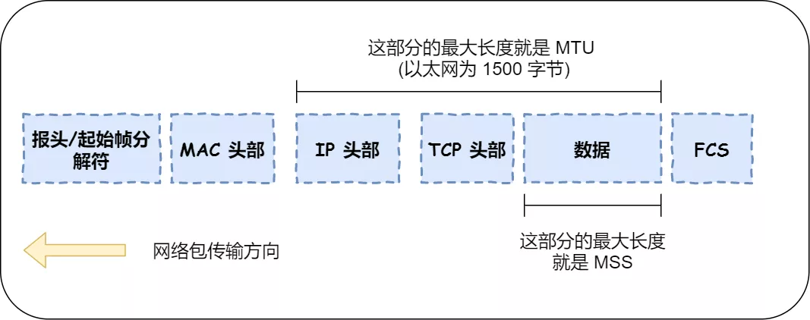
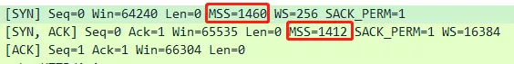
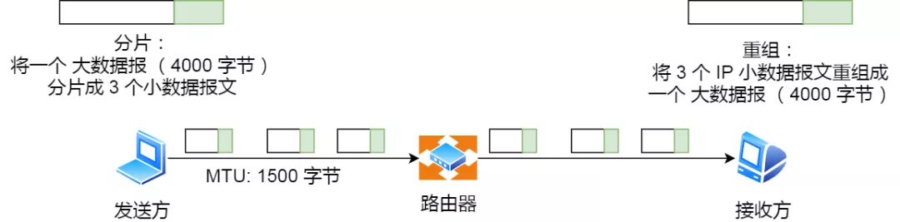

> 既然 IP 层会分片，为什么 TCP 层还需要 MSS 呢？

我们先来认识下 MTU 和 MSS

MTU 与 MSS

- `MTU`：一个网络包的最大长度，以太网中一般为 `1500` 字节；
- `MSS`：除去 IP 和 TCP 头部之后，一个网络包所能容纳的 TCP 数据的最大长度；

如果TCP 的整个报文（头部 + 数据）交给 IP 层进行分片，会有什么异常呢？

当 IP 层有一个超过 `MTU` 大小的数据（TCP 头部 + TCP 数据）要发送，那么 IP 层就要进行分片，把数据分片成若干片，保证每一个分片都小于 MTU。把一份 IP 数据报进行分片以后，由目标主机的 IP 层来进行重新组装后，在交给上一层 TCP 传输层。

这看起来井然有序，但这存在隐患的，**那么当如果一个 IP 分片丢失，整个 IP 报文的所有分片都得重传**。

因为 IP 层本身没有超时重传机制，它由传输层的 TCP 来负责超时和重传。

当接收方发现 TCP 报文（头部 + 数据）的某一片丢失后，则不会响应 ACK 给对方，那么发送方的 TCP 在超时后，就会重发「整个 TCP 报文（头部 + 数据）」。

因此，可以得知由 IP 层进行分片传输，是非常没有效率的。

所以，为了达到最佳的传输效能 TCP 协议在**建立连接的时候通常要协商双方的 MSS 值**，当 TCP 层发现数据超过 MSS 时，则就先会进行分片，当然由它形成的 IP 包的长度也就不会大于 MTU ，自然也就不用 IP 分片了。

握手阶段协商 MSS

经过 TCP 层分片后，如果一个 TCP 分片丢失后，**进行重发时也是以 MSS 为单位**，而不用重传所有的分片，大大增加了重传的效率。

------

#### IP 分片与重组

每种数据链路的最大传输单元 `MTU` 都是不相同的，如 FDDI 数据链路 MTU 4352、以太网的 MTU 是 1500 字节等。

每种数据链路的 MTU 之所以不同，是因为每个不同类型的数据链路的使用目的不同。使用目的不同，可承载的 MTU 也就不同。

其中，我们最常见数据链路是以太网，它的 MTU 是 `1500` 字节。

那么当 IP 数据包大小大于 MTU 时， IP 数据包就会被分片。

经过分片之后的 IP 数据报在被重组的时候，只能由目标主机进行，路由器是不会进行重组的。

假设发送方发送一个 4000 字节的大数据报，若要传输在以太网链路，则需要把数据报分片成 3 个小数据报进行传输，再交由接收方重组成大数据报。

分片与重组

在分片传输中，一旦某个分片丢失，则会造成整个 IP 数据报作废，所以 TCP 引入了 `MSS` 也就是在 TCP 层进行分片不由 IP 层分片，那么对于 UDP 我们尽量不要发送一个大于 `MTU` 的数据报文。