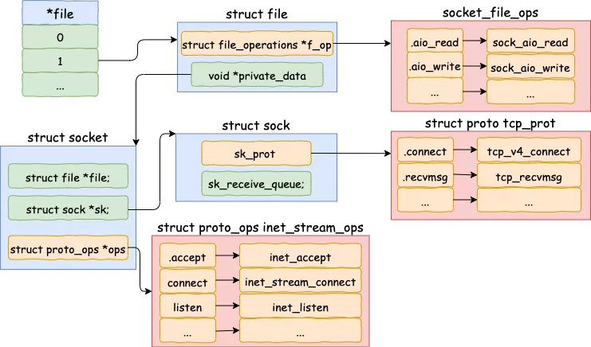
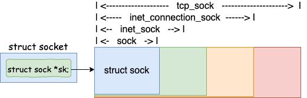
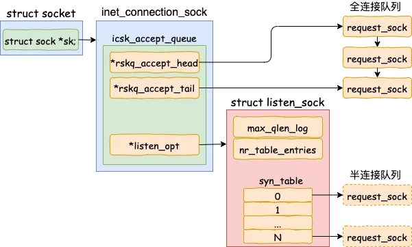

大家好，我是飞哥。飞哥在北京摇号 9 年多，最近终于算是搞下来个北京的电动车牌，其中的艰难过程写个一万字估计都写不完。不管咋说，新能源也是车，总算是有车能开了。这几天买车卖车（外地牌）忙的团团转。不过无论多忙，硬核文章仍然不能停！

大家都知道，在创建一个服务器程序的时候，需要先 listen 一下，然后才能接收客户端的请求。例如下面的这段代码我们再熟悉不过了。

```
int main(int argc, char const *argv[])
{
 int fd = socket(AF_INET, SOCK_STREAM, 0);
 bind(fd, ...);
 listen(fd, 128);
 accept(fd, ...);
```

那么我们今天来思考一个问题，**为什么需要 listen 一下才能接收连接？**或者换句话说，listen 内部执行的时候到底干了啥？

如果你也想搞清楚 listen 内部的这些秘密，那么请跟我来！

## 一、创建 socket

服务器要做的第一件事就是先创建一个 socket。具体就是通过调用 socket 函数。当 socket 函数执行完毕后，在用户层视角我们是看到返回了一个文件描述符 fd。但在内核中其实是一套内核对象组合，大体结构如下。



这里简单了解这个结构就行，后面我们在源码中看到函数指针调用的时候需要回头再来看它。

## 二、内核执行 listen

### 2.1 listen 系统调用

我在 net/socket.c 下找到了 listen 系统调用的源码。

```
//file: net/socket.c
SYSCALL_DEFINE2(listen, int, fd, int, backlog)
{
 //根据 fd 查找 socket 内核对象
 sock = sockfd_lookup_light(fd, &err, &fput_needed);
 if (sock) {
  //获取内核参数 net.core.somaxconn
  somaxconn = sock_net(sock->sk)->core.sysctl_somaxconn;
  if ((unsigned int)backlog > somaxconn)
   backlog = somaxconn;
  
  //调用协议栈注册的 listen 函数
  err = sock->ops->listen(sock, backlog);
  ......
}
```

用户态的 socket 文件描述符只是一个整数而已，内核是没有办法直接用的。所以该函数中第一行代码就是根据用户传入的文件描述符来查找到对应的 socket 内核对象。

再接着获取了系统里的 net.core.somaxconn 内核参数的值，和用户传入的 backlog 比较后取一个最小值传入到下一步中。

所以，虽然 listen 允许我们传入 backlog（该值和半连接队列、全连接队列都有关系）。但是如果用户传入的比 net.core.somaxconn 还大的话是不会起作用的。

接着通过调用 sock->ops->listen 进入协议栈的 listen 函数。

### 2.2 协议栈 listen

这里我们需要用到第一节中的 socket 内核对象结构图了，通过它我们可以看出 sock->ops->listen 实际执行的是 inet_listen。

```
//file: net/ipv4/af_inet.c
int inet_listen(struct socket *sock, int backlog)
{
 //还不是 listen 状态（尚未 listen 过）
 if (old_state != TCP_LISTEN) {
  //开始监听
  err = inet_csk_listen_start(sk, backlog);
 }

 //设置全连接队列长度
 sk->sk_max_ack_backlog = backlog;
}
```

在这里我们先看一下最底下这行，sk->sk_max_ack_backlog 是全连接队列的最大长度。所以这里我们就知道了一个关键技术点，**服务器的全连接队列长度是 listen 时传入的 backlog 和 net.core.somaxconn 之间较小的那个值**。

> 如果你在线上遇到了全连接队列溢出的问题，想加大该队列长度，那么可能需要同时考虑 listen 时传入的 backlog 和 net.core.somaxconn。

再回过头看 inet_csk_listen_start 函数。

```
//file: net/ipv4/inet_connection_sock.c
int inet_csk_listen_start(struct sock *sk, const int nr_table_entries)
{
 struct inet_connection_sock *icsk = inet_csk(sk);

 //icsk->icsk_accept_queue 是接收队列，详情见 2.3 节 
 //接收队列内核对象的申请和初始化，详情见 2.4节 
 int rc = reqsk_queue_alloc(&icsk->icsk_accept_queue, nr_table_entries);
 ......
}
```

在函数一开始，将 struct sock 对象强制转换成了 inet_connection_sock，名叫 icsk。

这里简单说下为什么可以这么强制转换，这是因为 inet_connection_sock 是包含 sock 的。tcp_sock、inet_connection_sock、inet_sock、sock 是逐层嵌套的关系，类似面向对象里的继承的概念。



对于 TCP 的 socket 来说，sock 对象实际上是一个 tcp_sock。因此 TCP 中的 sock 对象随时可以强制类型转化为 tcp_sock、inet_connection_sock、inet_sock 来使用。

在接下来的一行 reqsk_queue_alloc 中实际上包含了两件重要的事情。一是接收队列数据结构的定义。二是接收队列的申请和初始化。这两块都比较重要，我们分别在 2.3 节，和 2.4 节介绍。

### 2.3 接收队列定义

icsk->icsk_accept_queue 定义在 inet_connection_sock 下，是一个 request_sock_queue 类型的对象。是内核用来接收客户端请求的主要数据结构。我们平时说的全连接队列、半连接队列全部都是在这个数据结构里实现的。



我们来看具体的代码。

```
//file: include/net/inet_connection_sock.h
struct inet_connection_sock {
 /* inet_sock has to be the first member! */
 struct inet_sock   icsk_inet;
 struct request_sock_queue icsk_accept_queue;
 ......
}
```

我们再来查找到 request_sock_queue 的定义，如下。

```
//file: include/net/request_sock.h
struct request_sock_queue {
 //全连接队列
 struct request_sock *rskq_accept_head;
 struct request_sock *rskq_accept_tail;

 //半连接队列
 struct listen_sock *listen_opt;
 ......
};
```

对于全连接队列来说，在它上面不需要进行复杂的查找工作，accept 的时候只是先进先出地接受就好了。所以全连接队列通过 rskq_accept_head 和 rskq_accept_tail 以链表的形式来管理。

和半连接队列相关的数据对象是 listen_opt，它是 listen_sock 类型的。

```
//file: 
struct listen_sock {
 u8   max_qlen_log;
 u32   nr_table_entries;
 ......
 struct request_sock *syn_table[0];
};
```

因为服务器端需要在第三次握手时快速地查找出来第一次握手时留存的 request_sock 对象，所以其实是用了一个 hash 表来管理，就是 struct request_sock *syn_table[0]。max_qlen_log 和 nr_table_entries 都是和半连接队列的长度有关。

### 2.4 接收队列申请和初始化

了解了全/半连接队列数据结构以后，让我们再回到 inet_csk_listen_start 函数中。它调用了 reqsk_queue_alloc 来申请和初始化 icsk_accept_queue 这个重要对象。

```
//file: net/ipv4/inet_connection_sock.c
int inet_csk_listen_start(struct sock *sk, const int nr_table_entries)
{
 ...
 int rc = reqsk_queue_alloc(&icsk->icsk_accept_queue, nr_table_entries);
 ...
}
```

在 reqsk_queue_alloc 这个函数中完成了接收队列 request_sock_queue 内核对象的创建和初始化。其中包括内存申请、半连接队列长度的计算、全连接队列头的初始化等等。

让我们进入它的源码：

```
//file: net/core/request_sock.c
int reqsk_queue_alloc(struct request_sock_queue *queue,
        unsigned int nr_table_entries)
{
 size_t lopt_size = sizeof(struct listen_sock);
 struct listen_sock *lopt;

 //计算半连接队列的长度
 nr_table_entries = min_t(u32, nr_table_entries, sysctl_max_syn_backlog);
 nr_table_entries = ......

 //为 listen_sock 对象申请内存，这里包含了半连接队列
 lopt_size += nr_table_entries * sizeof(struct request_sock *);
 if (lopt_size > PAGE_SIZE)
  lopt = vzalloc(lopt_size);
 else
  lopt = kzalloc(lopt_size, GFP_KERNEL);

 //全连接队列头初始化
 queue->rskq_accept_head = NULL;

 //半连接队列设置
 lopt->nr_table_entries = nr_table_entries;
 queue->listen_opt = lopt;
 ......
}
```

开头定义了一个 struct listen_sock 指针。这个 listen_sock 就是我们平时经常说的半连接队列。

接下来计算半连接队列的长度。计算出来了实际大小以后，开始申请内存。最后将全连接队列头 queue->rskq_accept_head 设置成了 NULL，将半连接队列挂到了接收队列 queue 上。

> 这里要注意一个细节，半连接队列上每个元素分配的是一个指针大小（sizeof(struct request_sock *)）。这其实是一个 Hash 表。真正的半连接用的 request_sock 对象是在握手过程中分配，计算完 Hash 值后挂到这个 Hash 表 上。

### 2.5 半连接队列长度计算

在上一小节，我们提到 reqsk_queue_alloc 函数中计算了半连接队列的长度，由于这个有点小复杂，所以我们单独拉一个小节讨论这个。

```
//file: net/core/request_sock.c
int reqsk_queue_alloc(struct request_sock_queue *queue,
        unsigned int nr_table_entries)
{
 //计算半连接队列的长度
 nr_table_entries = min_t(u32, nr_table_entries, sysctl_max_syn_backlog);
 nr_table_entries = max_t(u32, nr_table_entries, 8);
 nr_table_entries = roundup_pow_of_two(nr_table_entries + 1);

 //为了效率，不记录 nr_table_entries
 //而是记录 2 的几次幂等于 nr_table_entries
 for (lopt->max_qlen_log = 3;
      (1 << lopt->max_qlen_log) < nr_table_entries;
      lopt->max_qlen_log++);
 ......
}
```

传进来的 nr_table_entries 在最初调用 reqsk_queue_alloc 的地方可以看到，它是内核参数 net.core.somaxconn 和用户调用 listen 时传入的 backlog 二者之间的较小值。

在这个 reqsk_queue_alloc 函数里，又将会完成三次的对比和计算。

- min_t(u32, nr_table_entries, sysctl_max_syn_backlog) 这个是再次和 sysctl_max_syn_backlog 内核对象又取了一次最小值。
- max_t(u32, nr_table_entries, 8) 这句保证 nr_table_entries 不能比 8 小，这是用来避免新手用户传入一个太小的值导致无法建立连接使用的。
- roundup_pow_of_two(nr_table_entries + 1) 是用来上对齐到 2 的整数幂次的。

说到这儿，你可能已经开始头疼了。确实这样的描述是有点抽象。咱们换个方法，通过两个实际的 Case 来计算一下。

假设：某服务器上内核参数 net.core.somaxconn 为 128， net.ipv4.tcp_max_syn_backlog 为 8192。那么当用户 backlog 传入 5 时，半连接队列到底是多长呢？

和代码一样，我们还把计算分为四步，**最终结果为 16**。

1. min (backlog, somaxconn)  = min (5, 128) = 5
2. min (5, tcp_max_syn_backlog) = min (5, 8192) = 5
3. max (5, 8) = 8
4. roundup_pow_of_two (8 + 1) = 16

somaxconn 和 tcp_max_syn_backlog 保持不变，listen 时的 backlog 加大到 512，再算一遍，**结果为 256**。

1. min (backlog, somaxconn)  = min (512, 128) = 128
2. min (128, tcp_max_syn_backlog) = min (128, 8192) = 128
3. max (128, 8) = 128
4. roundup_pow_of_two (128 + 1) = 256

算到这里，我把半连接队列长度的计算归纳成了一句话，**半连接队列的长度是 min(backlog, somaxconn, tcp_max_syn_backlog) + 1 再上取整到 2 的幂次，但最小不能小于16。** 我用的内核源码是 3.10, 你手头的内核版本可能和这个稍微有些出入。

> 如果你在线上遇到了半连接队列溢出的问题，想加大该队列长度，那么就需要同时考虑 somaxconn、backlog、和 tcp_max_syn_backlog 三个内核参数。

最后再说一点，为了提升比较性能，内核并没有直接记录半连接队列的长度。而是采用了一种晦涩的方法，只记录其幂次假设队列长度为 16，则记录 max_qlen_log 为 4 （2 的 4 次方等于 16），假设队列长度为 256，则记录 max_qlen_log 为 8 （2 的 8 次方等于 16）。大家只要知道这个东东就是为了提升性能的就行了。

## 最后，总结一下

计算机系的学生就像背八股文一样记着服务器端 socket 程序流程：先 bind、再 listen、然后才能 accept。至于为什么需要先 listen 一下才可以 accpet，似乎我们很少去关注。

通过今天对 listen 源码的简单浏览，我们发现 listen 最主要的工作就是**申请和初始化接收队列，包括全连接队列和半连接队列**。其中全连接队列是一个链表，而半连接队列由于需要快速的查找，所以使用的是一个哈希表（其实半连接队列更准确的的叫法应该叫半连接哈希表）。


全/半两个队列是三次握手中很重要的两个数据结构，有了它们服务器才能正常响应来自客户端的三次握手。所以服务器端都需要 listen 一下才行。

除此之外我们还有额外收获，我们还知道了内核是如何确定全/半连接队列的长度的。

**1.全连接队列的长度**
对于全连接队列来说，其最大长度是 listen 时传入的 backlog 和 net.core.somaxconn 之间较小的那个值。如果需要加大全连接队列长度，那么就是调整 backlog 和 somaxconn。

**2.半连接队列的长度**
在 listen 的过程中，内核我们也看到了对于半连接队列来说，其最大长度是 min(backlog, somaxconn, tcp_max_syn_backlog) + 1 再上取整到 2 的幂次，但最小不能小于16。如果需要加大半连接队列长度，那么需要一并考虑 backlog，somaxconn 和 tcp_max_syn_backlog 这三个参数。网上任何告诉你修改某一个参数就能提高半连接队列长度的文章都是错的。

所以，不放过一个细节，你可能会有意想不到的收获！