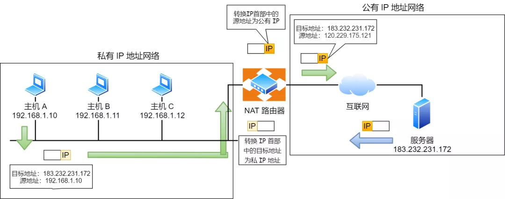
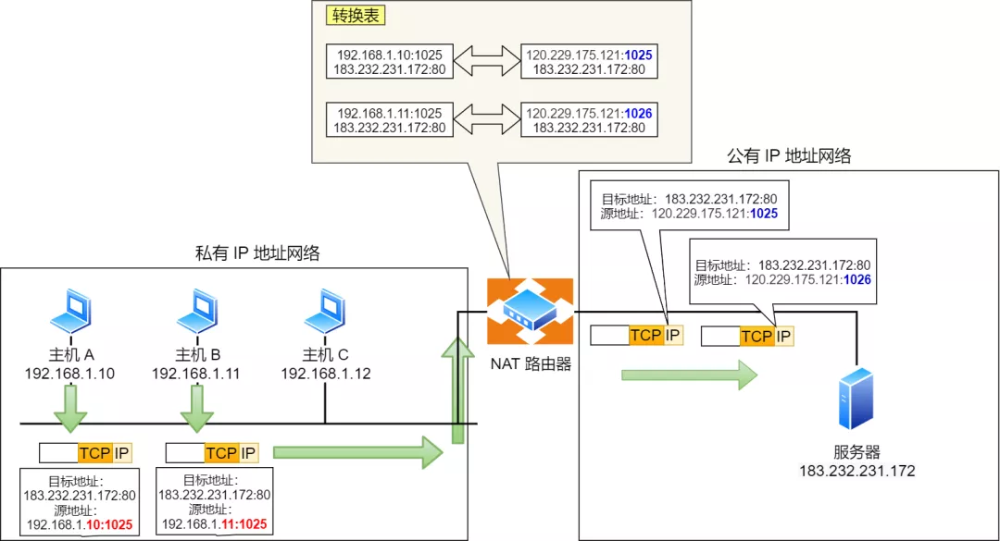

#### NAT

IPv4 的地址是非常紧缺的，在前面我们也提到可以通过无分类地址来减缓 IPv4 地址耗尽的速度，但是互联网的用户增速是非常惊人的，所以 IPv4 地址依然有被耗尽的危险。

于是，提出了一个种**网络地址转换 NAT** 的方法，再次缓解了 IPv4 地址耗尽的问题。

简单的来说 NAT 就是在同个公司、家庭、教室内的主机对外部通信时，把私有 IP 地址转换成公有 IP 地址。

NAT

> 那不是 N 个 私有 IP 地址，你就要 N 个公有 IP 地址？这怎么就缓解了 IPv4 地址耗尽的问题？这不瞎扯吗？

确实是，普通的 NAT 转换没什么意义。

由于绝大多数的网络应用都是使用传输层协议 TCP 或 UDP 来传输数据的。

因此，可以把 IP 地址 + 端口号一起进行转换。

这样，就用一个全球 IP 地址就可以了，这种转换技术就叫**网络地址与端口转换 NAPT。**

很抽象？来，看下面的图解就能瞬间明白了。

NAPT

图中有两个客户端 192.168.1.10 和 192.168.1.11 同时与服务器 183.232.231.172 进行通信，并且这两个客户端的本地端口都是 1025。

此时，**两个私有 IP 地址都转换 IP 地址为公有地址 120.229.175.121，但是以不同的端口号作为区分。**

于是，生成一个 NAPT 路由器的转换表，就可以正确地转换地址跟端口的组合，令客户端 A、B 能同时与服务器之间进行通信。

这种转换表在 NAT 路由器上自动生成。例如，在 TCP 的情况下，建立 TCP 连接首次握手时的 SYN 包一经发出，就会生成这个表。而后又随着收到关闭连接时发出 FIN 包的确认应答从表中被删除。

> NAT 那么牛逼，难道就没缺点了吗？

当然有缺陷，肯定没有十全十美的方案。

由于 NAT/NAPT 都依赖于自己的转换表，因此会有以下的问题：

- 外部无法主动与 NAT 内部服务器建立连接，因为 NAPT 转换表没有转换记录。
- 转换表的生产与转换操作都会产生性能开销。
- 通信过程中，如果 NAT 路由器重启了，所有的 TCP 连接都将被重置。

> 如何解决 NAT 潜在的问题呢？

解决的方法主要两种方法。

*第一种就是改用 IPv6*

IPv6 可用范围非常大，以至于每台设备都可以配置一个公有 IP 地址，就不搞那么多花里胡哨的地址转换了，但是 IPv6 普及速度还需要一些时间。

*第二种 NAT 穿透技术*

NAT 穿越技术拥有这样的功能，它能够让网络应用程序主动发现自己位于 NAT 设备之后，并且会主动获得 NAT 设备的公有 IP，并为自己建立端口映射条目，注意这些都是 NAT设备后的应用程序自动完成的。

也就是说，在 NAT 穿越技术中，NAT 设备后的应用程序处于主动地位，它已经明确地知道 NAT 设备要修改它外发的数据包，于是它主动配合 NAT 设备的操作，主动地建立好映射，这样就不像以前由 NAT 设备来建立映射了。

说人话，就是客户端主动从 NAT 设备获取公有 IP 地址，然后自己建立端口映射条目，然后用这个条目对外通信，就不需要 NAT 设备来进行转换了。