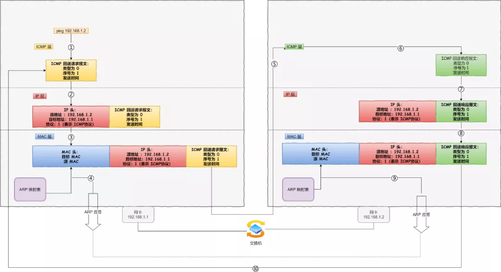

### ping —— 查询报文类型的使用

接下来，我们重点来看 `ping` 的**发送和接收过程**。

同个子网下的主机 A 和 主机 B，主机 A 执行`ping` 主机 B 后，我们来看看其间发送了什么？

主机 A ping 主机 B

ping 命令执行的时候，源主机首先会构建一个 **ICMP 回送请求消息**数据包。

ICMP 数据包内包含多个字段，最重要的是两个：

- 第一个是**类型**，对于回送请求消息而言该字段为 `8`；
- 另外一个是**序号**，主要用于区分连续 ping 的时候发出的多个数据包。

每发出一个请求数据包，序号会自动加 `1`。为了能够计算往返时间 `RTT`，它会在报文的数据部分插入发送时间。

主机 A 的 ICMP 回送请求报文

然后，由 ICMP 协议将这个数据包连同地址 192.168.1.2 一起交给 IP 层。IP 层将以 192.168.1.2 作为**目的地址**，本机 IP 地址作为**源地址**，**协议**字段设置为 `1` 表示是 `ICMP` 协议，在加上一些其他控制信息，构建一个 `IP` 数据包。

主机 A 的 IP 层数据包

接下来，需要加入 `MAC` 头。如果在本地 ARP 映射表中查找出 IP 地址 192.168.1.2 所对应的 MAC 地址，则可以直接使用；如果没有，则需要发送 `ARP` 协议查询 MAC 地址，获得 MAC 地址后，由数据链路层构建一个数据帧，目的地址是 IP 层传过来的 MAC 地址，源地址则是本机的 MAC 地址；还要附加上一些控制信息，依据以太网的介质访问规则，将它们传送出去。

主机 A 的 MAC 层数据包

主机 `B` 收到这个数据帧后，先检查它的目的 MAC 地址，并和本机的 MAC 地址对比，如符合，则接收，否则就丢弃。

接收后检查该数据帧，将 IP 数据包从帧中提取出来，交给本机的 IP 层。同样，IP 层检查后，将有用的信息提取后交给 ICMP 协议。

主机 `B` 会构建一个 **ICMP 回送响应消息**数据包，回送响应数据包的**类型**字段为 `0`，**序号**为接收到的请求数据包中的序号，然后再发送出去给主机 A。

主机 B 的 ICMP 回送响应报文

在规定的时候间内，源主机如果没有接到 ICMP 的应答包，则说明目标主机不可达；如果接收到了 ICMP 回送响应消息，则说明目标主机可达。

此时，源主机会检查，用当前时刻减去该数据包最初从源主机上发出的时刻，就是 ICMP 数据包的时间延迟。

针对上面发生的事情，总结成了如下图：

主机 A ping 主机 B 期间发送的事情

当然这只是最简单的，同一个局域网里面的情况。如果跨网段的话，还会涉及网关的转发、路由器的转发等等。

但是对于 ICMP 的头来讲，是没什么影响的。会影响的是根据目标 IP 地址，选择路由的下一跳，还有每经过一个路由器到达一个新的局域网，需要换 MAC 头里面的 MAC 地址。

说了这么多，可以看出 ping 这个程序是**使用了 ICMP 里面的 ECHO REQUEST（类型为 8 ） 和 ECHO REPLY （类型为 0）**。