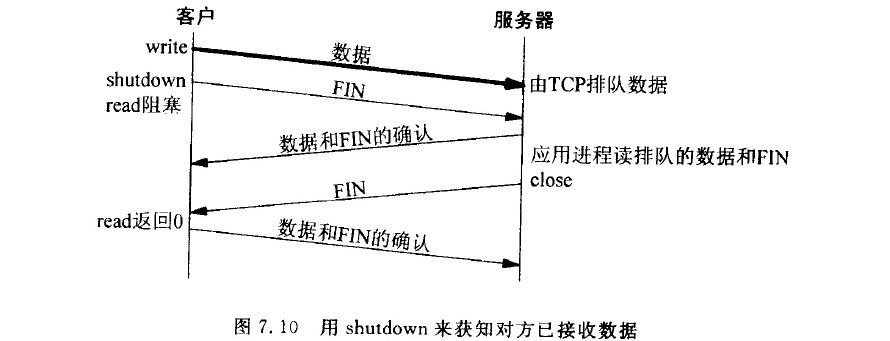

# 常见的 socket 选项

严格意义上说套接字选项是有不同层级的（level），如socket级别、TCP级别、IP级别，这里我们不区分具体的级别。

**1. SO_SNDTIMEO 与 SO_RCVTIMEO**
这两个选项用于设置阻塞模式下套接字，

- `SO_SNDTIMEO`用于在send数据由于对端tcp窗口太小，发不出去而最大的阻塞时长；
- `SO_RCVTIMEO`用于recv函数因接受缓冲区无数据而阻塞的最大阻塞时长。

如果你需要获取它们的默认值，请使用getsockopt函数。

**2. TCP_NODELAY**
禁止 `nagle` 算法

操作系统底层协议栈默认有这样一个机制，为了减少网络通信次数，会将send等函数提交给tcp协议栈的多个小的数据包合并成一个大的数据包，最后再一次性发出去，也就是说，如果你调用send函数往内核协议栈缓冲区拷贝了一个数据，这个数据也许不会马上发到网络上去，而是要等到协议栈缓冲区积累到一定量的数据后才会一次性发出去，我们把这种机制叫做`nagle`算法。默认打开了这个机制，有时候我们希望关闭这种机制，让`send`的数据能够立刻发出去，我们可以选择关闭这个算法，这就可以通过设置套接字选项`TCP_NODELAY`，即关闭`nagle`算法。

**3. SO_LINGER**

这个选项的用处是 **用于解决，当需要关闭套接字时，协议栈发送缓冲区中尚有未发送出去的数据，等待这些数据发完的最长等待时间**。

```cpp
  struct linger { 
    int l_onoff;  // 是否开启
    int l_linger; // 多久
  };
```

- 默认情况下，`l_onoff=0` 即关闭本选项，`l_linger` 的值被忽略，此时 `close(fd)`函数立即返回，如果发送缓冲区中有数据会尝试发送。

- `l_onoff=1, l_linger=0`：此时 `close(fd)` 行为是 TCP将立即中止这个连接，TCP会丢弃发送缓冲区中的所有数据并且发送一个 `RST` 给对端，而且**结束过程没有四次握手过程。这样就避免了 `TIMEWAIT` 状态**。

- ```
  l_onoff=1, 1_linger=val
  ```

  ：此时

   

  ```
  l_linger
  ```

   

  非0。 那么

   

  ```
  close(fd)
  ```

   

  内核将会拖延一段时间。如果发送缓冲区中仍有数据，那么进程将会投入睡眠，直到

  - 所有数据都已经发送完+被对方确认
  - 时间到

如果 sockfd 被设置为非阻塞，将不会等待 close 完成，即使设置了 `l_onoff=1, 1_linger=val` 也是如此。因此，在非阻塞模式下检测错误返回值很重要。如果在非阻塞模式下，延迟时间到数据没有发送完且被对端确认，那么发送缓冲区中的剩余数据将会被丢弃，并返回错误：**EWOULDBLOCK** 错误。

`close`返回只是说明：先前发送的数据和 `FIN` 已由对端确认，而不能告诉我们对端应用进程是否已经读取了数据。如果不设置这个选择，连对端确认都不知道。

`shutdown(fd, SHUT_WR)` + `read` 可以知道对端的是否已经读取了数据，并且等待对端 `close` 服务端。



**4. SO_REUSEADDR/SO_REUSEPORT**

一个端口，尤其是作为服务器端端口在四次挥手的最后一步，有一个为`TIME_WAIT`的状态，这个状态一般持续2MSL，占据着ip地址和端口，使其不能被立即复用。为了立即回收复用ip地址端口号，我们可以通过开启套接字 `SO_REUSEADDR/SO_REUSEPORT`。

**6. SO_KEEPALIVE**

默认情况下，当一个连接长时间没有数据来往，会被系统防火墙之类的服务关闭。为了避免这种现象，尤其是一些需要长连接的应用场景下，我们需要使用心跳包机制，即定时从两端定时发一点数据，这种行为叫做“**保活**”。

而 `tcp` 协议栈本身也提供了这种机制，那就是设置套接字 `SO_KEEPALIVE` 选项，开启这个选项后，`tcp` 协议栈会定时发送心跳包探针，但是这个默认时间比较长（2个小时），我们可以继续通过相关选项改变这个默认值