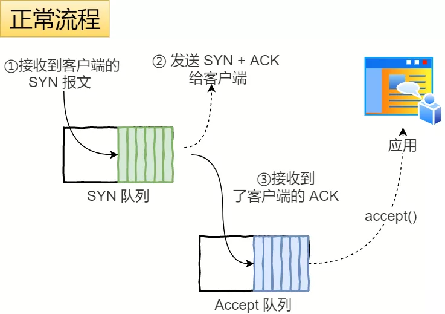
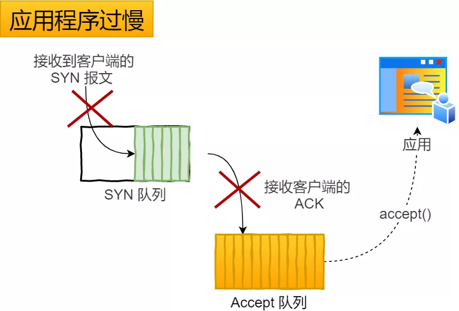
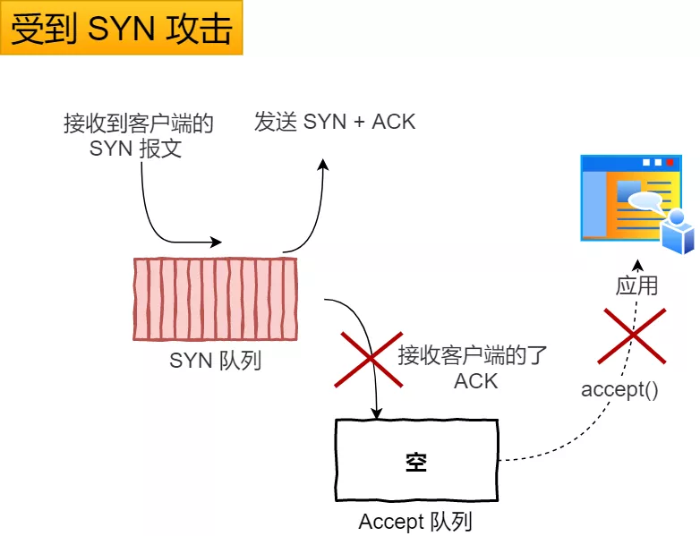

> 什么是 SYN 攻击？如何避免 SYN 攻击？

*SYN 攻击*

我们都知道 TCP 连接建立是需要三次握手，假设攻击者短时间伪造不同 IP 地址的 `SYN` 报文，服务端每接收到一个 `SYN` 报文，就进入`SYN_RCVD` 状态，但服务端发送出去的 `ACK + SYN` 报文，无法得到未知 IP 主机的 `ACK` 应答，久而久之就会**占满服务端的 SYN 接收队列（未连接队列）**，使得服务器不能为正常用户服务。

SYN 攻击

*避免 SYN 攻击方式一*

其中一种解决方式是通过修改 Linux 内核参数，控制队列大小和当队列满时应做什么处理。

- 当网卡接收数据包的速度大于内核处理的速度时，会有一个队列保存这些数据包。控制该队列的最大值如下参数：

```
net.core.netdev_max_backlog
```


- SYN_RCVD 状态连接的最大个数：

```
net.ipv4.tcp_max_syn_backlog
```


- 超出处理能时，对新的 SYN 直接回 RST，丢弃连接：

```
net.ipv4.tcp_abort_on_overflow
```

*避免 SYN 攻击方式二*

我们先来看下Linux 内核的 `SYN` （未完成连接建立）队列与 `Accpet` （已完成连接建立）队列是如何工作的？

正常流程

正常流程：

- 当服务端接收到客户端的 SYN 报文时，会将其加入到内核的「 SYN 队列」；
- 接着发送 SYN + ACK 给客户端，等待客户端回应 ACK 报文；
- 服务端接收到 ACK 报文后，从「 SYN 队列」移除放入到「 Accept 队列」；
- 应用通过调用 `accpet()` socket 接口，从「 Accept 队列」取出的连接。


应用程序过慢

应用程序过慢：

- 如果应用程序过慢时，就会导致「 Accept 队列」被占满。


受到 SYN 攻击

受到 SYN 攻击：

- 如果不断受到 SYN 攻击，就会导致「 SYN 队列」被占满。

`tcp_syncookies` 的方式可以应对 SYN 攻击的方法：

```
net.ipv4.tcp_syncookies = 1
```


tcp_syncookies 应对 SYN 攻击

- 当 「 SYN 队列」满之后，后续服务器收到 SYN 包，不进入「 SYN 队列」；
- 计算出一个 `cookie` 值，再以 SYN + ACK 中的「序列号」返回客户端，
- 服务端接收到客户端的应答报文时，服务器会检查这个 ACK 包的合法性。如果合法，直接放入到「 Accept 队列」。
- 最后应用通过调用 `accpet()` socket 接口，从「 Accept 队列」取出的连接。