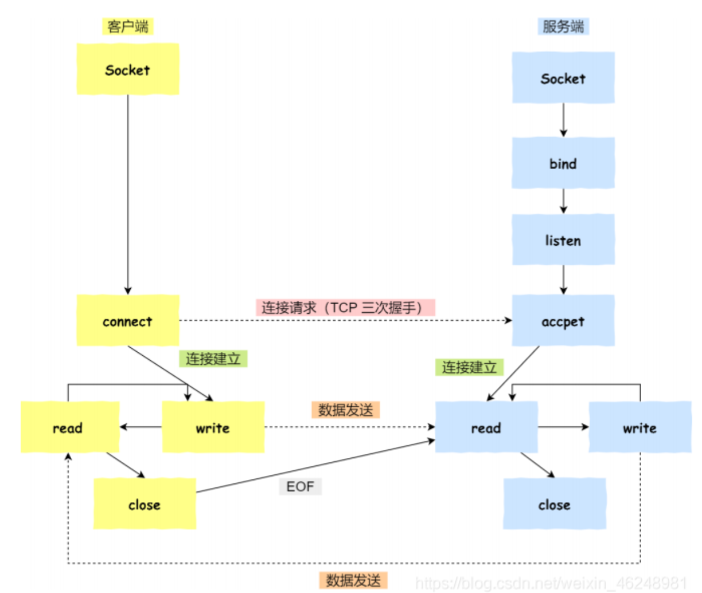

## 1.针对TCP该如何Socket编程

- 服务端和客户端初始化Socket，得到文件描述符
- 服务端调用bind，将绑定IP地址和端口
- 服务端调用listen，进行监听
- 服务端调用accept，等待客户端连接
- 客户端调用connect，向服务器端的地址和端口发送连接请求
- 服务端accept返回用于传输的socket的文件描述符
- 客户端调用write写入数据，服务端调用read读取数据
- 客户端断开连接时，会调用close，那么服务端read读取数据的时候，就会读到了EOF，黛处理完数据后，服务端调用close，表示连接关闭

这里需要主要的是，服务端调用accept时，连接成功了会返回一个已经完成连接的socket，后续用来传输数据。
所以，监听的socket和真正用来传送数据的socket，是两个socket，一个叫做监听socket，一个叫做已完成连接socket。
成功连接建立之后，双方开始通过read和write函数来读写数据，就像一个文件流里面写东西一样。