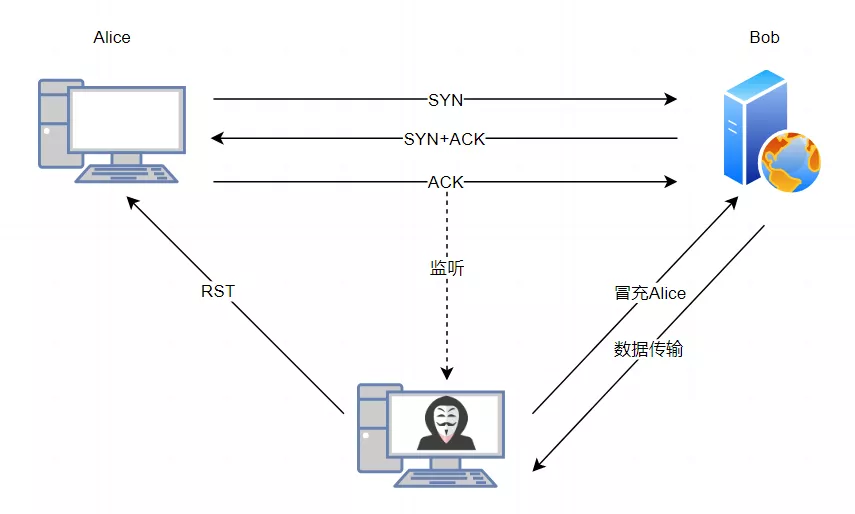

> 为什么客户端和服务端的初始序列号 ISN 是不相同的？

因为网络中的报文**会延迟、会复制重发、也有可能丢失**，这样会造成的不同连接之间产生互相影响，所以为了避免互相影响，客户端和服务端的初始序列号是随机且不同的。

> 初始序列号 ISN 是如何随机产生的？

起始 `ISN` 是基于时钟的，每 4 毫秒 + 1，转一圈要 4.55 个小时。

RFC1948 中提出了一个较好的初始化序列号 ISN 随机生成算法。

*ISN = M + F (localhost, localport, remotehost, remoteport)*

- `M` 是一个计时器，这个计时器每隔 4 毫秒加 1。
- `F` 是一个 Hash 算法，根据源 IP、目的 IP、源端口、目的端口生成一个随机数值。要保证 Hash 算法不能被外部轻易推算得出，用 MD5 算法是一个比较好的选择。

------

## **TCP的初始序列号**

Hi，我是Robert，上回说到我费了老大劲才考上了Linux帝国的公务员，被分配到了网络部协议栈大厦的传输层工作。

上班第一天，主管就让我处理一个新的TCP连接练练手。虽然我理论背的滚瓜烂熟，不过还没有实际上手处理过TCP数据包，竟有些紧张起来。

接过这个请求连接的数据包后，我准备了一个响应包，将`SYN`标记和`ACK`标记都点亮后，接下来就犯了难了。这个确认号`ACK`我倒是知道是对方的序列号+1，不过我回复的序列号该是多少呢？


我闭上眼睛在脑子飞快的检索RFC，很快想了起来，RFC793有言，初始序列号`ISN`是一个计数器，每4ms加1。

我赶紧向一旁的Cerf求助，“Hi，Cerf，初始序列号计数器在哪里啊？”

Cerf顺手指了一下墙上的一个钟表样式的东西，“喏，那就是，这是个全局统一的计数器，大家共用。”


我填充好了序列号字段，正欲发送，Cerf叫住了我，“等等，你打算就拿这个计数器直接当初始序列号发送出去啊？”

“这有什么不对吗？RFC793就是这样说的啊”

“这都是多老的版本了，现在早就不这样了！直接用这个当序列号很危险的”

## **你不知道的ISN**

我有些不好意思，接下来Cerf给我介绍了前因后果。

“原来，早先时候比特宇宙中别的帝国就是直接按照RFC793来设计ISN的。后来出了一件事，有一个攻击者冒充客户端给服务器发送数据包，把别人正常的TCP连接给劫持了，窃取了机密的数据！你猜他是怎么办到的？”



这可难不倒我，脱口而出：“肯定是这家伙在半道上监听了网络通信，拿到了他们通信的序列号和确认号，然后就能伪造一方进行通信了”

Cerf摇了摇头，“非也，这家伙不是中间人，没有监听通信哦”

这下我倒是蒙了，皱起了眉头，“不是中间人，那就没办法知道序列号了，不知道序列号的前提下，怎么能冒充呢？”

听到我的问题，Cerf会心一笑，“这家伙太聪明了，在冒充之前，他先和服务器建立过连接，拿到了服务器的初始序列号。因为这个序列号是每4ms加1，所以后面掐着时间推算一下，就能算到后面建立连接的时候，服务器新的ISN是什么”

我恍然大悟，“这家伙真鸡贼，那看来这个ISN不能这样简单设定。”

“所以啊，我刚刚制止了你，现在RFC出了新规定1948号文件，规定ISN要这么算：”

**ISN = M + F(localhost, localport, remotehost, remoteport)**

“M就是你刚刚看那个计数器，在此基础之上，还增加了一个F，把通信双方的IP和端口，也就是四元组信息做一个运算，得到一个值加在计数器之上，增加ISN的不可预测性”

我点了点头，“这个F一般用什么算法呢？”

“在咱们Linux帝国，之前用过MD4算法，后来升级成MD5算法了”

“感谢Cerf，要不是你我就要犯错误了”

Cerf拍拍我的肩，语重心长的说：“你还要不停学习啊，考上帝国公务员只是第一步”


“要学习的不只是他，你也是啊，不知道关于ISN又出新规定了吗？”

我俩一起回头，原来是主管走了过来。

“主管，啥新规定啊？”，Cerf问到。

“RFC出了个新规定6528号文件，现在的ISN是这样计算的：”

**ISN = M + F(localip, localport, remoteip, remoteport, secretkey)**

“多了一个secretkey！”，我一下发现了不同。

“没错！如果双方用同样的端口先后进行两次通信，四元组是固定的，那F函数算下来的结果也是固定的，这样随机性就大大降低了。所以再增加一个secretkey，让ISN变得更难预测”

“那是不是这样就万无一失啦？再也不怕被劫持了呢？”，我接着问到。

主管顿了一下，说到：“除非是网络中其他单位做中间人来劫持，否则应该是没有办法了”

主管不愧是主管，懂得是比我们多。

耽误了半天，我的这条连接还没有回复，我赶紧按照新的算法，算出了ISN，给对方回了过去。

第一个练手的连接就让我学到了不少东西，没想到一个简单的ISN居然还有这么多讲究。

## **神秘的计数器**

时间来到下午，Cerf带我在大厦到处转转，熟悉一下环境。

不多时，我们来到了一间屋子，屋子里摆放着一堆计数器，上面的信号灯还在一明一暗的不停闪着。


“这又是一堆什么计数器啊，怎么这么多！”，我问一旁的Cerf。

“这些是记录咱们网络部门工作数据的重要展示，不仅在咱们传输层，下面一楼的网络层也有一个屋子存放了他们的计数器。每一次启动，咱们发了多少包、收了多少包、出错了多少、收到多少重复包等等信息，都在这一笔笔记着呢。你后面正式工作了，少不了要经常来这里的”

我放眼望去，每个计数器上面都贴了标签：

```
SyncookiesSent
SyncookiesRecv
SyncookiesFailed
EmbryonicRsts
PruneCalled
RcvPruned
OfoPruned 
······
DelayedACKs 
DelayedACKLocked 
DelayedACKLost 
ListenOverflows 
ListenDrops 
TCPPrequeued
```

正瞧着，忽然发现有不少同名的计数器，再仔细一瞧，不是同名，而是这里划分了8个分区，每个分区里的计数器都是一样的。

“Cerf，这里怎么有8份一样的计数器啊”

“那是因为和咱们打交道的CPU是个8核的，为了防止多个线程之间竞争，加锁太耽误事儿了，就弄了8份。最后统计的时候再合在一起就行了”

离开了计数器的房间，Cerf又带我参观了存放连接请求队列的仓库，接着又教了我几个TCP定时器的用法，这一天真是收获满满。

明天就要正式工作了，不知道又是怎样的一天~

**未完待续······**

## **彩蛋**

> “醒醒，上峰给我们派任务了，让我们配合他劫持TCP连接”
>
> “我们又没有内核权限怎么能劫持TCP连接呢？”
>
> “信上没说，只是让我们汇报一个计数器的值”
>
> “什么计数器？”
>
> *预知后事如何，请关注后续精彩······*