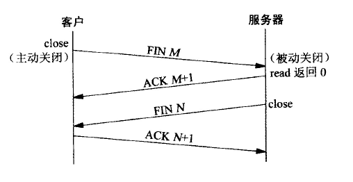

# TCP断开连接

TCP的终止需要四个分节。

- 第一次握手：*Client* 端发送一个 *FIN=1, seq=M* 给服务端。*Client*进入 **FIN_WAIT_1** 状态。
- 第二次握手：*Server* 接收到该报文后，发送确认应答 *ACK=1, ack=M+1* 给 *Client*。*Server* 进入 **CLOSE_WAIT** 状态，客户端进入半关闭 **FIN_WAIT_2** 状态。
- 第三次握手：*Server* 也准备关闭时，发送 *FIN=1, seq = N* 给客户端。*Server* 进入 **LAST_ACK** 状态。
- 第四次握手：*Client* 接受到后，*Client* 端进入 **TIME_WAIT** 状态。接着发送 *ACK=1, seq=N+1* 给 *Server*。*Server* 接受到后进入 **CLOSED** 状态。至此服务端已经完成关闭。客户端在经过 **2MSL** 时间后，自动进入 **CLOSED** 状态。至此，客户端也完成了连接。

**[注意]**：

- 主动关闭方才有 **TIME_WAIT** 状态，被动关闭方才有**CLOSE_WAIT**状态。
- 服务端出现 **CLOSE_WAIT** 状态后，接受不到数据了，但是还能发送数据。