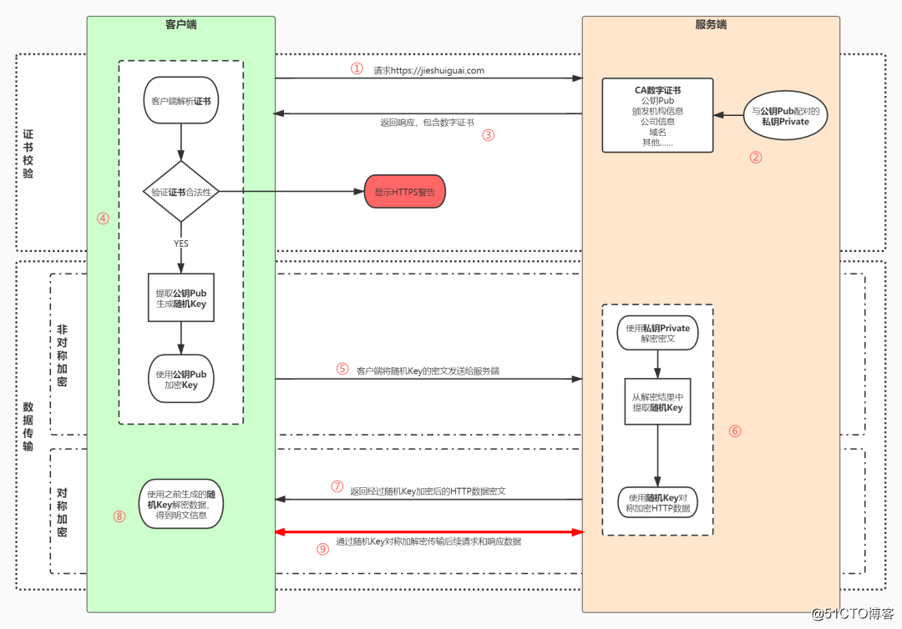
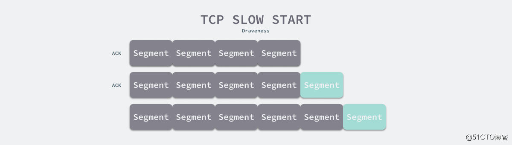
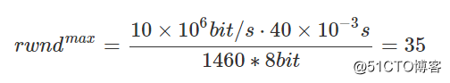
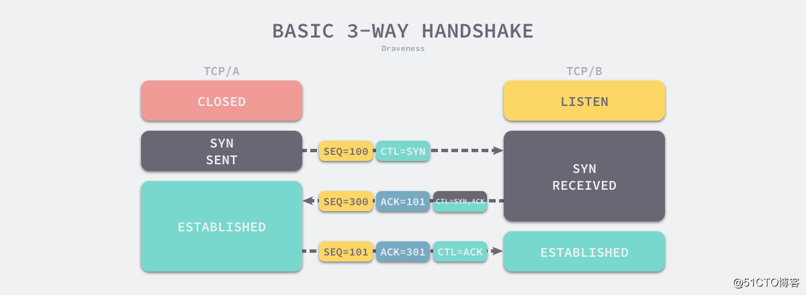
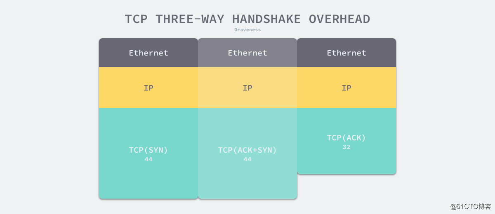
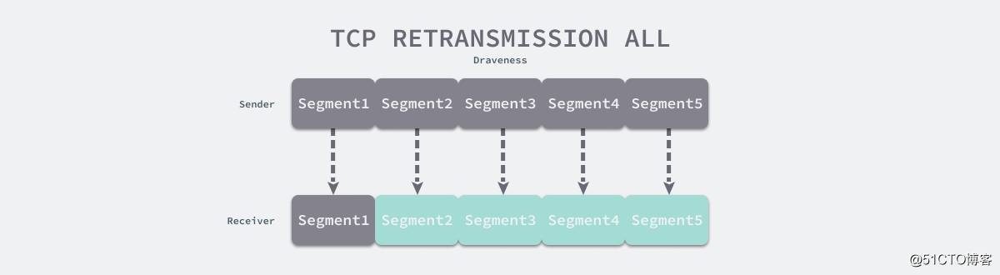

## 为什么 TCP 协议有性能问题

[企业开发](https://www.codetd.com/cat/17706/1) 2020-08-10 06:11:22 阅读次数: 0


为什么这么设计（Why’s THE Design）是一系列关于计算机领域中程序设计决策的文章，我们在这个系列的每一篇文章中都会提出一个具体的问题并从不同的角度讨论这种设计的优缺点、对具体实现造成的影响。如果你有想要了解的问题，可以在文章下面留言。

TCP 协议可以说是今天互联网的基石，作为可靠的传输协议，在今天几乎所有的数据都会通过 TCP 协议传输，然而 TCP 在设计之初没有考虑到现今复杂的网络环境，当你在地铁上或者火车上被断断续续的网络折磨时，你可能都不知道这一切可能都是 TCP 协议造成的。本文会分析 TCP 协议为什么在弱网环境下有严重的性能问题1。

注：本文的分析基于 RFC 7932 中定义的 TCP 协议，从 RFC 793 发布至今已经过了将近 40 年，期间多个状态为 Proposed Standard 的非强制性 RFC 都对 TCP 协议进行了修订，尝试优化 TCP 协议的性能，例如：选择性 ACK（Selective ACK, SACK）3、虚假超时剖析（Forward RTO, F-RTO）4 和 TCP 快开启（TCP Fast Open, TFO）5，最新版本的 Linux 中已经包含了这些 RFC 的实现。

底层的数据传输协议在设计时必须要对带宽的利用率和通信延迟进行权衡和取舍，所以想要解决实际生产中的全部问题是不可能的，TCP 选择了充分利用带宽，为流量而设计，期望在尽可能短的时间内传输更多的数据6。

在网络通信中，从发送方发出数据开始到收到来自接收方的确认的时间被叫做往返时延（Round-Trip Time，RTT）。

弱网环境是丢包率较高的特殊场景，TCP 在类似场景中的表现很差，当 RTT 为 30ms 时，一旦丢包率达到了 2%，TCP 的吞吐量就会下降 89.9%7，从下面的表中我们可以看出丢包对 TCP 的吞吐量极其显著的影响：

**RTT TCP 吞吐量 TCP 吞吐量（2% 丢包率）
0 ms 93.5 Mbps 3.72 Mbps
30 ms 16.2 Mbps 1.63 Mbps
60 ms 8.7 Mbps 1.33 Mbps
90 ms 5.32 Mbps 0.85 Mbps**

本文将分析在弱网环境下（丢包率高）影响 TCP 性能的三个原因：

- TCP 的拥塞控制算法会在丢包时主动降低吞吐量；
- TCP 的三次握手增加了数据传输的延迟和额外开销；
- TCP 的累计应答机制导致了数据段的传输；

在上述的三个原因中，拥塞控制算法是导致 TCP 在弱网环境下有着较差表现的首要原因，三次握手和累计应答两者的影响依次递减，但是也加剧了 TCP 的性能问题。

# 拥塞控制

TCP 拥塞控制算法是互联网上主要的拥塞控制措施，它使用一套基于线増积减（Additive increase/multiplicative decrease，AIMD）的网络拥塞控制方法来控制拥塞8，也是造成 TCP 性能问题的主要原因。

第一次发现的互联网拥塞崩溃是在 1986 年，NSFnet 阶段一的骨干网的处理能力从 32,000bit/s 降到了 40bit/s，该骨干网的处理能力直到 1987 和 1988 年，TCP 协议实现了拥塞控制之后才得到解决9。正是因为发生过网络阻塞造成的崩溃，所以 TCP 的拥塞控制算法就认为只要发生了丢包当前网络就发生了拥堵，从这一假设出发，TCP 最初的实现 Tahoe 和 Reno 就使用了慢启动和拥塞避免两个机制10实现拥塞控制，本节中对拥塞控制的分析就是基于这个版本的实现。



图 1 - TCP 拥塞控制

每一个 TCP 连接都会维护一个拥塞控制窗口（Congestion Window），它决定了发送方同时能向接收方发送多少数据，其作用主要有两个：

1. 防止发送方向接收方发送了太多数据，导致接收方无法处理；
2. 防止 TCP 连接的任意一方向网络中发送大量数据，导致网络拥塞崩溃；

除了拥塞窗口大小（cwnd）之外，TCP 连接的双方都有接收窗口大小（rwnd），在 TCP 连接建立之初，发送方和接收方都不清楚对方的接收窗口大小，所以通信双方需要一套动态的估算机制改变数据传输的速度，在 TCP 三次握手期间，通信双方会通过 ACK 消息通知对方自己的接收窗口大小，接收窗口大小一般是带宽延迟乘积（Bandwidth-delay product, BDP）决定的11，不过在这里我们就不展开介绍了。

客户端能够同时传输的最大数据段的数量是接收窗口大小和拥塞窗口大小的最小值，即 min(rwnd, cwnd)。TCP 连接的初始拥塞窗口大小是一个比较小的值，在 Linux 中是由 TCP_INIT_CWND 定义的12：

```
/* TCP initial congestion window as per rfc6928 */
#define TCP_INIT_CWND       10
```

初始拥塞控制窗口的大小从出现之后被多次修改，几个名为 Increasing TCP’s Initial Window 的 RFC 文档：RFC241413、RFC339014 和 RFC692815 分别增加了 initcwnd 的值以适应不断提高的网络传输速度和带宽。

TCP 协议使用慢启动阈值（Slow start threshold, ssthresh）来决定使用慢启动或者拥塞避免算法：

- 当拥塞窗口大小小于慢启动阈值时，使用慢启动；
- 当拥塞窗口大小大于慢启动阈值时，使用拥塞避免算法；
- 当拥塞窗口大小等于慢启动阈值时，使用慢启动或者拥塞避免算法；



图 2 - TCP 的慢启动

如上图所示，使用 TCP 慢启动时，发送方每收到一个响应方的 ACK 消息，拥塞窗口大小就会加一。当拥塞窗口大小大于慢启动阈值时，就会使用拥塞避免算法：

1. 线性增长：每经过一个往返时间 RTT，拥塞窗口大小会加一；
2. 积式减少：当发送方发送的数据包丢包时，慢启动阈值会设置为拥塞窗口大小的一半；

TCP 的早期实现 Tahoe 和 Reno 在遇到丢包时会将拥塞控制大小重置为初始值16，由于拥塞窗口大小小于慢启动阈值，所以重新进入慢启动阶段。

如果 TCP 连接刚刚建立，由于 Linux 系统的默认设置，客户端能够同时发送 10 个数据段，假设我们网络的带宽是 10M，RTT 是 40ms，每个数据段的大小是 1460 字节，那么使用 BDP 计算的通信双方窗口大小上限应该是 35，这样才能充分利用网络的带宽：



然而拥塞控制窗口的大小从 10 涨到 35 需要 2RTT 的时间，具体的过程如下：

1. 发送方向接收方发送 initcwnd = 10 个数据段（消耗 0.5RTT）；
2. 接收方接收到 10 个数据段后向发送方发送 ACK（消耗 0.5RTT）；
3. 发送方接收到发送方的 ACK，拥塞控制窗口大小由于 10 个数据段的成功发送 +10，当前拥塞控制窗口大小达到 20；
4. 发送方向接收方发送 20 个数据段（消耗 0.5RTT）；
5. 接收方接收到 20 个数据段后向发送方发送 ACK（消耗 0.5RTT）；
6. 发送方接收到发送方的 ACK，拥塞控制窗口大小由于 20 个数据段的成功发送 +20，当前拥塞控制窗口大小达到 40；

从 TCP 三次握手建立连接到拥塞控制窗口大小达到假定网络状况的最大值 35 需要 3.5RTT 的时间，即 140ms，这是一个比较长的时间了。

早期互联网的大多数计算设备都通过有线网络连接，出现网络不稳定的可能性也比较低，所以 TCP 协议的设计者认为丢包意味着网络出现拥塞，一旦发生丢包，客户端疯狂重试就可能导致互联网的拥塞崩溃，所以发明了拥塞控制算法来解决该问题。

但是如今的网络环境更加复杂，无线网络的引入导致部分场景下的网络不稳定成了常态，所以丢包并不一定意味着网络拥堵，如果使用更加激进的策略传输数据，在一些场景下会得到更好的效果。

# 三次握手

TCP 使用三次握手建立连接应该是全世界所有工程师都十分了解的知识点，三次握手的主要目的是避免历史错误连接的建立并让通信的双方确定初始序列号17，然而三次握手的成本相当高，在不丢包的情况下，它需要建立 TCP 连接的双方进行三次通信。



图 3 - 常见的 TCP 三次握手

如果我们要从北京访问上海的服务器，由于北京到上海的直线距离约为 1000 多公里，而光速是目前通信速度的极限，所以 RTT 一定会大于 6.7ms：

**RTT=1,000,000m÷300,000m/ms×2=6.7ms**

然而因为光在光纤中不是直线传播的，真正的传输速度会比光速慢 ~31%18，而且数据需要在各种网络设备之间来回跳转，所以很难达到理论的极限值。在生产环境中从北京到上海的 RTT 大概在 40ms 左右，所以 TCP 建立连接所需要最短时间也需要 60ms（1.5RTT）。

在网络环境较差的地铁、车站等场景中，因为丢包率较高，客户端很难与服务端快速完成三次通信并建立 TCP 连接。当客户端长时间没有收到服务端的响应时，只能不断发起重试，随着请求次数逐渐增加，访问的延迟也会越来越高。

由于大多数的 HTTP 请求都不会携带大量的数据，未被压缩的请求和响应头大小在 ~200B 到 2KB 左右，而 TCP 三次握手带来的额外开销是 222 字节，其中以太网数据帧占 3 *14 = 42 字节，IP 数据帧占 3* 20 = 60 字节，TCP 数据帧约占 120 字节（三次握手的开销与请求和环境有关，具体值不固定）：



图 4 - TCP 三次握手的额外开销

虽然 TCP 不会为每一个发出的数据段建立连接，但是三次握手建立连接需要的成本还是相当高，不仅需要额外增加 1.5RTT 的网络延时，还需要增加 222 字节的额外开销，所以在弱网环境下，通过三次握手建立连接会加剧 TCP 的性能问题。

# 重传机制

TCP 传输的可靠性是通过序列号和接收方的 ACK 来保证的，当 TCP 传输一个数据段时，它会将该数据段的副本放到重传队列上并开启计时器：

- 如果发送方收到了该数据段对应的 ACK 响应，当前数据段就会从重传队列中删除；
- 如果发送方在计时器到期之间都没有收到该数据段对应的 ACK，就会重新发送当前数据段；

TCP 的 ACK 机制可能会导致发送方重新传输接收方已经收到了数据段。TCP 中的 ACK 消息表示该消息之前的全部消息都已经被成功接收和处理，例如：

1. 发送方向接收方发送了序号为 1-10 的消息；
2. 接收方向发送方发送 ACK 8 响应；
3. 发送方认为序号为 1-8 的消息已经被成功接收；

这种 ACK 的方式在实现上比较简单，更容易保证消息的顺序性，但是在以下情况可能会导致发送方重传已经接收的数据：



图 5 - TCP 的重传策略

如上图所示，接收方已经收到了序号为 2-5 的数据，但是由于 TCP ACK 的语义是当前数据段前的全部数据段都已经被接收和处理，所以接收方无法发送 ACK 消息，由于发送方没有收到 ACK，所有数据段对应的计时器就会超时并重新传输数据。在丢包较为严重的网络下，这种重传机制会造成大量的带宽浪费。

RFC2581 中提出的快速重传就会缓解上述问题，当接收方收到乱序的数据段时，会立刻发送三个连续的 ACK 触发发送方的重传。

# 总结

TCP 协议的一些设计在今天来看虽然仍然具有巨大的价值，但是并不能适用于所有场景。为了解决 TCP 的性能问题，目前业界有两种解决方案：

1. 使用 UDP 构建性能更加优异、更灵活的传输协议，例如：QUIC19 等；
2. 通过不同的手段优化 TCP 协议的性能，例如：选择性 ACK（Selective ACK, SACK），TCP 快开启（TCP Fast Open, TFO）；

由于 TCP 协议在操作系统内核中，不利于协议的更新，所以第一种方案目前发展的更好，HTTP/3 就使用了 QUIC 作为传输协议20。我们在这里重新回顾一下导致 TCP 性能问题的三个重要原因：

- TCP 的拥塞控制在发生丢包时会进行退让，减少能够发送的数据段数量，但是丢包并不一定意味着网络拥塞，更多的可能是网络状况较差；
- TCP 的三次握手带来了额外开销，这些开销不只包括需要传输更多的数据，还增加了首次传输数据的网络延迟；
- TCP 的重传机制在数据包丢失时可能会重新传输已经成功接收的数据段，造成带宽的浪费；

TCP 协议作为互联网数据传输的基石可以说是当之无愧，虽然它确实在应对特殊场景时有些问题，但是它的设计思想有着非常多的借鉴意义并值得我们学习。

到最后，我们还是来看一些比较开放的相关问题，有兴趣的读者可以仔细思考一下下面的问题：

- QUIC 协议是能否保证丢包率较高时的传输性能？
- 除了 SACK 和 TFO 之外还有哪些手段可以优化 TCP 的性能？

如果对文章中的内容有疑问或者想要了解更多软件工程上一些设计决策背后的原因，可以在博客下面留言，作者会及时回复本文相关的疑问并选择其中合适的主题作为后续的内容。

1. TCP Selective Acknowledgment Options, October 1996 https://tools.ietf.org/html/rfc2018 ↩︎
2. RFC793 Transmission Control Protocol, September 1981 RFC793 https://tools.ietf.org/html/rfc793 ↩︎
3. RFC2018 TCP Selective Acknowledgment Options, October 1996 https://tools.ietf.org/html/rfc2018 ↩︎
4. RFC5682 Forward RTO-Recovery (F-RTO): An Algorithm for Detecting Spurious Retransmission Timeouts with TCP, September 2009 https://tools.ietf.org/html/rfc5682 ↩︎
5. RFC7413 TCP Fast Open, December 2014 https://tools.ietf.org/html/rfc7413 ↩︎
6. KCP - A Fast and Reliable ARQ Protocol https://github.com/skywind3000/kcp ↩︎
7. Measuring Network Performance: Links Between Latency, Throughput and Packet Loss https://accedian.com/enterprises/blog/measuring-network-performance-latency-throughput-packet-loss/ ↩︎
8. Wikipedia: TCP congestion control https://en.wikipedia.org/wiki/TCP_congestion_control ↩︎
9. Wikipedia: Network congestion https://en.wikipedia.org/wiki/Network_congestion#Congestive_collapse ↩︎
10. Wikipedia: Additive increase/multiplicative decrease https://en.wikipedia.org/wiki/Additive_increase/multiplicative_decrease ↩︎
11. Bandwidth-delay product https://en.wikipedia.org/wiki/Bandwidth-delay_product ↩︎
12. TCP_INIT_CWND https://github.com/torvalds/linux/blob/738d2902773e30939a982c8df7a7f94293659810/include/net/tcp.h#L226 ↩︎
13. RFC2414 Increasing TCP’s Initial Window https://tools.ietf.org/html/rfc2414 ↩︎
14. RFC3390 Increasing TCP’s Initial Window https://tools.ietf.org/html/rfc3390 ↩︎
15. RFC6928 Increasing TCP’s Initial Window https://tools.ietf.org/html/rfc6928 ↩︎
16. Kurose, James; Ross, Keith. Computer Networking – A Top-Down Approach 4th. Addison Wesley. 2008. ISBN 978-0-13-607967-5. p. 284. ↩︎
17. 为什么 TCP 建立连接需要三次握手, October 2019 https://draveness.me/whys-the-design-tcp-three-way-handshake ↩︎
18. Researchers create fiber network that operates at 99.7% speed of light, smashes speed and latency records, March 2013 https://www.extremetech.com/computing/151498-researchers-create-fiber-network-that-operates-at-99-7-speed-of-light-smashes-speed-and-latency-records ↩︎
19. Wikiepedia: QUIC https://en.wikipedia.org/wiki/QUIC ↩︎
20. HTTP-over-QUIC to be renamed HTTP/3, November 2018 https://www.zdnet.com/article/http-over-quic-to-be-renamed-http3/ ↩︎