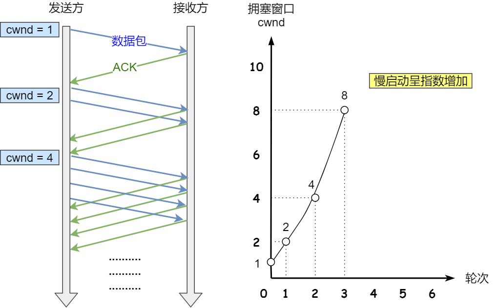

# 拥塞控制

流量控制通过滑动窗口来实现，但是滑动窗口只考虑了发送方窗口(`send window, swnd`)和接收方窗口(`recv window, rwnd`)的问题，没考虑网络的问题。有可能接收端很快，但是网络拥塞了，所以加了一个拥塞窗口(`crowded window, cwnd`)。**拥塞窗口的意思就是一次性可以连续提交多少个包到网络中**。最终发送窗口大小 $swnd = min(cwnd, rwnd)$ 由两个窗口共同控制发送速度。

TCP的拥塞控制主要避免两种现象：包丢失和包重传。网络的带宽是固定的，当发送端发送速度超过带宽后，中间设备处理不完多出来的包就会被丢弃，这就是包丢失。如果我们在中间设备上加上缓存，处理不过来的包就会被加到缓存队列中，不会丢失，但是会增加时延。如果时延到达一定的程度，就会超时重传，这就是包重传。

*cwnd*的变化规则：

- 只要网络中没有出现拥塞，*cwnd* 就会增大
- 网络中出现了拥塞，*cwnd* 就会减少

拥塞控制主要是四个算法：

- 慢启动
- 拥塞避免
- 拥塞发生
- 快速恢复。

**[1-慢启动]**
TCP 在刚建立连接完成后，首先是有个慢启动的过程，这个慢启动的意思就是一点一点的提高发送数据包的数量。慢启动的算法记住一个规则就行：当发送方每收到一个 `ACK`，就拥塞窗口 `cwnd` 的大小就会加 1。初始化为1个`MSS`的大小。

慢启动是指数型增长

慢启动有个阈值*ssthresh(slow start thresh)*：

- `cwnd < ssthresh` : 使用**慢启动**算法
- `cwnd >= ssthresh` : 使用**拥塞避免**算法

**[2-拥塞避免]**
`ssthresh`一般是 65535个字节。当 `cwnd` 超过 `ssthresh` 就会进入拥塞避免算法。此时规则：每当接受到一个`ACK`。

接着慢启动的例子，且假设`ssthresh=8`。当 8 个 `ACK` 应答确认到来时，每个确认增加 $1/8$，8 个 ACK 确认 `cwnd` 一共增加 1，于是这一次能够发送 `9 个 MSS` 大小的数据，变成了线性增长。

拥塞避免算法是将原本慢启动算法的指数增长变成了线性增长。一直增长着，网络就会慢慢进入了拥塞的状况了，于是就会出现**丢包现象**，这时就需要对丢失的数据包进行重传。

> 当触发了重传机制，也就发生了拥塞，也就进入了拥塞发生算法

**[3-拥塞发生]** 当网络出现拥塞，也就是会发生数据包重传，重传机制主要有两种：

- 超时重传
  超时重传发生如下改变：

  - `ssthresh = cwnd/2`，

- `cwnd = 1`

  然后重新从头慢启动。但是慢启动是会突然减少数据流的，会造成网络卡顿

- 快速重传
  前面我们讲过「快速重传算法」。当接收方发现丢了一个中间包的时候，发送三次前一个包的 ACK，于是发送端就会快速地重传，不必等待超时再重传。

  TCP 认为这种情况不严重，因为大部分没丢，只丢了一小部分，则 ssthresh 和 cwnd 变化如下：

  - *cwnd = cwnd/2*
  - *ssthresh = cwnd*
  - 进入快速恢复算法

**[4-快速恢复]**

接着上一段拥塞发生的第二种情况，快速恢复算法的逻辑如下:

- `cwnd = sshthresh + 3 * MSS` （3的意思是确认有3个数据包被收到了）。
- 重传丢失的数据包
- 如果再收到重复的`ACK`，那么 `cwnd = cwnd +1`
- 如果收到了新的Ack，那么 `cwnd = sshthresh` ，然后就进入了拥塞避免的算法了。

如此，就是避免了再次进入慢启动了。

