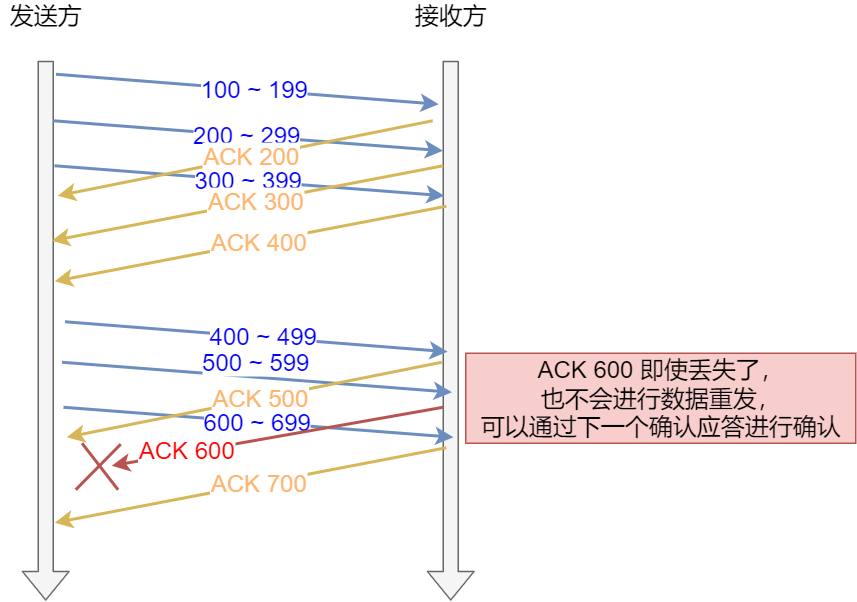
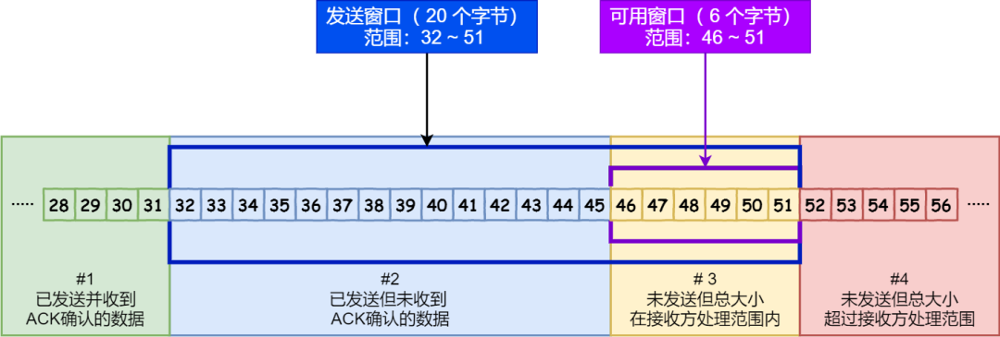

# 滑动窗口

滑动窗口的设计是为了应对：`TCP`每发一个数据包，都要进行一次应答而导致的低效率问题。有了窗口，就可以指定窗口大小，**窗口大小就是指无需等待确认应答，而可以继续发送数据的最大值**。

因此，发送方主机在等到确认应答返回之前，必须在缓冲区中保留已发送的数据。如果按期收到确认应答，此时数据就可以从缓存区清除。

**注意：** 滑动窗口的大小是由 **接受方**的窗口决定的。TCP 头里有一个16位的字段叫 `Window`，也就是**窗口大小**。这个字段是接收端告诉发送端自己还有多少缓冲区可以接收数据。于是发送端就可以根据这个接收端的处理能力来发送数据，而不会导致接收端处理不过来

**累计确认/累计应答**

下图中的 接受方的`ACK 600` 确认应答报文在发送过程中丢失，也没关系，因为可以通过**下一个确认应答**进行确认，只要发送端收到了` ACK 700` 确认应答，就意味着 700 之前的所有数据「接收方」都收到了。这个模式就叫累计确认或者累计应答。

**发送端窗口与接收端窗口**

- 发送端数据可以分为四个部分，如图
  - \#1 已发送并收到`ACK`确认的数据：1~31 字节
  - \#2 已发送但未收到`ACK`确认的数据：32~45 字节
  - \#3 未发送但总大小在接收方处理范围内（接收方还有空间）：46~51字节
  - \#4 未发送但总大小超过接收方处理范围（接收方没有空间）：52字节以后

- 接收端数据分为三个部分，如图
  - \#1 + #2 是已成功接收并确认的数据（等待应用进程读取）；
  - \#3 是未收到数据但可以接收的数据；
  - \#4 未收到数据并不可以接收的数据；

整个滑动窗口是变化的，是根据接受端的滑动窗口变化的。

- 发送端，之前发送出去未接收到ACK的数据（比如上图的32~45字节）收到对端的`ACK`应答后，在滑动窗口大小没有改变的情况下，窗口右边就会右移动被确认的字节数。
- 接收端：接收端需要等应用层取走**已经接受成功并确认的数据**，才会右移滑动滑动窗口。

由于滑动窗口是动态变化的，因此二者并不是完全相等，接收窗口的大小是约等于发送窗口的大小的。注意，上面图中**深蓝色的才是发送/接受端窗口**。