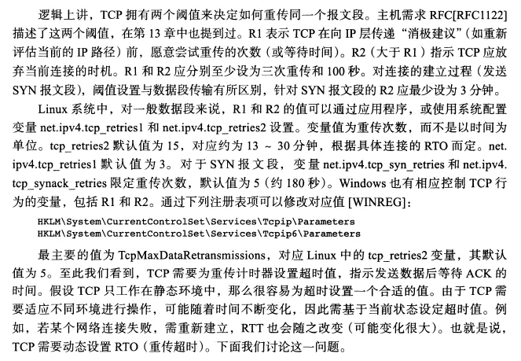
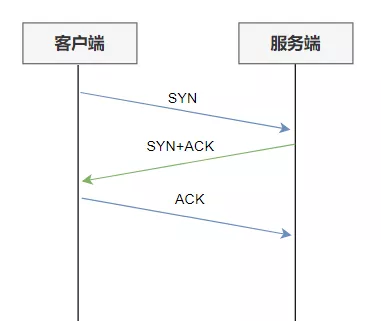

### 重传机制

TCP 实现可靠传输的方式之一，是通过序列号与确认应答。

在 TCP 中，当发送端的数据到达接收主机时，接收端主机会返回一个确认应答消息，表示已收到消息。

正常的数据传输

但在错综复杂的网络，并不一定能如上图那么顺利能正常的数据传输，万一数据在传输过程中丢失了呢？

所以 TCP 针对数据包丢失的情况，会用**重传机制**解决。

接下来说说常见的重传机制：

- 超时重传
- 快速重传
- SACK
- D-SACK

#### 超时重传

重传机制的其中一个方式，就是在发送数据时，设定一个定时器，当超过指定的时间后，没有收到对方的 `ACK` 确认应答报文，就会重发该数据，也就是我们常说的**超时重传**。

TCP 会在以下两种情况发生超时重传：

- 数据包丢失
- 确认应答丢失

超时重传的两种情况

> 超时时间应该设置为多少呢？

我们先来了解一下什么是 `RTT`（Round-Trip Time 往返时延），从下图我们就可以知道：

RTT

`RTT` 就是**数据从网络一端传送到另一端所需的时间**，也就是包的往返时间。

超时重传时间是以 `RTO` （Retransmission Timeout 超时重传时间）表示。

假设在重传的情况下，超时时间 `RTO` 「较长或较短」时，会发生什么事情呢？

超时时间较长与较短

上图中有两种超时时间不同的情况：

- 当超时时间 **RTO 较大**时，重发就慢，丢了老半天才重发，没有效率，性能差；
- 当超时时间 **RTO 较小**时，会导致可能并没有丢就重发，于是重发的就快，会增加网络拥塞，导致更多的超时，更多的超时导致更多的重发。

精确的测量超时时间 `RTO` 的值是非常重要的，这可让我们的重传机制更高效。

根据上述的两种情况，我们可以得知，**超时重传时间 RTO 的值应该略大于报文往返  RTT 的值**。

RTO 应略大于 RTT

至此，可能大家觉得超时重传时间 `RTO` 的值计算，也不是很复杂嘛。

好像就是在发送端发包时记下 `t0` ，然后接收端再把这个 `ack` 回来时再记一个 `t1`，于是 `RTT = t1 – t0`。没那么简单，**这只是一个采样，不能代表普遍情况**。

实际上「报文往返 RTT 的值」是经常变化的，因为我们的网络也是时常变化的。也就因为「报文往返 RTT 的值」 是经常波动变化的，所以「超时重传时间 RTO 的值」应该是一个**动态变化的值**。

我们来看看 Linux 是如何计算 `RTO` 的呢？

估计往返时间，通常需要采样以下两个：

- 需要 TCP 通过采样 RTT 的时间，然后进行加权平均，算出一个平滑 RTT 的值，而且这个值还是要不断变化的，因为网络状况不断地变化。
- 除了采样 RTT，还要采样 RTT 的波动范围，这样就避免如果 RTT 有一个大的波动的话，很难被发现的情况。

RFC6289 建议使用以下的公式计算 RTO：

RFC6289 建议的 RTO 计算

其中 `SRTT` 是计算平滑的RTT ，`DevRTR` 是计算平滑的RTT 与 最新 RTT 的差距。

在 Linux 下，**α = 0.125，β = 0.25， μ = 1，∂ = 4**。别问怎么来的，问就是大量实验中调出来的。

如果超时重发的数据，再次超时的时候，又需要重传的时候，TCP 的策略是**超时间隔加倍。**

也就是**每当遇到一次超时重传的时候，都会将下一次超时时间间隔设为先前值的两倍。两次超时，就说明网络环境差，不宜频繁反复发送。**

超时触发重传存在的问题是，超时周期可能相对较长。那是不是可以有更快的方式呢？

于是就可以用「快速重传」机制来解决超时重发的时间等待。

#### 快速重传

TCP 还有另外一种**快速重传（Fast Retransmit）机制**，它**不以时间为驱动，而是以数据驱动重传**。

快速重传机制，是如何工作的呢？其实很简单，一图胜千言。

快速重传机制

在上图，发送方发出了 1，2，3，4，5 份数据：

- 第一份 Seq1 先送到了，于是就 Ack 回 2；
- 结果 Seq2 因为某些原因没收到，Seq3 到达了，于是还是 Ack 回 2；
- 后面的 Seq4 和 Seq5 都到了，但还是 Ack 回 2，因为 Seq2 还是没有收到；
- **发送端收到了三个 Ack = 2 的确认，知道了 Seq2 还没有收到，就会在定时器过期之前，重传丢失的 Seq2。**
- 最后，接收到收到了 Seq2，此时因为 Seq3，Seq4，Seq5 都收到了，于是 Ack 回 6 。

所以，快速重传的工作方式是当收到三个相同的 ACK 报文时，会在定时器过期之前，重传丢失的报文段。

快速重传机制只解决了一个问题，就是超时时间的问题，但是它依然面临着另外一个问题。就是**重传的时候，是重传之前的一个，还是重传所有的问题。**

比如对于上面的例子，是重传 Seq2 呢？还是重传 Seq2、Seq3、Seq4、Seq5 呢？因为发送端并不清楚这连续的三个 Ack 2 是谁传回来的。

根据 TCP 不同的实现，以上两种情况都是有可能的。可见，这是一把双刃剑。

为了解决不知道该重传哪些 TCP 报文，于是就有 `SACK` 方法。

#### SACK 方法

还有一种实现重传机制的方式叫：`SACK`（ Selective Acknowledgment 选择性确认）。

这种方式需要在 TCP 头部「选项」字段里加一个 `SACK` 的东西，它**可以将缓存的地图发送给发送方**，这样发送方就可以知道哪些数据收到了，哪些数据没收到，知道了这些信息，就可以**只重传丢失的数据**。

如下图，发送方收到了三次同样的 ACK 确认报文，于是就会触发快速重发机制，通过 `SACK` 信息发现只有 `200~299` 这段数据丢失，则重发时，就只选择了这个 TCP 段进行重复。

选择性确认

如果要支持 `SACK`，必须双方都要支持。在 Linux 下，可以通过 `net.ipv4.tcp_sack` 参数打开这个功能（Linux 2.4 后默认打开）。

#### Duplicate SACK

Duplicate SACK 又称 `D-SACK`，其主要**使用了 SACK 来告诉「发送方」有哪些数据被重复接收了。**

下面举例两个栗子，来说明 `D-SACK` 的作用。

*栗子一号：ACK 丢包*

ACK 丢包

- 「接收方」发给「发送方」的两个 ACK 确认应答都丢失了，所以发送方超时后，重传第一个数据包（3000 ~ 3499）
- **于是「接收方」发现数据是重复收到的，于是回了一个 SACK = 3000~3500**，告诉「发送方」 3000~3500 的数据早已被接收了，因为 ACK 都到了 4000 了，已经意味着 4000 之前的所有数据都已收到，所以这个 SACK 就代表着 `D-SACK`。
- 这样「发送方」就知道了，数据没有丢，是「接收方」的 ACK 确认报文丢了。

*栗子二号：网络延时*

网络延时

- 数据包（1000~1499） 被网络延迟了，导致「发送方」没有收到 Ack 1500 的确认报文。
- 而后面报文到达的三个相同的 ACK 确认报文，就触发了快速重传机制，但是在重传后，被延迟的数据包（1000~1499）又到了「接收方」；
- **所以「接收方」回了一个 SACK=1000~1500，因为 ACK 已经到了 3000，所以这个 SACK 是 D-SACK，表示收到了重复的包。**
- 这样发送方就知道快速重传触发的原因不是发出去的包丢了，也不是因为回应的 ACK 包丢了，而是因为网络延迟了。

可见，`D-SACK` 有这么几个好处：

1. 可以让「发送方」知道，是发出去的包丢了，还是接收方回应的 ACK 包丢了;
2. 可以知道是不是「发送方」的数据包被网络延迟了;
3. 可以知道网络中是不是把「发送方」的数据包给复制了;

在 Linux 下可以通过 `net.ipv4.tcp_dsack` 参数开启/关闭这个功能（Linux 2.4 后默认打开）。


大家好，我是轩辕。

前几天，我在读者群里提了一个问题：


这一下，大家总算停止了灌水（这群人都不用上班的，天天划水摸鱼），开始讨论起这个问题来。

有的说通过**User-Agent**可以看，我直接给了一个狗头。


然后发现不对劲，改口说可以通过HTTP响应的Server字段看，比如看到像这种的，那肯定Windows无疑了。

```
HTTP/1.1 200 OK
Content-Type: text/html
Last-Modified: Fri, 23 Aug 2019 01:02:08 GMT
Accept-Ranges: bytes
ETag: "e65855634e59d51:0"
Server: Microsoft-IIS/8.0
X-Powered-By: ASP.NET
Date: Fri, 23 Jul 2021 06:02:38 GMT
Content-Length: 1375
```

还有的说可以通过URL路径来判断，如果大小写敏感就是Linux，不敏感就是Windows。

于是我进一步提高了难度，如果连Web服务也没有，只有一个TCP Server呢？

这时又有人说：可以通过ping这个IP，查看ICMP报文中的**TTL**值，如果是xxx就是xx系统，如果是yyy就是yy系统···（不过有些情况下也不是太准确）


## **从TCP重传说起**

今天想跟大家探讨的是另外一种方法，这个方法的思路来源于前几天被删掉的那篇文章。就是日本网络环境下访问不了极客时间的问题，当时抓包看到的情况是这个图的样子：


看到了服务器后面在不断的尝试重发了吗？当时我就想到了一个问题：

**服务器到底会重传好多次呢？**

众所周知，TCP是一种面向连接的、可靠的、基于字节流的传输层通信协议。

其中，可靠性的一个重要体现就是它的**超时重传机制**。

TCP的通信中有一个确认机制，我发给你了数据，你得告诉我你收到没，这样双方才能继续通信下去，这个确认机制是通过序列号SEQ和确认号ACK来实现的。

简单来说，当发送方给接收方发送了一个报文，而接收方在规定的时间里没有给出应答，那发送方将认为有必要重发。

那具体最多重发多少次呢？关于这一点，RFC中关于TCP的文档并未明确规定出来，只是给了一些在总超时时间上的参考，这就导致不同的操作系统在实现这一机制的时候可能会有一些差异。于是我进一步想到了另一个问题：

**会不会不同操作系统重传次数不一样，这样就能通过这一点来判断操作系统了呢？**

然后我翻看了《TCP/IP详解·卷1》，试图在里面寻找答案，果然，这本神书从来没有让我失望过：



这一段说了个什么事情呢？大意是说RFC标准中建议有两个参数R1和R2来控制重传的次数，Linux中，这俩参数可以这样看：

```
cat /proc/sys/net/ipv4/tcp_retries1
cat /proc/sys/net/ipv4/tcp_retries2
```

`tcp_retries1`默认值是3，`tcp_retries2`默认值是15。

但需要特别注意的是，并不是最多重传3次或者15次，Linux内部有一套算法，这两个值是算法中非常重要的参数，而不是重传次数本身。具体的重传次数还与`RTO`有关系，具体的算法有兴趣的朋友可以看看这篇文章：聊一聊重传次数（http://perthcharles.github.io/2015/09/07/wiki-tcp-retries/）

总体来说，在Linux上重传的次数不是一个固定值，而是不同的连接根据`tcp_retries2`和`RTO`计算出来的一个动态值，不固定。

而在Windows上，也有一个变量来控制重传次数，可以在注册表中设定它：

```
键值路径：
HKLM\System\CurrentControlSet\Services\Tcpip\Parameters

键值名：
TcpMaxDataRetransmissions

默认值：5
```

我手里有一份Windows XP的源码，在实现协议栈的驱动`tcpip.sys`的部分中，也印证了这个信息：

从注册表中读取键值

没有读到的默认值

不过就目前的信息来看，由于Linux的重传次数是不固定的，还没法用这个重传次数来判断操作系统。

## **TCP之SYN+ACK的重传**

就在我想要放弃的时候，我再一次品读《TCP/IP详解·卷1》中的那段话，发现另一个信息：**TCP的重传在建立连接阶段和数据传输阶段是不一样的！**

上面说到的重传次数限制，是针对的是TCP连接已经建立完成，在数据传输过程中发生超时重传后的重传次数情况描述。

而在TCP建立连接的过程中，也就是三次握手的过程中，发生超时重传，它的次数限定是有另外一套约定的。

**Linux：**


在Linux中，另外还有两个参数来限定建立连接阶段的重传次数：

```
cat /proc/sys/net/ipv4/tcp_syn_retries
cat /proc/sys/net/ipv4/tcp_synack_retries
```

`tcp_syn_retries`限定作为客户端的时候发起TCP连接，最多重传SYN的次数，Linux3.10中默认是6，Linux2.6中是5。

`tcp_synack_retries`限定作为服务端的时候收到SYN后，最多重传SYN+ACK的次数，默认是5

重点来关注这个`tcp_synack_retries`，它指的就是TCP的三次握手中，服务端回复了第二次握手包，但客户端一直没发来第三次握手包时，服务端会重发的次数。

我们知道正常情况下，TCP的三次握手是这个样子的：



但如果客户端不给服务端发起第三个包，那服务端就会重发它的第二次握手包，情况就会变成下面这样：


所以，这个`tcp_synack_retries`实际上规定的就是上面这种情况下，服务端会重传SYN+ACK的次数。

为了进一步验证，我使用Python写了一段代码，用来手动发送TCP报文，里面使用的发包库是scapy，这个我之前写过一篇文章介绍它：[面向监狱编程，就靠它了！](https://mp.weixin.qq.com/s?__biz=MzIyNjMxOTY0NA==&mid=2247490184&idx=1&sn=271fee2bc91e33dcdd780957675e2b98&scene=21#wechat_redirect)。

下面的这段代码，我向目标IP的指定端口只发送了一个SYN包，：

```
def tcp_syn_test(ip, port):

    # 第一次握手，发送SYN包
    # 请求端口和初始序列号随机生成
    # 使用sr1发送而不用send发送，因为sr1会接收返回的内容
    ans = sr1(IP(dst=ip) / TCP(dport=port, sport=RandShort(), seq=RandInt(), flags='S'), verbose=False)
```

用上面这段代码，向一台Linux的服务器发送，抓包来看一下：


实际验证，服务器确实重传了5次SYN+ACK报文。

一台服务器说明不了问题，我又多找了几个，结果都是5次。

再来看一下Linux的源码中关于这个次数的定义：


接下来看一下Windows上的情况。

## **Windows**

前面说过，在注册表`HKLM\System\CurrentControlSet\Services\Tcpip\Parameters`目录下有一个叫`TcpMaxDataRetransmissions`的参数可以用来控制数据重传次数，不过那是限定的数据传输阶段的重传次数。

根据`MSDN`上的介绍，除了这个参数，还有另一个参数用来限制上面SYN+ACK重传的次数，它就是`TcpMaxConnectResponseRetransmissions`。


而且有趣的是，和Linux上的默认值不一样，Windows上的默认值是**2**。

这就有意思了，通过这一点，就能把Windows和Linux区分开来。

我赶紧用虚拟机中的XP上跑了一个nginx，测试了一下：


果然是2次，随后我又换了一个Windows Server 2008，依旧是2次。

为了进一步验证，我通过注册表把这个值设定成了4：


再来试一下：


重传次数果然变成了4次了。

接下来在手中的Windows XP源码中去印证这个信息：


果然，不管是从实验还是从源码中都得到了同一个结论：

> Linux上，SYN+ACK默认重传5次。
>
> Windows上，SYN+ACK默认重传2次。

## **总结**

如果一个IP开启了基于TCP的服务，不管是不是HTTP服务，都可以通过向其发送SYN包，观察其回应来判断对方是一个Linux操作系统还是一个Windows操作系统。

当然，这种方法的局限性还是挺大的。

首先，本文只介绍了一些默认的情况，但TCP的重传次数是可以更改的，如果网络管理员更改了这个数值，判断的结果就不准确了。

其次，对于有些网络服务器开启了防DDoS功能，测试发现，其根本不会重传SYN+ACK包，比如我用百度的IP测试就得到了这样的结果。

最后，没有测试其他操作系统上的情况，比如Unix和MAC OSX，为什么呢？


因此，文中介绍的这种方法只能作为一种辅助手段，仅供参考，大家能顺便了解一些关于TCP重传的知识也是很有意义的。

好了，以上就是今天的分享了，写作不易，大家看完给个三连支持呀~


