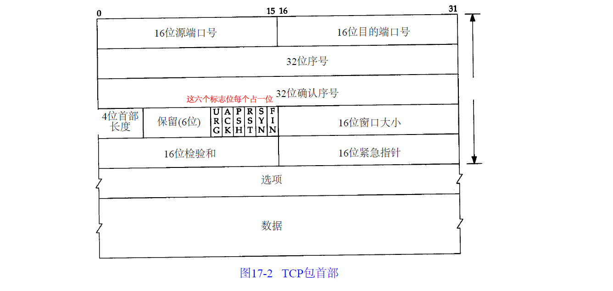

# TCP消息格式



- 首部长度：“选项” 没有使用就是20个字节，使用了就靠首部长度获悉。

- 序号*Seq*
  **用于对字节流进行编号**。例如序号为 301，表示第一个字节的编号为 301，如果携带的数据长度为 100 字节，那么下一个报文段的序号应为 401

  > 序号用来标识从TCP发端向TCP收端发送的数据字节流，它表示在这个报文段中的的第一个数据字节。如果将字节流看作在两个应用程序间的单向流动，则 **TCP用序号对每个字节进行计数**。序号是32 bit的无符号数，序号到达`2^32-1`后又从0开始。

- 确认序号*Ack*
  确认序号， 即**期望收到的下一个报文段的序号**，其值是上次已成功收到数据字节序号 *seq* 加上携带的数据长度：*Ack = seq + length* 。只有 *ACK* 标志为 1 时确认序号字段才有效。

  > 例如 B 正确收到 A 发送来的一个报文段，序号为 501，携带的数据长度为 200 字节，因此 B 期望下一个报文段的序号为 701，B 发送给 A 的确认报文段中确认号就为 701。

  ```cpp
  序号和确认序号是保证数据可靠性的重要方式。
  
   + 序号：用来解决的是 **网络包乱序的问题**
   + 确认序号：用来解决**不丢包**的问题
  
  小写的**Ack**一般表示确认序号，大写的**ACK**一般表示标志位
  ```

- 标志位 : *URG，ACK，PSH，RST，SYN，FIN*

  - URG：紧急指针（[urgent pointer](https://www.zhihu.com/search?q=urgent+pointer&search_source=Entity&hybrid_search_source=Entity&hybrid_search_extra={"sourceType"%3A"article"%2C"sourceId"%3A81144898})）有效。

  - ACK：`ACk=1`时，确认序号才有效。TCP 规定除了最初建立连接时的`SYN`包之外该位必须设置为1。
  - PSH：接收方应该尽快将这个报文交给应用层。
  - RST：`RST=1`时，表示`TCP`连接出现异常，需要重建连接。
  - SYN：`SYN=1`时，表示发起一个连接。
  - FIN：`FIN=1`时，表示的发送端**不会再有数据发送**，希望断开连接。

- 窗口大小
  为流量控制而设计。窗口值作为接收方让发送方设置其发送窗口的依据。之所以要有这个限制，是因为接收方的数据缓存空间是有限的。窗口大小是一个 16 bit字段，因而窗口大小最大为65535字节。