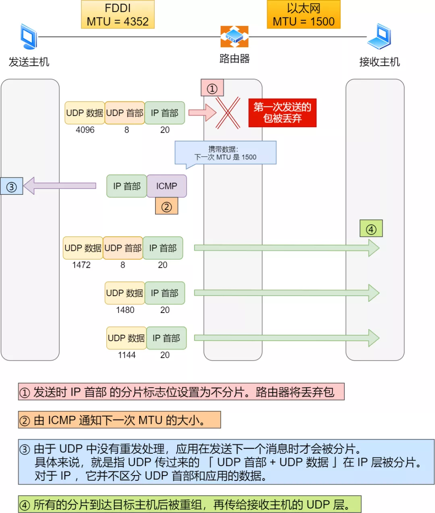

### traceroute —— 差错报文类型的使用

有一款充分利用 ICMP **差错报文类型**的应用叫做 `traceroute`（在UNIX、MacOS中是这个命令，而在Windows中对等的命令叫做 tracert ）。

*1. traceroute 作用一*

traceroute 的第一个作用就是**故意设置特殊的 TTL，来追踪去往目的地时沿途经过的路由器。**

traceroute 的参数指向某个**目的 IP 地址**：

```
traceroute 192.168.1.100
```

> 这个作用是如何工作的呢？

它的原理就是利用 IP 包的**生存期限** 从 `1` 开始按照顺序递增的同时发送 **UDP 包**，强制接收 **ICMP 超时消息**的一种方法。

比如，将 TTL 设置 为 `1`，则遇到第一个路由器，就牺牲了，接着返回 ICMP 差错报文网络包，类型是**时间超时**。

接下来将 TTL 设置为 `2`，第一个路由器过了，遇到第二个路由器也牺牲了，也同意返回了 ICMP 差错报文数据包，如此往复，直到到达目的主机。

这样的过程，traceroute 就可以拿到了所有的路由器 IP。

当然有的路由器根本就不会返回这个 ICMP，所以对于有的公网地址，是看不到中间经过的路由的。

> 发送方如何知道发出的 UDP 包是否到达了目的主机呢？

traceroute 在发送 `UDP` 包时，会填入一个**不可能的端口号**值作为 UDP 目标端口号（大于 `3000` ）。当目的主机，收到 UDP 包后，会返回 ICMP 差错报文消息，但这个差错报文消息的类型「**端口不可达**」。

所以，**当差错报文类型是端口不可达时，说明发送方发出的 UDP 包到达了目的主机。**

*2. traceroute 作用二*

traceroute 还有一个作用是**故意设置不分片，从而确定路径的 MTU**。

> 这么做是为了什么？

这样做的目的是为了**路径MTU发现**。

因为有的时候我们并不知道路由器的 `MTU` 大小，以太网的数据链路上的 `MTU` 通常是 `1500` 字节，但是非以太网的 `MTU` 值就不一样了，所以我们要知道 `MTU` 的大小，从而控制发送的包大小。

MTU 路径发现（UDP的情况下）

它的工作原理如下：

首先在发送端主机发送 `IP` 数据报时，将 `IP` 包首部的**分片禁止标志位设置为 1**。根据这个标志位，途中的路由器不会对大数据包进行分片，而是将包丢弃。

随后，通过一个 ICMP 的不可达消息将**数据链路上 MTU 的值**一起给发送主机，不可达消息的类型为「**需要进行分片但设置了不分片位**」。

发送主机端每次收到 ICMP 差错报文时就**减少**包的大小，以此来定位一个合适的 `MTU` 值，以便能到达目标主机。