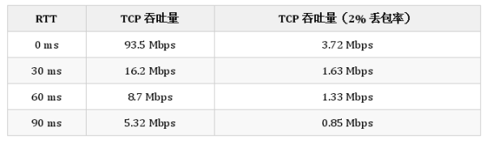

在网络通信中，从发送方发出数据开始到收到来自接收方的确认的时间被叫做往返时延(Round-Trip Time，RTT)。

弱网环境是丢包率较高的特殊场景，TCP 在类似场景中的表现很差，当 RTT 为 30ms 时，一旦丢包率达到了 2%，TCP 的吞吐量就会下降 89.9%[^3]，从下面的表中我们可以看出丢包对 TCP 的吞吐量极其显著的影响：

本文将分析在弱网环境下(丢包率高)影响 TCP 性能的三个原因：

TCP 的拥塞控制算法会在丢包时主动降低吞吐量;

TCP 的三次握手增加了数据传输的延迟和额外开销;

TCP 的累计应答机制导致了数据段的传输;

在上述的三个原因中，拥塞控制算法是导致 TCP 在弱网环境下有着较差表现的首要原因，三次握手和累计应答两者的影响依次递减，但是也加剧了 TCP 的性能问题。

**拥塞控制**

TCP 拥塞控制算法是互联网上主要的拥塞控制措施，它使用一套基于线増积减(Additive increase/multiplicative decrease，AIMD)的网络拥塞控制方法来控制拥塞[^4]，也是造成 TCP 性能问题的主要原因。

第一次发现的互联网拥塞崩溃是在 1986 年，NSFnet 阶段一的骨干网的处理能力从 32,000bit/s 降到了 40bit/s，该骨干网的处理能力直到 1987 和 1988 年，TCP 协议实现了拥塞控制之后才得到解决[^5]。正是因为发生过网络阻塞造成的崩溃，所以 TCP 的拥塞控制算法就认为只要发生了丢包当前网络就发生了拥堵，从这一假设出发，TCP 就使用了慢启动和线增积减[^6]的机制实现拥塞控制。

tcp-congestion-control

**图 1 - TCP 的拥塞控制机制**

每一个 TCP 连接都会维护一个拥塞控制窗口(Congestion Window)，拥塞控制窗口的作用有两个：

1. [鸿蒙官方战略合作共建——HarmonyOS技术社区](https://harmonyos.51cto.com/#wlxqy)
2. 防止发送方向接收方发送了太多数据，导致接收方无法处理;
3. 防止 TCP 连接的任意一方向网络中发送大量数据，导致网络拥塞崩溃

很多人提到keepalive，TCP无法感知网络中断这些问题。。。这个算是TCP一个容易踩的坑，但这并不能说明UDP就比TCP好（或者说解释为何要使用UDP）。因为**在UDP上面一样需要面对这些问题，而解决这类问题的方法和在TCP上面进行应用层心跳的方法其实没有本质上的区别。**而这就是为什么没有接触过这类问题的人会有题主提出的疑惑。

那么为什么呢？最本质上UDP的优势还是带宽的利用。这一切要回归到99~03年的网络状况，当时网络的特点就是接入带宽很窄而且抖动特别厉害。所谓抖动可能是多方面的，例如延时突发性地暴增、也有可能是由于路由层面的变化突然导致路由黑洞，还各种等等等等的问题。TCP因为拥塞控制、保证有序等原因，在这种网络状态上对带宽的利用是非常低的。而且因为网络抖动的原因，应用层心跳超时（一般不依靠keepalive）应用层主动断掉socket之后TCP需要三次握手才能重新建立链接，一旦出现频繁的小抖动就会使得带宽利用更低。而等待四次挥手的时间，也会占用服务器上宝贵的资源。

**总结来说，当网络差到一定程度了，TCP的优势反而会成为劣势。**

这时候我们再看看UDP在这种情况下的表现。使用UDP对抗网络抖动，说到底就是在应用层比TCP更快地探测和重传，一旦超过一定的时间没有收到回复，客户端可以选择马上重试或者换一个IP:PORT重试（假如你的服务像QQ一样有多个接入），在服务器端则可以果断地断掉socket。而可以应用UDP的时候，往往是你的应用层协议本身已经具备了一定的面向连接的特性。如果你应用层的协议已经达到了一定程度的消息幂等，客户端可以几乎无脑地进行重传，这样就可以**尽可能地降低网络抖动的影响**，同时也可以**尽可能地利用整个带宽**。而刚好QQ的协议，就具备类似的特点。

简单来说就是我们可以使用UDP实现一个面向连接协议，这个协议可以很好地适应当时的网络状况和QQ本身的业务。但凡事都有成本，成本就是你的应用层协议本身需要去实现抵抗网络异常带来的问题。例如乱序、例如业务数据的分片和重组、例如网络状态探测等等等等。。。

而现在UDP也应用在很多跨运营商、跨地域、跨机房之间的服务调用当中。原因无它，就是网络烂到一定程度了。