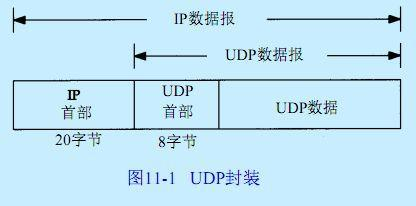
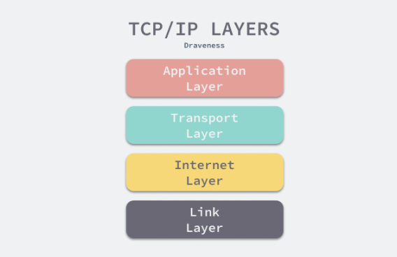
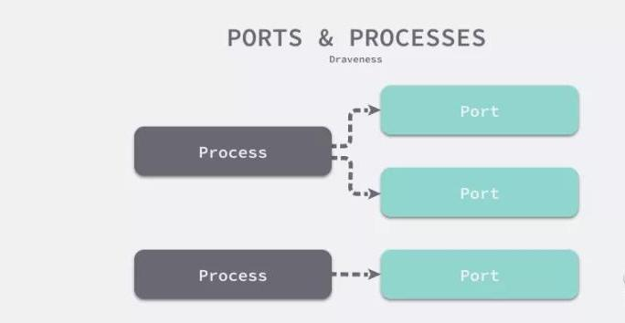

 

UDP 与 TCP 两种传输协议是 IP 协议簇的核心成员，1980 年发布的 RFC 768 定义了 UDP 协议[^1]，我们可以通过它在多个计算机连接构成的网络中传递数据。

> 常见的 DNS 协议就可以使用 UDP 协议获取域名解析的结果[^2]。

UDP 是能够传输数据的最简单的协议，它的协议首部（也称作协议头）只有 8 个字节，很多人，尤其是应届毕业生都能通过死机硬背暂时记住 UDP 协议头包含的内容，但是知道协议头的内容不代表我们真正理解背后的原因。

> 本文会分析为什么只有 8 个字节的 UDP 协议能够传输数据，相信这篇文章能帮助你更好地理解 UDP 协议头中字段的作用。

**图 1 - UDP 协议头**

UDP 协议头中只包含 4 个字段，分别是源端口、目的端口、长度和校验码，其中每一个字段都占 16 比特，即 2 字节，这 4 个字段的作用如下：

  ✪ 源端口是一个可选字段，它表示发送方进程的端口号，接收方可以使用该字段（不一定准确）向发送方发送信息；

  ✪ 目的端口是数据报接收方的端口号，它只在目标的 IP 地址下才有意义；

  ✪ 长度是协议头和数据报中数据长度的总和，表示整个数据报的大小；

  ✪ 校验码使用 IP 首部、UDP 首部和数据报中的数据进行计算[^3]，接收方可以通过校验码验证数据的准确性，发现传输过程中出现的问题；

通过 Wireshark 抓包来查看实际使用中 UDP 协议首部的值。当我们执行 dig baidu.com 命令时，本地就会向 DNS 服务器发送 DNS 查询，下面就是一个 DNS 查询中 UDP 首部的例子：

> 0000 ff 7c 00 35 00 23 c2 6e

上述 UDP 首部中四个字段对应的值如下：

 

由于 DNS 协议使用的端口是 53[^4]，所以上述 UDP 首部中的目的端口就是 53。源端口就是本地发出 DNS 请求的端口，该端口也用来接收 DNS 响应。

定义 UDP 协议的 RFC 768 文档只有 3 页，由于 UDP 协议既不需要保证送达，也不需要保证顺序，所以它没有 TCP 协议那么复杂。

> TCP 协议中的三次握手[^5]、拥塞控制算法和重传策略等机制都是为了提供可靠性所付出的必要代价，但是 UDP 协议不需要这些策略，它只尽力保证数据报的送达。

我们今天来分析一下为什么首部只有 8 个字节的 UDP 协议能够将数据传输到目的地并由特定的服务接收和处理。

我们可以将应用到应用之间的传输过程分成两个部分：主机到主机的数据传输和主机到应用的数据转发。

  ✪ UDP 协议底层的网际协议（Internet Protocol，IP）会负责数据包在主机之间的传输；

  ✪ UDP 协议首部的端口号用于定位处理数据的具体进程并转发数据；

我们都说 UDP 协议是传输层协议，但是真正在主机间完成『数据传输』工作的是 IP 协议，UDP 协议只起到了定位具体进程的作用。

## 数据传输

RFC768 在介绍 UDP 协议时强调 UDP 协议假设底层会使用 IP 协议。IP 协议是 TCP/IP 协议栈的核心成员，它不保证端到端数据的可靠性和顺序，也不包含流控制等机制，其作用就是从来源向目的地传输数据包[^6]。

> 『UDP 协议只能尽力送达数据』这一说法『继承』自 UDP 的下层协议，也就是 IP 协议。只包含了两个端口号的 UDP 协议本身是无法提供路由和寻址功能的，它还是需要下层的协议来解决这个问题。

上面提到的这种各司其职的设计源于网络通讯协议的分层结构。抽象是计算机科学中的基础概念，通过定义良好的接口、构建抽象层，我们可以减少同时需要关注的问题，让每一层都能聚焦到需要处理的问题上。

TCP/IP 协议簇将通信过程分成了四个抽象层，分别是：链接层（Link）、网络层（Internet）、传输层（Transport）和应用层（Application）[^7]。

 

**图 2 - TCP/IP 协议簇的抽象层**

不同的抽象层有着完全不同的功能，我们来看一下网络层和传输层的职责。

> TCP 和 UDP 等传输层协议的主要作用是为应用建立基本的数据管道，为特定任务提供数据传输的功能；而 IP 等网络层协议的主要作用是寻址和路由，它能够帮助我们将数据发送目标的主机。

简单总结一下，UDP 协议下层的 IP 协议实现数据包的传输，虽然 UDP 属于传输层协议，但是其本身没有提供主机到主机的数据传输能力。

##  

## 进程定位

在软件层面上，端口是用来表示特定进程或者特定类型网络服务的逻辑概念[^8]，计算机硬件中也有端口的概念，但是这里说的端口是没有实体的。

当主机接收到 IP 数据包时会根据协议号交给不同的模块处理，TCP 和 UDP 协议会根据端口号确定送给对应的进程处理。

虽然 TCP 和 UDP 协议中都有端口号这一概念，但是因为它们两者的端口不在一个命名空间下（TCP 和 UDP 是两套命名空间），所以 TCP 和 UDP 可以同时使用相同的端口号。

> 例如：53/TCP 和 53/UDP，这两个端口号后的服务都处理 DNS 请求。从这一点来看，只有通过 IP 地址、传输层协议和端口号三者才能在网络上定位到具体的服务，只凭借 IP 地址和端口号是不可行的。

 

**图 3 - TCP 和 UDP 的重复端口号**

UDP 协议中的两个端口号占据了 UDP 协议头的一半开销，这从侧面表明了端口号在 UDP 协议的重要地位和 UDP 协议的主要功能。

接收 IP 数据包的主机可以使用目的端口号找到特定的进程，该进程也可以使用数据包中的源端口号向发送方回复数据。

 

**图 4 - 端口号和进程**

TCP 和 UDP 的端口号是主机和进程的中间层，进程和端口号既可以是一对一的关系，也可以是一对多的关系，端口号的引入可以让同一个主机上的多个进程对外提供服务，也可以让一个进程对外提供多个服务。

有了端口号，想要访问主机服务的请求也不需要使用进程标识符等方式定位提供服务的具体进程。

##  

## 总结

简单回答一下本文提出的问题：UDP 协议利用下层的 IP 协议提供基本的数据传输能力，它的作用就是引入端口号的概念让同一主机可以同时提供对外多个服务，由于不保证可靠性，所以协议本身只占用 8 个字节。

在理想情况下，我们可以在 IP 协议上构建新的传输层协议实现特定的需求，不过在实际操作中由于协议号的限制，新的传输层协议无法被大量部署的网络地址转换（Network address translation，NAT）[^9]设备识别和支持，所以使用这种方式构建新的传输层协议在实践中难以落实。

> 注1：协议号是 IP 首部中的一个字段，它表示当前报文数据区使用的协议，最常见的 TCP 和 UDP 协议的协议号分别是 6 和 17。

> 注2：SCTP 协议[^10]就是一个 RFC 标准中的传输层协议，但是 NAT 设备的兼容性问题会导致 SCTP 报文被丢弃。

由于 UDP 协议非常简单，很多新的传输层协议都会基于 UDP 实现，例如：Google 的 QUIC 协议[^11]。

到最后，我们还是来看一些比较开放的相关问题，有兴趣的读者可以仔细思考一下下面的问题：

  ✪ UDP 协议中的长度和校验码可以被省略么？为什么？

  ✪ 除了 UDP 和 TCP 协议，其他基于 IP 的传输层协议有没有端口号的概念？