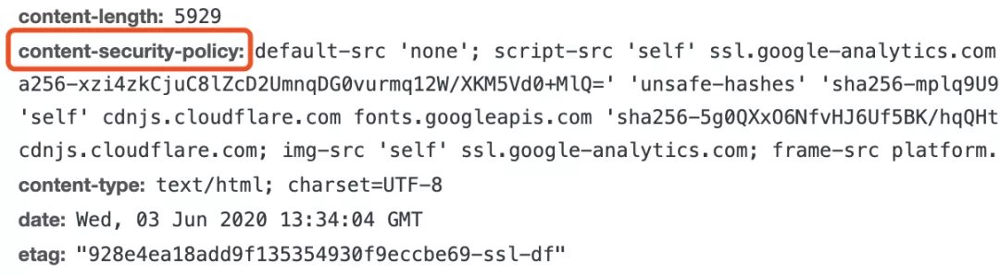

## **神秘URL**

我叫小风，是Windows帝国一个普通的上班族。上一回说到[因为一个跨域请求，我差点丢了饭碗](https://mp.weixin.qq.com/s?__biz=MzIyNjMxOTY0NA==&mid=2247484178&idx=1&sn=7d8e5efe7cba41122a6d978a08058627&scene=21#wechat_redirect)，好在有惊无险，我的职场历险记还在继续。

“叮叮叮叮~~~~”，闹钟又把我给吵醒了，我一看时间竟然已经这么晚了。

我赶紧起身，准备要去上班，好不容易在那家浏览器公司谋了个差事，可不敢迟到。

今天又是普通的一天，很快就到了深夜，上网业务少了，我和小雪妹子一合计，伙同负责网络连接的老白和负责存储的小黑，一起打起了麻将。


一连打了几圈，正在兴头上，公司的美女前台跑了过来，“你们几个别玩了，上网业务来了。老白，这是URL，给”

我瞅了一眼这URL，看上去有些奇怪，不仅比之前见过的都长，貌似还夹杂着一些JavaScript代码。

> http://zone.oo.com/user/info.jsp?desc="/><script>$("body").append("")</script><!--

“老白，这URL长的好奇怪？会不会有什么问题？”，我向老白问到。

“嗨，你小子就是新来的，我见过的URL比你执行过的JS代码都多，什么奇形怪状的没见过，大惊小怪”，老白不屑一顾。

“大家把牌盖着，都别看，忙完了回来咱接着打”，老白继续说到。

于是大家各归各位，准备处理这一单上网业务。

很快，老白取回了这个URL背后的网页，交给了小雪来解析渲染。

小雪做了一半，叫住了我：“风哥，又有 **<script>** 标签了，该你上了”。

我接过小雪手里的网页，猛地一看，**这不是刚刚URL里面出现的代码吗？怎么又跑到网页里面去了？**

心里突然涌上一种不好的预感，正在困惑之中，老白催我了，“小雪小风你俩赶紧的，网页加载半天了还没显示出来！”

但愿是我多想了，我开始执行这 **<script>** 标签中的代码了。

```
<script>
  $("body").append("\")
</script>
```

我要创建一个新的 **** 标签，添加到网页正文中去。看了一下这个图片的来源，是一个新的地址，再一看，还要把当前网站的**Cookie**带着作为参数才能拿到这个图片。

我来到小黑的存储仓库，准备向他索要Cookie。

当我表明来意以后，小黑也显得有些谨慎，“**按照公司规定，一个网站的Cookie是不能随便给别的网站访问的**”

“这我当然知道，不过现在是这个网站的JS代码主动把Cookie取出来发给别人，这不算违反公司规定吧”，我解释到。

小黑邹着眉头想了一想，也就同意了。

我拿到cookie后，构建了一个完整的 **** 标签添加到了网页的DOM树中，之后还给小雪继续渲染。

网页很快渲染完成展示出来了，忙完之后我们继续开始未完的牌局。

过了一会儿，人类终于关掉了浏览器，我们也可以下班了······

## **XSS跨站脚本攻击**

第二天一早，我刚到公司，小雪妹子就转过头告诉我：“风哥，主管让你去趟他的办公室，他好像不太高兴，你当心点”

“你知道是什么事情吗？”

“我也不太清楚，只听说你执行了什么错误的JavaScript代码”

我心里一紧，感觉大事不妙，难道是昨晚那奇怪的代码有什么问题？

来到主管的办公室，见里面坐了一个年轻小哥。我轻轻的敲了敲门问到：“主管，您找我有事？”

主管见我到来，指着旁边的沙发示意我也坐下。

“你闯祸了知道吗？”，领导扔给我一页文件。


我拿起文件一看，上面赫然写着我昨晚执行那段奇怪的JavaScript代码。

“主管，我不太清楚，这是有什么问题吗？”，我小声问道。

主管指着旁边那个年轻小哥说到：“这位是OO空间网站的负责人，让他告诉你吧”

小哥点了点头说到：“是这样的，我们发现有人盗用我们网站的Cookie，免登录直接访问了进去，经过日志排查，发现是你们这里把Cookie泄露的，所以想过来了解一下情况”


“这段代码是你们网站自己的，我只是完成我的工作执行了它而已啊”，我开始有些紧张了。

“可是我们网站根本没有这段代码，也不可能把Cookie就这样发给别人的”，这小哥也争辩道。

办公室的气氛变得有些紧张，现场陷入了短暂的安静。

就在此时，年轻小哥出去接了一个电话。

片刻之后，小哥再次回到办公室，脸色突然和缓了许多，笑着说到：“不好意思，刚刚接到同事的电话说，他们已经排查出了问题，**是我们网站对URL中的参数没有检查，直接写入了网页中，被人利用传入了JS代码**。跟你们应该没有关系，实在是抱歉”


听完，我松了一口气，差点就要背锅了。

回到工位，我把事情的经过告诉了大伙。

小雪听后吐槽：“那些奇奇怪怪的URL就别乱点嘛，真是给我们添乱”

“你看你看，我昨晚上就觉得有些不对劲。这坏蛋手段挺高啊，能想出这么个损招，咱们给这种攻击方式取个名字吧”，小黑说到，“叫`Cross Site Script`攻击怎么样？”

老白点了点头，“跨站脚本攻击，嗯，总结很到位，那就简称CSS吧！”

小雪一听转过头来，“你叫CSS，那我的层叠样式表岂不是要改名让贤？”

老白挠了挠头，有些不好意思，“哦，忘了这一茬。那改一下，叫**XSS**，这总可以了吧？”

我们都点了点头，就这么定了。

## **XSS Auditor**

虽然这一次的事情责任不在我们浏览器，不过我一直还是有些后怕。

这天晚上，我又仔细回忆了那天整个事情的经过


突然脑子里灵光一闪，发现一个重要的特点


**既然JS代码同时出现在了请求的URL中和响应的网页中，何不利用这个特点来进行针对性拦截呢？**

越想越难入睡，连夜写起了方案。

第二天，来到公司，打算将昨晚的方案汇报给主管，挣一下表现。

我再次来到主管办公室，主管见是我，招呼道：“小风啊，来来来，刚好找你有点事”

我快步走了进去，只见主管又拿出了一叠文件放在我的面前，随后说到：“这是我搞到的绝密资料，是咱们隔壁Chrome浏览器公司的一个叫`XSS Auditor`的技术，据说可以阻止类似上次的攻击事件，你抽空研究一下”


我脑子一懵，赶紧快速浏览了这份文件，没想到居然跟我的方案撞到一块儿了，而且比我想的还全面细致。我只好悄悄收起了原来准备汇报的方案······

几天后，主管宣布我们也要用上这种技术，增强咱们浏览器的安全性。

## **存储型XSS**

“听说了吗？隔壁Chrome浏览器公司也发生XSS攻击了”，一天中午，老白神神秘秘的说到。

我一听来了精神，“不是有XSS Auditor吗，怎么还会发生这种事？”

“这回那些坏蛋换招了，他们没有把JS代码放在URL中，XSS Auditor自然是发觉不了了”

“不在URL中，那放哪里了？”

“听说是存在了数据库里，访问网页的时候从数据库里读取出来后，直接给填充到了网页上了，喏，就像这样”，老白说完画了一个图。


“对了，他们借此机会把XSS攻击分成了两种，以前那种直接通过URL把JS代码注入进网页的方式叫做`反射型XSS`，这一次这种叫`存储型XSS`”，老白继续说到。

我看了老白的图一下就明白了，“这一招也太狠了，存进了网站的数据库里，所有人访问页面都得中招”

“可不是咋的，OO空间网站那边已经乱成一锅粥了，正在内部整顿，对所有的输入进行全面的检查过滤，防止JS代码混进去。”

“这种事情还是得他们网站自己做好检查，咱们浏览器也帮不上什么忙”，一旁的小黑也插了一嘴。

大家七嘴八舌聊了几句就散了。


虽然小黑说的也没错，不过上次的方案撞车，我一直不太服气，这一次机会来了，我要是能再想出一套方案，能把这次的新型XSS一并解决的话，那就扬眉吐气了。

之后一段时间，一有闲暇我就开始思考这个问题，却一直没什么进展。

## **CSP**

这一天中午，没什么工作要忙，我又想起了这个问题，小雪他们又组织打麻将，我没有心思便拒绝了。

老白闻讯过来，说到：“小风，你还在想那个问题啊，你这两天没看新闻吗，W3C标准化组织推出了一个新技术，已经把这个问题解决了！”

老白的话如当头一棒，“什么技术？怎么解决的？”


“你看你，天天关起门来研究，都不知道外面的世界变化有多快。你去了解一下，好像叫什么`Content Security Policy`，哦对，就是这个，简称叫`CSP`”

我赶紧去打听了这个叫CSP的新技术，看完直拍大腿，我怎么就没想到。

CSP规定了一个叫`Content-Security-Policy`的信息，网站通过这个信息告诉浏览器哪些外部资源可以加载和执行。这个信息可以用HTTP头的形式出现，像这样：



也可以通过 **<meta>** 标签出现，像这样：

```
<meta http-equiv="Content-Security-Policy" 
      content="script-src 'self'; object-src 'none'; style-src cdn.example.org third-party.org; child-src https:">
```

至于里面的内容，则是将所有可能出现外部资源加载的地方进行了指示，浏览器拿到它就能知道能去哪些地址加载对应的资源，如果资源所在的地址不在名单之内就拒绝加载：

```
- script-src：外部脚本
- style-src：样式表
- img-src：图像
- media-src：媒体文件（音频和视频）
- font-src：字体文件
- object-src：插件（比如 Flash）
- child-src：框架
- frame-ancestors：嵌入的外部资源
- connect-src：HTTP 连接（通过 XHR、WebSockets、EventSource等）
- worker-src：worker脚本
- manifest-src：manifest 文件
```

比如 img-src的内容是`self`，那所有的 **** 标签的src属性必须是在当前网站才行，如果加载其他地址的图片就会拒绝。

不仅如此，还提供了一个叫`report-uri`的字段，字段内容是一个服务器地址，浏览器发现有不符合规定的资源加载后，除了拒绝加载还可以把这一情况报告给这个地址，网站就能及时知道预警了。

真是完美的解决方案！没想到，竟然这么多竞争对手都已经用上了这项技术


当天下午，我就拉着老白去到领导办公室，说服他将这项技术在咱们公司也用起来。

烦人的XSS攻击总算是缓解了不少，我们也难得度过了一段时间的太平日子。

**未完待续······**

## **彩蛋**

> 太平的日子没有太持久，那件事之后半个月，我又因为执行一段JS代码霸占CPU太久，被帝国安全警卫队勒令我们浏览器公司强制关闭。
>
> 执行JavaScript这份工是越来越不好打了。
>
> *预知后事如何，请关注后续精彩······*