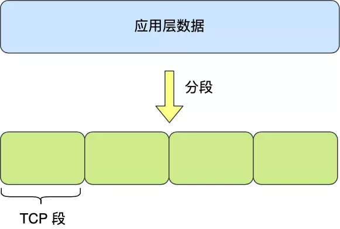
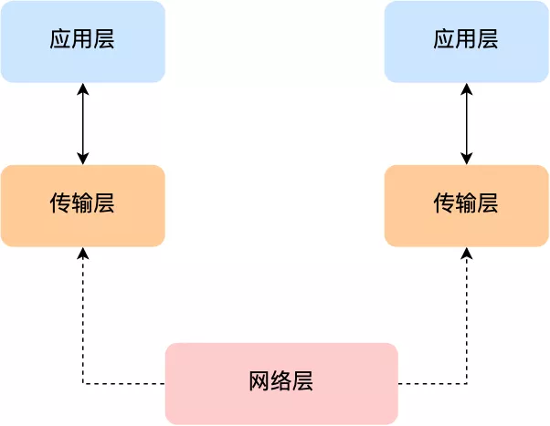
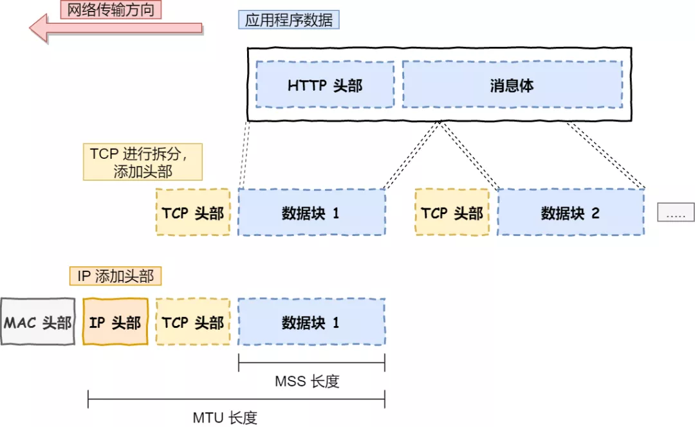
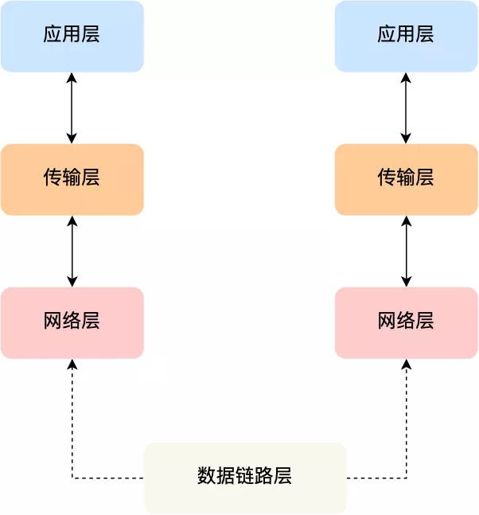
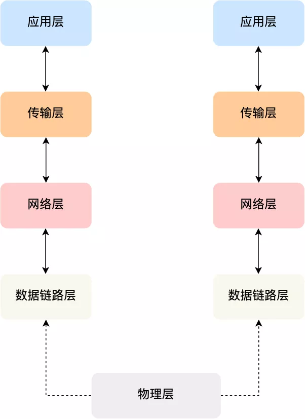
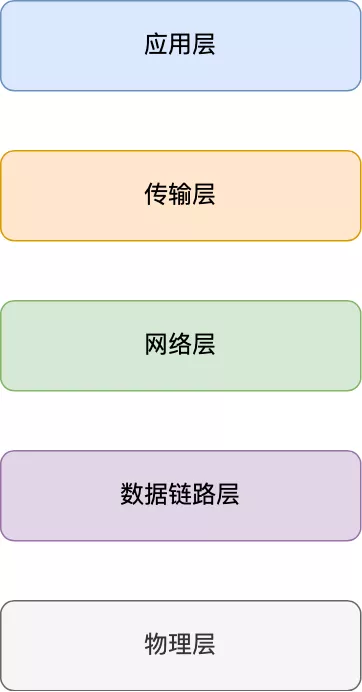

### 网络模型

为了使得多种设备能通过网络相互通信，和为了解决各种不同设备在网络互联中的兼容性问题，国际标标准化组织制定了开放式系统互联通信参考模型（*open System Interconnection Reference Model*），也就是 OSI 网络模型，该模型主要有 7 层，分别是应用层、表示层、会话层、传输层、网络层、数据链路层以及物理层。

每一层负责的职能都不同，如下：

- 应用层，负责给应用程序提供统一的接口；
- 表示层，负责把数据转换成兼容另一个系统能识别的格式；
- 会话层，负责建立、管理和终止表示层实体之间的通信会话；
- 传输层，负责端到端的数据传输；
- 网络层，负责数据的路由、转发、分片；
- 数据链路层，负责数据的封帧和差错检测，以及 MAC 寻址；
- 物理层，负责在物理网络中传输数据帧；

由于 OSI 模型实在太复杂，提出的也只是概念理论上的分层，并没有提供具体的实现方案。事实上，我们比较常见，也比较实用的是四层模型，即 TCP/IP 网络模型，Linux 系统正是按照这套网络模型来实现网络协议栈的。

TCP/IP 网络模型共有 4 层，分别是应用层、传输层、网络层和网络接口层，每一层负责的职能如下：

- 应用层，负责向用户提供一组应用程序，比如 HTTP、DNS、FTP 等;
- 传输层，负责端到端的通信，比如 TCP、UDP 等；
- 网络层，负责网络包的封装、分片、路由、转发，比如 IP、ICMP 等；
- 网络接口层，负责网络包在物理网络中的传输，比如网络包的封帧、 MAC 寻址、差错检测，以及通过网卡传输网络帧等；

TCP/IP 网络模型相比 OSI 网络模型简化了不少，也更加易记，它们之间的关系如下图：

不过，我们常说的七层和四层负载均衡，是用 OSI 网络模型来描述的，七层对应的是应用层，四层对应的是传输层。

### Linux 网络协议栈

我们可以把自己的身体比作应用层中的数据，打底衣服比作传输层中的 TCP 头，外套比作网络层中 IP 头，帽子和鞋子分别比作网络接口层的帧头和帧尾。

在冬天这个季节，当我们要从家里出去玩的时候，自然要先穿个打底衣服，再套上保暖外套，最后穿上帽子和鞋子才出门，这个过程就好像我们把 TCP 协议通信的网络包发出去的时候，会把应用层的数据按照网络协议栈层层封装和处理。

你从下面这张图可以看到，应用层数据在每一层的封装格式。

其中：

- 传输层，给应用数据前面增加了 TCP  头；
- 网络层，给 TCP 数据包前面增加了 IP  头；
- 网络接口层，给 IP 数据包前后分别增加了帧头和帧尾；

这些新增和头部和尾部，都有各自的作用，也都是按照特定的协议格式填充，这每一层都增加了各自的协议头，那自然网络包的大小就增大了，但物理链路并不能传输任意大小的数据包，所以在以太网中，规定了最大传输单元（MTU）是 `1500` 字节，也就是规定了单次传输的最大 IP 包大小。

当网络包超过 MTU 的大小，就会在网络层分片，以确保分片后的 IP 包不会超过 MTU 大小，如果 MTU 越小，需要的分包就越多，那么网络吞吐能力就越差，相反的，如果 MTU 越大，需要的分包就越小，那么网络吞吐能力就越好。

知道了 TCP/IP 网络模型，以及网络包的封装原理后，那么 Linux 网络协议栈的样子，你想必猜到了大概，它其实就类似于 TCP/IP 的四层结构：

从上图的的网络协议栈，你可以看到：

- 应用程序需要通过系统调用，来跟 Socket 层进行数据交互；
- Socket 层的下面就是传输层、网络层和网络接口层；
- 最下面的一层，则是网卡驱动程序和硬件网卡设备；

------

### 应用层

最上层的，也是我们能直接接触到的就是**应用层**（*Application Layer*），我们电脑或手机使用的应用软件都是在应用层实现。那么，当两个不同设备的应用需要通信的时候，应用就把应用数据传给下一层，也就是传输层。

所以，应用层只需要专注于为用户提供应用功能，不用去关心数据是如何传输的，就类似于，我们寄快递的时候，只需要把包裹交给快递员，由他负责运输快递，我们不需要关心快速是如何被运输的。

而且应用层是工作在操作系统中的用户态，传输层及以下则工作在内核态。

------

### 传输层

应用层的数据包会传给传输层，**传输层**（**Transport Layer**）是为应用层提供网络支持的。

在传输层会有两个传输协议，分别是 TCP 和 UDP。

TCP 的全称叫传输层控制协议（*Transmission Control Protocol*），大部分应用使用的正是 TCP 传输层协议，比如 HTTP 应用层协议。TCP 相比 UDP 多了很多特性，比如流量控制、超时重传、拥塞控制等，这些都是为了保证数据包能可靠地传输给对方。 

UDP 就相对很简单，简单到只负责发送数据包，不保证数据包是否能抵达对方，但它实时性相对更好，传输效率也高。当然，UDP 也可以实现可靠传输，把 TCP 的特性在应用层上实现就可以，不过要实现一个商用的可靠 UDP 传输协议，也不是一件简单的事情。

应用需要传输的数据可能会非常大，如果直接传输就不好控制，因此当传输层的数据包大小超过 MSS（TCP 最大报文段长度） ，就要将数据包分块，这样即使中途有一个分块丢失或损坏了，只需要重新这一个分块，而不用重新发送整个数据包。在 TCP 协议中，我们把每个分块称为一个 **TCP 段**（*TCP Segment*）。

当设备作为接收方时，传输层则要负责把数据包传给应用，但是一台设备上可能会有很多应用在接收或者传输数据，因此需要用一个编号将应用区分开来，这个编号就是**端口**。

比如 80 端口通常是 Web 服务器用的，22 端口通常是远程登录服务器用的。而对于浏览器（客户端）中的每个标签栏都是一个独立的进程，操作系统会为这些进程分配临时的端口号。

由于传输层的报文中会携带端口号，因此接收方可以识别出该报文是发送给哪个应用。

------

### 网络层

传输层可能大家刚接触的时候，会认为它负责将数据从一个设备传输到另一个设备，事实上它并不负责。

实际场景中的网络环节是错综复杂的，中间有各种各样的线路和分叉路口，如果一个设备的数据要传输给另一个设备，就需要在各种各样的路径和节点进行选择，而传输层的设计理念是简单、高效、专注，如果传输层还负责这一块功能就有点违背设计原则了。

也就是说，我们不希望传输层协议处理太多的事情，只需要服务好应用即可，让其作为应用间数据传输的媒介，帮助实现应用到应用的通信，而实际的传输功能就交给下一层，也就是**网络层**（*Internet Layer*）。

网络层最常使用的是 IP 协议（*Internet Protocol*），IP 协议会将传输层的报文作为数据部分，再加上 IP 包头组装成 IP 报文，如果 IP 报文大小超过 MTU（以太网中一般为 1500 字节）就会**再次进行分片**，得到一个即将发送到网络的 IP 报文。

网络层负责将数据从一个设备传输到另一个设备，世界上那么多设备，又该如何找到对方呢？因此，网络层需要有区分设备的编号。

我们一般用 IP 地址给设备进行编号，对于 IPv4 协议， IP 地址共 32 位，分成了四段，每段是 8 位。只有一个单纯的 IP 地址虽然做到了区分设备，但是寻址起来就特别麻烦，全世界那么多台设备，难道一个一个去匹配？这显然不科学。

因此，需要将 IP 地址分成两种意义：

- 一个是**网络号**，负责标识该 IP 地址是属于哪个子网的；
- 一个是**主机号**，负责标识同一子网下的不同主机；

怎么分的呢？这需要配合**子网掩码**才能算出 IP 地址 的网络号和主机号。那么在寻址的过程中，先匹配到相同的网络号，才会去找对应的主机。

除了寻址能力， IP 协议还有另一个重要的能力就是**路由**。实际场景中，两台设备并不是用一条网线连接起来的，而是通过很多网关、路由器、交换机等众多网络设备连接起来的，那么就会形成很多条网络的路径，因此当数据包到达一个网络节点，就需要通过算法决定下一步走哪条路径。

所以，**IP 协议的寻址作用是告诉我们去往下一个目的地该朝哪个方向走，路由则是根据「下一个目的地」选择路径。寻址更像在导航，路由更像在操作方向盘**。

------

### 数据链路层

实际场景中，网络并不是一个整体，比如你家和我家就不属于一个网络，所以数据不仅可以在同一个网络中设备间进行传输，也可以跨网络进行传输。

一旦数据需要跨网络传输，就需要有一个设备同时在两个网络当中，这个设备一般是路由器，路由器可以通过路由表计算出下一个要去的 IP 地址。

那问题来了，路由器怎么知道这个 IP 地址是哪个设备的呢？

于是，就需要有一个专门的层来标识网络中的设备，让数据在一个链路中传输，这就是**数据链路层**（*Data Link Layer*），它主要为网络层提供链路级别传输的服务。

每一台设备的网卡都会有一个 MAC 地址，它就是用来唯一标识设备的。路由器计算出了下一个目的地 IP 地址，再通过 ARP 协议找到该目的地的 MAC 地址，这样就知道这个 IP 地址是哪个设备的了。

------

### 物理层

当数据准备要从设备发送到网络时，需要把数据包转换成电信号，让其可以在物理介质中传输，这一层就是**物理层**（*Physical Layer*），它主要是为数据链路层提供二进制传输的服务。

------

### 总结

综上所述，网络协议通常是由上到下，分成 5 层，分别是应用层、传输层、网络层、数据链路层和物理层。

