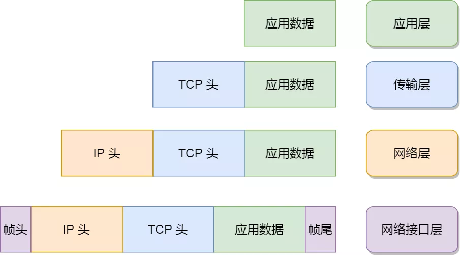
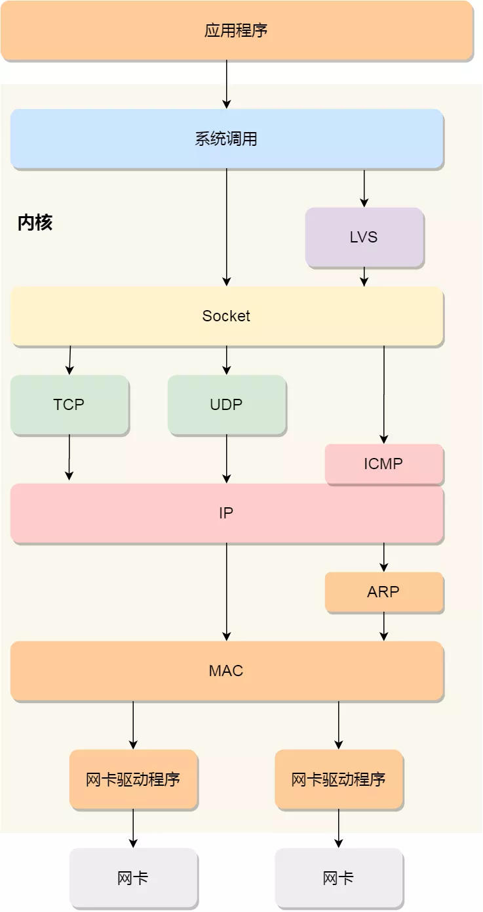

### 网络模型

为了使得多种设备能通过网络相互通信，和为了解决各种不同设备在网络互联中的兼容性问题，国际标标准化组织制定了开放式系统互联通信参考模型（*open System Interconnection Reference Model*），也就是 OSI 网络模型，该模型主要有 7 层，分别是应用层、表示层、会话层、传输层、网络层、数据链路层以及物理层。

每一层负责的职能都不同，如下：

- 应用层，负责给应用程序提供统一的接口；
- 表示层，负责把数据转换成兼容另一个系统能识别的格式；
- 会话层，负责建立、管理和终止表示层实体之间的通信会话；
- 传输层，负责端到端的数据传输；
- 网络层，负责数据的路由、转发、分片；
- 数据链路层，负责数据的封帧和差错检测，以及 MAC 寻址；
- 物理层，负责在物理网络中传输数据帧；

由于 OSI 模型实在太复杂，提出的也只是概念理论上的分层，并没有提供具体的实现方案。事实上，我们比较常见，也比较实用的是四层模型，即 TCP/IP 网络模型，Linux 系统正是按照这套网络模型来实现网络协议栈的。

TCP/IP 网络模型共有 4 层，分别是应用层、传输层、网络层和网络接口层，每一层负责的职能如下：

- 应用层，负责向用户提供一组应用程序，比如 HTTP、DNS、FTP 等;
- 传输层，负责端到端的通信，比如 TCP、UDP 等；
- 网络层，负责网络包的封装、分片、路由、转发，比如 IP、ICMP 等；
- 网络接口层，负责网络包在物理网络中的传输，比如网络包的封帧、 MAC 寻址、差错检测，以及通过网卡传输网络帧等；

TCP/IP 网络模型相比 OSI 网络模型简化了不少，也更加易记，它们之间的关系如下图：

不过，我们常说的七层和四层负载均衡，是用 OSI 网络模型来描述的，七层对应的是应用层，四层对应的是传输层。

### Linux 网络协议栈

我们可以把自己的身体比作应用层中的数据，打底衣服比作传输层中的 TCP 头，外套比作网络层中 IP 头，帽子和鞋子分别比作网络接口层的帧头和帧尾。

在冬天这个季节，当我们要从家里出去玩的时候，自然要先穿个打底衣服，再套上保暖外套，最后穿上帽子和鞋子才出门，这个过程就好像我们把 TCP 协议通信的网络包发出去的时候，会把应用层的数据按照网络协议栈层层封装和处理。

你从下面这张图可以看到，应用层数据在每一层的封装格式。

其中：

- 传输层，给应用数据前面增加了 TCP  头；
- 网络层，给 TCP 数据包前面增加了 IP  头；
- 网络接口层，给 IP 数据包前后分别增加了帧头和帧尾；

这些新增和头部和尾部，都有各自的作用，也都是按照特定的协议格式填充，这每一层都增加了各自的协议头，那自然网络包的大小就增大了，但物理链路并不能传输任意大小的数据包，所以在以太网中，规定了最大传输单元（MTU）是 `1500` 字节，也就是规定了单次传输的最大 IP 包大小。

当网络包超过 MTU 的大小，就会在网络层分片，以确保分片后的 IP 包不会超过 MTU 大小，如果 MTU 越小，需要的分包就越多，那么网络吞吐能力就越差，相反的，如果 MTU 越大，需要的分包就越小，那么网络吞吐能力就越好。

知道了 TCP/IP 网络模型，以及网络包的封装原理后，那么 Linux 网络协议栈的样子，你想必猜到了大概，它其实就类似于 TCP/IP 的四层结构：

从上图的的网络协议栈，你可以看到：

- 应用程序需要通过系统调用，来跟 Socket 层进行数据交互；
- Socket 层的下面就是传输层、网络层和网络接口层；
- 最下面的一层，则是网卡驱动程序和硬件网卡设备；