大家好，我是小林。

之前我在「[实战！我用“大白鲨”让你看见 TCP](http://mp.weixin.qq.com/s?__biz=MzUxODAzNDg4NQ==&mid=2247484469&idx=1&sn=55ec7f4addf10ddf25e8c8806da83921&chksm=f98e409fcef9c9891b92945129e8e1c9ca79f95be4cf3a85cea13fa0b57bc63c19d53f0e5b4e&scene=21#wechat_redirect)」这篇文章里做了 TCP 三次握手的三个实验：

- 实验一：模拟 TCP 第一次握手的 SYN 丢包；
- 实验二：模拟 TCP 第二次握手的 SYN、ACK 丢包；
- 实验三：模拟 TCP 第三次握手的 ACK 包丢；

这篇文章在知乎还挺高赞的，超过 1000 赞了。


不过，实验二分析的过程中，之前有个读者反馈给我说，我说的有问题。

实验二我是在客户端的防火墙加入了屏蔽服务端所有的数据包来模拟第二次握手丢失的现象，先给大家看看当时的实验图，以及我说分析过程。

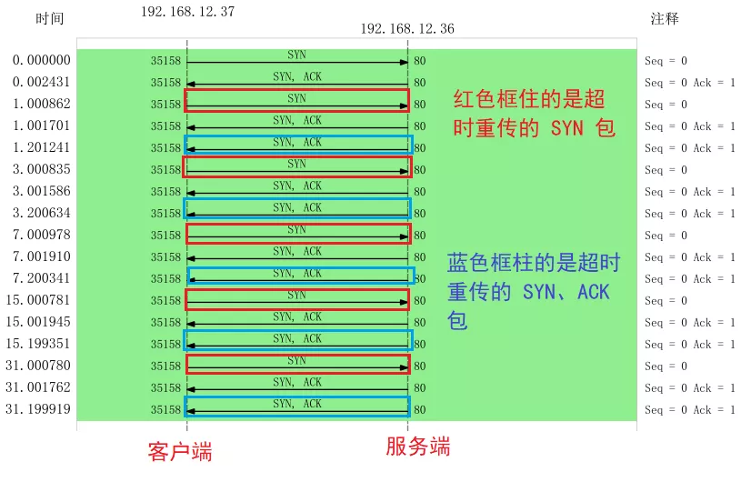

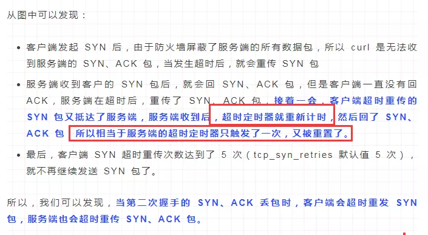

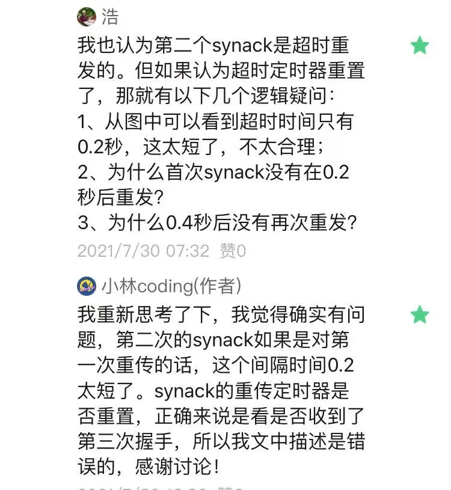

图中红色框起来的那句话有问题，正确来说：**第二次握手的 SYN、ACK 报文的重传定时器并不会因为收到 SYN 包后被重置，因为第二次握手的包需要被第三次握手的 ACK 确认后，才会重置重传定时器**。

我也把 TCP 三次握手模拟异常情况的实验过程整理了下，大家有兴趣可以模仿我这篇文章的实验步骤来做实验。

5000字的车，坐稳了！

### TCP 三次握手异常情况实战分析

TCP 三次握手的过程相信大家都背的滚瓜烂熟，那么你有没有想过这三个异常情况：

- **TCP 第一次握手的 SYN 丢包了，会发生了什么？**
- **TCP 第二次握手的 SYN、ACK 丢包了，会发生什么？**
- **TCP 第三次握手的 ACK 包丢了，会发生什么？**

有的小伙伴可能说：“很简单呀，包丢了就会重传嘛。”

那我在继续问你：

- 那会重传几次？
- 超时重传的时间 RTO 会如何变化？
- 在 Linux 下如何设置重传次数？
- ….

是不是哑口无言，无法回答？

不知道没关系，接下里我用三个实验案例，带大家一起探究探究这三种异常。

#### 实验场景

本次实验用了两台虚拟机，一台作为服务端，一台作为客户端，它们的关系如下：

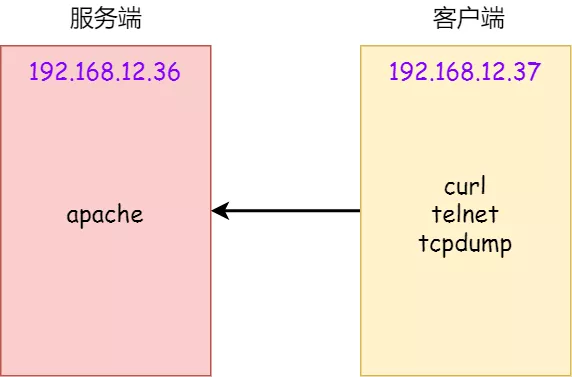

实验环境

- 客户端和服务端都是 CentOs 6.5 Linux，Linux 内核版本 2.6.32
- 服务端 192.168.12.36，apache web 服务
- 客户端 192.168.12.37

#### 实验一：TCP 第一次握手 SYN 丢包

为了模拟 TCP 第一次握手 SYN 丢包的情况，我是在拔掉服务器的网线后，立刻在客户端执行 curl 命令：

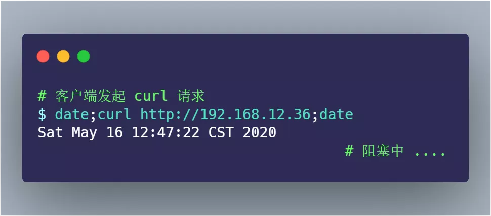

其间 tcpdump 抓包的命令如下：

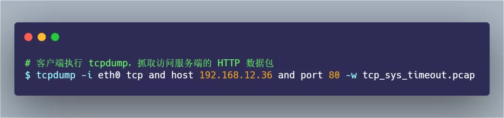

过了一会， curl 返回了超时连接的错误：

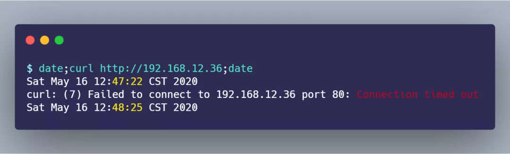

从 `date` 返回的时间，可以发现在超时接近 1 分钟的时间后，curl 返回了错误。

接着，把 tcp_sys_timeout.pcap 文件用 Wireshark 打开分析，显示如下图：

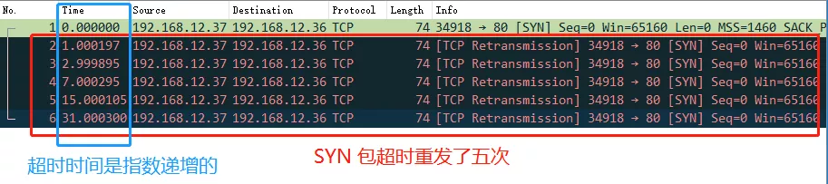

SYN 超时重传五次

从上图可以发现， 客户端发起了 SYN 包后，一直没有收到服务端的 ACK ，所以一直超时重传了 5 次，并且每次 RTO 超时时间是不同的：

- 第一次是在 1 秒超时重传
- 第二次是在 3 秒超时重传
- 第三次是在 7 秒超时重传
- 第四次是在 15 秒超时重传
- 第五次是在 31 秒超时重传

可以发现，每次超时时间 RTO 是**指数（翻倍）上涨的**，当超过最大重传次数后，客户端不再发送 SYN 包。

在 Linux 中，第一次握手的 `SYN` 超时重传次数，是如下内核参数指定的：

```
$ cat /proc/sys/net/ipv4/tcp_syn_retries
5
```

`tcp_syn_retries` 默认值为 5，也就是 SYN 最大重传次数是 5 次。

接下来，我们继续做实验，把 `tcp_syn_retries` 设置为 2 次：

```
$ echo 2 > /proc/sys/net/ipv4/tcp_syn_retries
```

重传抓包后，用 Wireshark 打开分析，显示如下图：

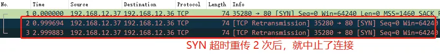

SYN 超时重传两次

> 实验一的实验小结

通过实验一的实验结果，我们可以得知，当客户端发起的 TCP 第一次握手 SYN 包，在超时时间内没收到服务端的 ACK，就会在超时重传 SYN 数据包，每次超时重传的 RTO 是翻倍上涨的，直到 SYN 包的重传次数到达 `tcp_syn_retries` 值后，客户端不再发送 SYN 包。

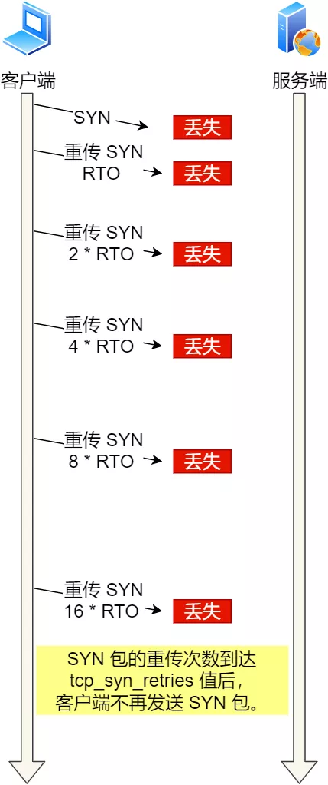

SYN 超时重传

#### 实验二：TCP 第二次握手 SYN、ACK 丢包

为了模拟客户端收不到服务端第二次握手 SYN、ACK 包，我的做法是在客户端加上防火墙限制，直接粗暴的把来自服务端的数据都丢弃，防火墙的配置如下：

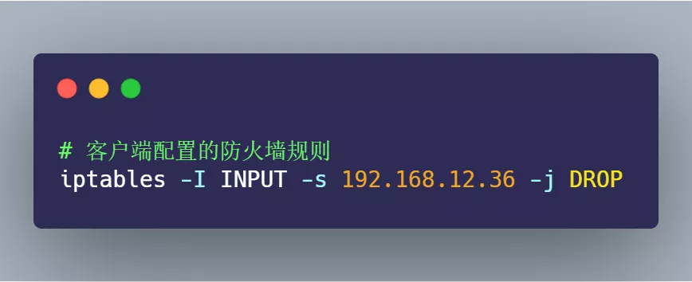

接着，在客户端执行 curl 命令：

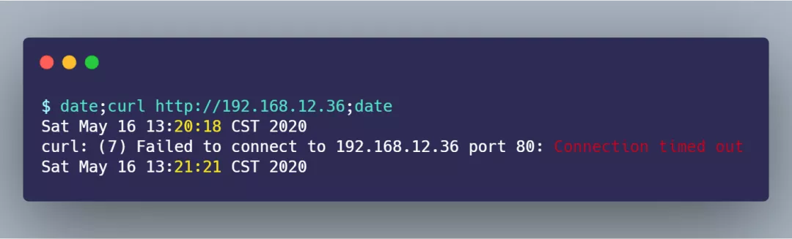

从 `date` 返回的时间前后，可以算出大概 1 分钟后，curl 报错退出了。

客户端在这其间抓取的数据包，用 Wireshark 打开分析，显示的时序图如下：


从图中可以发现：

- 客户端发起 SYN 后，由于防火墙屏蔽了服务端的所有数据包，所以 curl 是无法收到服务端的 SYN、ACK 包，当发生超时后，就会重传 SYN 包
- 服务端收到客户的 SYN 包后，就会回 SYN、ACK 包，但是客户端一直没有回 ACK，服务端在超时后，重传了 SYN、ACK 包，**接着一会，客户端超时重传的 SYN 包又抵达了服务端，服务端收到后，然后回了 SYN、ACK 包，但是SYN、ACK包的重传定时器并没有重置，还持续在重传，因为第二次握手在没收到第三次握手的 ACK 确认报文时，就会重传到最大次数。**
- 最后，客户端 SYN 超时重传次数达到了 5 次（tcp_syn_retries 默认值 5 次），就不再继续发送 SYN 包了。

所以，我们可以发现，**当第二次握手的 SYN、ACK 丢包时，客户端会超时重发 SYN 包，服务端也会超时重传 SYN、ACK 包。**

> 咦？客户端设置了防火墙，屏蔽了服务端的网络包，为什么 tcpdump 还能抓到服务端的网络包？

添加 iptables 限制后， tcpdump 是否能抓到包 ，这要看添加的 iptables 限制条件：

- 如果添加的是 `INPUT` 规则，则可以抓得到包
- 如果添加的是 `OUTPUT` 规则，则抓不到包

网络包进入主机后的顺序如下：

- 进来的顺序 Wire -> NIC -> **tcpdump -> netfilter/iptables**
- 出去的顺序 **iptables -> tcpdump** -> NIC -> Wire

> tcp_syn_retries 是限制 SYN 重传次数，那第二次握手 SYN、ACK 限制最大重传次数是多少？

TCP 第二次握手 SYN、ACK 包的最大重传次数是通过 `tcp_synack_retries` 内核参数限制的，其默认值如下：

```
$ cat /proc/sys/net/ipv4/tcp_synack_retries
5
```

是的，TCP 第二次握手 SYN、ACK 包的最大重传次数默认值是 `5` 次。

为了验证 SYN、ACK 包最大重传次数是 5 次，我们继续做下实验，我们先把客户端的 `tcp_syn_retries` 设置为 1，表示客户端 SYN 最大超时次数是 1 次，目的是为了防止多次重传 SYN，把服务端 SYN、ACK 超时定时器重置。

接着，还是如上面的步骤：

1. 客户端配置防火墙屏蔽服务端的数据包
2. 客户端 tcpdump 抓取 curl 执行时的数据包

把抓取的数据包，用 Wireshark 打开分析，显示的时序图如下：

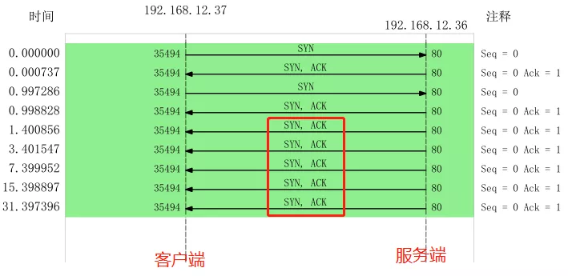

从上图，我们可以分析出：

- 客户端的 SYN 只超时重传了 1 次，因为 `tcp_syn_retries` 值为 1
- 服务端应答了客户端超时重传的 SYN 包后，由于一直收不到客户端的 ACK 包，所以服务端一直在超时重传 SYN、ACK 包，每次的 RTO 也是指数上涨的，一共超时重传了 5 次，因为 `tcp_synack_retries` 值为 5

接着，我把 **tcp_synack_retries 设置为 2**，`tcp_syn_retries` 依然设置为 1:

```
$ echo 2 > /proc/sys/net/ipv4/tcp_synack_retries
$ echo 1 > /proc/sys/net/ipv4/tcp_syn_retries
```

依然保持一样的实验步骤进行操作，接着把抓取的数据包，用 Wireshark 打开分析，显示的时序图如下：

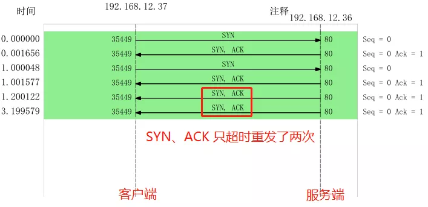

可见：

- 客户端的 SYN 包只超时重传了 1 次，符合 tcp_syn_retries 设置的值；
- 服务端的 SYN、ACK 超时重传了 2 次，符合 tcp_synack_retries 设置的值

> 实验二的实验小结

通过实验二的实验结果，我们可以得知，当 TCP 第二次握手 SYN、ACK 包丢了后，客户端 SYN 包会发生超时重传，服务端 SYN、ACK 也会发生超时重传。

客户端 SYN 包超时重传的最大次数，是由 tcp_syn_retries 决定的，默认值是 5 次；服务端 SYN、ACK 包时重传的最大次数，是由 tcp_synack_retries 决定的，默认值是 5 次。

#### 实验三：TCP 第三次握手 ACK 丢包

为了模拟 TCP 第三次握手 ACK 包丢，我的实验方法是在服务端配置防火墙，屏蔽客户端 TCP 报文中标志位是 ACK 的包，也就是当服务端收到客户端的 TCP ACK 的报文时就会丢弃，iptables 配置命令如下：

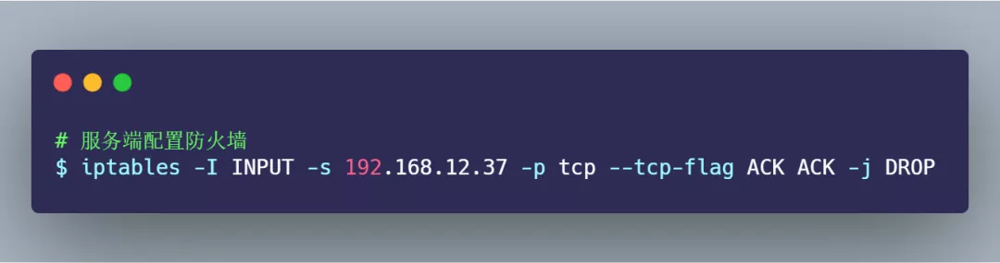

接着，在客户端执行如下 tcpdump 命令：

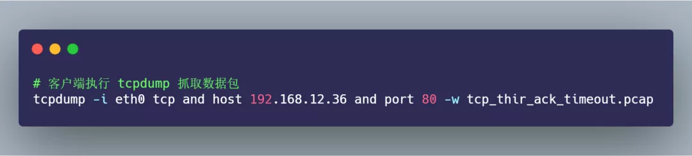

然后，客户端向服务端发起 telnet，因为 telnet 命令是会发起 TCP 连接，所以用此命令做测试：

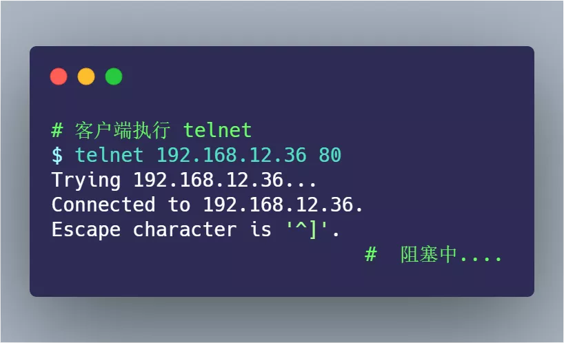

此时，由于服务端收不到第三次握手的 ACK 包，所以一直处于 `SYN_RECV` 状态：

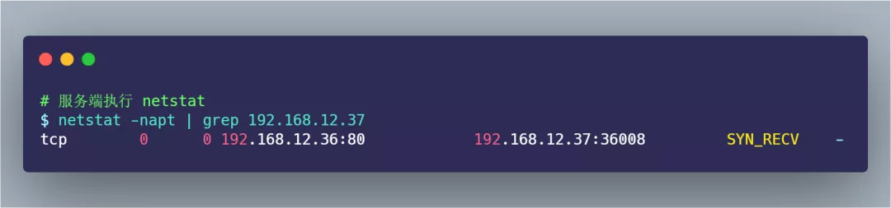

而客户端是已完成 TCP 连接建立，处于 `ESTABLISHED` 状态：

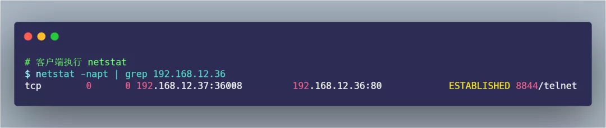

过了 1 分钟后，观察发现服务端的 TCP 连接不见了：

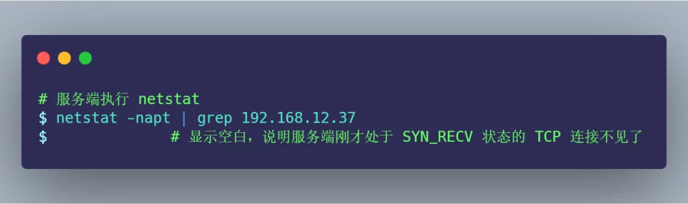

过了 30 分别，客户端依然还是处于 `ESTABLISHED` 状态：


接着，在刚才客户端建立的 telnet 会话，输入 123456 字符，进行发送：

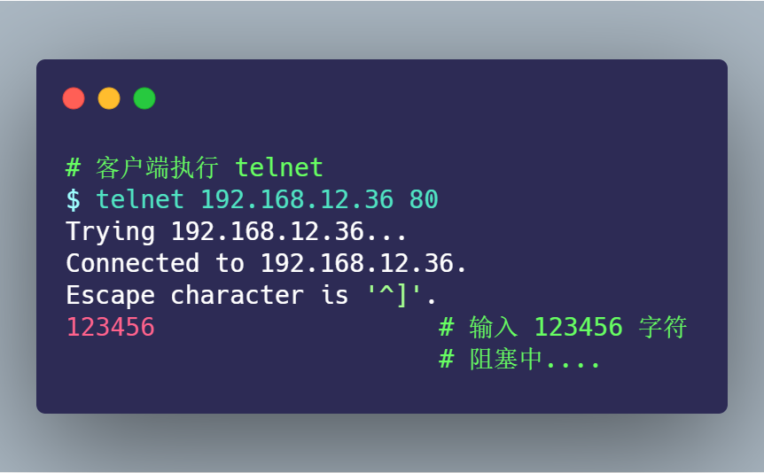

持续「好长」一段时间，客户端的 telnet 才断开连接：

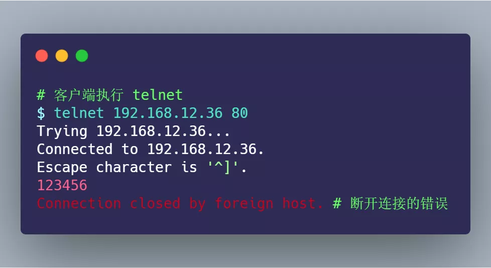

以上就是本次的实现三的现象，这里存在两个疑点：

- 为什么服务端原本处于 `SYN_RECV` 状态的连接，过 1 分钟后就消失了？
- 为什么客户端 telnet 输入 123456 字符后，过了好长一段时间，telnet 才断开连接？

不着急，我们把刚抓的数据包，用 Wireshark 打开分析，显示的时序图如下：

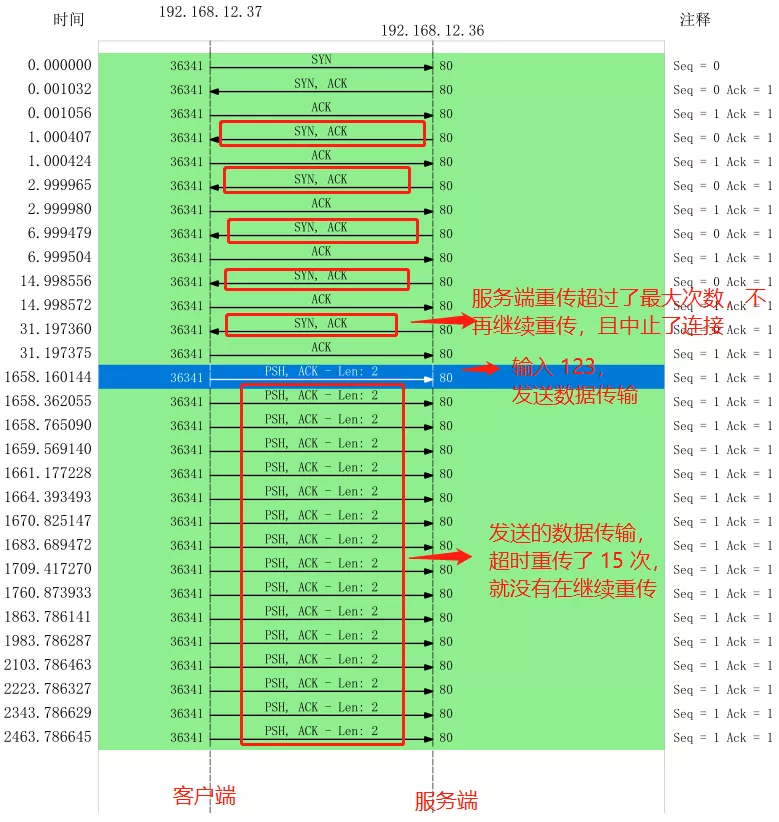

上图的流程：

- 客户端发送 SYN 包给服务端，服务端收到后，回了个 SYN、ACK 包给客户端，此时服务端的 TCP 连接处于 `SYN_RECV` 状态；
- 客户端收到服务端的  SYN、ACK 包后，给服务端回了个 ACK 包，此时客户端的 TCP 连接处于 `ESTABLISHED` 状态；
- 由于服务端配置了防火墙，屏蔽了客户端的 ACK 包，所以服务端一直处于 `SYN_RECV` 状态，没有进入  `ESTABLISHED` 状态，tcpdump 之所以能抓到客户端的 ACK 包，是因为数据包进入系统的顺序是先进入 tcpudmp，后经过 iptables；
- 接着，服务端超时重传了 SYN、ACK 包，重传了 5 次后，也就是**超过 tcp_synack_retries 的值（默认值是 5），然后就没有继续重传了，此时服务端的 TCP 连接主动中止了，所以刚才处于 SYN_RECV 状态的 TCP 连接断开了**，而客户端依然处于`ESTABLISHED` 状态；
- 虽然服务端 TCP 断开了，但过了一段时间，发现客户端依然处于`ESTABLISHED` 状态，于是就在客户端的 telnet 会话输入了 123456 字符；
- 此时由于服务端已经断开连接，**客户端发送的数据报文，一直在超时重传，每一次重传，RTO 的值是指数增长的，所以持续了好长一段时间，客户端的 telnet 才报错退出了，此时共重传了 15 次。**

通过这一波分析，刚才的两个疑点已经解除了：

- 服务端在重传 SYN、ACK 包时，超过了最大重传次数 `tcp_synack_retries`，于是服务端的 TCP 连接主动断开了。
- 客户端向服务端发送数据包时，由于服务端的 TCP 连接已经退出了，所以数据包一直在超时重传，共重传了 15 次， telnet 就断开了连接。

> TCP 第一次握手的 SYN 包超时重传最大次数是由 tcp_syn_retries 指定，TCP 第二次握手的 SYN、ACK 包超时重传最大次数是由 tcp_synack_retries 指定，那 TCP 建立连接后的数据包最大超时重传次数是由什么参数指定呢？

TCP 建立连接后的数据包传输，最大超时重传次数是由 `tcp_retries2` 指定，默认值是 15 次，如下：

```
$ cat /proc/sys/net/ipv4/tcp_retries2
15
```

如果 15 次重传都做完了，TCP 就会告诉应用层说：“搞不定了，包怎么都传不过去！”

> 那如果客户端不发送数据，什么时候才会断开处于 ESTABLISHED 状态的连接？

这里就需要提到 TCP 的 **保活机制**。这个机制的原理是这样的：

定义一个时间段，在这个时间段内，如果没有任何连接相关的活动，TCP 保活机制会开始作用，每隔一个时间间隔，发送一个「探测报文」，该探测报文包含的数据非常少，如果连续几个探测报文都没有得到响应，则认为当前的 TCP 连接已经死亡，系统内核将错误信息通知给上层应用程序。

在 Linux 内核可以有对应的参数可以设置保活时间、保活探测的次数、保活探测的时间间隔，以下都为默认值：

```
net.ipv4.tcp_keepalive_time=7200
net.ipv4.tcp_keepalive_intvl=75  
net.ipv4.tcp_keepalive_probes=9
```

- tcp_keepalive_time=7200：表示保活时间是 7200 秒（2小时），也就 2 小时内如果没有任何连接相关的活动，则会启动保活机制
- tcp_keepalive_intvl=75：表示每次检测间隔 75 秒；
- tcp_keepalive_probes=9：表示检测 9 次无响应，认为对方是不可达的，从而中断本次的连接。

也就是说在 Linux 系统中，最少需要经过 2 小时 11 分 15 秒才可以发现一个「死亡」连接。

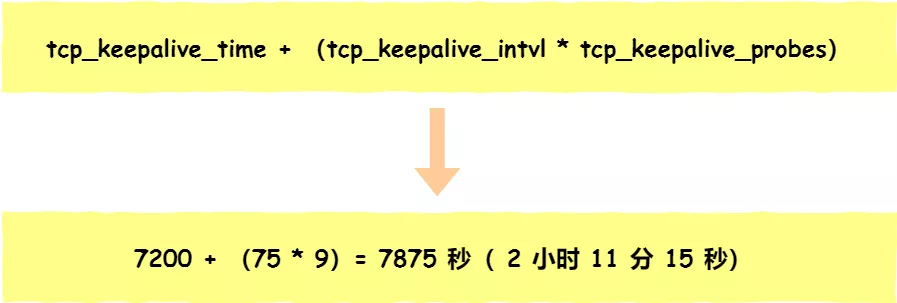

这个时间是有点长的，所以如果我抓包足够久，或许能抓到探测报文。

> 实验三的实验小结

在建立 TCP 连接时，如果第三次握手的 ACK，服务端无法收到，则服务端就会短暂处于 `SYN_RECV` 状态，而客户端会处于 `ESTABLISHED` 状态。

由于服务端一直收不到 TCP 第三次握手的 ACK，则会一直重传 SYN、ACK 包，直到重传次数超过 `tcp_synack_retries` 值（默认值 5 次）后，服务端就会断开 TCP 连接。

而客户端则会有两种情况：

- 如果客户端没发送数据包，一直处于 `ESTABLISHED` 状态，然后经过 2 小时 11 分 15 秒才可以发现一个「死亡」连接，于是客户端连接就会断开连接。
- 如果客户端发送了数据包，一直没有收到服务端对该数据包的确认报文，则会一直重传该数据包，直到重传次数超过 `tcp_retries2` 值（默认值 15 次）后，客户端就会断开 TCP 连接。