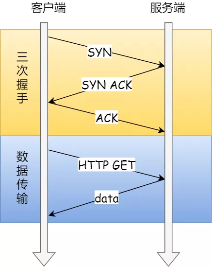
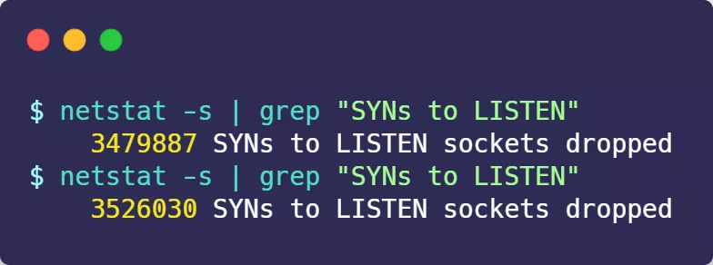
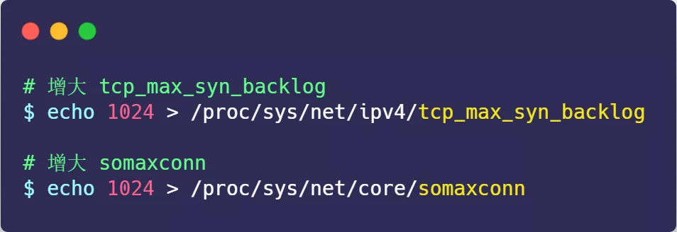
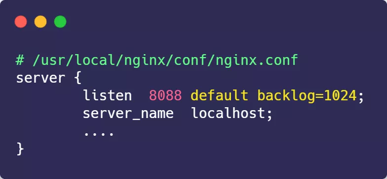
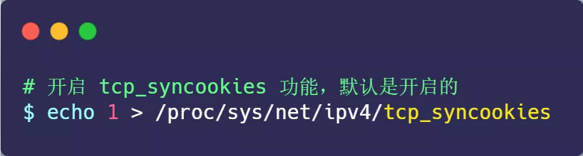
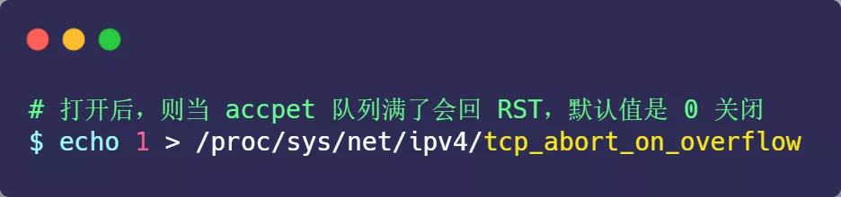
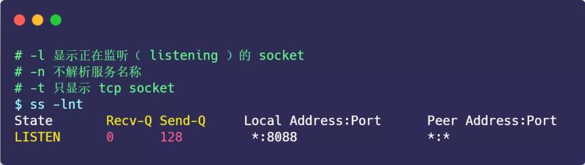
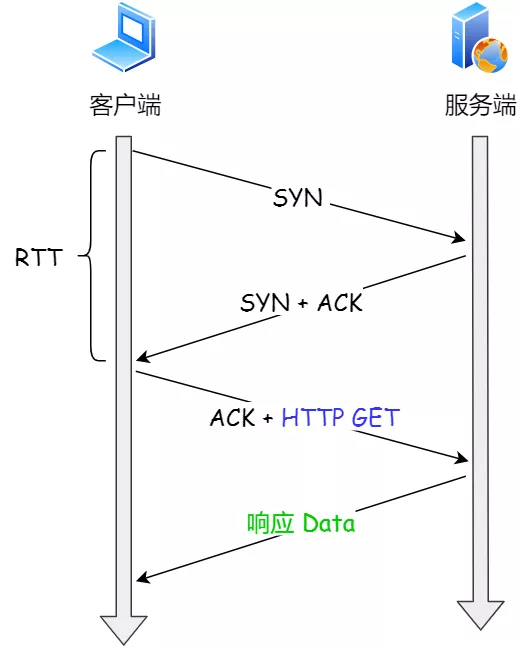
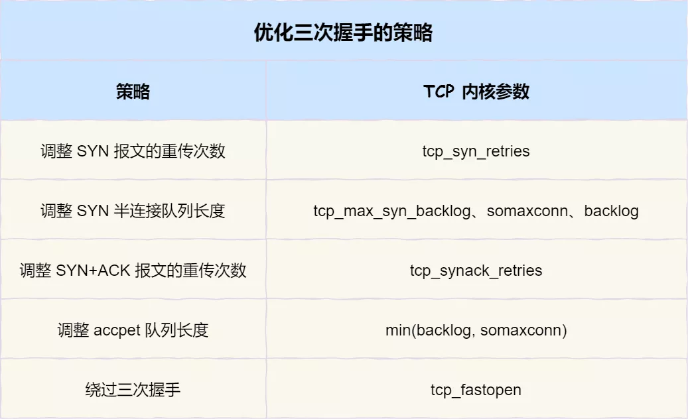

## 正文

### 01 TCP 三次握手的性能提升

TCP 是面向连接的、可靠的、双向传输的传输层通信协议，所以在传输数据之前需要经过三次握手才能建立连接。

三次握手与数据传输

那么，三次握手的过程在一个 HTTP 请求的平均时间占比 10% 以上，在网络状态不佳、高并发或者遭遇 SYN 攻击等场景中，如果不能有效正确的调节三次握手中的参数，就会对性能产生很多的影响。

如何正确有效的使用这些参数，来提高 TCP 三次握手的性能，这就需要理解「三次握手的状态变迁」，这样当出现问题时，先用 `netstat` 命令查看是哪个握手阶段出现了问题，再来对症下药，而不是病急乱投医。

TCP 三次握手的状态变迁

客户端和服务端都可以针对三次握手优化性能。主动发起连接的客户端优化相对简单些，而服务端需要监听端口，属于被动连接方，其间保持许多的中间状态，优化方法相对复杂一些。

所以，客户端（主动发起连接方）和服务端（被动连接方）优化的方式是不同的，接下来分别针对客户端和服务端优化。

#### 客户端优化

三次握手建立连接的首要目的是「同步序列号」。

只有同步了序列号才有可靠传输，TCP 许多特性都依赖于序列号实现，比如流量控制、丢包重传等，这也是三次握手中的报文称为 SYN 的原因，SYN 的全称就叫 *Synchronize Sequence Numbers*（同步序列号）。

TCP 头部

> SYN_SENT 状态的优化

客户端作为主动发起连接方，首先它将发送 SYN 包，于是客户端的连接就会处于 `SYN_SENT` 状态。

客户端在等待服务端回复的 ACK 报文，正常情况下，服务器会在几毫秒内返回 SYN+ACK ，但如果客户端长时间没有收到 SYN+ACK 报文，则会重发 SYN 包，**重发的次数由 tcp_syn_retries 参数控制**，默认是 5 次：

通常，第一次超时重传是在 1 秒后，第二次超时重传是在 2 秒，第三次超时重传是在 4 秒后，第四次超时重传是在 8 秒后，第五次是在超时重传 16 秒后。没错，**每次超时的时间是上一次的 2 倍**。

当第五次超时重传后，会继续等待 32 秒，如果仍然服务端没有回应 ACK，客户端就会终止三次握手。

所以，总耗时是 1+2+4+8+16+32=63 秒，大约 1 分钟左右。

SYN 超时重传

你可以根据网络的稳定性和目标服务器的繁忙程度修改 SYN 的重传次数，调整客户端的三次握手时间上限。比如内网中通讯时，就可以适当调低重试次数，尽快把错误暴露给应用程序。

#### 服务端优化

当服务端收到 SYN 包后，服务端会立马回复 SYN+ACK 包，表明确认收到了客户端的序列号，同时也把自己的序列号发给对方。

此时，服务端出现了新连接，状态是 `SYN_RCV`。在这个状态下，Linux 内核就会建立一个「半连接队列」来维护「未完成」的握手信息，当半连接队列溢出后，服务端就无法再建立新的连接。

半连接队列与全连接队列

SYN 攻击，攻击的是就是这个半连接队列。

> 如何查看由于 SYN 半连接队列已满，而被丢弃连接的情况？

我们可以通过该 `netstat -s` 命令给出的统计结果中，  可以得到由于半连接队列已满，引发的失败次数：

上面输出的数值是**累计值**，表示共有多少个 TCP 连接因为半连接队列溢出而被丢弃。**隔几秒执行几次，如果有上升的趋势，说明当前存在半连接队列溢出的现象**。

> 如何调整 SYN 半连接队列大小？

要想增大半连接队列，**不能只单纯增大 tcp_max_syn_backlog 的值，还需一同增大 somaxconn 和 backlog，也就是增大 accept 队列。否则，只单纯增大 tcp_max_syn_backlog 是无效的。**

增大 tcp_max_syn_backlog 和 somaxconn 的方法是修改 Linux 内核参数：

增大 backlog 的方式，每个 Web 服务都不同，比如 Nginx 增大 backlog 的方法如下：

最后，改变了如上这些参数后，要重启 Nginx 服务，因为 SYN 半连接队列和 accept 队列都是在 `listen()` 初始化的。

> 如果 SYN 半连接队列已满，只能丢弃连接吗？

并不是这样，**开启 syncookies 功能就可以在不使用 SYN 半连接队列的情况下成功建立连接**。

syncookies 的工作原理：服务器根据当前状态计算出一个值，放在己方发出的 SYN+ACK 报文中发出，当客户端返回 ACK 报文时，取出该值验证，如果合法，就认为连接建立成功，如下图所示。

开启 syncookies 功能

syncookies 参数主要有以下三个值：

- 0 值，表示关闭该功能；
- 1 值，表示仅当 SYN 半连接队列放不下时，再启用它；
- 2 值，表示无条件开启功能；

那么在应对 SYN 攻击时，只需要设置为 1 即可：

> SYN_RCV 状态的优化

当客户端接收到服务器发来的 SYN+ACK 报文后，就会回复 ACK 给服务器，同时客户端连接状态从 SYN_SENT 转换为 ESTABLISHED，表示连接建立成功。

服务器端连接成功建立的时间还要再往后，等到服务端收到客户端的 ACK 后，服务端的连接状态才变为 ESTABLISHED。

如果服务器没有收到 ACK，就会重发 SYN+ACK 报文，同时一直处于 SYN_RCV 状态。

当网络繁忙、不稳定时，报文丢失就会变严重，此时应该调大重发次数。反之则可以调小重发次数。**修改重发次数的方法是，调整 tcp_synack_retries 参数**：

tcp_synack_retries 的默认重试次数是 5 次，与客户端重传 SYN 类似，它的重传会经历 1、2、4、8、16 秒，最后一次重传后会继续等待 32 秒，如果服务端仍然没有收到 ACK，才会关闭连接，故共需要等待 63 秒。

服务器收到 ACK 后连接建立成功，此时，内核会把连接从半连接队列移除，然后创建新的完全的连接，并将其添加到 accept 队列，等待进程调用 accept 函数时把连接取出来。

如果进程不能及时地调用 accept 函数，就会造成 accept 队列（也称全连接队列）溢出，最终导致建立好的 TCP 连接被丢弃。

accept 队列溢出

> accept 队列已满，只能丢弃连接吗？

丢弃连接只是 Linux 的默认行为，我们还可以选择向客户端发送 RST 复位报文，告诉客户端连接已经建立失败。打开这一功能需要将 tcp_abort_on_overflow 参数设置为 1。

tcp_abort_on_overflow 共有两个值分别是 0 和 1，其分别表示：

- 0 ：如果 accept 队列满了，那么 server 扔掉 client  发过来的 ack ；
- 1 ：如果 accept 队列满了，server 发送一个 `RST` 包给 client，表示废掉这个握手过程和这个连接；

如果要想知道客户端连接不上服务端，是不是服务端 TCP 全连接队列满的原因，那么可以把 tcp_abort_on_overflow 设置为 1，这时如果在客户端异常中可以看到很多 `connection reset by peer` 的错误，那么就可以证明是由于服务端 TCP 全连接队列溢出的问题。

通常情况下，应当把 tcp_abort_on_overflow 设置为 0，因为这样更有利于应对突发流量。

举个例子，当 accept 队列满导致服务器丢掉了 ACK，与此同时，客户端的连接状态却是 ESTABLISHED，客户端进程就在建立好的连接上发送请求。只要服务器没有为请求回复 ACK，客户端的请求就会被多次「重发」。**如果服务器上的进程只是短暂的繁忙造成 accept 队列满，那么当 accept 队列有空位时，再次接收到的请求报文由于含有 ACK，仍然会触发服务器端成功建立连接。**

tcp_abort_on_overflow 为 0 可以应对突发流量

所以，tcp_abort_on_overflow 设为 0 可以提高连接建立的成功率，只有你非常肯定 TCP 全连接队列会长期溢出时，才能设置为 1 以尽快通知客户端。

> 如何调整 accept 队列的长度呢？

accept 队列的长度取决于 somaxconn 和 backlog 之间的最小值，也就是 min(somaxconn, backlog)，其中：

- somaxconn 是 Linux 内核的参数，默认值是 128，可以通过 `net.core.somaxconn` 来设置其值；
- backlog 是 `listen(int sockfd, int backlog)` 函数中的 backlog 大小；

Tomcat、Nginx、Apache 常见的 Web 服务的 backlog 默认值都是 511。

> 如何查看服务端进程 accept 队列的长度？

可以通过 `ss -ltn` 命令查看：

- Recv-Q：当前 accept 队列的大小，也就是当前已完成三次握手并等待服务端 `accept()` 的 TCP 连接；
- Send-Q：accept 队列最大长度，上面的输出结果说明监听 8088 端口的 TCP 服务，accept 队列的最大长度为 128；

> 如何查看由于 accept 连接队列已满，而被丢弃的连接？

当超过了 accept 连接队列，服务端则会丢掉后续进来的 TCP 连接，丢掉的 TCP 连接的个数会被统计起来，我们可以使用 netstat -s 命令来查看：

上面看到的 41150 times ，表示 accept 队列溢出的次数，注意这个是累计值。可以隔几秒钟执行下，如果这个数字一直在增加的话，说明 accept 连接队列偶尔满了。

如果持续不断地有连接因为 accept 队列溢出被丢弃，就应该调大 backlog 以及 somaxconn 参数。

#### 如何绕过三次握手？

以上我们只是在对三次握手的过程进行优化，接下来我们看看如何绕过三次握手发送数据。

三次握手建立连接造成的后果就是，HTTP 请求必须在一个 RTT（从客户端到服务器一个往返的时间）后才能发送。

常规 HTTP 请求

在 Linux 3.7 内核版本之后，提供了 TCP Fast Open 功能，这个功能可以减少 TCP 连接建立的时延。

> 接下来说说，TCP Fast Open 功能的工作方式。

开启 TCP Fast Open 功能

在客户端首次建立连接时的过程：

1. 客户端发送 SYN 报文，该报文包含 Fast Open 选项，且该选项的 Cookie 为空，这表明客户端请求 Fast Open Cookie；
2. 支持 TCP Fast Open 的服务器生成 Cookie，并将其置于 SYN-ACK 数据包中的 Fast Open 选项以发回客户端；
3. 客户端收到 SYN-ACK 后，本地缓存 Fast Open 选项中的 Cookie。

所以，第一次发起 HTTP GET 请求的时候，还是需要正常的三次握手流程。

之后，如果客户端再次向服务器建立连接时的过程：

1. 客户端发送 SYN 报文，该报文包含「数据」（对于非 TFO 的普通 TCP 握手过程，SYN 报文中不包含「数据」）以及此前记录的 Cookie；
2. 支持 TCP Fast Open 的服务器会对收到 Cookie 进行校验：如果 Cookie 有效，服务器将在 SYN-ACK 报文中对 SYN 和「数据」进行确认，服务器随后将「数据」递送至相应的应用程序；如果 Cookie 无效，服务器将丢弃 SYN 报文中包含的「数据」，且其随后发出的 SYN-ACK 报文将只确认 SYN 的对应序列号；
3. 如果服务器接受了 SYN 报文中的「数据」，服务器可在握手完成之前发送「数据」，**这就减少了握手带来的 1 个 RTT 的时间消耗**；
4. 客户端将发送 ACK 确认服务器发回的 SYN 以及「数据」，但如果客户端在初始的 SYN 报文中发送的「数据」没有被确认，则客户端将重新发送「数据」；
5. 此后的 TCP 连接的数据传输过程和非 TFO 的正常情况一致。

所以，之后发起 HTTP GET 请求的时候，可以绕过三次握手，这就减少了握手带来的 1 个 RTT 的时间消耗。

注：客户端在请求并存储了 Fast Open Cookie 之后，可以不断重复 TCP Fast Open 直至服务器认为 Cookie 无效（通常为过期）。

> Linux 下怎么打开 TCP Fast Open 功能呢？

在 Linux 系统中，可以通过**设置 tcp_fastopn 内核参数，来打开 Fast Open 功能**：

tcp_fastopn 各个值的意义:

- 0 关闭
- 1 作为客户端使用 Fast Open 功能
- 2 作为服务端使用 Fast Open 功能
- 3 无论作为客户端还是服务器，都可以使用 Fast Open 功能

**TCP Fast Open 功能需要客户端和服务端同时支持，才有效果。**

#### 小结

本小结主要介绍了关于优化 TCP 三次握手的几个 TCP 参数。

三次握手优化策略

> 客户端的优化

当客户端发起 SYN 包时，可以通过 `tcp_syn_retries` 控制其重传的次数。

> 服务端的优化

当服务端 SYN 半连接队列溢出后，会导致后续连接被丢弃，可以通过 `netstat -s` 观察半连接队列溢出的情况，如果 SYN 半连接队列溢出情况比较严重，可以通过 `tcp_max_syn_backlog、somaxconn、backlog` 参数来调整 SYN 半连接队列的大小。

服务端回复 SYN+ACK 的重传次数由 `tcp_synack_retries` 参数控制。如果遭受 SYN 攻击，应把 `tcp_syncookies` 参数设置为 1，表示仅在 SYN 队列满后开启 syncookie 功能，可以保证正常的连接成功建立。

服务端收到客户端返回的 ACK，会把连接移入 accpet 队列，等待进行调用 accpet() 函数取出连接。

可以通过 `ss -lnt` 查看服务端进程的 accept 队列长度，如果 accept 队列溢出，系统默认丢弃 ACK，如果可以把 `tcp_abort_on_overflow` 设置为 1 ，表示用 RST 通知客户端连接建立失败。

如果 accpet 队列溢出严重，可以通过 listen 函数的 `backlog` 参数和 `somaxconn` 系统参数提高队列大小，accept 队列长度取决于 min(backlog, somaxconn)。

> 绕过三次握手

TCP Fast Open 功能可以绕过三次握手，使得 HTTP 请求减少了 1 个 RTT 的时间，Linux 下可以通过 `tcp_fastopen` 开启该功能，同时必须保证服务端和客户端同时支持。