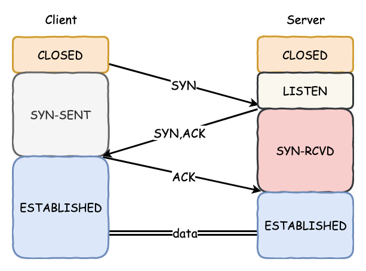
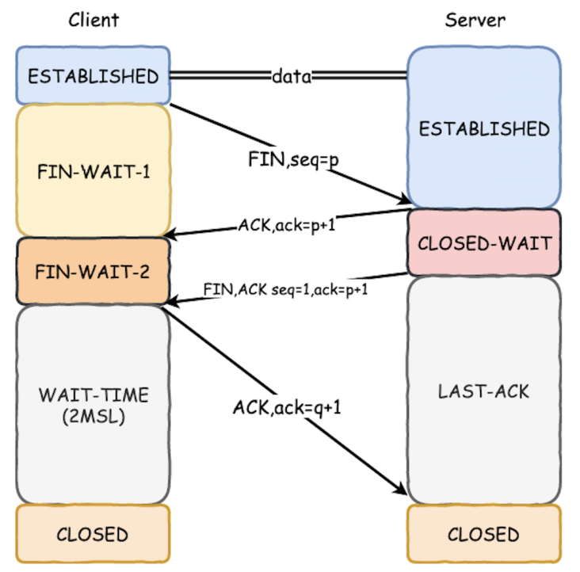

## 一. 序

当我们聊到 TCP 协议的时候，聊的最多的就是三次握手与四次挥手。但是大部分资料和文章，写的都是正常的情况下的流程。但是你有没有想过，三次握手或者四次挥手时，如果发生异常了，是如何处理的？又是由谁来处理？

TCP 作为一个靠谱的协议，在传输数据的前后，需要在双端之间建立连接，并在双端各自维护连接的状态。TCP 并没有什么特别之处，在面对多变的网络情况，也只能通过不断的重传和各种算法来保证可靠性。

建立连接前，TCP 会通过三次握手来保证双端状态正确，然后就可以正常传输数据了。当数据传输完成，需要断开连接的时候，TCP 会通过四次握手来完成双端的断连，并回收各自的资源。

我们在学习 TCP 建连和断连时，多数都在说一个标准的流程，但是网络环境是多变的，很多时候并不像教科书那样标准，那么今天就来聊聊，TCP 三次握手和四次挥手时，如果出现异常情况，是如何处理的?由是由谁来处理？

## 二. TCP 三次握手

### 2.1 简单理解三次握手

虽然是说三次握手的异常情况，我们还是先来了解一下三次握手。

在通过 TCP 传输数据时，第一步就是要先建立一个连接。TCP 建立连接的过程，就是我们常说的三次握手。

我们经常将三次握手，描述成「**请求 → 应答 → 应答之应答**」。

至于 TCP 握手为什么是三次？其实就是要让双端都经历一次「请求 → 应答」的过程，来确认对方还在。网络情况是多变的，双端都需要一次自己主动发起的请求和对方回复的应答过程，来确保对方和网络是正常的。

下面这张图，是比较经典的 TCP 三次握手的消息和双端状态的变化。

我们先来解释一下这张图：

*1.* 在初始时，双端处于 CLOSE 状态，服务端为了提供服务，会主动监听某个端口，进入 LISTEN 状态。

*2.* 客户端主动发送连接的「SYN」包，之后进入 SYN-SENT 状态，服务端在收到客户端发来的「SYN」包后，回复「SYN,ACK」包，之后进入 SYN-RCVD 状态。

*3.* 客户端收到服务端发来的「SYN,ACK」包后，可以确认对方存在，此时回复「ACK」包，并进入 ESTABLISHED 状态。

*4.* 服务端收到最后一个「ACK」包后，也进入 ESTABLISHED 状态。

这是正常的 TCP 三次握手，握手完成后双端都进入 ESTABLISHED 状态，在此之后，就是正常的数据传输过程。

### 2.2 TCP 握手的异常情况

三次握手的正常发包和应答，以及双端的状态扭转我们已经讲了，接下来就来看看在这三次握手的过程中，出现的异常情况。

*1.* **客户端第一个「SYN」包丢了。**

如果客户端第一个「SYN」包丢了，也就是服务端根本就不知道客户端曾经发过包，那么处理流程主要在客户端。

而在 TCP 协议中，某端的一组「请求-应答」中，在一定时间范围内，只要没有收到应答的「ACK」包，无论是请求包对方没有收到，还是对方的应答包自己没有收到，均认为是丢包了，都会触发超时重传机制。

所以此时会进入重传「SYN」包。根据《TCP/IP详解卷Ⅰ：协议》中的描述，此时会尝试三次，间隔时间分别是 5.8s、24s、48s，三次时间大约是 76s 左右，而大多数伯克利系统将建立一个新连接的最长时间，限制为 75s。

也就是说三次握手第一个「SYN」包丢了，会重传，总的尝试时间是 75s。

参考：《[TCP/IP 卷1 18|TCP连接的建立与终止](https://link.segmentfault.com/?enc=RCdQJiT%2F0K0VHop46BBZfA%3D%3D.N9bgpXdC62dfEFn%2Bux%2B1XRCuZ%2BJ8IcB6JM%2BBM8G6bvQ%2B5mbV7BHmMhsB1%2B72uwpqRE1BGt%2F6QNFK6Fdb2bAH5A%3D%3D)》

*2.* **服务端收到「SYN」并回复的「SYN,ACK」包丢了。**

此时服务端已经收到了数据包并回复，如果这个回复的「SYN,ACK」包丢了，站在客户端的角度，会认为是最开始的那个「SYN」丢了，那么就继续重传，就是我们前面说的「错误 1」 的流程。

而对服务端而言，如果发送的「SYN,ACK」包丢了，在超时时间内没有收到客户端发来的「ACK」包，也会触发重传，此时服务端处于 SYN_RCVD 状态，会依次等待 3s、6s、12s 后，重新发送「SYN,ACK」包。

而这个「SYN,ACK」包的重传次数，不同的操作系统下有不同的配置，例如在 Linux 下可以通过 `tcp_synack_retries` 进行配置，默认值为 5。如果这个重试次数内，仍未收到「ACK」应答包，那么服务端会自动关闭这个连接。

同时由于客户端在没有收到「SYN,ACK」时，也会进行重传，当客户端重传的「SYN」被收到后，服务端会立即重新发送「SYN,ACK」包。

*3.* **客户端最后一次回复「SYN,ACK」的「ACK」包丢了。**

如果最后一个「ACK」包丢了，服务端因为收不到「ACK」会走重传机制，而客户端此时进入 ESTABLISHED 状态。

多数情况下，客户端进入 ESTABLISHED 状态后，则认为连接已建立，会立即发送数据。但是服务端因为没有收到最后一个「ACK」包，依然处于 SYN-RCVD 状态。

那么这里的关键，就在于**服务端在处于 SYN-RCVD 状态下，收到客户端的数据包后如何处理？**

这也是比较有争议的地方，有些资料里会写到当服务端处于 SYN-RCVD 状态下，收到客户端的数据包后，会直接回复 RTS 包响应，表示服务端错误，并进入 CLOSE 状态。

但是这样的设定有些过于严格，试想一下，服务端还在通过三次握手阶段确定对方是否真实存在，此时对方的数据已经发来了，那肯定是存在的。

所以当服务端处于 SYN-RCVD 状态下时，接收到客户端真实发送来的数据包时，会认为连接已建立，并进入 ESTABLISHED 状态。

实践出真知，具体测试流程可以参考这篇文章：《[TCP三次握手的第三个ack丢了会怎样](https://link.segmentfault.com/?enc=Aocyf%2FeXSBxN4geDiumSqw%3D%3D.X9CkF1a0%2FNVva6Ynltm2Q75mp9I3o3dMJZVJJwelrCgJOkFpdqvNu2UOp2HPvnyAnVG3JCoL%2FsTPGYrupEOncw%3D%3D)》

那么实际情况，为什么会这样呢？

当客户端在 ESTABLISHED 状态下，开始发送数据包时，会携带上一个「ACK」的确认序号，所以哪怕客户端响应的「ACK」包丢了，服务端在收到这个数据包时，能够通过包内 ACK 的确认序号，正常进入 ESTABLISHED 状态。

参考：《[What if a TCP handshake segment is lost?](https://link.segmentfault.com/?enc=lrONkgb25aVxx0Oi%2BKGpTw%3D%3D.RHCn9OwlltyKJrHRbgBvhBXKOlLKMAQkU3990Os2JAxiS66ayG17nlyVbyHEh7rJ0mvf%2F6uHGYISmeWTXsQfKTZnmpiTVR1mFrBK0CNbMhGgOCSGe7mh9XX3N%2F1njrgV)》

*4.* **客户端故意不发最后一次「SYN」包。**

前面一直在说正常的异常逻辑，双方都还算友善，按规矩做事，出现异常主要也是因为网络等客观问题，接下来说一个恶意的情况。

如果客户端是恶意的，在发送「SYN」包后，并收到「SYN,ACK」后就不回复了，那么服务端此时处于一种半连接的状态，虽然服务端会通过 `tcp_synack_retries` 配置重试的次数，不会无限等待下去，但是这也是有一个时间周期的。

如果短时间内存在大量的这种恶意连接，对服务端来说压力就会很大，这就是所谓的 **SYN FLOOD 攻击**。

这就属于安全攻防的范畴了，今天就不讨论了，有兴趣可以自行了解。

## 三. TCP 四次挥手

### 3.1 简单理解四次挥手

说完 TCP 三次握手，继续来分析 TCP 四次挥手的异常情况。

保持行文风格，在此之前，我们还是先来简单了解一下 TCP 的四次挥手。

当数据传输完成，需要断开连接的时候，TCP 会采取四次挥手的方式，来安全的断开连接。

**为什么握手需要三次，而挥手需要四次呢？**

本质上来说，双端都需要经过一次「分手」的过程，来保证自己和对端的状态正确。本着友好协商的态度，你先提出的分手，也要把最大的善意給对方，不能打了对方一个措手不及。你说不玩了就不玩了，那以后谁还敢和你玩。

下面这张图，是比较经典的 TCP 四次挥手的消息和双端状态的变化。

我们解释一下这张图：

*1.* 初始时双端还都处于 ESTABLISHED 状态并传输数据，某端可以主动发起「FIN」包准备断开连接，在这里的场景下，是客户端发起「FIN」请求。在发出「FIN」后，客户端进入 FIN-WAIT-1 状态。

*2.* 服务端收到「FIN」消息后，回复「ACK」表示知道了，并从 ESTABLISHED 状态进入 CLOSED-WAIT 状态，开始做一些断开连接前的准备工作。

*3.* 客户端收到之前「FIN」的回复「ACK」消息后，进入 FIN-WAIT-2 状态。而当服务端做好断开前的准备工作后，也会发送一个「FIN,ACK」的消息給客户端，表示我也好了，请求断开连接，并在发送消息后，服务端进入 LAST-ACK 状态。

*4.* 客户端在收到「FIN,ACK」消息后，会立即回复「ACK」，表示知道了，并进入 TIME_WAIT 状态，为了稳定和安全考虑，客户端会在 TIME-WAIT 状态等待 2MSL 的时长，最终进入 CLOSED 状态。

*5.* 服务端收到客户端回复的「ACK」消息后，直接从 LAST-ACK 状态进入 CLOSED 状态。

正常的经过四次挥手之后，双端都进入 CLOSED 状态，在此之后，双端正式断开了连接。

### 3.2 TCP 挥手的异常情况

四次挥手的正常发包和应答过程，我们已经简单了解了，接下来就继续看看，四次挥手过程中，出现的异常情况。

*1.* **断开连接的 FIN 包丢了。**

我们前面一直强调过，如果一个包发出去，在一定时间内，只要没有收到对端的「ACK」回复，均认为这个包丢了，会触发超时重传机制。而不会关心到底是自己发的包丢了，还是对方的「ACK」丢了。

所以在这里，如果客户端率先发的「FIN」包丢了，或者没有收到对端的「ACK」回复，则会触发超时重传，直到触发重传的次数，直接关闭连接。

对于服务端而言，如果客户端发来的「FIN」没有收到，就没有任何感知。会在一段时间后，也关闭连接。

*2.* **服务端第一次回复的 ACK 丢了。**

此时因为客户端没有收到「ACK」应答，会尝试重传之前的「FIN」请求，服务端收到后，又会立即再重传「ACK」。

而此时服务端已经进入 CLOSED-WAIT 状态，开始做断开连接前的准备工作。当准备好之后，会回复「FIN,ACK」，注意这个消息是携带了之前「ACK」的响应序号的。

只要这个消息没丢，客户端可以凭借「FIN,ACK」包中的响应序号，直接从 FIN-WAIT-1 状态，进入 TIME-WAIT 状态，开始长达 2MSL 的等待。

*3.* **服务端发送的 FIN,ACK 丢了。**

服务端在超时后会重传，此时客户端有两种情况，要么处于 FIN-WAIT-2 状态（之前的 ACK 也丢了），会一直等待；要么处于 TIME-WAIT 状态，会等待 2MSL 时间。

也就是说，在一小段时间内客户端还在，客户端在收到服务端发来的「FIN,ACK」包后，也会回复一个「ACK」应答，并做好自己的状态切换。

*4.* **客户端最后回复的 ACK 丢了。**

客户端在回复「ACK」后，会进入 TIME-WAIT 状态，开始长达 2MSL 的等待，服务端因为没有收到「ACK」的回复，会重试一段时间，直到服务端重试超时后主动断开。

或者等待新的客户端接入后，收到服务端重试的「FIN」消息后，回复「RST」消息，在收到「RST」消息后，复位服务端的状态。

*5.* **客户端收到 ACK 后，服务端跑路了。**

客户端在收到「ACK」后，进入了 FIN-WAIT-2 状态，等待服务端发来的「FIN」包，而如果服务端跑路了，这个包永远都等不到。

在 TCP 协议中，是没有对这个状态的处理机制的。但是协议不管，系统来凑，操作系统会接管这个状态，例如在 Linux 下，就可以通过 `tcp_fin_timeout` 参数，来对这个状态设定一个超时时间。

需要注意的是，当超过 tcp_fin_timeout 的限制后，状态并不是切换到 TIME_WAIT，而是直接进入 CLOSED 状态。

参考：《[关于FIN_WAIT2](https://link.segmentfault.com/?enc=QPePA4kO4coV%2By90O2f%2Btw%3D%3D.FhkFatiX0mphyKzyLWQl1KGpXMK%2FZE8NRCjLyR5K26fJ%2FIM4J1tSs%2Bc7ZgqwUp4B)》

*6.* **客户端收到 ACK 后，客户端自己跑路了。**

客户端收到「ACK」后直接跑路，服务端后续在发送的「FIN,ACK」就没有接收端，也就不会得到回复，会不断的走 TCP 的超时重试的机制，此时服务端处于 LAST-ACK 状态。

那就要分 2 种情况分析：

1. 在超过一定时间后，服务端主动断开。
2. 收到「RST」后，主动断开连接。

「RST」消息是一种重置消息，表示当前错误了，应该回到初始的状态。如果客户端跑路后有新的客户端接入，会在此发送「SYN」以期望建立连接，此时这个「SYN」将被忽略，并直接回复「FIN,ACK」消息，新客户端在收到「FIN」消息后是不会认的，并且会回复一个「RST」消息。

参考：《[Coping with the TCP TIME-WAIT state on busy Linux servers](https://link.segmentfault.com/?enc=l0oDugOGJmxKd5Es%2BCSZWA%3D%3D.%2FdWXYHtc9yPSpTdqz2W%2B0y%2BKeIBS2mVpA8CsIoTbf%2FZ1ExEgkUsgQh1KOrA7ISGqnIYpWwYlDb0cwkRjLG1I6awhnEXXQtqtaTICujNny48%3D)》

## 四. 小结时刻

本文聊了 TCP 在三次握手和四次挥手的时候，出现异常的处理逻辑。

大多数情况下，都是依赖超时重传来保证 TCP 的可靠性，但是重传的次数，状态的转换，以及有哪些状态是被系统接管，这些细节，就是本文的主题。

有任何问题欢迎留言讨论，有所帮助也别忘了转发和点收藏支持一下，谢谢！