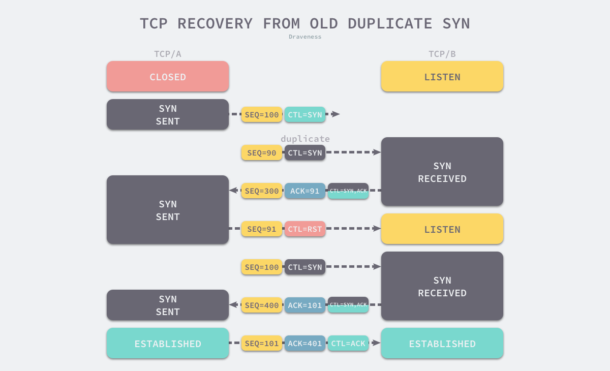

> 为什么挥手需要四次？

再来回顾下四次挥手双方发 `FIN` 包的过程，就能理解为什么需要四次了。

- 关闭连接时，客户端向服务端发送 `FIN` 时，仅仅表示客户端不再发送数据了但是还能接收数据。
- 服务器收到客户端的 `FIN` 报文时，先回一个 `ACK` 应答报文，而服务端可能还有数据需要处理和发送，等服务端不再发送数据时，才发送 `FIN` 报文给客户端来表示同意现在关闭连接。

从上面过程可知，服务端通常需要等待完成数据的发送和处理，所以服务端的 `ACK` 和 `FIN` 一般都会分开发送，从而比三次握手导致多了一次。

------

# 为什么 TCP 建立连接需要三次握手

2019-10-28 [为什么这么设计](https://draveness.me/tags/为什么这么设计) [系统设计](https://draveness.me/tags/系统设计) [TCP](https://draveness.me/tags/tcp) [三次握手](https://draveness.me/tags/三次握手)

> 为什么这么设计（Why’s THE Design）是一系列关于计算机领域中程序设计决策的文章，我们在这个系列的每一篇文章中都会提出一个具体的问题并从不同的角度讨论这种设计的优缺点、对具体实现造成的影响。如果你有想要了解的问题，可以在文章下面留言。

TCP 协议是我们几乎每天都会接触到的网络协议，绝大多数网络连接的建立都是基于 TCP 协议的，学过计算机网络或者对 TCP 协议稍有了解的人都知道 —— 使用 TCP 协议建立连接需要经过三次握手（three-way handshake）。

如果让我们简单说说 TCP 建立连接的过程，相信很多准备过面试的人都会非常了解，但是一旦想要深究『为什么 TCP 建立连接需要三次握手？』，作者相信大多数人都没有办法回答这个问题或者会给出错误的答案，这边文章就会讨论究竟为什么我们需要三次握手才能建立 TCP 连接？

> 需要注意的是我们会将重点放到为什么需要 TCP 建立连接需要**『三次握手』**，而*不仅仅*是为什么需要**『三次』**握手。

## 概述

在具体分析今天的问题之前，我们首先可以了解一下最常见的错误类比，这个对 TCP 连接过程的错误比喻误导了很多人，作者在比较长的一段时间内也认为它能够很好地描述 TCP 建立连接为什么需要三次握手：

1. 你听得到吗？
2. 我能听到，你听得到？
3. 我也能听到；

这种用类比来解释问题往往就会面临『十个类比九个错』的尴尬局面，如果别人用类比回答你的为什么，你需要仔细想一想它的类比里究竟哪里有漏洞；类比带来的解释往往只能有片面的相似性，我们永远也无法找到绝对正确的类比，它只在我们想要通俗易懂地展示事物的特性时才能发挥较大的作用，我们在文章的后面会介绍为什么这里的类比有问题，各位读者也可以带着疑问来阅读剩下的内容。

很多人尝试回答或者思考这个问题的时候其实关注点都放在了三次握手中的**三次**上面，这确实很重要，但是如果重新审视这个问题，我们对于『什么是连接』真的清楚？只有知道**连接的定义**，我们才能去尝试回答为什么 TCP 建立连接需要三次握手。

> The reliability and flow control mechanisms described above require that TCPs initialize and maintain certain status information for each data stream. The combination of this information, including sockets, sequence numbers, and window sizes, is called a connection.

[RFC 793 - Transmission Control Protocol](https://tools.ietf.org/html/rfc793) 文档中非常清楚地定义了 TCP 中的连接是什么，我们简单总结一下：用于保证可靠性和流控制机制的信息，包括 Socket、序列号以及窗口大小叫做连接。

所以，建立 TCP 连接就是通信的双方需要对上述的三种信息达成共识，连接中的一对 Socket 是由互联网地址标志符和端口组成的，窗口大小主要用来做流控制，最后的序列号是用来追踪通信发起方发送的数据包序号，接收方可以通过序列号向发送方确认某个数据包的成功接收。

到这里，我们将原有的问题转换成了『为什么需要通过三次握手才可以初始化 Sockets、窗口大小和初始序列号？』，那么接下来我们就开始对这个细化的问题进行分析并寻找解释。

## 设计

这篇文章主要会从以下几个方面介绍为什么我们需要通过三次握手才可以初始化 Sockets、窗口大小、初始序列号并建立 TCP 连接：

- 通过三次握手才能阻止重复历史连接的初始化；
- 通过三次握手才能对通信双方的初始序列号进行初始化；
- 讨论其他次数握手建立连接的可能性；

这几个论点中的第一个是 TCP 选择使用三次握手的最主要原因，其他的几个原因相比之下都是次要的原因，我们在这里对它们的讨论只是为了让整个视角更加丰富，通过多方面理解这一有趣的设计决策。

### 历史连接

[RFC 793 - Transmission Control Protocol](https://tools.ietf.org/html/rfc793) 其实就指出了 TCP 连接使用三次握手的首要原因 —— 为了阻止历史的重复连接初始化造成的混乱问题，防止使用 TCP 协议通信的双方建立了错误的连接。

> The principle reason for the three-way handshake is to prevent old duplicate connection initiations from causing confusion.

想象一下这个场景，如果通信双方的通信次数只有两次，那么发送方一旦发出建立连接的请求之后它就没有办法撤回这一次请求，如果在网络状况复杂或者较差的网络中，发送方连续发送多次建立连接的请求，如果 TCP 建立连接只能通信两次，那么接收方只能选择接受或者拒绝发送方发起的请求，它并不清楚这一次请求是不是由于网络拥堵而早早过期的连接。

所以，TCP 选择使用三次握手来建立连接并在连接引入了 `RST` 这一控制消息，接收方当收到请求时会将发送方发来的 `SEQ+1` 发送给对方，这时由发送方来判断当前连接是否是历史连接：

- 如果当前连接是历史连接，即 `SEQ` 过期或者超时，那么发送方就会直接发送 `RST` 控制消息中止这一次连接；
- 如果当前连接不是历史连接，那么发送方就会发送 `ACK` 控制消息，通信双方就会成功建立连接；

使用三次握手和 `RST` 控制消息将是否建立连接的最终控制权交给了发送方，因为只有发送方有足够的上下文来判断当前连接是否是错误的或者过期的，这也是 TCP 使用三次握手建立连接的最主要原因。

### 初始序列号

另一个使用三次握手的重要的原因就是通信双方都需要获得一个用于发送信息的初始化序列号，作为一个可靠的传输层协议，TCP 需要在不稳定的网络环境中构建一个可靠的传输层，网络的不确定性可能会导致数据包的缺失和顺序颠倒等问题，常见的问题可能包括：

- 数据包被发送方多次发送造成数据的重复；
- 数据包在传输的过程中被路由或者其他节点丢失；
- 数据包到达接收方可能无法按照发送顺序；

为了解决上述这些可能存在的问题，TCP 协议要求发送方在数据包中加入『序列号』字段，有了数据包对应的序列号，我们就可以：

- 接收方可以通过序列号对重复的数据包进行去重；
- 发送方会在对应数据包未被 ACK 时进行重复发送；
- 接收方可以根据数据包的序列号对它们进行重新排序；

序列号在 TCP 连接中有着非常重要的作用，初始序列号作为 TCP 连接的一部分也需要在三次握手期间进行初始化，由于 TCP 连接通信的双方都需要获得初始序列号，所以它们其实需要向对方发送 `SYN` 控制消息并携带自己期望的初始化序列号 `SEQ`，对方在收到 `SYN` 消息之后会通过 `ACK` 控制消息以及 `SEQ+1` 来进行确认。

如上图所示，通信双方的两个 `TCP A/B` 分别向对方发送 `SYN` 和 `ACK` 控制消息，等待通信双方都获取到了自己期望的初始化序列号之后就可以开始通信了，由于 TCP 消息头的设计，我们可以将中间的两次通信合成一个，`TCP B` 可以向 `TCP A` 同时发送 `ACK` 和 `SYN` 控制消息，这也就帮助我们将四次通信减少至三次。

> A three way handshake is necessary because sequence numbers are not tied to a global clock in the network, and TCPs may have different mechanisms for picking the ISN’s. The receiver of the first SYN has no way of knowing whether the segment was an old delayed one or not, unless it remembers the last sequence number used on the connection (which is not always possible), and so it must ask the sender to verify this SYN. The three way handshake and the advantages of a clock-driven scheme are discussed in [3].

除此之外，网络作为一个分布式的系统，其中并不存在一个用于计数的全局时钟，而 TCP 可以通过不同的机制来初始化序列号，作为 TCP 连接的接收方我们无法判断对方传来的初始化序列号是否过期，所以我们需要交由对方来判断，TCP 连接的发起方可以通过保存发出的序列号判断连接是否过期，如果让接收方来保存并判断序列号却是不现实的，这也再一次强化了我们在上一节中提出的观点 —— 避免历史错连接的初始化。

### 通信次数

当我们讨论 TCP 建立连接需要的通信次数时，我们经常会执着于为什么通信三次才可以建立连接，而不是两次或者四次；讨论使用更多的通信次数来建立连接往往是没有意义的，因为我们总可以**使用更多的通信次数交换相同的信息**，所以使用四次、五次或者更多次数建立连接在技术上都是完全可以实现的。

这种增加 TCP 连接通信次数的问题往往没有讨论的必要性，我们追求的其实是用更少的通信次数（理论上的边界）完成信息的交换，也就是为什么我们在上两节中也一再强调使用『两次握手』没有办法建立 TCP 连接，使用三次握手是建立连接所需要的最小次数。

## 总结

我们在这篇文章中讨论了为什么 TCP 建立连接需要经过三次握手，在具体分析这个问题之前，我们首先重新思考了 TCP 连接究竟是什么，[RFC 793 - Transmission Control Protocol - IETF Tools](https://tools.ietf.org/html/rfc793) 对 TCP 连接有着非常清楚的定义 —— 用于保证可靠性和流控制机制的数据，包括 Socket、序列号以及窗口大小。

TCP 建立连接时通过三次握手可以有效地避免历史错误连接的建立，减少通信双方不必要的资源消耗，三次握手能够帮助通信双方获取初始化序列号，它们能够保证数据包传输的不重不丢，还能保证它们的传输顺序，不会因为网络传输的问题发生混乱，到这里不使用『两次握手』和『四次握手』的原因已经非常清楚了：

- 『两次握手』：无法避免历史错误连接的初始化，浪费接收方的资源；
- 『四次握手』：TCP 协议的设计可以让我们同时传递 `ACK` 和 `SYN` 两个控制信息，减少了通信次数，所以不需要使用更多的通信次数传输相同的信息；

我们重新回到在文章开头提的问题，为什么使用类比解释 TCP 使用三次握手是错误的？这主要还是因为，这个类比没有解释清楚核心问题 —— 避免历史上的重复连接。到最后，我们还是来看一些比较开放的相关问题，有兴趣的读者可以仔细想一下下面的问题：

- 除了使用序列号是否还有其他方式保证消息的不重不丢？
- UDP 协议有连接的概念么，它能保证数据传输的可靠么？

> 如果对文章中的内容有疑问或者想要了解更多软件工程上一些设计决策背后的原因，可以在博客下面留言，作者会及时回复本文相关的疑问并选择其中合适的主题作为后续的内容。

## Reference

- [RFC 793 - Transmission Control Protocol - IETF Tools](https://tools.ietf.org/html/rfc793)
- [Why do we need a 3-way handshake? Why not just 2-way?](https://networkengineering.stackexchange.com/questions/24068/why-do-we-need-a-3-way-handshake-why-not-just-2-way)

